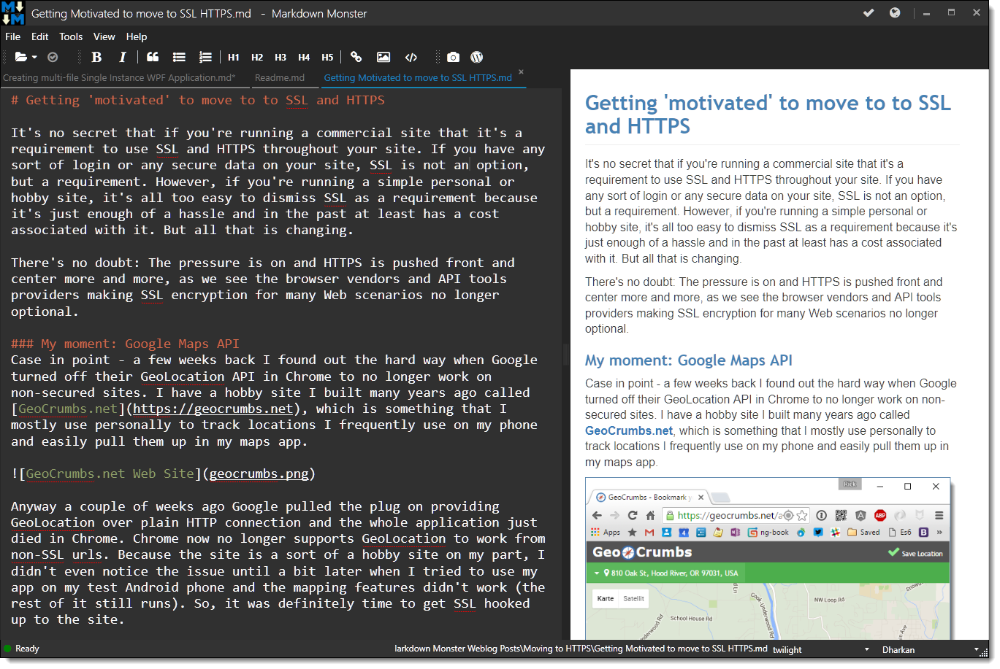
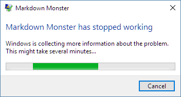
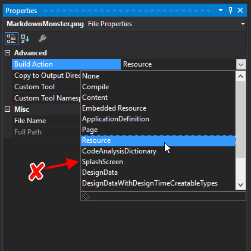

# Creating Single Instance WPF Applications that open multiple Files

When building desktop applications these days, most of the application that I build are either raw utilities or very document centric applications. I'm currently working on the latter and for those it's quite common to have a single application instance that displays all documents inside of that single instance. 

To deal with this in an application you need to be able to detect that another instance is already running and then pass some information - usually the file name arguments - on to the original instance so that it can open the requested documents.

### My practical Example: Markdown Monster
To set the stage I've been working on a WPF application in my spare time over the last few weeks called [Markdown Monster](http://markdownmonster.west-wind.com). It's a document based application to handle Markdown editing with an extension model so you can easily plug in custom functionality. Trying to keep the editor fairly minimal and use extensions to provide most of the useful support functionality. Some extensions that I'm building are  for screen captures with SnagIt and a WebLog publishing add-in that I started using to post my blog posts.

It's been a fun project to play with - it's been a while since I've used WPF and I realized I still hate it even while recognizing that there's so much that you can do with it if you put in the time. After a bit of struggling I was able to get my first usable prototypes built and I've now been using it to get my last few blog posts - including this one - published with it.

It's still pretty early and clearly a work in progress but if you're interested you can check out early builds from here:

[Markdown Monster](http://markdownmonster.west-wind.com)

Here's a screen shot of the running app, editing my last blog post:



### Single Instance Document Apps
So one of the features of this editor is that it should run as a single document that displays all open documents in tabs. Markdown Monster associates itself as an editor for `.md` documents, so when you select a new document it should just open documents in a new tab rather than a whole new application instance.

There are a lot of different approaches available to do this and while looking for solutions on how to accomplish this effectively most of the solutions struck me as overly complex. 

What needs to happen is basically this:

* Start first instance - just start full copy
* Start second instance - shutdown and defer to first instance
* If file name arguments were passed pass them to the first instance
* First instance needs to detect the request to open new files.

Most of the samples I've seen for Singleton based apps don't address the communication aspect of the second instance forwarding parameters - or if they do, they are using a fairly complex communication mechanism.

##AD##

### Many Roads lead to Rome
When I started out on this I started with simplest thing I could think of, which is writing command line arguments to a file from the second instance, and using a `FileWatcher` to pick up the file and read the command line arguments from it. It worked but I ran into some problems - that it turned out were unrelated to the `FileWatcher` approach. 

While trying to figure out some crazy WPF Kernel crashes during early shutdown (which were unrelated to the `FileWatcher` code in the end), I also created a **NamedPipes** implementation. While a little more code, it's a cleaner and more direct approach that lets the two instances directly communicate with each other.

Let's see what this looks like in this WPF app.

### WPF and Singleton apps
A default WPF application is different than most other .NET applications in that it hides the `Main()` function. `Main()` still exists of course, but it's generated as part of the generated `App` class that WPF creates (in `App.g.cs`).

The generated Main method looks like this and it gives you some insight into how WPF bootstraps:

```csharp
[System.STAThreadAttribute()]
[System.Diagnostics.DebuggerNonUserCodeAttribute()]
[System.CodeDom.Compiler.GeneratedCodeAttribute("PresentationBuildTasks", "4.0.0.0")]
public static void Main() {
    SplashScreen splashScreen = new SplashScreen("assets/markdownmonstersplash.png");
    splashScreen.Show(true);
    
    MarkdownMonster.App app = new MarkdownMonster.App();
    app.InitializeComponent();
    app.Run();
}
```        

The goal for secondary instances is to immediately detect a second instance and exit before WPF gets control. As you can see from the code above, if you leave the default `Main()` in place, the earliest you can get control is in the `App` constructor. 

> #### @icon-warning Loose the Auto Splash Screen
> I ran into major issues with early shutdown due to the SplashScreen screen. I'll talk about this later, but if you do have a SplashScreen in your app make sure you **do not** auto show the splash screen on early exits as it will randomly crash your app due to background thread shutdown issues. 

Instead WPF relies on `App.xaml` and its corresponding `.cs` class to handle all the startup management code. Looking at the main method above you can see the earliest you can get control in `App` is in the constructor and that's where we can put the startup check.

Here's the code:

```csharp
public partial class App : System.Windows.Application
{
    public Mutex Mutex;

    public App()
    {
        SingleInstanceCheck();
        
        // First instance - starts normally
        SplashScreen splashScreen = new SplashScreen("assets/markdownmonstersplash.png");
        splashScreen.Show(true);
    }

    public void SingleInstanceCheck()
    {
        if (mmApp.Configuration.UseSingleWindow)
        {
            bool isOnlyInstance = false;
            Mutex = new Mutex(true, @"MarkdownMonster", out isOnlyInstance);
            if (!isOnlyInstance)
            {
                string filesToOpen = " ";
                var args = Environment.GetCommandLineArgs();
                if (args != null && args.Length > 1)
                {
                    StringBuilder sb = new StringBuilder();
                    for (int i = 1; i < args.Length; i++)
                    {
                        sb.AppendLine(args[i]);
                    }
                    filesToOpen = sb.ToString();
                }
                
                var manager = new NamedPipeManager("MarkdownMonster");
                manager.Write(filesToOpen);

                // this exits the application                    
                Environment.Exit(0); 
            }
        }
    }
 
    protected override void OnStartup(StartupEventArgs e)
    {
        // ... your regular startup code here
    }
    
}
```

So this code is hooked up to the constructor. `SingleInstanceCheck()` does all the work and if this is not the first instance the code exits the application using `Environment.Exit()` immediately.

To do the startup detection the code uses a  `Mutex` - a mechanism you can use as a cross process 'CriticalSection' that determines whether the Mutex is already in use in any other process on the machine. It's an easy and efficient way to signal boolean state across multiple applications.

The code then proceeds to create a string of any command line parameters that were passed, so we can pass filenames to open to the first app.

These values are then passed using the small, custom `NamedPipeManager` class which I'll describe below which basically sends the command argument string to the primary instance.

Once that's done `Environment.Exit()` then shuts down the secondary app.

##AD##

### Back at the Farm
The primary instance now also uses the `NamedPipeServer` to listen for messages on a separate thread. When it receives a message it picks up any (if any) files and opens them in new tabs.

Here's what the code looks like. First is the hook up code which is fire from the Main Window's constructor:

```csharp
if (mmApp.Configuration.UseSingleWindow)
{
    PipeManager = new NamedPipeManager("MarkdownMonster");
    PipeManager.StartServer();
    PipeManager.ReceiveString += HandleNamedPipe_OpenRequest;       
}
```

The actual handler is hooked up the the `ReceiveString` event which is implemented like this:

```csharp
public void HandleNamedPipe_OpenRequest(string filesToOpen)
{
    Dispatcher.Invoke(() =>
    {
        if (!string.IsNullOrEmpty(filesToOpen))
        {
            TabItem lastTab = null;
            foreach (var file in StringUtils.GetLines(filesToOpen))
            {                        
                if (!string.IsNullOrEmpty(file))
                    lastTab = this.OpenTab(file.Trim());
            }
            if (lastTab != null)
                Dispatcher.InvokeAsync(() => TabControl.SelectedItem = lastTab);                                            
        }


        if (WindowState == WindowState.Minimized)
            WindowState = WindowState.Normal;

        this.Topmost = true;
        this.Activate();
        Dispatcher.BeginInvoke(new Action(() => { this.Topmost = false; }));
    });
}
```

All of the code runs inside of a `Dispatcher` because the code needs to interact with the UI for opening new tabs and activating the form.

If there are files, these files are iterated and then opened in new tabs by parsing the lines out of the string. This code uses the [StringUtils class from Westwind.Utilities](https://github.com/RickStrahl/Westwind.ApplicationConfiguration/blob/master/Westwind.Utilities.Configuration/Support/Utilities/StringUtils.cs) and then loops through the strings, opening each in a new tab. 

Then the main form is activated and pushed to the top of the call stack and made visible.

The code for this is pretty short and mostly generic so it's easy to implement for other solutions.

### Simple Named Pipes
To simplify the NamedPipe access I created a small wrapper class around NamedPipes that handles the server and client side. It's very basic single purpose implementation where the server only listens for a string and the client only sends strings.

```csharp
/// <summary>
/// A very simple Named Pipe Server implementation that makes it 
/// easy to pass string messages between two applications.
/// </summary>
public class NamedPipeManager 
{
    public string NamedPipeName = "MarkdownMonster";
    public event Action<string> ReceiveString;

    private const string EXIT_STRING = "__EXIT__";
    private bool _isRunning = false;
    private Thread Thread;
    
    public NamedPipeManager(string name)
    {
        NamedPipeName = name;
    }
        
    /// <summary>
    /// Starts a new Pipe server on a new thread
    /// </summary>
    public void StartServer()
    {
        Thread = new Thread((pipeName) =>
        {
            _isRunning = true;

            while (true)
            {
                string text;
                using (var server = new NamedPipeServerStream(pipeName as string))
                {
                    server.WaitForConnection();

                    using (StreamReader reader = new StreamReader(server))
                    {
                        text = reader.ReadToEnd();
                    }                        
                }

                if (text == EXIT_STRING)
                    break;

                OnReceiveString(text);
                                                 
                if (_isRunning == false)
                    break;
            }
        });
        Thread.Start(NamedPipeName);
    }

    /// <summary>
    /// Called when data is received.
    /// </summary>
    /// <param name="text"></param>
    protected virtual void OnReceiveString(string text) => ReceiveString?.Invoke(text);
    

    /// <summary>
    /// Shuts down the pipe server
    /// </summary>
    public void StopServer()
    {
        _isRunning = false;
        Write(EXIT_STRING);
        Thread.Sleep(30); // give time for thread shutdown
    }

    /// <summary>
    /// Write a client message to the pipe
    /// </summary>
    /// <param name="text"></param>
    /// <param name="connectTimeout"></param>
    public bool Write(string text, int connectTimeout = 300)
    {
        using (var client = new NamedPipeClientStream(NamedPipeName))
        {
            try
            {
                client.Connect(connectTimeout);
            }
            catch
            {
                return false;
            }

            if (!client.IsConnected)
                return false;

            using (StreamWriter writer = new StreamWriter(client))
            {
                writer.Write(text);
                writer.Flush();
            }
        }
        return true;
    }
}
```

The server portion creates a new thread that waits for incoming connections and it just sits on the background thread waiting for connections to come in. When a connection comes in it reads the data from the pipe, and fires the `ReceiveString` event with the string. The code then restarts the Pipe listener to listen for the next connection. 

To shut down the server a special **EXIT** command is sent which causes the server to break out of its loop and... exit.

The client creates a new PipeClient, connects to the server with a short timeout and if it finds a server pushes a message at it. 

This server is very basic but it does what it needs to do and it's easily reusable as is.

And that's all of it really. It just works. 

### WPF Startup and Early Shutdowns
I want to spend a minute talking about some of the problems I initially ran into with my Singleton implementation. When I initially added this code I added it to `OnStartup()` which is the traditional place where you put 'startup' code.

However, when I ran either initially with the `FileWatcher` implementation, and then later with the NamedPipes implementation, I frequently saw hard Windows crashes:



These crashes occurred about 70-80% of the time and were not trappable by the application itself. Even using the `AppDomain.UnhandledException` event wouldn't capture the errors, and hooking up a debugger revealed that the errors were occurring in Windows Kernel mode. Yuchhh. I struggled with this for a long time and initially I thought it was the file access/Filewatcher interaction.

It took a while, btut eventually it became clear that the problem was the `SplashScreen` that caused the problem. Although SplashScreen is very lightweight, it does get fired on a new thread, and by doing early exits in `OnStartup` or even the `ctor` was causing the SplashScreen to loose connection to the `App` which would then cause it to blow up. Typical Windows background thread problem. It took me a long time to figure this out because `SplashScreen` is hidden by default in generated code. Docs I've seen also seemed to indicate SplashScreen actually runs native code, but that's not actually true - SplashScreen is just a lightweight form like structure that can run before WPF has properly initialized.

The key to fix that problem was to not fire the SplashScreen when secondary instances are loaded. To do this I had to remove the SplashScreen from the project settings (ie. uncheck the SplashScreen build action) and instead manually load the splash screen only when the app is launching for sure.

To fix this make the SplashScreen image just a plain **Resource** in your project::

;

which causes the SplashScreen code to get removed from the `Main()`  method. You can then manually show the SplashScree it after the early exit logic is done.

One way is to use the splash screen only on the main form **after** the second instance check has already exited:

```csharp
public App()
{
    SingleInstanceCheck();

    SplashScreen splashScreen = new SplashScreen("assets/markdownmonstersplash.png");
    splashScreen.Show(true);
}
```

subsequent pages won't see the splash screen.

The other alternative if you actually want the splash screen to show on the secondary launch, is to explicitly close the SplashScreen before calling `Environment.Exit(0)`:

```csharp
SplashScreen.Close(Timespan.MinValue);

// this exits the application                    
Environment.Exit(0); 
```

Either approach works to avoid the random crashes. 

I talk about the `SplashScreen` class here which uses an image, but the same is true if you bring up your own custom WPF splash form. Just make sure you shut it down before exiting or you will potentially crash the app hard.

Finally - if you don't have or need a splash screen  you
don't need to worry about any of these issues.

##AD##

### Do I need a Singleton?
Generally I'm not a huge fan of Singletons, but after playing around with **Markdown Monster** without the ability to open multiple documents in the same instance, I find it annoying to have new instances pop up everytime I open a file. The app also remembers the last files that were open and then reopens all those files (a la Sublime) and if you have multiple instances that behavior can get really funky as multiple instances would step on each other 'configuration' settings of what was open last.

Ultimately this needs to be a choice via a configuration option with the default as single instance. A small change to the both the startup and file watcher code accomplishes this in my app using a configuration setting in my application level configuration class:

```csharp
if (mmApp.Configuration.UseSingleWindow)
{
    // ...
}
```

With configuration the choice is up to the user as it should be...

### Summary
And there you have it - everything you need to know about single instance WPF applications. Note that the same approach will also work for WinForms applications, where you would likely hook up the startup single instance check in the `Main()` function.

I hope some of you will find this post useful. I know there are a few hard lessons learned for me in here, especially related to the struggle of finding the cause of the random crashes I saw due to the generated SplashScreen code that I'm likely to revisit in the future - if only I can remember...


<!-- Post Configuration -->
<!--
```xml
<abstract>
If you're building document centric applications, Singleton style EXE applications are pretty common. Rather than creating new windows for each opened file, a more common scenario is to open new tabs in a single instance. In this post I'll describe how to create a WPF application that allows only a single instance to run and passes command line arguments passed in secondary instances to the primary instance and I'll describe some pitfalls that you might have to watch out for.
</abstract>
<categories>
WPF,Windows
</categories>
<postid>1586362</postid>
<keywords>
Singleton,Mutex,WPF,
</keywords>
<weblog>
Rick Strahl's Weblog
</weblog>
```
-->
<!-- End Post Configuration -->


