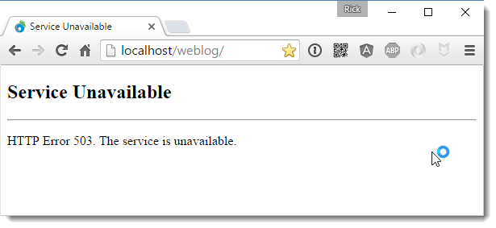
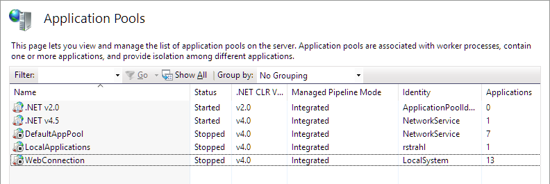
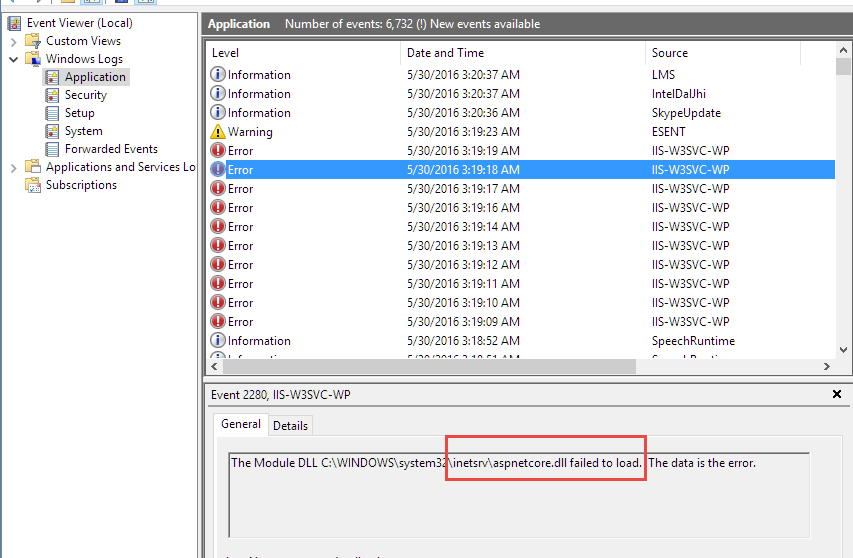
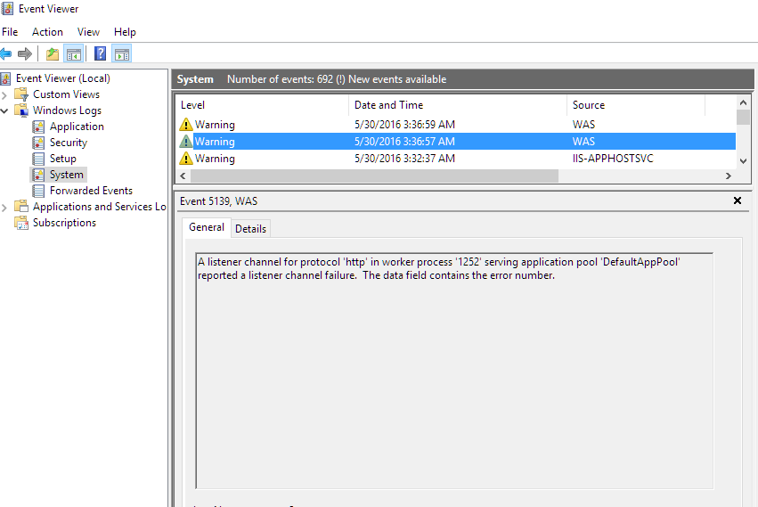
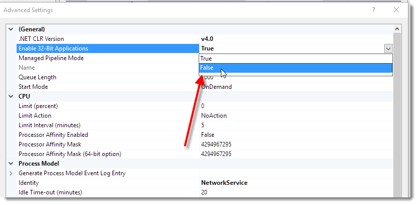

# IIS Channel Listener Errors in Windows 10 Insider Build 14342

After installing Windows 10  Insider Preview 14342 my IIS installation appeared to be completely hosed. 

Navigating to any of my local Web sites gets me the dreaded 503 Server Error:



And a string of disabled IIS Application Pools:

 

It turns out there are a few problems.

### IIS Rewrite Module
This is getting to be a tiresome ordeal to go through every time Windows updates - the IIS rewrite module somehow gets unregistered in the Windows upgrade, and if you have sites that use that module they are going to fail.

The simple solution is to repair or reinstall the IIS Rewrite Module. For more info see [my previous post](http://weblog.west-wind.com/posts/2015/Jul/05/Windows-10-Upgrade-and-IIS-503-Errors).

### 32 Bit AppPool Failure
Even with the Rewrite module updated I was getting new errors: 



I went ahead and removed the module from the root installation - but it turned out that this is a Red Herring. Although this module fails it's not the root cause. 

The AspNetCore module is just **a symptom**, not the problem so don't bother uninstalling it regardless of the omnious error message. Read on to the real problem.

After removing the module I got yet another error with a more promising error message:



The error is:

> A listener channel for protocol 'http' in worker process 'xxxx' serving application pool 'DefaultAppPool' reported a listener channel failure.

After a little bit of searching I found some old IIS Forum threads, which suggest to switch Application Pools into 64 bit mode. 



And sure enough that works. When hitting Application Pools in 64 bit mode everything runs. In 32 bit - I'm back to the 503 errors.

##AD##

### Why am I running 32 bit
For my dev setup this should be OK even though I have all of my Application Pools currently in 32 bit. Why? 32 bit consumes less memory and in most situations actually performs slightly better (except in very high memory (multi-gig) scenarios) so I've always stuck with this. I haven't actually checked recently whether these assumptions are still true. Certainly memory will but perf - it's probably becoming less of an issue. The bigger reason is that I've run into problems with 64 bit apps in the past that worked fine in 32 bit mode but not in 64 bit.  It'd be some obscure feature that wouldn't crop up until weeks later, but it's always just been more safe to run in 32 bit mode and there really wasn't a compelling reason to go to 64 bit.


Most of the apps I'm running **can** run in 64 bit, so for now on this local machine I can live with the 64 bit only limitation. I guess this is a good way to see what might break in 64 bit mode.

But, obviously there's a more serious problem here at the Windows level that needs to be addressed. I have no idea where to start with this. I hooked up IIS's FREB Tracing on the root site and the machine root, but I'm not getting anything. Whatever the failure is, it's never actually making it into IIS - from the looks of it the error is coming from `http.sys` but that's just conjecture.


So I'm curious to hear if others can duplicate this problem on their setup or whether this is an isolated or configuration based problem on my setup. For me I can't test on another machine as I don't have another machine running the previews. If you are, maybe you can try setting up a site in 32 bit mode and see if you see the same behavior.

### Why?
Now the real question is why is this happening in the first place. This is definitely related to the Windows update as I was working on the same site just before Windows rudely rebooted me.

For now the 64 bit fix works for me, but it's unsettling to know that this is required to not crash in 32 bit mode. If anybody has any insight into what might be causing this to happen, I'd appreciate a note in the comments.


<!-- Post Configuration -->
<!--
```xml
<abstract>
After installing Insider Build 14342 I ran into some major issues with IIS crashing hard and resulting in stopped Application Pools. After some tracking it turns out this is due to application pool bitness which causes 32 bit Application Pools to crash for me.
</abstract>
<categories>
IIS
</categories>
<postid>1601802</postid>
<keywords>
IIS,Crash,14342,Insider Build,Windows 10
</keywords>
<weblog>
Rick Strahl's Weblog
</weblog>
```
-->
<!-- End Post Configuration -->


