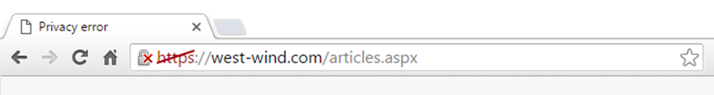
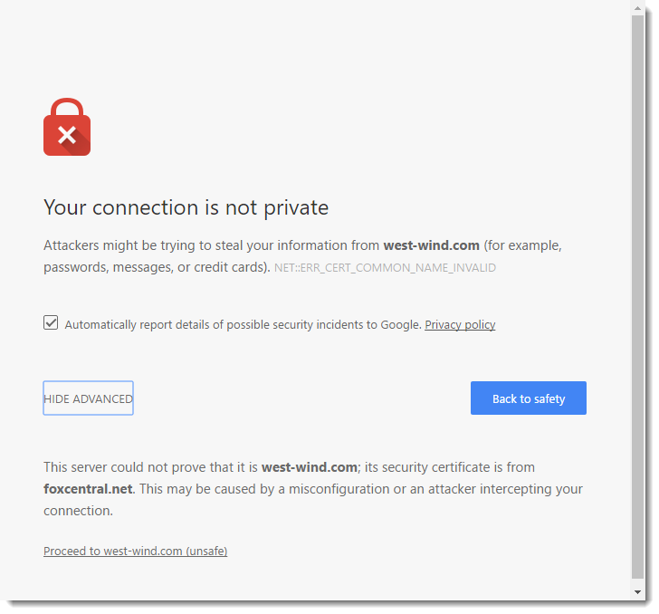
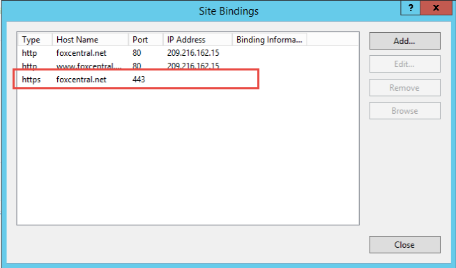

# IIS Serving the Wrong SSL Certificate

I ran into a scary problem with IIS today. I'm still not quite sure what happened, but I'm documenting it here in case somebody amongst you might have an idea what went wrong.

If you've been following this blog you probably know that I've been experimenting with Let's Encrypt on my live Web server. Let's Encrypt is a new SSL authorization authority that offers free SSL certificates and an open API to administer those certificates. It's a Mozilla project and sponsored by just about all the major industry players with the idea being that SSL should be used on **every** site.

Anyway, I've been using Let's Encrypt on Windows with IIS. After an initial trial period I decided to throw Lets Encrypt certificates on most of my smaller Web sites that previously did not have SSL hooked.

### Running, Running.... NOT RUNNING
My last update was on Tuesday afternoon when I added another site using Certify. Today is Friday afternoon and the site had been running fine. That is until sometime this after noon when all of a sudden bunch of  I have monitoring running on my sites and this afternoon notifications started coming in pointing at the SSL urls on the site.



This is not something that you want to see on your site. And in this case **all** of my SSL based sites, using both full wildcard certificate and 6 Lets Encrypt certificates all did not work.

When drilling into the error message, all sites ended up pointing one of my sites:



The only site that worked.

When I checked on that particular site I found the following:



Notice the missing IP address, which indicates that the site is not bound to a particular IP address which amounts to the **All unassigned** setting in IIS. 

If running multiple SSL certs on the same IP address with SNI it's important to set the IP address explicitly otherwise the uniqueness cannot be ascertained.

So I set the IP address explicitly and I figured that'd be that. But as it turns out, it's never that simple.

### Let the Weirdness begin
I set the IP address fully expecting that to solve the problem but as it turns out that did not do the trick. The main site and all other sites continued to fail with error messages pointing back to the same foxcentral domain.

I restarted IIS, and still the error persisted.

I then removed the https binding from the offending site. And **still** I was getting certificate errors on all sites. I completely removed **all** bindings to the foxcentral site, restarted IIS and still I got certificate errors pointing back to foxcentral.net.

Finally after about an hour of trying to track down any site discrepancies (missing SNI or explicit IP bindings) I decided to try a full IIS reboot.

And lo and behold when the server came back up all sites were working again. It took a full reboot to clear the certificate caching that IIS was doing.

I can't remember the last time I had to force a hard desperation reboot, especially with IIS settings, since an IISRESET typically does the job. 

### Scary Certificate Management
I'm not sure exactly what went wrong in this scenario. My suspicion is that the non-specific IP address in the last screen shot was the cause for the wrong certificate getting served. It appears the site's SSL link was randomly bouncing between the two IP addresses and when it hit the first address it caused the mislinked references.

The real question is why it took 3 days before it failed. I can understand the behavior, but while the target site is not very busy it does get a few thousand hits a day. To work for 3 days and then fail is just bizarre.

But even worse is that IIS continued to serve the wrong certificate **even after I removed the https site and certificate completely**. That's scary.


### Checklist
Regardless of the weirdness of what happened here are a couple of things to remember when running a few certificates on your servers:

* Make sure every site tied to the same IP Address uses SNI
* Make sure every site has an explicit IP Address assigned to it

Administering this 


<!-- Post Configuration -->
<!--
```xml
<abstract>
</abstract>
<categories>
</categories>
<keywords>
</keywords>
<weblog>
Rick's Wordpress Weblog
</weblog>
```
-->
<!-- End Post Configuration -->
