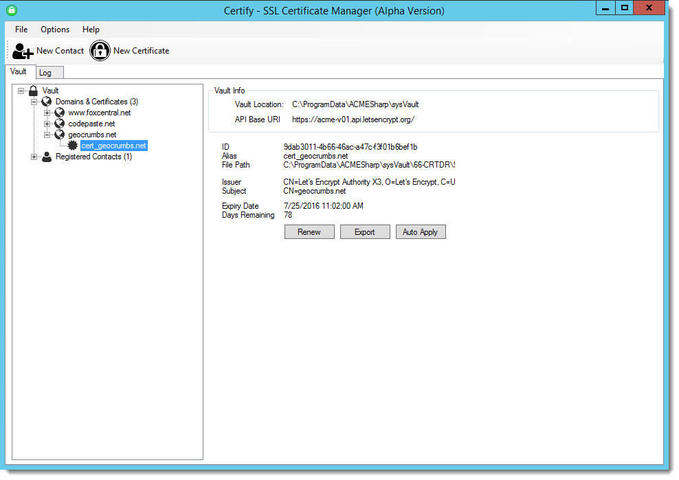
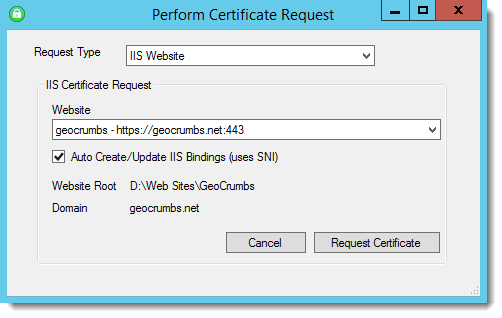

# Getting 'motivated' to move to to SSL and HTTPS

It's no secret that if you're running a commercial site that it's a requirement to use SSL and HTTPS throughout your site. If you have any sort of login or any secure data on your site, SSL is not an option, but a requirement. However, if you're running a simple personal or hobby site, it's all too easy to dismiss SSL as a requirement because it's just enough of a hassle and in the past at least has a cost associated with it. But all that is changing.

There's no doubt: The pressure is on and HTTPS is pushed front and center more and more, as we see the browser vendors and API tools providers making SSL encryption for many Web scenarios no longer optional.

### My moment: Google Maps API
Case in point - a few weeks back I found out the hard way when Google turned off their GeoLocation API in Chrome to no longer work on non-secured sites. I have a hobby site I built many years ago called [GeoCrumbs.net](https://geocrumbs.net), which is something that I mostly use personally to track locations I frequently use on my phone and easily pull them up in my maps app.


Anyway a couple of weeks ago Google pulled the plug on providing GeoLocation over plain HTTP connection and the whole application just died in Chrome. Chrome now no longer supports GeoLocation to work from non-SSL urls. Because the site is a sort of a hobby site on my part, I didn't even notice the issue until a bit later when I tried to use my app on my test Android phone and the mapping features didn't work (the rest of it still runs). So, it was definitely time to get SSL hooked up to the site.

This post describes the process and a few thoughts on the process of moving this simple site over to HTTPS.

##AD##

### HTTPS for Everything?
A lot of people have been clamoring for secure-everything for some time. The Web has become a cesspool of malicious content and drive-by attacks and while HTTPS isn't a panacea it can help reduce the risks of malicious injection into Web traffic significantly.

There are a lots of good arguments for using HTTPS for everything. Rather than rehash all of that here I'll point you at a good article that summarizes many of the benefits of HTTPS:

* [Still Think you don't need HTTPS?](https://scotthelme.co.uk/still-think-you-dont-need-https/)

Some of the more salient points are:

* Prevent Malicious Content Injection
* Search Engines starting to favor HTTPS
* APIs not supporting HTTP any longer (my problem exactly)
* Mobile devices can only access HTTPS
* HTTP/2 coming only runs over SSL
* Browsers are moving to mark non-SSL content as 'suspect'
* Much harder to eavesdrop on HTTPS traffic by authorities

In short it's clear that browser vendors are on the warpath to push Web developers to use HTTPS as **the** de-facto goto protocol.

### But doesn't it cost Money?
So my GeoCrumbs site is a perfect example of a site that was too small to justify actually paying for an SSL certificate. The site does logins, but since I intended this site to be mostly a personal site and it never went beyond that I decided it wouldn't have been worth the $15 or so for a certificate, plus the hassle to change the certificate every year.

There's cost, but there's also the hassle to deal with getting a new certificate from a provider, installing it into IIS, and more importantly then down the line have to deal with renewing the certificate and rebinding the sites [because IIS's renewal process is so messed up](http://weblog.west-wind.com/posts/2014/May/08/IIS-SSL-Certificate-Renewal-Pain).

Now I no longer have a choice since Google forced me into SSL, but... luckily today there are now free solutions to address that the SSL certificate issue both for the cost and administration factor. 

### LetsEncrypt changed Everything
This year things changed drastically when [LetsEncrypt](https://letsencrypt.org/) entered the SSL market as a purely open source certificate authority to offer **free** SSL certificates for all. Not only does this mean that cost is no longer an issue, but because LetsEncrypt is developed as an open source project with an accompanying open API, you can find a number of automation tools that automate the process of creating and installing LetsEncrypt certificates onto your servers. The tools can even help with auto-renewing certificates.

Let's Encrypt is still in late beta but already there are tons of tools that have been quickly ported into a variety of SDKs for various OS and development platforms. Creating a new certificate is as easy as firing up a small application or command line script and specifying a domain, contact info and depending on the tooling which Web site to install it to. It's not quite automatic, but after one time setup the process is pretty painless, even if you need to manage a few certificates.

I wrote about [using Let's Encrypt with IIS on Windows](http://weblog.west-wind.com/posts/2016/Feb/22/Using-Lets-Encrypt-with-IIS-on-Windows) and using some of the tooling described there (which has gotten better since I wrote the piece) it's trivial to set up new SSL certificates for free.

##AD##

### Certify
It's now become much easier to build an automated process that can create and renew certificates in an automated fashion. Since I run IIS on Windows I used [Certify](http://certify.webprofusion.com/) which is a Windows client for LetsEncrypt that makes it pretty straight forward to create certificates interactively and get them installed and renewed into an IIS installation in a matter of a few minutes. 



Let's Encrypt needs to be run from the server where the certificate will be installed. With Certify I use Remote Desktop and fire up the app, enter an email contact (me) which receives notifications from Lets Encrypt when certificates are about to expire. I can then add a new certificate by picking a Web site to create the certificate for:



Certify then does all the work of creating the certificate and installing it on the Web site in question. After a few seconds of churning you should have your certificate installed and you're ready to use your HTTPS site.

### AcmeSharp
As mentioned in my previous post, there are a number of tools available that are all based around the same [ACMESharp .NET toolkit](https://github.com/ebekker/ACMESharp) and it's entirely possible to build your own automation solutions. The ACMESharp toolkit includes .NET bits, as well as Powershell scripts that let you automate the entire process and even integrate it into your own applications. 

That said using the low level API isn't exactly trivial - there's a lot to understand that the high level tools are hiding, so unless you're familiar with the security terminology and concepts I recommend to stick with the higher level tools at least for now. 

It's all very early for tools like Certify and LetsEncryptWin - this stuff will get better and with any luck IIS (and most other Web servers) will include native support for certificate management with LetsEncrypt natively in the future. 

LetsEncrypt has also announced that there will be an official Windows client, which presumably matches some of the features of the Linux versions and extend that functionality to IIS. That tooling is slated for RTM when LetsEncrypt is officially released (vs the current beta status).

The good news is this: Updating a site to use SSL is no longer expensive nor a big hassle. If you have small sites that ordinarily might not warrant SSL, using LetsEncrypt makes it much more plausible to just opt for SSL by default going forward.

That said, LetsEncrypt provides only support for Domain Verified (DV) certificates at the moment, not the full Extended Verification (EV) certificates that give you the full green browser bar. LetsEncrypt also doesn't support wildcard domains, which is a bummer as wildcard domains are just easier to manage when you have a ton of subdomains. So for these scenarios you still need to stick with paid for certificates at least for now.

Let's Encrypt's entry into the SSL space is fairly disruptive and a number of SSL providers have indicated they will start offering free certificates as well. It'll be interesting to see where this leads - I can't imagine that basic Domain Validated certificates can continue to be charged for item going forward.

##AD## 

### One more thing... Redirecting to Secure Traffic with IIS
Ok, so I got my certificate, but I still need to make sure that all traffic is redirected to the secure site. This app is primarily meant to run on a phone and other devices so there are a shortcut links everywhere that point at the old `http://` URL. So, it would be nice to forward all the old `http://` links to `https://`.

To fix this it's easy to set up an IIS Rewrite Rule, in web.config:

```xml
<configuration>
  <system.webServer>
    <rewrite>
      <rules>
        <rule name="Redirect to HTTPS" 
              stopProcessing="true">
          <match url="(.*)" />
          <conditions>
            <add input="{HTTPS}" pattern="^OFF$" />
          </conditions>
          <action type="Redirect" 
                  url="https://{HTTP_HOST}/{R:1}" 
                  redirectType="Permanent" />
        </rule>
      </rules>
    </rewrite>
  </system.webServer>
</configuration>  
```

> Note that IIS Rewrite is an IIS add-in that you can install from the Web Platform installer.

With this simple change any request to access an `http://` link automatically redirects an `https://` link.

### Summary
It's all fine and neat to hear about the changes coming with browsers to force HTTPS, but it's quite another when that process actually bites you in the butt as it did me. Granted it wasn't a critical issue, but nothing like getting thrown into the fire.

Using LetsEncrypt has made it much easier to deploy new certificates and get them renewed on a regular basis, which is great. In fact, since I started playing with LetsEncrypt I went and moved all of my smaller public facing sites to support SSL.

Certificate based security will never be easy, but the open nature of the tooling makes it that much easier to hide that complexity behind reusable tools.

The time to look at moving your non-secure sites is now, before it's a do or die scenario like mine was. The all SSL based Web is coming without a doubt and it's time to start getting ready for it now.


<!-- Post Configuration -->
<!--
```xml
<abstract>
The pressure is on: HTTPS is pushed front and center more and more as we see the browser vendors and API tools providers, making SSL encryption no longer an optional part for many things that you build on the Web. SSL and HTTPS are becoming a requirement and for good reasons. I personally ran into this with the Google Maps API in one of my applications that now requires an HTTPS based client page in order to use this API. In this post I discuss some of the issues and why this is actually a good thing, and some of the steps I took to move my existing site to HTTPS.
</abstract>
<categories>
Security,IIS
</categories>
<postid>1582521</postid>
<keywords>
SSL,HTTPS,LetsEncrypt,Security
</keywords>
<weblog>
Rick Strahl's Weblog
</weblog>
```
-->
<!-- End Post Configuration -->


