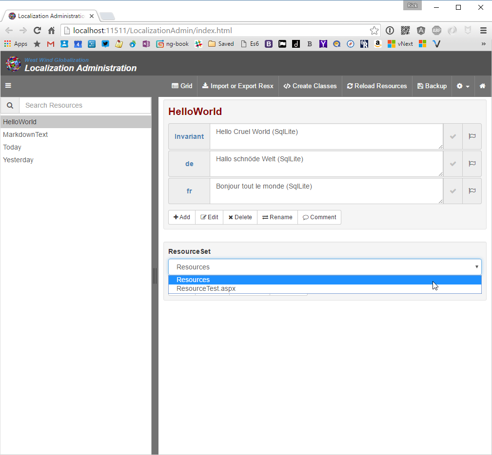
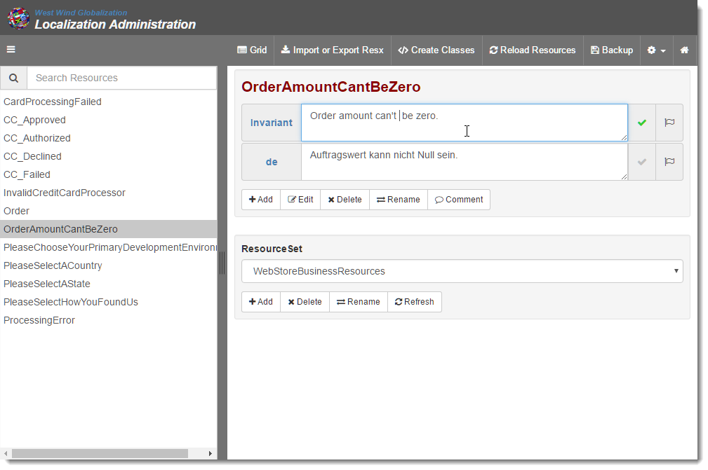
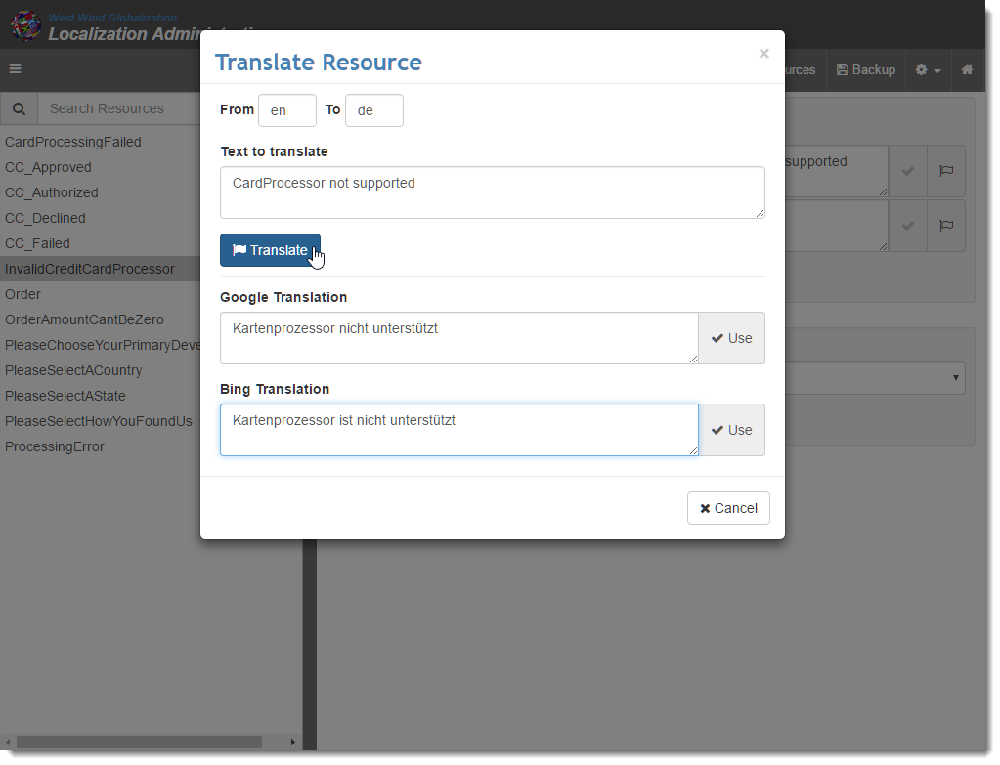
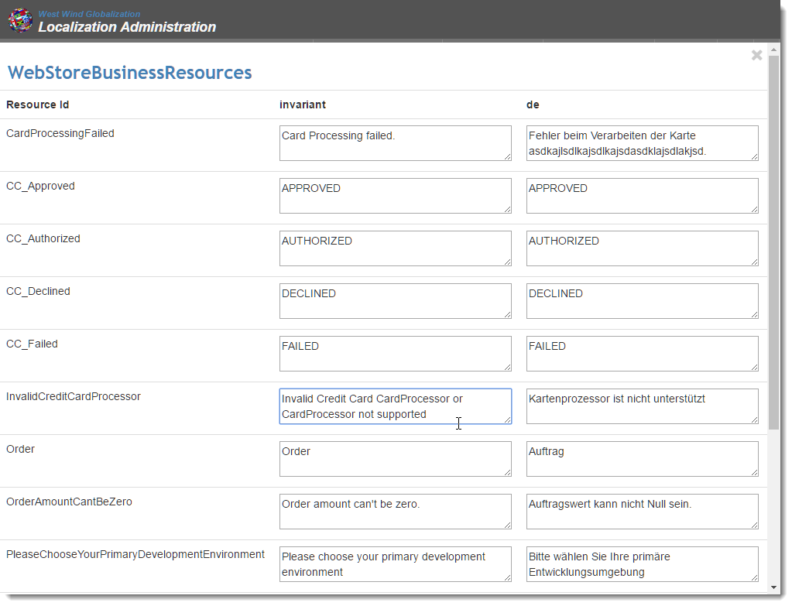
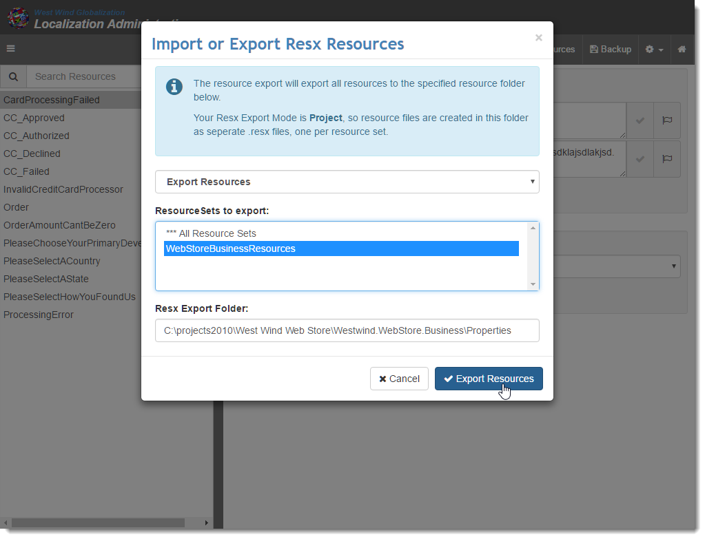
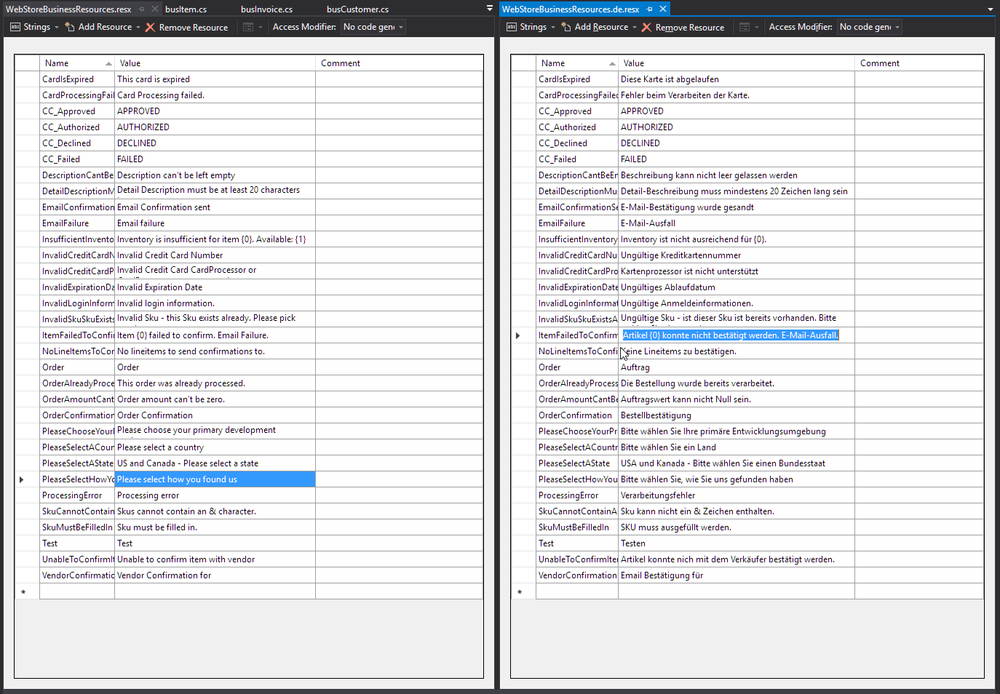

# Using Westwind.Globalization to edit loose RESX Files

I received a message yesterday that asked a simple question regarding the Westwind.Globalization library.

Westwind.Globalization is a library that allows you to use a database to store localization resources for editing or runtime loading, along with rich editing and conversion tools that can easily import and export resources to and from Resx.

The question was a simple one: 

> @icon-question-circle How can I edit single, loose Resx files in library projects without having to have a full Web project to manage all of my resources?

It's a fair question. The Westwind.Globalization.Web package is primarily meant for Web applications and managing the Web application level resource management and it works great for that. Since you're already running a Web app the LocalizationAdmin interface can just be accessed directly from within the Web application. 

What's not so obvious is that the Localization Admin application or the resource manager doesn't have to work with the resources contained in the current project - you can easily edit arbitrary resources located on the machine that the Web application is running on (given the Web app has the permissions to read/write the files).

What this means is that you can actually use Westwind.Globalization.Web as a standalone Resx file resource editor of arbitrary RESX files. IOW, you can easily edit resources that live in an arbitrary library project.

##AD##

### Using Westwind.Globalization as a RESX Editor
Ideally for this to work you'd create a 'generic' instance of Localization Admin Web application that's not part of a localizable Web application. Instead you treat this like a local application that imports and exports RESX data as needed, one resource set at at a time.

Using that approach the process is:

* Import RESX resources from a RESX file into the database
* Add, edit, translate and delete resources interactively
* Export RESX resources back into RESX files

The idea is that the database is only temporary storage with the final place of truth being the RESX file. The RESX file can go into source control and be synced between developers just like you normally would. The only difference is how you work managing your resources.

Although this sounds complicated it's actually quite easy and quick. Importing and Exporting resources is easy and quick from the RESX UI and can also be automated if necessary (the API is available in addition to the UI - I'll show the UI usage here).

So let's take a look on how this can work and the steps required to set this up.


### 1. Create a new Web Project
The following first two steps are one time steps that set up a reusable Web site. Once you've done that you can use steps 3 and forward to work with Resx files.

So Westwind.Globalization.Web and the LocalizationAdmin interface it installs requires a Web application, so you need to create a **local** Web site for this to work. Local because you'll want the Web site to be able to access RESX files from your local (or network) disk. The created Web project should be an empty Web site that can be used generically for any 'loose' RESX editing you want to do.

To do this:

* Create a new Web Application Project in Visual Studio
* Choose Empty Project Template
* Use NuGet and add `Westwind.Globalization.Web`

Compile to make sure everything installed properly. Next, you need to configure the library by providing a database connection string. You can use [any of the supported providers (SQL Server, MySql, SqLite)](https://github.com/RickStrahl/Westwind.Globalization/wiki/Non-SQL-Server-Provider-Configuration), but I'm going to use SqLite here just because it's light weight has no dependencies other than the NuGet package. If you want use SQL Server create a database and make sure the Web user your Web site is running under has full access to the database you create by adding the User with the right permissions.

### 2. SQLite Setup
Start by installing the SQLite NuGet package:

```
install-package System.Data.SQLite.Core
```

Then add these keys to your `web.config` that configure a connection string and add the provider key required to use the SqLite ADO.NET driver::

```xml
<configuration>
  <DbResourceConfiguration>
    <add key="ConnectionString" value="SqLiteLocalizations" />
    <add key="ResourceTableName" value="Localizations" />
    ... additional settings
  </DbResourceConfiguration>

  <connectionStrings>
    <add name="SqLiteLocalizations" connectionString="Data Source=|DataDirectory|\SqLiteLocalizations.db;Version=3" providerName="System.Data.SQLite" />
  </connectionStrings>
  
  <system.data>
    <DbProviderFactories>
      <remove invariant="System.Data.SQLite" />
      <add name="SQLite Data Provider" invariant="System.Data.SQLite" description=".Net Framework Data Provider for SQLite" type="System.Data.SQLite.SQLiteFactory, System.Data.SQLite" />
    </DbProviderFactories>
  </system.data>
</configuration>
```

Next create an `App_Data` folder in your Web app where the SqLite database will be stored and matches the connection string above. If you're using full IIS make sure the Application Pool Web account for the site you created for testing has rights to read/write/create files there (by default it doesn't). 

Finally you need to tell Westwind.Globalization to use SqLite when accessing DbResources by adding the following into `Application_Start`:

```csharp
protected void Application_Start(object sender, EventArgs e)
{
    DbResourceConfiguration.Current.DbResourceDataManagerType =
                                typeof(DbResourceSqLiteDataManager);
}
```

### 3. Starting up
At this point you should be able to startup the localization admin interface. Navigate to:

```ini
http://localhost:11511/LocalizationAdmin/index.html
```

or if you use IIS (which I recommend if you use this as a 'generic' application):

```ini
http://localhost/ResourceEditor/LocalizationAdmin/index.html
```

Next click on the **Create Table** button in the toolbar. Assuming you have write access in the `App_Data` folder the SqLite database will be created for your automatically.

At this point you should have an operating LocalizationAdmin interface with a couple of sample resource sets:



Ok, all set and ready to run now. You can delete those two initial resource sets if you like.

### Importing Arbitrary Resources
To import RESX resources use the **Import or Export Resx** button to bring up the import/export dialog and then choose **Import Resources**:


Note you can type any path on your arbitrary local system at this point to load resources from there. Here I'm loading resources from library project that is not a Web project.

> Note that you have to make sure you run IIS Express/IIS under an account that has rights to read and write in this folder. For IIS this means using an Application Pool with the appropriate Identity set.

This process imports the resources into the resource LocalizationAdmin resource editor where you can now take advantage of the user interface to edit your resources a bit more efficiently.

### Do your Localization Editing
At this point you can browse and edit resources as you see fit. Using the LocalizationAdmin interface makes it easy to find, browse edit and translate resources.

Here are some of the highlights what you can do with the resources once imported:

* See and edit resources for a resource key for all languages in one place  


* Use Google and Bing Translate to help you do quick translations interactively: 


* See a multi-locale resource view of all resources for all languages 


* Search and jump to resources quickly

So at this point you can party on the localization data. Any changes you make are stored in the localization database which lives in SqLite table(s) one for each resource file/sets.

##AD##

### Save your Work: Export back to RESX
When you're done making changes or when you think you're ready to 'save' your work or if you need to resources back into your code so you can use strongly typed resources properly, you need to export the resources. You can simply export the resources back to disk and into RESX files. In essence, this work flow treats the RESX file as the final source of truth where you write out the file to disk when you're done.

To do this you:

* Go the *Import or Export Resx** menu option
* Choose Export Resources
* Pick your ResourceSet or All Resources if you have multiples
* Enter the output folder which should be the same **Properties** folder you loaded from



If you go back to Visual Studio and open the RESX files you should now be able to see the localized data:




And voila, you're now back to a fully functioning RESX file that you can share as part of your project and source control.

> #### Strongly Typed Resources and Visual Studio
> One extra step is unfortunately required in order to get strongly typed resources to generate: You have to physically access the RESX editor in Visual Studio to trigger the strongly typed class generation as VS does not automatically regenerate strongly typed resources when the file changes (not even on a full build). Accessing the RESX editor for the default RESX and saving does the trick.
>
> As an alternative you can also use the *Create Classes Option* in the the Localization Adminstration editor to generate the resources explicitly. Either way an extra step is unfortunately required to get the classes generated.

### Workflow
In this scenario I described I'm treating the RESX file as the final store of truth which means that whenever I deem the localized data from the Localization Admin interface ready, I write it out to RESX. 

If you're working as a single developer there's not much to worry about - you can simply keep exporting and not worry about importing. 

In a multi-developer environment using source control, however, you'll need to make sure that you export to RESX before pushing to the repo, and import after a pull operation to make sure you pick up the latest RESX changes from other developers or localizers. It's a manual step for now.

### Mixing Web and Library Projects
As I mentioned earlier the use case for localizing Web applications and library projects tend to be a bit different. Web applications tend to have a lot of localizable content while most libraries generally have only a few items that need to be localized.

For Web apps I use the actual database resource provider in the database while developing and localizing. If all developers on the team are all in one place where we can all access the same database the database can work as the final store of truth. We all use the single store of localization data from the database and that works very well.

If the team is distributed then RESX are used since those resources can simply sync with source control. The RESX files are written out in alphabetical order so this should minimize source control churn. We store the final store or truth in the Resx Files and use the Import/Export functionality to handle resource updates.

If I have both Web and Class library projects I use two separate Localization Admin interfaces. For the Web app, the Localization Admin interface that is built into the actual Web app is used. For the library project(s) I use the 'standalone' version I described previous running in full IIS to provide me for the one of RESX import, edit, export cycle.

##AD##

### Is it worth it?
So now you've seen how you can pull in resources and edit them interactively. Clearly there's some effort and a little bit of discipline involved in this approach. Is it worth it?

For me personally I think the effort is worth it. Having an interactive editing environment where I can see the resources for all languages in one view, along with the grid view for quick editing and seeing what resources are missing easily is a huge data entry time saver. Having the Translation dialog hooked up inline also is very helpful, although if you use Google and/or Bing translation you better have a native speaker do the translations for you as the wording is often quite off from what you'd call colloquial. 

The productivity gain from being able to navigate and edit resources quickly far outweighs some of the interactive shuffling required to make this work for external library resources, so for me the answer is that it's totally worth it. 

Your mileage might vary, but next time you have a bunch of resources you need to edit give this approach a try and see if it saves you some time (maybe not on the first shot but on subsequent runs).

### Resources
* [West Wind Globalization on Github](https://github.com/RickStrahl/Westwind.Globalization)
* [West Wind Globalization NuGet Packages](https://www.nuget.org/packages?q=westwind.globalization)


<!-- Post Configuration -->
<!--
```xml
<abstract>
Although Westwind.Globalization is primarily aimed at Web applications, you can also use it to edit arbitrary RESX files using the Localization Administration interface that comes with the library. In this post I show how you can import RESX resources, then use the editor to manipulate RESX resources interactively, and then export the resources back out, using a local Web application on your machine.
</abstract>
<categories>
ASP.NET,.NET,Localization
</categories>
<postid>1591398</postid>
<keywords>
RESX,Resource Editing,Westwind.Globalization,.NET,Library Projects
</keywords>
<weblog>
Rick Strahl's Weblog
</weblog>
```
-->
<!-- End Post Configuration -->


