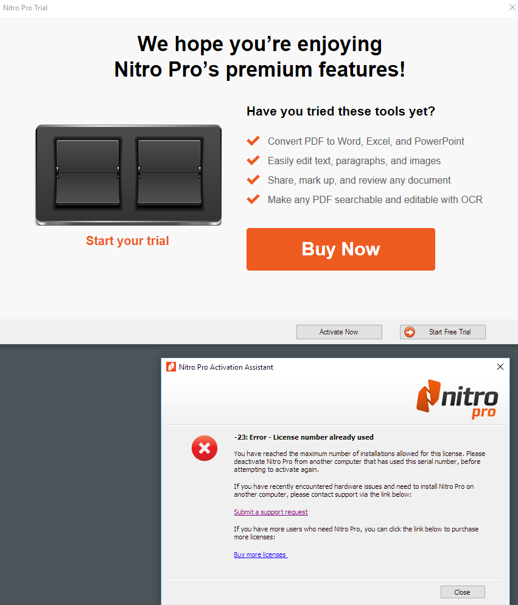

# Windows Updates and Lost Software Licenses and Activations

Today Windows once again updated more or less automatically. Windows just rebooted without immediate warning after one announcement that an update was available earlier in the day. This is an Insiders Update which tend to be full Windows upgrades that essentially reinstall a newer version of Windows. I'm on the slow Ring so I see updates every few months. That's fine I knew what I was getting into.

Well, every time these major updates happen, along with that Windows install I 'lose' a number of my software licenses for a number of software packages that weren't 'unregistered' before the upgrade. 

Right! Unregister. Like I can remember everything that is installed and even if I did, the way Windows auto-updates these days, it's likely I never would get the chance to do it.

### Windows Updates kill some Software Activations
So today Insider Build (14342) installed and sure enough I'm back here again. I don't use a lot of commercial software these days, but for me I've been through this dance a few times with these products:

* Nitro Pro
* Corel Draw
* LinqPad
* Adobe Products
* Some others I probably have forgotten and will curse when I use them next

The deal is that these products are apparently tied to the local machine and Windows installation and a Windows Update changes enough about this configuration that the license managers of these products decide that this version is running on a new machine.

### Reactivation
So then you have the 're-activate'. If that was all it was it'd a hassle but OK I can live with that. But, after a couple of times through the 're-activation' process these packages usually tell you that you have **too many activations** and you can no longer activate again.

For example this is the lovely notices I get from Nitro Pro after I had a totally legit licensed copy running pre-Update:



Not cool!

##AD##

### If you are a vendor using Hardware/OS based Software Activations...
So I get it. You are a software company, want to license your software and keep people from pirating. Fine. I understand that. That's why I paid you some money for a license.

**But for goodness' sake, find a different way to enforce your license!**

This is just one more reason more and more people are getting pissed off at commercial software. It's already bad enough with nobody wanting to pay for software anymore, expecting it to be free, and this certainly isn't helping the cause for your commercial software. 

While I'm Ok paying for software I use, I'm not OK with getting hassled by you for managing **your** licensing process on your behalf. This is **your** software bug and you need to solve this problem.

You as a vendor of a commercial solution who I actually supported with my dollars are now making my life miserable as I have to contact you to argue my case, and waste time dealing with your bureaucracy. And not just once, but again and again. You bump the license count and count it as case closed but I have to come back next month after the next update. It wastes my time and your support staff's time.

I for one believe that it's just fine to pay for stuff that I get value from. But if you make my life miserable with this licensing crap, I am going to change my decision and find another vendor who doesn't make me jump through hoops to use their software.

### OS Tied Software
Because of the way Windows 10 and forward will now upgrade, Hardware/OS tied licensing is something that is just not going to work going forward.

Windows itself is updating with major features once a year or less now (not counting Insider Previews) so these updates are a fact of life for all users and not just developers who install preview software. This licensing scheme is just not going to work. Unless you are in fact evil and hoping to coerce hapless users into upgrading their license even though it's still valid. 

### Whatever you do, don't buy a new License!
If your license errors, it doesn't mean you need to buy a new one. The company that sold you that license should give you and updated license count or otherwise renew your existing license so that it will work on the updated version of Windows. Don't buy a new license because of the scary dialog or because in some cases that's easier than dealing with support. That'll just feed the beast.

To be fair all of the companies I mentioned above ended up upping my activation count - I'm guessing they are all well aware of this problem because it's gotta be happening all the time. The folks at Nitro also were nice enough to engage in a discussion of the problem and I was told they are working on changes for the future. 

Regardless, the fact remains that it's major hassle to contact a vendor to get a license reactivated. Other companies like **Corel** were a royal pain not getting back for weeks until I raised a stink on Twitter. 

### Give it up!
There are other ways clearly. I have plenty of other licensed software (mostly small utilities) on my machine that doesn't require me to reactivate, so this is a solved problem. Big vendors too - Microsoft and Intuit for example can manage somehow.

So if you're one of those vendors that uses Windows tied licenses: Get your shit together and find another way!

The alternative is to continue to piss off your customers and drive them to other companies or free solutions that can. I know I will if you won't address this issue and I hope others do as well.

If you're a user and you run into this problem yourself, please make sure you contact the vendor and write how displeased (or worse!) you are with this practice. And explicitly write down your use case (say you're a developer and get Insider Previews for example) - chances are the support or dev staff that takes that note can actually empathize with you. Let them know that if they continue with this practice you plan on looking elsewhere. If enough people complain this issue will get fixed fast.


<!-- Post Configuration -->
<!--
```xml
<abstract>
Windows Updates often hose Software Activations and Licenses for various commercial software packages. It's a pain in the ass and it's time to let those vendors that use the outdated practice of counting activations based on Windows OS criteria is no longer viable.
</abstract>
<categories>
Windows
</categories>
<postid>1601155</postid>
<keywords>
Windows Update,Activation,License,
</keywords>
<weblog>
Rick Strahl's Weblog (local)
</weblog>
```
-->
<!-- End Post Configuration -->


