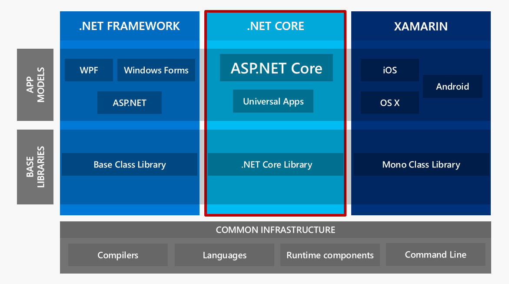
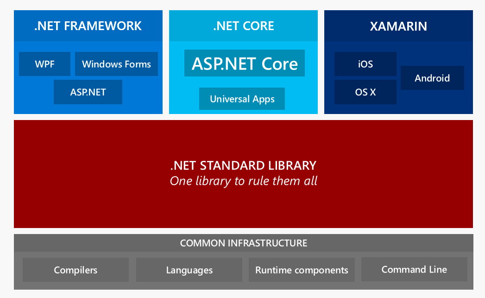

# ASP.NET Core and .NET Core Overview


It’s been a long journey, but ASP.NET Core and .NET Core have been released as v1.0 RTM this week. Yay! Congratulations to the ASP.NET and .NET Core teams on building this massive framework and delivring what looks to be a solid 1.0 relaese.

This post answers a number of questions like:

* What is .NET Core and ASP.NET?
* How did we get here?
* How does it work?
* How is it different from current ASP.NET? 

A lot has changed since I wrote my [first articles for ASP.NET ‘vNext’](http://www.codemag.com/article/1501061) in Code Magazine which were my first takes on the platform late in 2014. 

### It's been a long Wait
The last couple of years have been tough if you’ve been keeping up with Microsoft’s ever changing architectures for the **new** .NET and ASP.NET platforms. The **.NET Core** platform has gone through three major platform updates since this journey to reboot .NET started nearly 3 years ago, but now it finally seems that all of this churn is coming together in a much clearer vision of where .NET is headed. Even so not all of this unification and integration is going to come to fruition with the forthcoming RTM release, as more post RTM changes have already been announced. Rather, RTM for .NET Core and ASP.NET Core will be more of a stepping stone on a longer journey that continues to add new features as time goes on.

##AD##

### Drawing a line in the Sand
This initial release is about drawing a line in the sand and having a stable base on top of which additional frameworks and components - and updated features - can be built. It's also a stake to let people start using an **official** released version of these new tools. Microsoft is quite adamant in saying that although there will be a lot more changes post RTM, these changes are not going to be as drastic as some of the changes that we've seen as late as RC2. Instead future changes are supposed to light up new functionality that won't break backwards compatibility. More features available without breaking what's already there. 

v1.0 has released with solid tooling infrastructure and a solid but ‘snapshot in time’ version of the .NET Core framework and a fully functional ASP.NET MVC application layer. 

Of these major components the one most in flex is .NET Core, which is going to gain additional features to bring it closer to the full .NET framework after the RTM release. The v1.0 release is meant to bring a production ready and fully supported release of the .NET Core and ASP.NET Core systems so that early adopters have a solid, base production framework that is officially supported by Microsoft to deploy applications with. 

But make no mistake - things are going to continue changing after RTM. But hopefully if we take Microsoft's word, the changes coming post RTM will be benign to existing code.

### Building a Common .NET
With .NET Core and ASP.NET Core Microsoft is on a mission to build a unified .NET base library that provides a common baseline that all platforms that run .NET can take advantage of. Today there are a boatload of different .NET implementations and each has its own set of supported features. If you are a component developer today (pre-Core) it's very difficult to build libraries that can run on any number of the supported platforms. 

Microsoft has been proposing to create a new **.NET Standard**, which is a 'standard' that defines a common base layer that a platform should support. They plan to implement this new .NET Standard across the runtimes Microsoft itself publishes. It's very likely that ultimately **.NET Core** - which is an implementation of .NET Standard -  will figure heavily in this vision, with .NET Core providing a single implementation that can run on many platforms. We're already seeing that with support for .NET Core on Windows, Mac and Linux for the server version. But there are more OS's to worry about - Xamarins Mobile platforms running Mono, UWP Windows application, game development platforms and the desktop OS implementations that are currently served by Mono. 

.NET Core is the vehicle to deliver on the .NET Standard and while it hasn't been officially stated, it's probably a safe bet that .NET Core will become the unifying runtime that eventually can span a server/desktop based runtime (what .NET Core does today), UWP Windows apps and what currently is Xamarins stack as well as the desktop OSs that Mono targets. This isn't all going to happen overnight and certainly not with this v1.0 RTM release,  but with ASP.NET Core and .NET Core you're getting the clearest glimpse of what that world will look like today.

### .NET and ASP.NET Core today
As of today (.NET Core/ASP.NET Core RC2) the landscape is still pretty fragemented: 

  
<small>slide slightly modified from previous Microsoft presentations from Scott Hunter and Jeff Fritz</small>

On the bottom you have the core infrastructure of compilers, languages, runtime and tools that interact with them. Above that sit the base libraries, which is where most of the divergence that we are seeing today is centered on, due to the variety of different runtimes that all have different feature sets with some partial overlap. Above that sit the application frameworks like ASP.NET Core, Xamarin's mobile libraries and desktop Windows platforms like WPF, WinForm as well as full framework ASP.NET.

### .NET Common Infrastructure
On the bottom of the stack you have the common infrastructure and tools that provide the base rock of the platform: The Roslyn Compiler platform, C#, VB.NET, F# and the runtime loaders and the new dotnet.exe based command line tools.  This story is actually much better today than it was just a couple of years ago thanks to Roslyn's unifying influence that has made much easier to take advantage of the compiler as a platform. Alternate platforms can now much more easily use Microsoft compiler rather than reinventing the wheel including running the compiler on non-windows platforms. .NET Core on Mac and Linux uses Roslyn for example as do tools like Ominsharp.

The important thing about this base is that it provides a single set of tools to get started with .NET both as a developer and integrator. In this scenario .NET is installed from a single .NET SDK.  Once the SDK is installed you can create a new project from the command line, compile it and run it all with a few very simple steps. As part of configuration you can specify which version of the .NET platform you want to target and the compilers will figure out how to build and run the proper version(s) using the correct runtimes. 

You don’t need Visual Studio or install a host of other .NET SDKs – all that’s needed is the single .NET SDK that gets you everything you need to do it all. This common set of tools can be used to build, package, and deploy applications as I’ll show later in this article.

##AD##

This may not seem very significant at first glance, but if you compare this to the process of getting started with full framework .NET today, this is a big step forward. Rather than installing the huge monster that is Visual Studio that gives you everything under the sun, or installing a host of disparate SDKs and support tools, a single reasonably sized SDK install gets you everything you need to build and run any kind of .NET application. You can get started with .NET within a few minutes of download and a short install. 

To be clear – we’re not there yet as support for .NET Standard currently is limited to .NET Core applications at the moment, but if you’re building apps with ASP.NET Core or .NET Core you can see what this developer experience looks like. You can use command line tools, or you can use Visual Studio. You can use your favorite editor including editors on other platforms and use tools like Omnisharp to get a pretty good .NET dev experience outside of Visual Studio. Visual Studio still provides the richest environment for .NET development, but you can get the compiler and tools integration and a good chunk of the editor and Intellisense smarts in other environments now as well.

### Command Line Tooling
The **dotnet.exe** command line tools combine compiler, runtime loaders, package management and deployment into a single, easy to use environment that is accessible with single commands that are easy to work with even for command line adverse developers. Personally I'm not that keen to work from the command line only, but I really love the fact that I have access to all of these tools so I can automate my build and deploy steps much easier than before. While I am no command line lover I definitely have been using the CLI a lot. Using these tools will change the way you think about the tools and it's very likely it'll also change the way you work with some things. I know it has done that for me.

When you install the SDK the dotnet command line tool is referenced in your path. You can say `dotnet new` to scaffold a simple HelloWorld console project that you can modify and edit in a plain text editor. You can then do `dotnet restore` to restore missing NuGet packages including runtimes, followed by dotnet run to execute the application. `dotnet build` and `dotnet pack` can build and package your application and component packages for binary distribution and nuge t packages, and finally `dotnet publish` can deploy an application to a server or other packing location.  

This simple command line front end interface consolidates a ton of disparate tooling under a single installable package, which makes it much easier to get started with .NET. And to top it off, these tools work the same on all the Operating Systems that .NET now supports: Windows, Mac and Linux. This tooling significantly lowers the barrier of entry to starting with .NET regardless of the platform you’re using. 

### Base Class Libraries
In the current state of .NET there are a lot of different yet similar .NET runtimes. There’s the full framework .NET library, the .NET Core library and there’s Mono that’s used for mobile and Mac development with Xamarin. Then there are various older libraries like Silverlight, Windows Phone 8 and 8.1 etc. Tons of libraries – all similar, providing common .NET functionality, but all with different levels of feature support. For developers and especially component developers it has been a major headache to support so many variations of .NET.

.NET Core is the key for Microsoft’s journey to moving to a single .NET Standard which is meant to provide a core base line for the .NET framework across all platforms which is shown below:

  
<small>slide slightly modified from previous Microsoft presentations from Scott Hunter and Jeff Fritz</small>

Please note that .NET Standard roughly corresponds to the core system services in the .NET Framework which equates to what is in `mscorlib` or the BCL today. In full framework there is also the FCL which are the various `System` assemblies, many of which are platform/Windows specific and these libraries are not coming to .NET Core, at least not in the core runtime. The idea is that there is a core layer that is maintained as a single runtime, but everything else sits on top and is developed and delivered separately.

If .NET Standard delivers on the promise of providing most of what **mscorelib** provides and provide that across multiple platforms with the .NET Core implementation that would be a huge improvement over the somewhat limited and often incompatible (with full framework) subset we see in the current RC2 bits.

We’re not there yet obviously, but the .NET Core stack with ASP.NET gives us a good glimpse of what development looks like for all platforms using .NET Standard. 
 
### Application Libraries
The push for a standard .NET library makes it much clearer where the boundaries are between the base library and the application layer. Since the standard library has to be able to run cross-platform a lot of feature functionality like OS specific library features have to move higher up the stack into the application frameworks.  To be clear what the .NET Standard Library addresses is akin to what was called the BCL (Base Class Library – the stuff in mscorlib.dll) of old. Additional services that traditionally were services of the FCL (Function Class Library) have to move up to the specific framework/application layer.

For the full .NET framework this includes common applications frameworks we use to build desktop and server applications with. WPF, WinForms, Console apps, Services and ASP.NET apps of all stripes. 

##AD##

It's important to note that the full .NET framework 4.x does not go away. It will continue to be delivered and improved on with its Windows centric focus and support of all the Windows specific and rich application features that you are using today. This means you are not required to move to .NET Core or ASP.NET Core – your existing applications and new applications build with ASP.NET MVC 5 will continue to work and are still viable for new projects going forward for a long time. 

Microsoft is also comitted to continuing to support and improve full framework, although it's clear that all the big exciting stuff is going to be happening on the .NET Core platform. ASP.NET Core is the application framework that is getting a lot of attention because it is one of the first big frameworks built on top of the .NET Core framework using the current .NET Standard Library implementation.

### Xamarin
Finally, on the right we have Xamarin and the various client and mobile platforms which to date are based on Mono. Mono is a port of the full .NET framework that runs on Mac, Linux, Android and iOS. Since Microsoft has acquired Xamarin recently Mono and .NET Core are starting to converge and it’s expected that eventually Xamarin based tools will use .NET Core as well or Core and Mono end up merging to the point where you can't tell the difference.

### Bringing it all together
In the end the idea is to bring all of these disparate platforms together more closely with a common base line of the .NET Standard that is the same on each platform, which makes it easier for both implementors and developers to jump from platform to platform. It's hard to say whether Microsoft and other platform vendors can deliver a runtime that satisfies all platforms. Only time will tell.

But things are looking much more promising than they have at any time during this long development process to bring out .NET Core and ASP.NET Core. It's a monumental job that has been accomplished thus far, given the sheer scope and size of the .NET libraries that have been ported and created. 

And more importantly in my opinion: It seems that Microsoft finally has a coherent vision for .NET that isn't just full of catchy phrases and technologies du jour, but rather a strategy to make sure that there is consistency when you use .NET on various platforms. Hopefully Microsoft can also undo the mis-marketing and terrible messaging that has surrounded .NET for so long and has undoubtedly massive harm over the years. Just hearing recent talks that discuss .NET from build and forward I think this is also changing with coherent messages finally emerging.

It's also very clear that the move to open source development has drastically changed the way things are done at Microsoft and you can see this in the excitement of the developers and the sheer active involvement both by members of Microsoft teams as well as the open source developer community. If you check the repositories and activity it's intoxicating to see the rush of activity. A lot of this can be attributed to the modularity that allows small teams to tackle small and very focused tasks which promote a stake in the technology to be proud and exited about for devs which is ultimately what drives better development.

### Should I stay or should I go?
Whenever a discussion of this new technology comes you can't get away from the question of whether it's a good idea to jump in, or wait a bit to use all this shiny new functionality.

There are no easy answers for this and even when RTM rolls around, it won't be anything like the minor updates to ASP.NET/NET technology we've seen in the last years. 

I think building a real world .NET Core based ASP.NET Core apps today will be a tough job due to limited third party support. Most of the applications I build today use a number of third party libraries. Many of those are not available yet in .NET Core versions with many (including some of my own) not even having a schedule to port. A few examples that come to mind are BrainTree SDK, XmlRpc (MetaWebLog), Graphics libs (no System.Drawing), Email, FTP, Libs, MongoDb just to name a few.  Some of these don't have good workarounds today. BrainTree for example doesn't have an official API spec - they provide only their vendor ,SDK otherwise you have to reverse engineer their internal REST calls. Or XmlRpc - that project hasn't been updated in 7 years. It was done then (fair enough) but that's not going to work for .NET Core without some additional work.

What this means is that if you run into soemthing that you assumed would be there and isn't you're looking at finding an alternate library (if you're lucky) or hacking together your own, or fixing an existing library to support .NET Core none of which are very enticing.

Library developers too are likely to look at the recent announcements that more of the full framework .NET Stack is moving into .NET Core. And if so it'll likely be a heck of a lot easier porting libraries in the future than right now.

### Full Framework MixIn?
Although Figure 2 doesn’t describe this use case well, ASP.NET Core can also use the full .NET framework to run ASP.NET Core applications. 

But even if it is possible to do so, I think that this is not the optimal use case for ASP.NET Core. If you are considering ASP.NET Core most likely you are considering it for its new features like reduced footprint, high performance infrastructure and the cross platform capabilities. If you use the full framework with ASP.NET Core you're giving up many of those new features and the benefits of this new platform are somewhat diminished.

You do get to use ASP.NET Core, though, along with the new Dependency Injection based configuration and everything else that is new. But you can't run on other platforms obviously and you're going to actually increase your memory usage as you are loading multiple frameworks that are interacting with each other. 

While possible, I question this path as it feels like the kind of legacy integration path that you will kick yourself for in a year or so as the technology comes to full fruition as additional features in the framework light up and third parties fill most if not all feature voids. To me, if I'm going to invest in this new way of building applications it's all or nothing - the safe path in the middle feels more like the training wheels you won't be able to kick off when you're half way down that rough hill.

### Jumping in - slowly...
Personally I really like what I see in ASP.NET Core - especially the integrated MVC/API features, TagHelpers, ViewComponents, the new Config system to name a few. But I'm also wary to jump in with big production apps and I'm holding off for those projects. Most of my customers are also not ready to live on the bleeding edge either where you can't yet tell where the pain points will be because the landscape is still shifting. Most of these customers are likely to wait until at least the next major release. I won't be surprised to see many others on the fence as well. The reality is that ASP.NET Core and .NET Core are a pretty major change and with those changes combined with the prospect of missing features and low third party support the initial release is not an easy sell.

So, am I using ASP.NET Core today? Yes, I have a few sample apps I've been nurturing since the early betas and I've been updating and tweaking those and [the final update to RTM from RC2](https://weblog.west-wind.com/posts/2016/Jun/27/Upgrading-to-ASPNET-Core-RTM-from-RC2) was relatively minor. A couple of weeks ago I also started a couple of small to medium sized internal projects with ASP.NET Core. Chosen specifically because they don't require anything in the way of integration so they should be safe for use with .NET Core's smaller API footprint. 

For me personally I like to cut my teeth on the technology in a non-mission critical environment. Learn and figure out best practices and then eventually kick it up to high gear. I can say that the projects I've been working on are stable and performance is decent (although slower than classic ASP.NET apps). The tooling is not all there and it takes some tweaking to do things like publishing to IIS, but I'm guessing that some of these pain points will be routed out by the time RTM is shipped.

In the end I think Microsoft is going to deliver exactly what they are promising for RTM. A stable release of .NET Core and ASP.NET Core that is a snapshot in time on road to more features later. Nothing more, nothing less...

### Getting to the Core of it
The take away from all of this is that the .NET platform on various devices and operating systems is becoming much more unified. It isn’t going to all happen before .NET Core and ASP.NET Core get released as version 1.0 at the end of the month. There will be additional and most likely incremental and non-breaking improvements after RTM that bring .NET Core closer to what’s in the current full framework BCL. 

In the end this means you can build on .NET Core today, and expect more features to light up later, so things will get easier as time goes on. Whether you want to be an early adopter with the less featured framework now, or jump in later when more features have been added and the third party eco-system has caught up is going to be a (tough) decision that we all have to make on your own.

Regardless, I recommend taking ASP.NET Core and .NET Core for a spin. Build a sample app or a small to medium sized pet project and figure out how things work, what works and what doesn't. While a lot of things are similar there are lots of new things in .NET Core/ASP.NET Core that you either have to learn or at minimum get familiar with even if the concepts are not new to you. There's nothing like getting your hands dirty, instead of listening to guys like me ramble on about abstract shit like this :-)

What are your thoughts? Are you planning on using .NET Core and ASP.NET or are you planning on waiting for the 2.0 release, or are you going a different route altogether? Leave a comment below if you have thoughts.

### Related Posts
* [First Steps: Exploring .NET Core and ASP.NET Core](https://weblog.west-wind.com/posts/2016/Jun/29/First-Steps-Exploring-NET-Core-and-ASPNET-Core)
* [Upgrading to ASP.NET Core RTM from RC2](https://weblog.west-wind.com/posts/2016/Jun/27/Upgrading-to-ASPNET-Core-RTM-from-RC2)
* [Publishing and Running ASP.NET Core Applications with IIS](https://weblog.west-wind.com/posts/2016/Jun/06/Publishing-and-Running-ASPNET-Core-Applications-with-IIS)
* [Strongly Typed Configuration Settings in ASP.NET Core](https://weblog.west-wind.com/posts/2016/May/23/Strongly-Typed-Configuration-Settings-in-ASPNET-Core)

<!-- Post Configuration -->
<!--
```xml
<abstract>
ASP.NET Core and .NET Core are almost here, with the RTM release scheduled for the end of this month. In this post I’m going to revisit the high level overview architecture of .NET Core and ASP.NET Core since so much has changed, to help you understand how the pieces fit together and what it means to develop on the new stack along with some personal thoughts on how I plan to approach all of this new tech in my own work.
</abstract>
<categories>
ASP.NET,ASP.NET Core
</categories>
<postid>1613273</postid>
<keywords>
.NET Core,ASP.NET Core,ASP.NET, Runtime,Dotnet.exe,
</keywords>
<weblog>
Rick Strahl's Weblog
</weblog>
```
-->
<!-- End Post Configuration -->