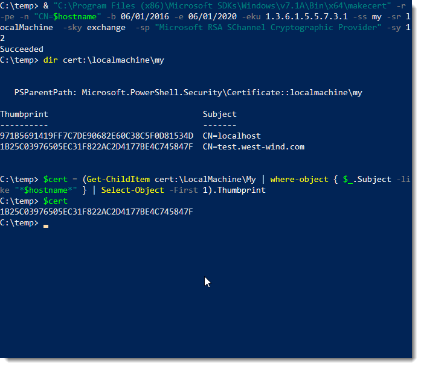
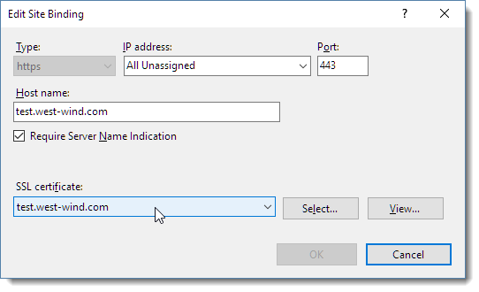
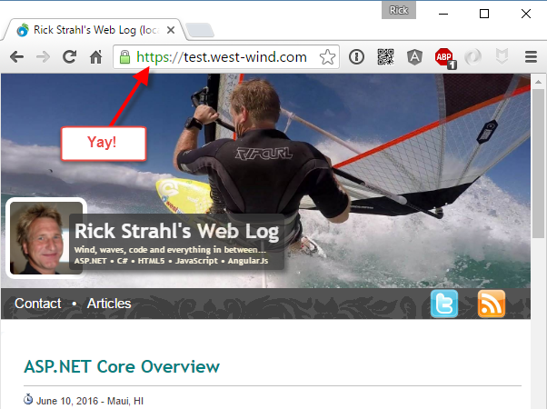

# Use Powershell to bind SSL Certificates to an IIS Host Header Site


Certificate management on Windows has always been a pain in the ass. I've been dealing with certificates a bit in the last few months [as I've moved all of my sites over to Lets Encrypt](https://weblog.west-wind.com/posts/2016/May/09/Getting-motivated-to-move-to-to-SSL-and-HTTPS), so here are a few notes on how to use command line tools, or more specifically Powershell to manage certificates in relation to IIS installations.

Things got a little more complicated with Windows Server 2012 and support for SNI which lets you bind multiple Certificates to a single IP address which means that certificates have to be bound that way as well. In researching this there have been solutions for some time for binding to IP addresses, but when binding to host headered sites with SNI, things work a little differently and finding the right solution took a bit of fiddling.

##AD##

### Getting Started
For these examples I'll use Powershell and the [IIS WebAdministration Powershell snap-in](http://www.iis.net/learn/manage/powershell/installing-the-iis-powershell-snap-in). If you have IIS installed this snap-in should be registered, if not you may have to [install it](http://www.iis.net/downloads/microsoft/powershell).

The process to register an SSL certificate in an IIS site is:

* Create or import a certificate
* Find its certificate hash
* Bind the host header/IP address to the certificate in http.sys
* Bind the IP/Hostheader binding to IIS

### Getting Setup
Let's start by opening a Powershell Administrator window, and then creating a couple of variables in Powershell that we'll re-use with various commands:

```powershell
$hostname="test.west-wind.com"
$iisSite="Default Web Site"
```
> ### @icon-scissors Cutin' and Pastin'
> Note most of the following Powershell commands below include line breaks for readability but they need to be on a single line to execute. I've copied all the commands <a href="#PowershellCodeSnippets">@icon-arrow-circle-down at the bottom</a> into a parameterized script that you can either run directly or cut and paste from more easily.

### Creating a Test Certificate
I'll start by creating a test certificate to bind. If you already have a certificate and that certificate is installed you can skip this step and go directly to retrieving the certificate's thumbprint/certhash.

To create a local client side certificate:

```powershell
& "C:\Program Files (x86)\Microsoft SDKs\Windows\v7.1A\Bin\x64\makecert" 
   -r -pe -n "CN=$hostname" -b 06/01/2016 -e 06/01/2020 
   -eku 1.3.6.1.5.5.7.3.1 -ss my -sr localMachine  -sky exchange 
   -sp "Microsoft RSA SChannel Cryptographic Provider" -sy 12
```

Once created you need to also make add this certificate to your trusted root certificates so that your local machiune will trust it - without this step the certificate will show as secure but untrusted. From the start menu run *Manage Certificates | Personal*  to find your certificate and then **copy it** over into the *Trusted Root Certificates*:


Once you've created the certificate you can check to see whether it was created with:

```powershell
dir certs:\localmachine\my
```
From the display there you can also copy the thumbprint, which we'll need later to bind the certificate in IIS.

We'll want to capture the certificate hash (shown as the thumbprint) into a variable, so we can use to store that to a `$cert` variable:

```powershell
$cert = (Get-ChildItem cert:\LocalMachine\My 
      | where-object { $_.Subject -like "*$hostname*" } 
      | Select-Object -First 1).Thumbprint
```

This should all look something like this:



### Existing Certificates
If you have an existing certificate you can import it with `CertUtil`:

From a PFX:
```powershell
certutil -importpfx <pfx_file>
```

From a CER:
```powershell
certutil –addstore MY <Cer_File>
```

### Get the Certificate Hash or 'Thumbprint'
Once a certificate exists you need to find the certificate hash which is used to bind the certificate to an IP address and to an IIS site.

As before browse your certs and find the thumbprint, copy it from the Powershell window and paste it to the `$cert` variable:
```powershell
dir certs:\localmachine\my
$cert = "<thumbprintOfYourCert>"
```

### Bind the certificate to an IP Address and Port
Once you have a certificate hash in the `$cert` variable I can bind the certificate to a port.

For host header support you need to use the `hostnameport` parameter `netsh sslcert` command to specify a combination for hostname and port. This is required so you can use SNI (Server Name Indication) with the IIS Site, which allows you to bind multiple certificates to a single IP address in IIS.

To bind hostname and IP to your certificate you can now do:

```powershell
$guid = [guid]::NewGuid().ToString("B")
netsh http add sslcert hostnameport="${hostname}:443" certhash=$cert certstorename=MY appid="$guid"
```
Note that here we're binding an hostname and IP Address combination using the `hostnameport` option which is what's required for SNI. The hostname:port combo doesn't yet exist, but it works regardless as this just creates an entry in a mapping table.

### Bind the Web Site to the Host Header IP
Finally we need to also bind Web site to the IP/Hostheader/Port combination.

```powershell
New-WebBinding -name $iisSite -Protocol https  -HostHeader $hostname -Port 443 -SslFlags 1
```

Notice the `-SslFlag=1` setting, which enables SNI on this binding.

If for whatever reason you need to remove the binding you can use:

```powershell
netsh http delete sslcert hostnameport=test.west-wind.com:443
```
##AD##

### Finito
When it's all said and done we should now have a completed binding in IIS:



Note that we have the SNI setting flagged and the certificate pointing at our newly created certificate.

You should now be able to browse to your site under SSL and get the secure lock icon:




### Powershell Code Snippets
As mentioned here are all the pastable Powershell commands. It's actually a runnable script which you can run. 

First make sure you find your cert hash:

```powershell
dir cert:\localmachine\my

# find your has and paste as value below
$cert="PastedCertificateHash"
```

Then you can run the script to pass in the hostname, the IIS site name, machine name and the cert hash as parameters:

```powershell
# Execute script and pass the hash
.\SSLIISBinding.ps1 "test.west-wind.com" "Default Web Site" "LocalMachine" $cert
```

##AD##

Here's the full script. Note if you don't pass a cert hash to it it will create a new local certificate with the name of the hostname.

```powershell
$hostname = "test.west-wind.com"
$iisSite = "Default Web Site"
$machine = "LocalMachine"

if ($args[0]) 
{     
    $hostname = $args[0]
}
if($args[1])
{
    $iisSite = $args[1]
}
if ($args[2])
{
    $machine = $args[2]
}
if ($args[3])
{
    $cert = $args[3]
}
"Host Name: " + $hostname
"Site Name: " + $iisSite
"  Machine: " + $machine
if (-not $cert) {
    # Create a certificate
    & "C:\Program Files (x86)\Microsoft SDKs\Windows\v7.1A\Bin\x64\makecert" -r -pe -n "CN=${hostname}" -b 06/01/2016 -e 06/01/2020 -eku 1.3.6.1.5.5.7.3.1 -ss my -sr localMachine  -sky exchange  -sp "Microsoft RSA SChannel Cryptographic Provider" -sy 12

    dir cert:\localmachine\my
    $cert = (Get-ChildItem cert:\LocalMachine\My | where-object { $_.Subject -like "*$hostname*" } | Select-Object -First 1).Thumbprint
    $cert
}
"Cert Hash: " + $cert

# http.sys mapping of ip/hostheader to cert
$guid = [guid]::NewGuid().ToString("B")
netsh http add sslcert hostnameport="${hostname}:443" certhash=$cert certstorename=MY appid="$guid"

# iis site mapping ip/hostheader/port to cert - also maps certificate if it exists
# for the particular ip/port/hostheader combo
New-WebBinding -name $iisSite -Protocol https  -HostHeader $hostname -Port 443 -SslFlags 1

# netsh http delete sslcert hostnameport="${hostname}:443"
# netsh http show sslcert
```
### Related Content
* [Using Lets Encrypt with Windows and IIS](https://weblog.west-wind.com/posts/2016/Feb/22/Using-Lets-Encrypt-with-IIS-on-Windows)
* [Getting Motivated to move to SSL](https://weblog.west-wind.com/posts/2016/May/09/Getting-motivated-to-move-to-to-SSL-and-HTTPS)
<!-- Post Configuration -->
<!--
```xml
<abstract>
Managing SSL certificates on Windows has always been a pain in the ass and recently with the introduction of SNI to support multiple SSL certificates per site things have changed slightly in order to register certificates with IIS programmatically. In this post I show how to use PowerShell and the IIS WebAdministration snap in commands to create or import and register an SSL Certificate via the Command Line along with how this convoluted process works
</abstract>
<categories>
IIS,Security
</categories>
<postid>1621593</postid>
<keywords>
SSL,IIS,Host Header,SNI,Powershell
</keywords>
<weblog>
Rick Strahl's Weblog
</weblog>
```
-->
<!-- End Post Configuration -->


