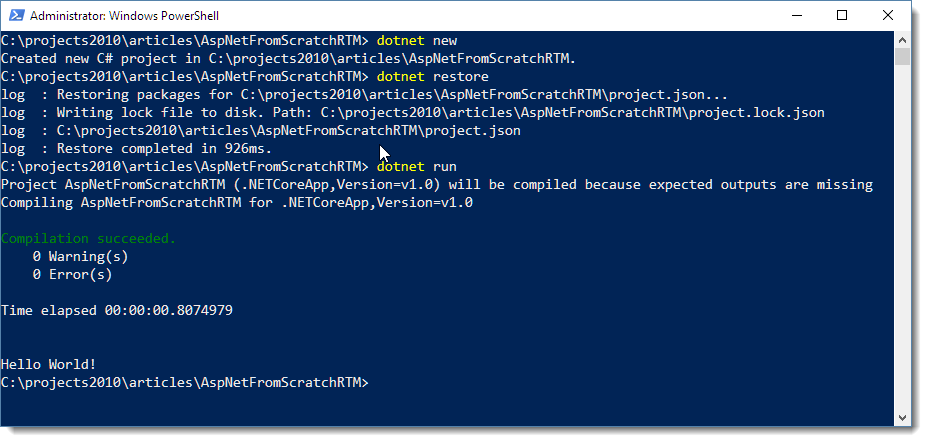
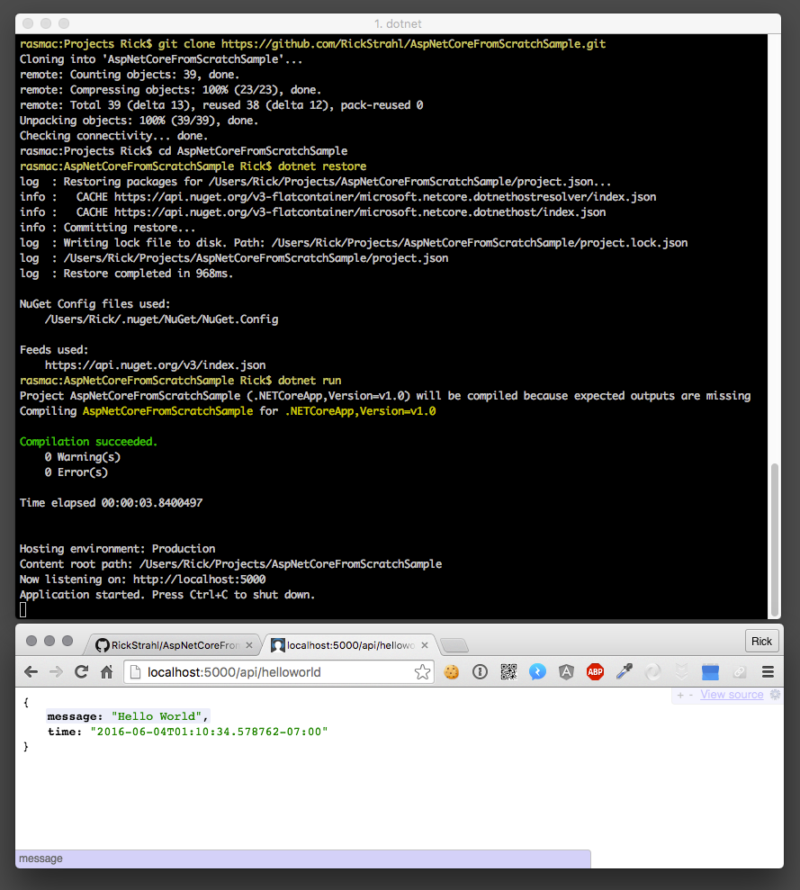

# First Steps: Exploring  .NET Core and ASP.NET Core


.NET Core and ASP.NET Core 1.0 are finally here, and in this post I'll show how to get started with these new tools using the command line tooling. This is not meant to be your typical getting started tutorial that jumps right into Visual Studio and creates a Web project from there. Rather, the purpose of this post is to demonstrate some of the core underpinnings of how .NET Core and ASP.NET Core projects are bootstrapped and using the command line tooling is actually the best way to demonstrate this. 

I'll start at the beginning with 'HelloWorld' then add additional pieces and ASP.NET and demonstrate how to deploy and then run the application both on Windows and a Mac.

You can find the code for this simple walkthrough at:

* [ASP.NET From Scratch Sample on GitHub](https://github.com/RickStrahl/AspNetCoreFromScratchSample)

If you're brand new to .NET Core and what it all means you might also enjoy reading the Overview post first:

* [ASP.NET and .NET Core Overview](https://weblog.west-wind.com/posts/2016/Jun/13/ASPNET-Core-and-NET-Core-Overview)

### Command Line Tooling
One of the nice things about the new command line tooling is that all .NET pieces - the runtimes, compiler and command line tooling - are installed through a single unified install. As I mentioned in my [ASP.NET and .NET Core Overview post](https://weblog.west-wind.com/posts/2016/Jun/13/ASPNET-Core-and-NET-Core-Overview).

I’ll use Windows here to create this first application, but note that you can also do the same thing on a Mac or a Linux machine if the .NET SDK is installed. The steps other than installation are the same so you can follow along on a Mac or Linux.

##AD##

Start by downloading the .NET SDK from [http://dot.net](http://dot.net). Click on the .NET Core link and follow the install instructions for your platform. To create a new project, you can follow the directions from that page.

The steps are:

* Create a new folder
* Change to the new folder
* `dotnet new` to create a new project
* `dotnet restore` to bring down NuGet packages required
* `dotnet run` to actually run the application

As you can see in Figure above the output of this console application is dumped to the console. You’ve just created and run a .NET application in 3 small steps. 

Start with `dotnet new` which creates a new project  with a `program.cs` file that contains a `public Main()` function, just like you expect for a classic Console application. All .NET Core applications, including ASP.NET applications now are Console applications.

The first thing you need to do is `dotnet restore` which restores all the NuGet packages linked in the project. In an empty project like this one it doesn't actually do anything other than reference the .NET Standard Library installed on your machine. 

Once you've restored you can do `dotnet run` which runs the default hello world program:




You can now open the `program.cs` file in that was generated and change the code. For example, change the `Console.WriteLine()` to add a date and time:

```csharp
using System;

namespace ConsoleApplication
{
    public class Program
    {
        public static void Main(string[] args)
        {
            Console.WriteLine("Hello World. Time is: " +
                              DateTime.Now.ToString("t"));
        }
    }
}
```                              

Back at the command line just use `dotnet run` and you should see the updated message including the time displayed. 

```
Hello World. Time is: 5:36 PM
```
Note that the code automatically was recompiled and executed with the change you made when you did `dotnet run`. There's no explicit compilation step - there is however an explicit `dotnet build` command you **can** use if you explicitly want to just build your project.

To recap. You:

* installed .NET
* ran three commands
* and had a running .NET piece of code

While developers of languages like NodeJs have taken this for granted you can now much more easily create new project or small utilities using this same approach using .NET.

### Where's my Executable?
One thing you might have noticed in the code above is that you are not executing an EXE file. Instead you run `dotnet run` in a folder that contains a `project.json` file which contains the instructions to bootstrap the application. This does mean that current applications have to run out of a dedicated folder and have to contain the files to build the project.

Code is compiled into an assembly on the fly (stored in the `bin` folder as a DLL) which is then loaded by the dotnet runtime loader that hosts the DLL when you do `dotnet run`. The build process does produce binaries in the `bin` folder, but there's no mainline exe. `dotnet run` options determine whether the project is compiled or uses the existing assemblies from the `bin` folder.

> #### @icon-info-circle Building an Exe
> When you `dotnet build` or `dotnet run` using the project json shown earlier, it produces a platform agnostic, portable set of assemblies that can execute on any platform that are loaded from `dotnet.exe` when you run `dotnet run`.
> 
> It is possible to build your application to an EXE by creating a platform specific build. A number of directives in `project.json` can be used to specify the output targets. `dotnet publish` then creates a renamed `dotnet.exe` that automatically launches the platform specific project. For more info please see [.NET Core Application Deployment](https://docs.microsoft.com/en-us/dotnet/articles/core/deploying/index) (thanks to [Bertrand](https://twitter.com/bleroy) for the link).
>
> In the future there's also been talk about the creation of native binaries with dynamic compilation, but for now only this pass through execution through `dotnet.exe` and a required folder are supported. 

##AD##

### Command Line Bigotry?
So the command line tooling is interesting in that it makes it much easier to create, build and run .NET applications. 

But it's not just that you can perform the build process from the command line, but the fact that it’s very easy to get started. Download a relatively small SDK, install it, scaffold a base project, then use any text editor (or full boat Visual Studio) to make a change to your code and run. Compare that with the process of how you get started with the full version .NET, which pretty much involves downloading Visual Studio or installing a slew of SDKs and figuring CSC command line syntax. Using `dotnet.exe` with a few simple commands is a lot more approachable, and more importantly you can be up and running with this code from download to running code in about 5 minutes.

This is **a very good thing**!

The command line tools are there to make getting started easier and to appease those that like to work on a lower level than the big monster that is Visual Studio. 

But that isn’t to say that you’re going to **have to** build your application from the command line now - you can still use Visual Studio which then uses the command line tooling for creating the projects on your behalf.

In fact, if you install the Visual Studio tooling for ASP.NET Core you get Visual Studio integration like you would expect, so you can use the rich Visual Studio editor and your favorite tools and extensions to build your applications. 

But behind the scenes, Visual Studio calls **into these same command line tools to compile your project**. This opens up the build process to tooling or your own build process management, because you have easy access to the same tools that Visual Studio uses to build your project.

Personally I'm not a big command line guy - I prefer visual tooling for most things, but I have to admit that with this new tooling I find myself at the command line more often. Because the tooling is easy to use with terse commands it can often be quicker to restart an app from the command line than the Visual Studio run cycle. So beware - you might end up changing your habits (again - probably a good thing).

### What about ASP.NET?
So far I’ve talked about general .NET with a console application, but what does all of that have to do with ASP.NET? Well, ASP.NET Core projects are Console applications that launch a Web server execution environment and use this very same infrastructure that I’ve talked about in the last example. 

Let’s turn the lowly HelloWorld application into a much more desirable HelloWorld **Web** application. Change out the Main() method with the code shown here:

```csharp
using System;
using System.IO;
using Microsoft.AspNetCore.Builder;
using Microsoft.AspNetCore.Hosting;
using Microsoft.AspNetCore.Http;

namespace ConsoleApplication
{
    public class Program
    {
        public static void Main(string[] args)
        {
            var host = new WebHostBuilder()
                .UseKestrel()
                .UseStartup<Startup>()
                .Build();

            host.Run();
        }
    }

    public class Startup
    {
        public void Configure(IApplicationBuilder app)
        {            
            app.Run(async (context) =>
            {
                await context.Response.WriteAsync(
                    "Hello World. The Time is: " + 
                    DateTime.Now.ToString("hh:mm:ss tt"));
                                                               
            });
        }
    }
}
```

You’ll also need to make a small change in project.json to add a reference to pull in the Kestrel Web server and Http extensions:

```json
 "dependencies": {
    "Microsoft.AspNetCore.Server.Kestrel": "1.0.0"
  },
  "frameworks": { ... }
```

Now go back to the command line and run the application again and then do:

```
dotnet restore
```

This updates the NuGet packages and pulls down the additional package. Then do:

```
dotnet run
```

and you should now get a prompt that states that the Web server has been started on port 5000. Navigate to [http://localhost:5000](http://localhost:5000) and… voila, HelloWorld from ASP.NET Core. You’ll get a plain text string:

```
Hello World. The Time is: 6/3/2016 2:32:20 PM
```

So this is super trivial, but it highlights the basic process of how an ASP.NET Core application bootstraps on top of the .NET Core runtime. You can see that the same Console application structure is used for ASP.NET. There’s no magic, you have full control all the way from the initial bootstrapping of the application, through startup configuration and into the full ASP.NET pipeline.

### Middleware
ASP.NET Core applications are self contained Console applications that self host the Kestrel Web server. The code in `Main()` basically hoists up a new instance of Kestrel and configures it to handle Web requests. The configuration is delegated to the `Startup` class which usually lives in a separate file, but for simplicity I'm putting everything into a single file here.

The `Startup` class is where you can hook up custom middleware that is added to the ASP.NET pipeline. Middleware is essentially what we thought of as **HttpHandlers** and **HttpModules** in classic ASP.NET – it’s the stuff that makes things happen in an ASP.NET Core Web application.

### App.Run() - Handler of Last Resort
The code in the `Startup` class above uses the App.Run() middleware handler, which is roughly the equivalent of an HttpHandler in classic ASP.NET. When App.Run() gets fired it’s expected to handle the inbound request completely and return a result. You can think of App.Run() as a last resort handler that is fired when nothing else has handled the request. In the example above there is nothing else handling requests, so the App.Run() handler is fired and hence we see the HelloWorld message.

### App.Use - Middleware Modules
If `App.Run()` is like an Http handler, `App.Use()` is like an HttpModule. `App.Use()` handlers can be chained together and are fired in the order they are assigned. Unlike HttpModules middleware can handle both **before** and **after** request processing operations. Let’s modify the HelloWorld sample with an `App.Use()` handler that hooks in pre and post processing for each request on the server.

Add the following to the Configure method just before the App.Run() implementation:

```csharp
app.Use(async (context, next) =>
{
    await context.Response.WriteAsync("Pre Processing");

    await next();

    await context.Response.WriteAsync("Post Processing");
});
```

If you stop the server with Ctrl-c and re-run it with dotnet run, you should now get:

```
Pre Processing...Hello World. The Time is: 6/3/2016 3:10:19 PMPost Processing...
```

As you can see the `App.Use()` middleware has wrapped itself around the App.Run() call. The middleware pipeline strings together all pieces of middleware one after the other and each piece of middleware calls the next in the chain. The middleware handlers are executed in order going in, and then in reverse order going out (stack behavior). Again if you think of the analogy with older ASP.NET versions you can think of it as pre and post request RequestHandler processing. All the pre-handlers fire until the pipeline has no more middleware or an operation doesn’t call `next()`, and then it reverses and walks the chain the other way. It’s a simple and elegant concept that's used by other server implementations like NodeJs and the previous ASP.NET OWIN architecture.  

### Hooking up ASP.NET MVC
`App.Use()` and `App.Run()` are very low level constructs akin to creating HttpHandlers and HttpModules and generally not the level at which you build applications. `App.Use()` is typically implemented by application frameworks like ASP.NET MVC or utility features like Authentication modules, state managers or loggers hook into. 

When you build a Web application you tend use much higher abstractions such as ASP.NET MVC. Rather than implementing middleware yourself, ASP.NET MVC provides middleware integration with a configuration link that hooks up the MVC framework you then use to build your application. Once configured, building a typical ASP.NET Core MVC applications is fairly similar to the way you built older ASP.NET MVC applications. 

To demonstrate let’s add ASP.NET MVC to our startup sample and create simple API endpoint that returns some JSON data to show that it works. 

The first step to load the right packages loaded. Add the following to your dependencies in project.json:

* `"Microsoft.AspNetCore.Mvc": "1.0.0"`

Make sure to do a `dotnet restore` (or build if you're in Visual Studio) to pull down the packages.

Next add the following configuration code to the Startup class:

```csharp
using System;
using System.IO;
using Microsoft.AspNetCore.Builder;
using Microsoft.AspNetCore.Hosting;
using Microsoft.AspNetCore.Mvc;
using Microsoft.Extensions.DependencyInjection;

namespace ConsoleApplication
{
    public class Program
    {
        public static void Main(string[] args)
        {
            var host = new WebHostBuilder()
                .UseKestrel()
                .UseStartup<Startup>()
                .Build();

            host.Run();
        }
    }

    public class Startup
    {
   
        public void ConfigureServices(IServiceCollection services)
        {
            services.AddMvc();
        }

        public void Configure(IApplicationBuilder app)
        {
            app.UseMvc();
        }
    }
}
```

This code sets up the required dependency injection in `ConfigureServices()` and then enables MVC for the application in `Configure()`. This is a common pattern: `ConfigureServices()` initializes dependency injection services typically with configuration settings that are set up so that dependency injection creates types with the right configuration settings when injected. `Configure()` then adjusts the behavior of the middleware which is typically a more specific wrapper around `App.Use()`. Methods like `app.AddMvc()` and `app.UseMvc()` are extension methods that are provided by the specific implementation – in this case provided by the `Microsoft.AspNetCore.Mvc` package.

In the case of MVC there’s no explicit configuration required, but other providers like EntityFramework  or a logging provider **require** that you set up a connection string and data provider for example. Most `.AddXXX()` methods typically have overrides that pass in some sort of 'option' object with configurable properties or operations.

##AD##

Once configuration is done, all that’s left is to create a controller. I’m going to start with an API request and I’ll create a good old HelloWorld API request. To do this create a class like this and add it to the bottom of `program.cs`:

```csharp
public class HelloWorldController
{
    [HttpGet("api/helloworld")]
    public object HelloWorld()
    {
        return new
        {
            message = "Hello World",
            time = DateTime.Now
        };
    }
}
```

This is a controller with an API endpoint that returns an anonymous object instance. Because this is an API the result will be serialized - most likely into JSON (depending on the accept header of the client).

Now go back to the command line and again do `dotnet run`. Then navigate to [http://localhost:5000/api/helloworld](http://localhost:5000/api/helloworld). 

You should now get:

```json
{
  message: "Hello World",
  time: "2016-06-03T15:39:18.339626-07:00"
}
```

And that's an API endpoint.

### POCO Controller
Note that the controller implementation in this example doesn’t derive from Controller. It’s a POCO object and ASP.NET Core can figure out to call the controller’s method based on the name of the class by the Controller postfix convention. Unless you need specific features of the Controller base class you don’t have to inherit from it in ASP.NET Core. For simple APIs this can be useful as it reduces overhead of the relatively heavy `Controller` base class.

### Adding MVC and Razor Views
Finally let’s add another method to the controller and render a Helloworld View page. To do this we need to make a couple of configuration changes. Start by adding this package in `project.json`:

* `"Microsoft.Extensions.Configuration.FileExtensions": "1.0.0"`

Do `dotnet restore`, then set  `.UseContentRoot()` in the `Main()` startup to provide root path for the application:

```csharp
public static void Main(string[] args)
{
  var host = new WebHostBuilder()
        .UseContentRoot(Directory.GetCurrentDirectory())
        .UseKestrel()
        .UseStartup<Startup>()                
        .Build();
    host.Run();
}
```

> #### @icon-warning UseContentRoot is Required!
> MVC uses the Content Root to figure out where the base folder for the application and without this things like MVC View resolution or general purpose virtual to physical path mapping doesn't work. It seems superfluous - after all we are running a Console app and it knows where it started - but without `.UseContentRoot()` anything that requires path mapping fails.

Now we can add a controller method to the existing `Helloworld` controller. Note that ASP.NET Core’s MVC version supports both API and MVC endpoints in the same controller, so I don’t need to create a separate controller class (although generally it’s a good idea to separate API and UI endpoints):

```csharp
[HttpGet("helloworld")]
public ActionResult HelloworldMvc()
{
    ViewBag.Message = "Hello world!";
    ViewBag.Time = DateTime.Now;

    return View("helloworld");
    //return View("~/helloworld.cshtml");
}
```

There’s one more change required on this controller: When I showed the API request, the controller did not inherit from Controller and was a POCO object. But in this example I use the `ViewBag` and `View()` members of the base controller so this controller needs to inherit from `Controller`. 

Change the Controller class definition to:

```csharp
public class HelloworldController : Controller
```

Now all we need is a View. ASP.NET Core MVC uses standard View discovery logic by default, so it’s looking in the `/Views/Helloworld` folder for a `HelloworldMvc.cshtml` view. Instead I’ll create a `helloworld.cshtml` view which is reflected by explicitly specifying the requested view in the `View("helloworld")` call.

The view is ultra simple and just used to demonstrate that it works:

```html
<label>Message:</label>
@ViewBag.Message

<hr/>

<label>Time:</label>
@ViewBag.Time
```

You also need to add one more setting to `project.json` in the `builddOptions` section:

* `"preserveCompilationContext": true`

This option is required for dynamic compilation of views without it you will get a slew of errors that won't find dependencies. The switch passes forward all the host application assembly references.

The controller and view simply echo out the Viewbag values I passed from the controller as Razor expressions. Views work as you would expect supporting the full Razor/C# syntax. I’m only setting and accessing ViewBag values here, but of course you can also pass a full blown model object into the View just as you could in earlier versions of MVC.

Now go back to the command line and again do `dotnet run`. Then navigate to [http://localhost:5000/helloworld](http://localhost:5000/helloworld). 

You should now get:

```
Message: Hello world!
---
Time: 6/3/2016 9:29:12 PM
```

And that's an MVC Controller and View!

### Where are we?
So at this point we started with a plain Console application, then added a low level ASP.NET Core handler implementation, followed by an MVC API implementation and finally an MVC View based implementation. All of the code required to do this is in a single small code file in about 60 lines of code as shown here:

```csharp
using System;
using System.IO;
using Microsoft.AspNetCore.Builder;
using Microsoft.AspNetCore.Hosting;
using Microsoft.AspNetCore.Mvc;
using Microsoft.Extensions.DependencyInjection;
using Microsoft.AspNetCore.Http;

namespace ConsoleApplication
{
    public class Program
    {
        public static void Main(string[] args)
        {
            var host = new WebHostBuilder()
                .UseContentRoot(Directory.GetCurrentDirectory())
                .UseKestrel()
                .UseStartup<Startup>()
                .Build();

            host.Run();
        }
    }

    public class Startup
    {
        public void ConfigureServices(IServiceCollection services)
        {
            services.AddMvc();
        }

        public void Configure(IApplicationBuilder app)
        {
            app.UseDeveloperExceptionPage();

            app.UseMvc();

            //app.Use(async (context, next) =>
            //{
            //    await context.Response.WriteAsync("Pre Processing");
            //    await next();
            //    await context.Response.WriteAsync("Post Processing");
            //});

            // Handler of last Resort
            app.Run(async (context) =>
            {
                await context.Response.WriteAsync(
                    "Hello World of the last resort. The Time is: " +
                    DateTime.Now.ToString("hh:mm:ss tt"));

            });
        }
    }

    public class HelloWorldController : Controller
    {
        [HttpGet("api/helloworld")]
        public object HelloWorld()
        {
            return new
            {
                message = "Hello World",
                time = DateTime.Now
            };
        }

        [HttpGet("helloworld")]
        public ActionResult HelloworldMvc()
        {
            ViewBag.Message = "Hello world!";
            ViewBag.Time = DateTime.Now;

            return View("helloworld");
            //return View("~/helloworld.cshtml");
        }
    }
}
```


### Where’s IIS?
You may have noticed that I just ran a console application on Windows. There’s no IIS or other external Web server hosting the application. What’s happening is that ASP.NET Core uses a self-hosted Web Server (**Kestrel** which ASP.NET Core’s high performance Web Server) in a Console application. 

The application is self-contained running with its own private copy of .NET and its own Web server which makes the application very portable. Portable in terms of deployment, but also portable in terms of platform – you can host this application on multiple operating systems and assuming you didn’t use any platform specific features the application will run on both using the same Kestrel Web server.

The application is self-hosted and doesn’t directly need a Web server to run. However, it’s not recommended to run Kestrel directly over the Internet. Instead you should use a front end reverse proxy like IIS on Windows or nginx or similar on Linux to front the IIS Web server. The reverse proxy provides multiple bindings to the open Http (80) and SSL (443) ports as well as potential load balancing and other request routing logic. 

On Windows IIS additionally provides process management that can ensure that your application always stays running. If your application crashes it’s automatically restarted, much in the same way that the Windows Activation Service (WAS) does today with IIS Application Pools. 


There’s a native **AspNetCoreModule** that is installed on Windows and IIS that handles ASP.NET Core routing and process management. This native module is lightweight and still requires an Application Pool, but no .NET Runtime. IIS doesn’t do any direct request processing, but rather acts as proxy to forward requests to your application. 

Another benefit with this setup is that you can more easily set up load balancing and you can have a single server that requires an SSL certificate while the backplane runs over plain HTTP. You can also hide your application Web Server from the Internet as only the IIS server needs to be publicly exposed. When running ASP.NET Core on Windows, IIS is relegated to the job of reverse proxying and process management.

For more info on running ASP.NET Core on IIS check out:

* [Publishing and Running ASP.NET Core Applications with IIS](https://weblog.west-wind.com/posts/2016/Jun/06/Publishing-and-Running-ASPNET-Core-Applications-with-IIS)

##AD##

### Running on a Mac
So far I’ve run this little walk through exclusively on the Windows machine, but I can actually take this entire 'application' and move it over and run it on the Mac without any changes to the code!

To make this happen I'll push the project to source control on GitHub at: 

* [ASP.NET From Scratch on GitHub](https://github.com/RickStrahl/AspNetCoreFromScratchSample). 

The first thing that has to happen on the Mac side is to make sure that the [.NET SDK is installed](http://dot.net). Follow the simple and quick instructions there for installation and after a few minutes you should have a full install of .NET with the same feature functionality that I’ve discussed so far in this article. In fact, all of the steps I’ve run through so far (except for the section on IIS) apply just the same on the Mac or Linux for that matter.

Once the SDK is installed you can clone the repository from GitHub into any folder on your Mac or Linux machine. Once you have done that you can issue the following commands:

* `git clone https://github.com/RickStrahl/AspNetCoreFromScratchSample.git`
* `dotnet restore`
* `dotnet run`

You can see the results in Figure 5 which shows the packages being downloaded and installed, the compiler building the application and then running the Web server on port 5000. You can then navigate to [http://localhost:5000/api/helloworld](http://localhost:5000/api/helloworld),  to see the API, MVC and the raw `App.Run()` endpoints.



While it’s not super practical or even realistic to have applications that run on multiple platforms, it’s pretty cool to see this 'just work' without any special effort or any code or configuration changes. We are no longer limited to just running on Windows which is exciting as it opens many new opportunities for .NET code.

Granted, the example are just about the most basic thing you can build so it’s not too surprising that the code works across platforms. But I’ve also taken a few more involved, data centric applications and moved them over to the Mac. I was surprised to find them just working as well. As long as you can stay away or isolate platform specific features in your application,.NET Core code just runs on multiple platforms now.

You can take a .NET Core application developed on Windows, restore it on a Mac or Linux and it just runs.

### Core Analysis
It’s been a long journey for .NET Core and ASP.NET Core with a lot of false starts and a few tribulations along the way, but with the RTM release we're finally seeing all of that churn pay off in a flexible framework that finally seems to have a unified version on where its going in the future. The unified command line tooling features, the ability to run cross platform and relative ease with which you can now put applications together is good insight into what we can look forward to now and with the new features and functionality promised in the future.

In this article I’ve purposefully stuck to the low level aspects of creating a simple hello world application in a number of different ways, using just the command line tooling. This isn’t because I love command line tools, or because I plan on building everything using just this low level tooling. I’m quite happy using Visual Studio and the rich tooling and developer support it provides in the IDE, thank you very much. But I wanted to use this lower level approach because it demonstrates so much better how an application is put together than just hitting **New Project** in Visual Studio. Even if you do that from here on out, going through the manual process at least once really helps understanding the basic underpinnings of the platform so I hope you'll take the time to go through this exercise.

I hope you'll find this useful - it certainly has been helpful to me...

### Related Links
* [ASP.NET Core and .NET Core Overview](https://weblog.west-wind.com/posts/2016/Jun/13/ASPNET-Core-and-NET-Core-Overview)
* [Upgrading to ASP.NET Core RTM from RC2](https://weblog.west-wind.com/posts/2016/Jun/27/Upgrading-to-ASPNET-Core-RTM-from-RC2)
* [Publishing and Running ASP.NET Core Applications with IIS](https://weblog.west-wind.com/posts/2016/Jun/06/Publishing-and-Running-ASPNET-Core-Applications-with-IIS)
* [Strongly Typed Configuration Settings in ASP.NET Core](https://weblog.west-wind.com/posts/2016/May/23/Strongly-Typed-Configuration-Settings-in-ASPNET-Core)
* [.NET Core Application Deployment](https://docs.microsoft.com/en-us/dotnet/articles/core/deploying/index)


<!-- Post Configuration -->
<!--
```xml
<abstract>
In this post I'll demonstrate how to get started with .NET Core and ASP.NET using the Command Line Tools. I'll create a few very simple projects and starting with a plain console application, show how to hook up ASP.NET, run an API and MVC app and then run the app locally on Windows and then move it over to run on the Mac. This is not meant to be your typical getting started tutorial that jumps right into Visual Studio and creating a Web project from there. Rather, the purpose of this post is to demonstrate some of the core underpinnings of how .NET Core and ASP.NET Core projects are bootstrapped to run.
</abstract>
<categories>
ASP.NET Core,ASP.NET
</categories>
<postid>1626386</postid>
<keywords>
.NET Core,ASP.NET Core,Command Line,dotnet.exe,Cross Platform
</keywords>
<weblog>
Rick Strahl's Weblog
</weblog>
```
-->
<!-- End Post Configuration -->
