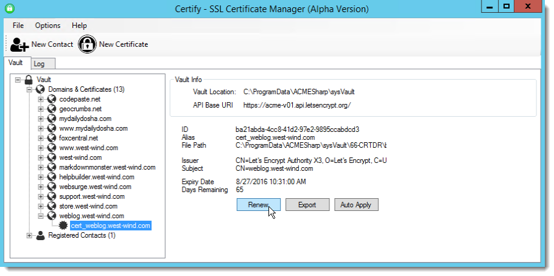
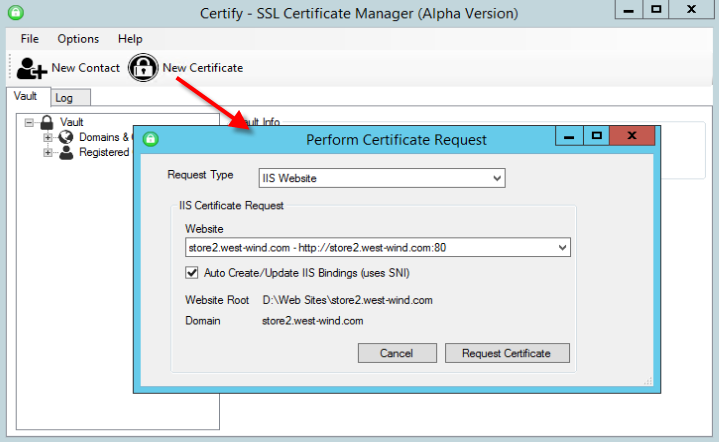
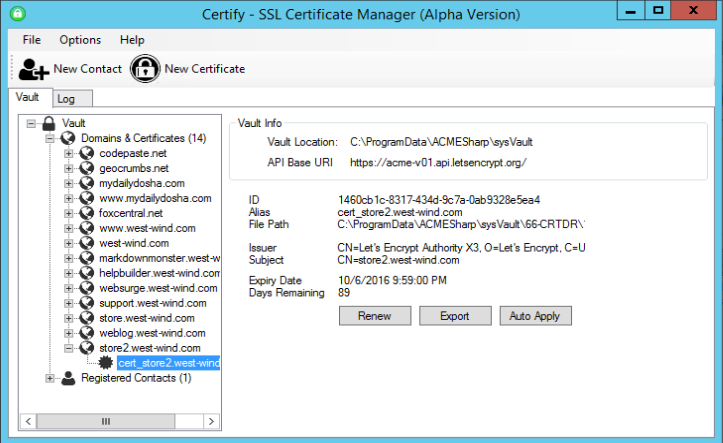
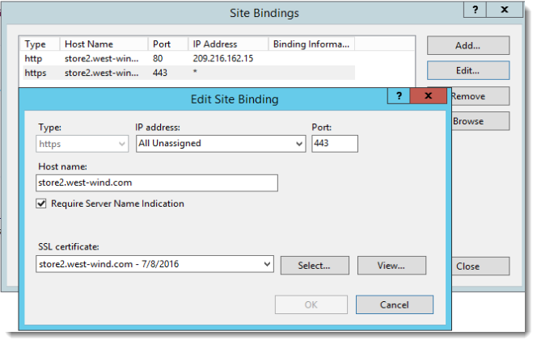
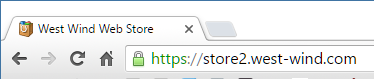
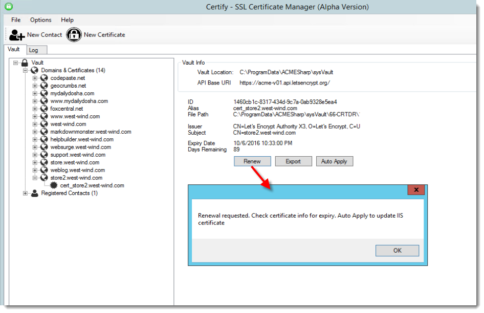
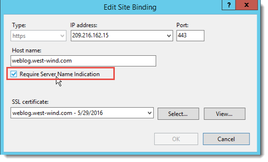

# Moving to Lets Encrypt SSL Certificates


This week marked the expiration of the last paid for SSL certificate that I still had running, and moving off all of my sites to [LetsEncrypt](https://letsencrypt.org/). I've talked a bit about [LetsEncrypt in a few posts recently](https://weblog.west-wind.com/posts/2016/Feb/22/Using-Lets-Encrypt-with-IIS-on-Windows) and as you can probably tell I'm fairly enthused by the fact that I can now use free SSL certificates on all of my sites, including those that previously I would have not considered SSL certs for in the first place. With SSL being free **and** easy to administer, it's become much easier to say *"all my sites are SSL"* from now on.

In this post I'll describe how I'm using LetsEncrypt with Windows and using a pre-release version of the [Certify GUI Client](http://certify.webprofusion.com/) to manage my Lets Encrypt certificates.

##AD##

### Moving off of paid SSL in Stages
I run 16 sites on my server 5 of which were originally using SSL. With the advent of Lets Encrypt and free certificates I moved all but three of the sites over to SSL. SSL is becoming more important as search engines are starting to rank sites using SSL higher. 

But also as a general purpose security feature, SSL protects content from prying eyes, man in the middle attacks and password and cookie snooping. SSL has always been important for sensitive sites that publish data that can't be exposed, but it's becoming important even for non-sensitive sites just to protect cookie and password high jacking. SSL is really starting to become a *requirement* rather than an option if you capture any data at all from users. 

In my case the unsecured sites were mainly hobby or internal use sites that were only used by me and few associates, so nothing really public facing. But even these sites are a potential security risk for things like logins if not properly secured. SSL is a good thing, but in the past, even spending $15 a year for a low impact site - plus the hassle of renewing with a vendor and then the certificate installation was enough to not do it in many cases.

When Lets Encrypt rolled around all that changed though. I started with a few of those previously open hobby sites and tried out Lets Encrypt. I run on a Windows Server so initially the tools available was pretty sparse since the official tooling from the Lets Encrypt Organization only supports Linux (a official Windows client is still in development), but things have improved and there are a number of third party libraries and tools available that make it possible to work with Lets Encrypt on Windows. [I wrote about those Windows tools for IIS](https://weblog.west-wind.com/posts/2016/Feb/22/Using-Lets-Encrypt-with-IIS-on-Windows) a few months ago.

### Moving things over
After playing around with the various solutions with my trial sites, I ended up settling on using [Certify](http://certify.webprofusion.com/). Certify is a Windows GUI utility, which means the process is not 100% automated, but I prefer to have an easy visual way to verify my certificates and interactively renew them which takes but a few minutes for all the sites once every few months.

For testing I ran for two months with the new certificates on my trial sites and went through the process of renewing them to see the whole workflow and notification process in action. It's important you find the right way to do this because Lets Encrypt certificates have a maximum expiration of 3 months which means you **have to renew every three months at least**. Whether you automate this process using the ACME libraries or LetsEncryptWin or whether you use a GUI utility like Certify, just make sure you use the approach that works for you.

After the initial trial period and finding the workflow that worked for me, I moved all of my existing sites to LetsEncrypt as well.

### Wild Card Domains
As I mentioned I just moved my final sites over to Lets Encrypt. The last domain that just expired was my ***.west-wind.com** wildcard domain certificate. Wildcard domains are nice because it makes it very easy to assign sub-domains for all sorts of things. I run about 15 sub-domains like this blog ([weblog.west-wind.com](http://weblog.west-wind.com)), my support site ([support.west-wind.com](http://support.west-wind.com)) and various product sites ([markdownmonster.west-wind.com](http://markdownmonster.west-wind.com), [websurge.west-wind.com](http://websurge.west-wind.com) etc.) as well as some internal test and dev sites under the west-wind.com domain.

Let's Encrypt doesn't support wild card domains, but given how you administer Let's Encrypt certificates that's not really a problem as you can easily generate certificates for all your sub-domains with Lets Encrypt, and then assign them. Using the workflow provided by any of the Lets Encrypt tools it's actually easier to do this than to manage a wildcard certificate in IIS, because the tooling combines the process of creating the certificate **and** installing it into IIS in one step. In a way, Certify and Lets Encrypt become my IIS certificate manager.

##AD##

### Certify
After playing with the various solutions I ended up settling on Certify for now. Certify is a GUI Windows client that lets very quickly and easily set up, and later renew certificates. The tool handles both creating the certificates and binding them to IIS Web sites. Under the covers this tool uses the main .NET based Windows ACME library to provide its functionality. Several other tools also use this same library.

To be clear Certify is still pretty rough and is an alpha product, but besides some of the quirks and lack of high level features (like an easy way to renew all certs), it's still very easy to use and very functional.



### Walk through Certify
Certify, like all Lets Encrypt based clients, should be run on the server that you plan to install the certificate on and where the base domain you are trying to create exists. A site has to exist on the root domain. So if you want to register any subdomain for `yourdomain.com` make sure that `yourdomain.com` is up and running. Also make sure the domain does not auto-redirect to another domain including to a SSL domain (that bit me on one of my sites).

Let's Encrypt certificates are only validated by their hostname and DNS mappings which is why the above works as it does.

> #### @icon-warning Windows Server 2012 required
> Note that Lets Encrypt creates hostname bound SSL certificates which means that the certificates that are mapped to the IP Address, port **and** hostname. On IIS this means you need to use SNI (Server Name Identification) which is supported only on Server 2012 and later. Client versions of Windows 8.0 and later also support it. However Lets Encrypt will **not work** on Server 2008 or older!

#### Creating a new Contact
To start you need to create a contact which is the admin contact that will eventually receive renewal emails for the certificates.


All certificates that you create from here on out are then bound to this or any other contacts that you configure in the above dialog.

#### Create New Certificate
Next you'll create a new certificate. Here you basically pick an IIS Web site that you want to create certificate for:



Notice that I selected the port 80 site. If you don't have an SSL binding to port 443 for the site yet, Certify will create the new binding and add it to IIS. If you already have a 443 binding you can also select that and Certify will figure that out as well.

If all goes well, after a few seconds you'll have a new certificate:



If you now go into IIS you'll find a new binding for port 443:



And you're done!

> #### @icon-info-circle Multiple IP Address Bindings
> If you have multiple IP Addresses on your server I recommend that you explicitly assign the certificate in IIS to an IP Address. Certify applies the certificates to **All Unassigned** which can cause problems if you have multiple IP Addresses. I've seen certificates randomly switching to the wrong IP address and then no longer validating properly. So, I recommend to always explicitly set the IP Address. It'd be nice if Certify/ACME would automatically pick up the explicit IP Address from the base domain.


If all of that worked you should now be able to access your site via SSL:



Yay!

Consider how easy and quick this process is. You can literally have a new certificate bound to a site in less than 5 minutes even if you're running this tooling for the very first time which is freaking awesome compared to the process I had to go through even just with dealing with an SSL vendor.

##AD##

### Renewing Certificates
When a certificate is set to expire, LetsEncrypt sends out notification emails which remind your to renew your certificate.

Using Certify, renewing is as easy as pulling up the site from the list and selecting Renew from the shortcut menu:



Renewals tend to take a little longer so they don't immediately refresh the UI - you have to reload the vault to see the update in the UI. But again it only takes a few seconds.

### Gotchas
There are a few gotchas to watch out for with lets encrypt that bit me while updating.

#### SNI
Lets Encrypt requires SNI (Server Name Identification) when using IIS so that you can bind multiple SSL certificates to a single IP address. Prior to SNI (which was introduced in Windows Server 2012 and Windows 8.0 (IIS 8)) SSL required a dedicated IP address for each SSL certificate which was a major stumbling block for SSL usage (and another reason why I didn't use it as I was running on Server 2008 up until late last year).

On IIS it's very important that you make sure that  **every SSL binding tied to a particular IP address** (or the 'unassigned' site) is marked as SNI:



if there's just one site that's not tied to SNI for a particular IP Address, you'll end up getting SSL errors for all but one site. 

This is a major fail in the IIS Admin UI - it shouldn't allow for this to happen, but as it is it's an easy mistake to make, and a difficult one to track down. You can use:

```
netsh http show sslcert
```

to show all http.sys port 443 bindings which also shows whether SNI is enabled, but if you have a few certs installed it's difficult to see the state easily there as well. It's best to be very careful when you create your certificate for the first time and ensure that SNI gets and IP port binding gets set correctly.

Renewals automatically use the existing mapping, so this tends to be a one time check you should make when you first install a new certificate.


##### IP Addresses
If you have more than one IP Address on your server make sure to bind every site to an IP Address rather than using *All Unassigned*. I've had various problems with IP Addresses jumping on domains and as a result SSL certificates randomly not working.

When that happens you'll see the red Https warning box in the address bar. The same rules as with the SNI note above applies - after initial creation of the new binding from Let's Encrypt make sure you double check the binding and ensure SNI is enabled and you are bound to a specific IP.

### What about Wildcard Certs
As I mentioned when I replaced all of my certs I also replaced my wild card certificate. But Lets Encrypt doesn't support wild card certs. So what did I do? It simply doesn't matter. Although wild card certs aren't supported, I can now create individual certs and assign them to my sites instead. Because I've simplified my IIS configuration process through Certify's interface, I'm removing the IIS mapping step that I can now do in Certify. Either way I needed to configure the certificate and the steps to do it with an explicit cert is no more involved than assigning a cert inside of IIS's manager. IOW, the process is different, but it's no more complex with individual certificates now.

### No Extended Validation Certificates
Lets Encrypt is limited to basic SSL certificates, which means it only provides for the lowest level of SSL validation which validates that you own the domain that you are certifying. This works fine if all you need to do is secure you're content, but you don't need to more vigorous validation that provides extended company identification.

You won't get an Extended Validation (EV) certificate that gives you the full company green bar. If you need this level of SSL certificate you still need to buy a certificate from a commercial certificate authority.

### Making life Easier
For me moving all my certificates to Lets Encrypt and using Certify has made my life much easier even though I've actually added a number of new certificates. The reason for this is that now I have a central place where I can manage all my certificates **and** administer their assignment into IIS. It's one place were I can go and check on status and if necessary renew the certificates. It's also saving me $200 a year that I used to spend on certificates.

The benefits of this approach are:

* Free SSL Certificates
* Central Storage of Certificates
* Easy to unify dates for all certificates  
(so you can update all at once)
* Easy assignment to IIS Sites
* Save some money

Once certificates have been set up I can check in once every three months (when the Lets Encrypt renewal notices pop up) and spend 5 minutes to update all the certificates and I'm done for another 3 months. If I run into a problem with cert or the keys get compromised I can easily renew any of the certs or all of them at any time.

Since I have a dozen domains here this takes a few minutes at best which is fast enough.

Compare that to upgrading paid certificates with renewal process, waiting for approval, unpacking the certificate and installing it into IIS this is a fraction of the time it used to take me.


So, if you haven't played with Lets Encrypt and automated certificates and you use certificates I recommend you take a look and check it out. I think you'll find that this process greatly simplifies certificate management and reduces costs as well. It'll be interesting to see what this ends up doing to paid providers (which like Commodo who are actively trying to disrupt and discredit LetsEncrypt), or if it will drive down prices and more importantly make it easier to deal with certificates. These new tools are showing that the process of certificate management doesn't have to be the special kind of hell we've been put through for all these years.


### Related Posts
* [Using Let's Encrypt with IIS on Window](https://weblog.west-wind.com/posts/2016/Feb/22/Using-Lets-Encrypt-with-IIS-on-Windows)
* [Getting Motivated to move to SSL and HTTPS](https://weblog.west-wind.com/posts/2016/May/09/Getting-motivated-to-move-to-to-SSL-and-HTTPS)
* [Use Powershell to bind SSL Certificates to an IIS Host Header Site](https://weblog.west-wind.com/posts/2016/Jun/23/Use-Powershell-to-bind-SSL-Certificates-to-an-IIS-Host-Header-Site)


<!-- Post Configuration -->
<!--
```xml
<blogpost>
<abstract>
This week marks the expiration of my last paid for SSL certificates and moving all certificates to Lets Encrypt. In the process I had a chance to moving some of my smaller personal and hobby sites as well as moving my wildcard cert for the main site. In this post I'll describe the process I'll describe what tools I used and the process I went through to gradually move my sites over to Lets Encrypt.
</abstract>
<categories>
Security,LetsEncrypt
</categories>
<keywords>
SSL Certificates,LetsEncrypt,Security
</keywords>
<weblogs>
<postid>1634041</postid>
<weblog>
Rick Strahl's Weblog
</weblog>
</weblogs>
</blogpost>
```
-->
<!-- End Post Configuration -->
