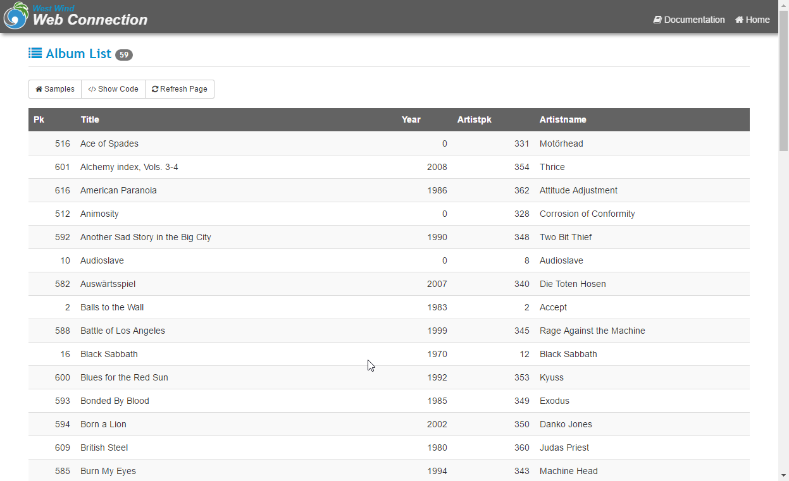
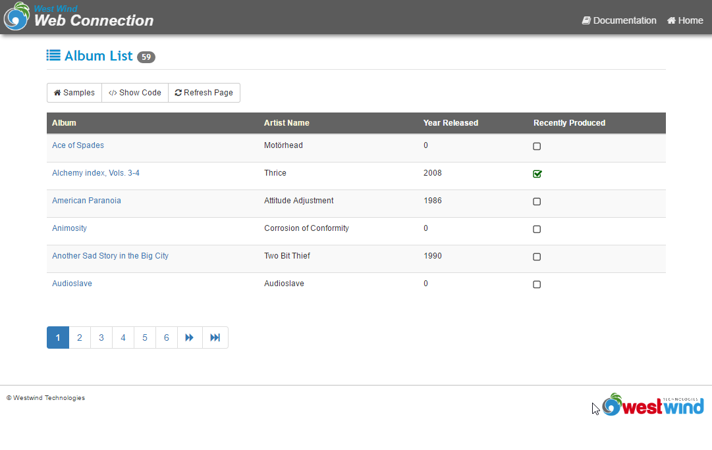
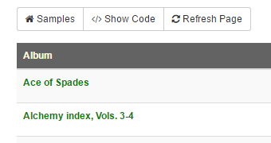
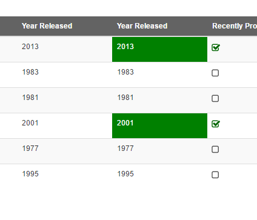
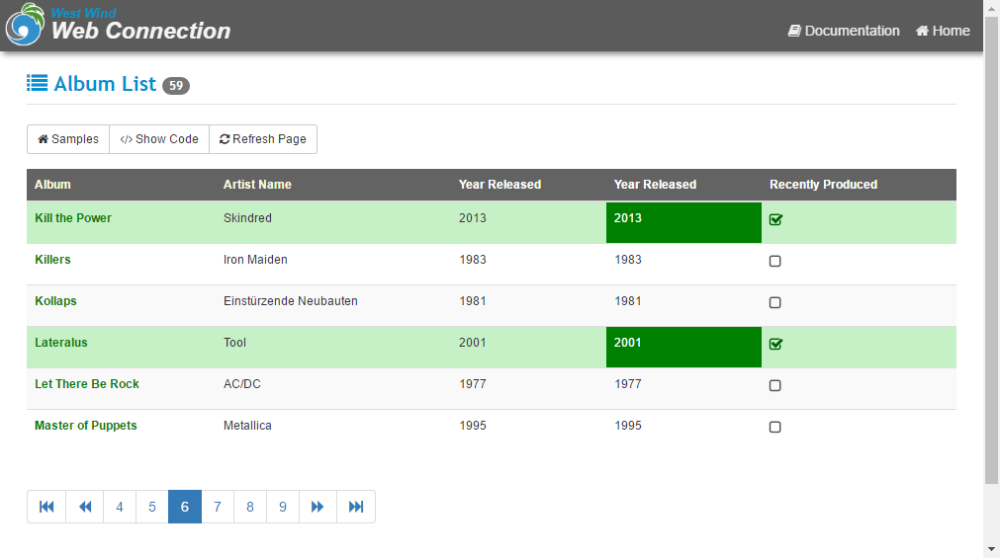

# Custom Row and Column Rendering in Web Connection with HtmlDataGrid()

DataGrids are a popular use case for FoxPro developers who seem to be obsessed (in my experience) with using data grids for data display. 

In this post I'll describe using the wwHtmlHelper `HtmlDataGrid()` function which makes it super easy to create grids, and specifically demonstrate how you can create customized displays for rows or columns to highlight content.

### HtmlDataGrid() basics
`HTMLDataGrid()` is a wwHtmlHelper function that is used to render data from tables or collections/arrays into an HTML table. It uses the new Web Connection 6.0 Bootstrap styling to create attractive grid displays fairly easily.

The function supports a couple of different operational modes: 

* Auto-Column generation from a cursor
* Custom Column Definitions

### Auto Column Generation
The former is super easy - it simply takes a cursor and renders it.

```foxpro
SELECT albums.pk,albums.title, albums.year, ;
       artists.pk as artistpk, artists.artistName  ;
    FROM albums, artists ;
    ORDER BY albums.title ;
	WHERE albums.ArtistPk = artists.Pk AND ;
	      artists.ArtistName = ?lcFilter ;	
    INTO CURSOR TQuery

* ... other header rendering

*** Render the Grid
Response.Write( HtmlDataGrid("TQuery") )

* ... other page rendering
```

Alternately you can also capture the HTML in your controller code:

```foxpro
PRIVATE pcHtml
pcHtml = HtmlDataGrid("TQuery") 
```
and you can then render the HTML inside of a template or script page:

```html
<div class="gridcontainer">
    <%= pcHtml %>
</div>
```

In either case, this produces a simple table list of all the records:



If you want a little more control you can add a `HtmlDataGridConfig` object to configure a few options like paging and styling of the table:

```foxpro
loConfig = CREATEOBJECT("HtmlDataGridConfig")
loConfig.PageSize = 10             && 10 items per page
loConfig.PagerButtonCount = 5      && Max page number buttons in pager

Response.Write( HtmlDataGrid("TQuery",loConfig) )
````
which turns the grid into a paged grid:


Auto-column generation is very easy but it's fairly limited. As you can see you can't easily control what fields are displayed (the pks are showing) unless you modify your query to return only the fields you want, and the titles are determined by the field names. 

It works for quick and dirty stuff, but in most cases you'll want to use custom grid columns.

### Custom Column Definitions
The better approach is to explicitly define your columns for the data grid which gives you a lot more control. When using columns you can add custom styling, apply formatting and even use code expressions to transform the content. For example, it's fairly easy to call other helpers for adding things like links or checkboxes, or use entire custom functions for rendering the content of individual columns.

The following example demonstrates a few custom features:

```foxpro
SELECT albums.pk,albums.title, albums.year, ;
       artists.pk as artistpk, artists.artistName ;
    FROM albums, artists ;
    ORDER BY albums.title ;
	WHERE albums.ArtistPk = artists.Pk AND ;
	      artists.ArtistName = ?lcFilter ;	
    INTO CURSOR TQuery

* ... other HTML generation
  
*** Use the HtmlDataGrid Helper function (easier)
loConfig = CREATEOBJECT("HtmlDataGridConfig")

*** Paging is a problem when you dynamically switch between the two modes
*** so leave out for now
loConfig.PageSize = 6

*** Add a column explicitly by craeating it first
*** Note this column uses an expression that is evaluated for each record
loColumn = loConfig.AddColumn([HtmlLink("ShowAlbum.wwd?id=" + TRANSFORM(Tquery.pk),Title)],"Album")
loColumn.Sortable = .T.
loColumn.SortExpression ="Upper(Title)"

loColumn = loConfig.AddColumn("ArtistName","Artist Name")
loColumn.Sortable = .T.
loColumn.SortExpression ="Upper(ArtistName)"
loConfig.AddColumn("Year","Year Released","N")

*** Add a checkbox column
loConfig.AddColumn("HtmlCheckBox([chkIsActive_] + TRANSFORM(Pk) ,[],Year > 2000)","Recently Produced")

lcHtml = HtmlDataGrid("Tquery",loConfig)

Response.Write(lcHtml)
```

which looks like this:



Notice that we have a link and a checkbox embedded into this display - using additional HTML helpers to render these items. You can embed any string expressions - including other HTML helpers which makes it easy to create more complex items in cells.

Additionally you can also create column output from expressions which can be either native FoxPro functions (for formatting for example), User Defined Functions, or class method calls.

To do this simply create the column expression with the function name:

```foxpro
loColumn = loConfig.AddColumn([Process.LinkAlbum()],"Album")
```

You can then implement this function on the Process class. Note it doesn't have to be a Process class method it just has to be something that's in scope called further down the call stack.

### Customizing Column Display
In this function you can do whatever you want to do. So if you want to create a custom column that bolds the link you could do:
```foxpro
FUNCTION LinkAlbum()
LOCAL lcHtml
lcHtml = [<a href="ShowAlbum.wwd?id=] + TRANSFORM(TQuery.pk) + [" ]  +;
		 [  style="font-weight: bold; color: green;">] +;
         EncodeHtml(TQuery.Title) + [</a>]

RETURN lcHtml
ENDFUNC
```

Which now renders a bold green texted link.



Not very practical, but you get the idea - you can pretty much generate any HTML using a function that creates the HTML string output. It's very powerful.

#### Customizing the Column Styling
You can also access the Column's own styling and attributes using the `ActiveColumnAttributeString` property for the config object. For example to turn the Year column to a green background when the year is newer than 2000 you can use code like this:

```foxpro
loConfig.AddColumn("Process.YearColumn(loConfig)","Year Released","N")
````

Then create the handler:

```foxpro
FUNCTION YearColumn(loConfig)

IF (TQuery.Year > 2000)
   loConfig.ActiveColumnAttributeString = [ style="background: green; color: white" ]
ELSE
   loConfig.ActiveColumnAttributeString = [  ]
ENDIF
 
RETURN TRANSFORM(TQuery.Year)
ENDFUNC
```

The `ActiveColumnAttributeString` allows you to customize the `<td>` element with custom attributes which gives you full control over rendering.

Here's what the green boxed cell looks like:



### Customizing Row Rendering
Finally it's also possible to affect row rendering using the `OnBeforeRowRender()` and `OnAfterRowRender()` handlers. These handlers also take expressions that have to return a string. Using these functions it's possible to get access to the row header and the individual column headers.

This is similar to the column customization except you use the `RowAttributeString` to customize the row.

First hook up the `OnBeforeRowRender` handler with the function expression:

```foxpro
loConfig.OnBeforeRowRender = "Process.RenderRowHeader(loConfig)"
```
Then implement the method:

```foxpro
FUNCTION RenderRowHeader(loConfig)

IF (TQuery.Year > 2000 )
	loConfig.RowAttributeString = [ class="highlight" ]
ELSE
    loConfig.RowAttributeString = []
ENDIF
    
RETURN ""
```

In this example, rather than setting an explicit style I simply assign a custom CSS class defined in a style sheet:

```css
.highlight {
    background: #c6f1c6 !important;
}
```

which applies a light green background to the entire row. The `!important` forces the background to override other styles.

When you now render this grid you get:



Note that you have to **always** set the `RowAttributeString` to a value including the empty value, because when you set it that value stays for all subsequent requests. So effectively you have to reset it for each row.

### Summary
As you can see you have **a lot** of control when rendering HtmlDataGrids with columns and values, even if the mechanism by which this works is not very obvious. But with a proper reference like this blog post it's easy to pick the right choice to customize your column or row render to match your needs exactly with very little code effort.


<!-- Post Configuration -->
<!--
```xml
<abstract>
DataGrids are popular for displaying lists of data and while I discourage people from excessively using DataGrids for storing data, many people do build complex and visual grids. The HtmlDataGrid() Html Helper in Web Connection provides a lot of flexibility for rendering custom column content as well as allowing for easy customization of each row and column's styling and formatting.
</abstract>
<categories>
Web Connection,FoxPro
</categories>
<postid>921</postid>
<keywords>
HtmlDataGrid,Row,Column,Styling,CSS,Highlighting
</keywords>
<weblog>
Rick Strahl's FoxPro and Web Connection Weblog
</weblog>
```
-->
<!-- End Post Configuration -->
