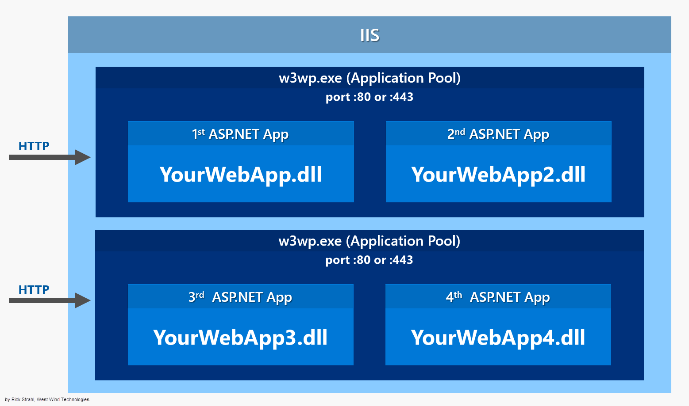
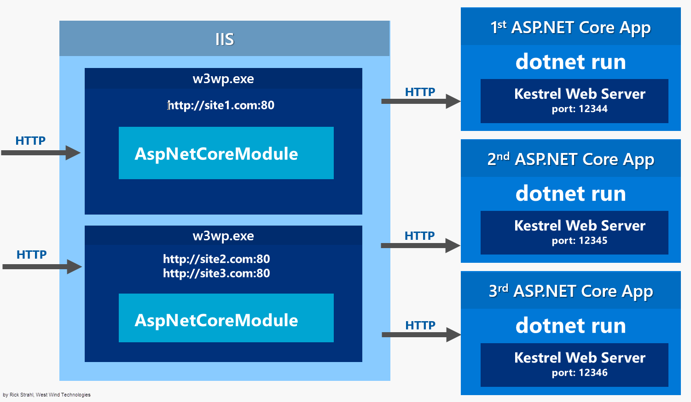
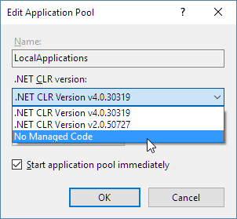
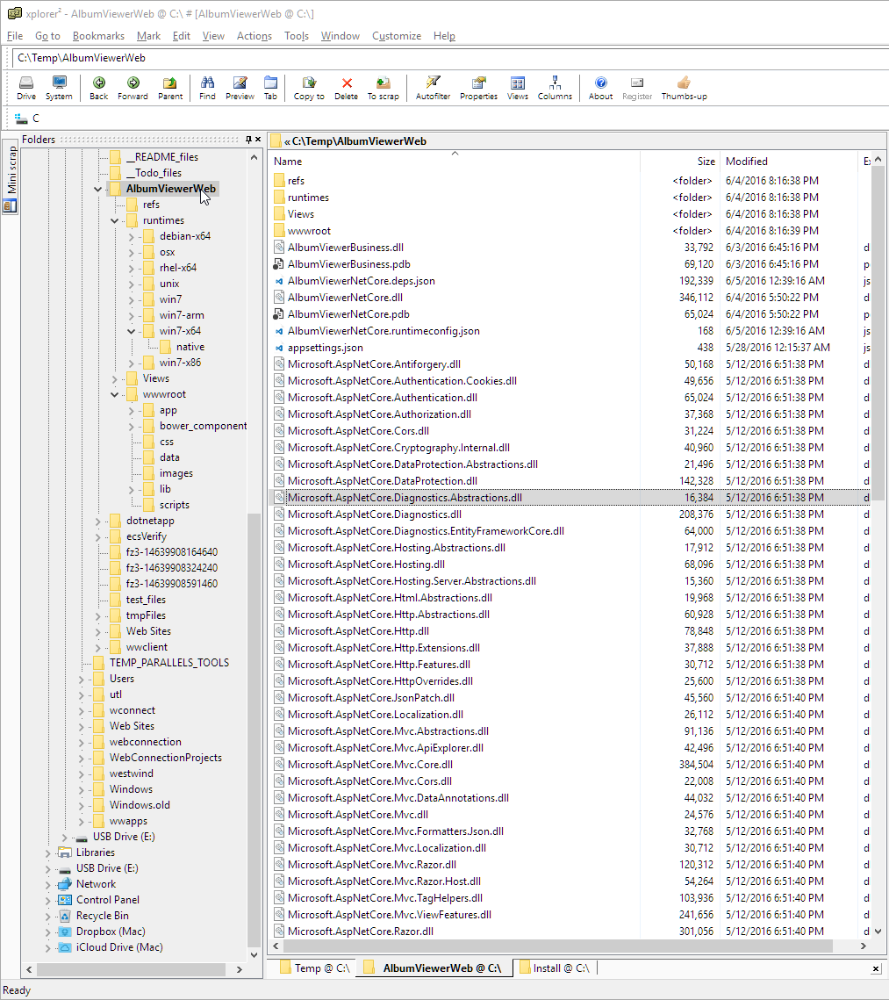
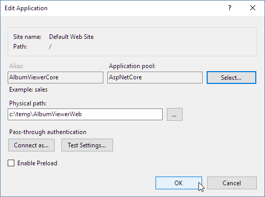
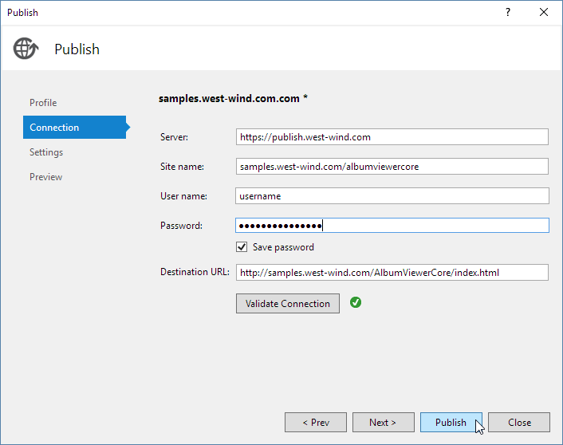

# Publishing and Running ASP.NET Core Applications with IIS

When you build ASP.NET Core applications and plan on running them on IIS, you'll find that .NET Core applications in IIS work radically different than previous versions of ASP.NET. 

In this post I'll explain how ASP.NET Core runs in the context of IIS and how you can deploy your ASP.NET Core application to IIS.

### IIS and ASP.NET Core
The most important thing to understand about hosting ASP.NET Core is that it runs as a standalone, **out of process Console application**. It's not hosted inside of IIS and it doesn't need IIS to run. ASP.NET Core applications have their own self-hosted Web server and process requests internally using this self-hosted server instance.

You can however run IIS as a front end proxy for ASP.NET Core applications, because Kestrel is a raw Web server that doesn't support all features a full server like IIS supports. This is actually a recommended practice on Windows in order to provide port 80/443 forwarding which kestrel doesn't support directly. For Windows IIS (or another reverse proxy) will continue to be an important part of the server even with ASP.NET Core applications.

Let's take a look and see how IIS fits into ASP.NET Core applications.

##AD##

### Classic ASP.NET Hosting
Before we take a look at ASP.NET Core hosting lets review how classic ASP.NET runs ASP.NET applications:



In a classic ASP.NET application everything is hosted inside of an IIS Worker Process (w3wp.exe) which is the IIS Application Pool. The AppPool hosts your ASP.NET application and your application is instantiated by the built-in ASP.NET hosting features in IIS. The native runtime manager instantiates the .NET Runtime on your application's behalf and brings up the `HttpRuntime` object which is then used to fire requests through the ASP.NET application pipeline as requests come in from the native http.sys driver. Requests come in from http.sys and are dispatched to the appropriate site that is mapped to the Application Pool and the HttpRuntime instance hosted there. 

### ASP.NET Core with IIS
Things are quite different with ASP.NET Core which doesn't run in-process to the IIS worker process, but rather runs as a separate, out of process Console application that runs its own Web server using the **Kestrel** component. Kestrel is a .NET Web Server implementation that has been heavily optimized for throughput performance. It's fast and functional in getting network requests into your application, but it's 'just' a raw Web server. It does not include Web management services as a full featured server like IIS does. 

> As of ASP.NET Core 2.2 IIS Hosting does support a new InProcess hosting mechanism. A [seperate post describes the details of In Process/Out of Process hosting](https://weblog.west-wind.com/posts/2019/Mar/16/ASPNET-Core-Hosting-on-IIS-with-ASPNET-Core-22).

If you run on Windows you will likely want to run Kestrel behind IIS to gain infrastructure features like port 80/443 forwarding via Host Headers, process lifetime management and certificate management to name a few.

Here's what it looks like when you run your ASP.NET Core application behind an IIS Web front:



ASP.NET Core applications are standalone Console applications invoked through the **dotnet** runtime command.  They are not loaded into an IIS worker process, but rather loaded through a native IIS module called `AspNetCoreModule` that executes the external Console application.

> The AspNetCoreModule has to be installed on your server and is part of the [ASP.NET Core Server Hosting Bundle](http://go.microsoft.com/fwlink/?LinkId=798480).

Once you've installed the hosting bundle (or you install the .NET Core SDK on your Dev machine) the AspNetCoreModule is available in the IIS native module list:


The AspNetCoreModule is a native IIS module that hooks into the IIS pipeline very early in the request cycle and immediately redirects all traffic to the backend ASP.NET Core application. All requests - even those mapped to top level Handlers like `ASPX` bypass the IIS pipeline and are forwarded to the ASP.NET Core process. This means you can't easily mix ASP.NET Core and other frameworks in the same Site/Virtual directory, which feels a bit like a step back given that you could easily mix frameworks before in IIS.

While the IIS Site/Virtual still needs an IIS Application Pool to run in, the Application Pool should be set to use **No Managed Code**. Since the App Pool acts merely as a proxy to forward requests, there's no need to have it instantiate a .NET runtime.



The AspNetCoreModule's job is to ensure that your application gets loaded when the first request comes in and that the process **stays** loaded if for some reason the application crashes. You essentially get the same behavior as classic ASP.NET applications that are managed by  WAS (Windows Activation Service).

Once running, incoming Http requests are handled by this module and then routed to your ASP.NET Core application. 

So, requests come in from the Web and int the kernel mode http.sys driver which routes into IIS on the primary port (80) or SSL port (443). The request is then forwarded to your ASP.NET Core application on the HTTP port configured for your application which is not port 80/443. In essence, IIS acts a reverse proxy simply forwarding requests to your ASP.NET Core Web running the Kestrel Web server on a different port.

Kestrel picks up the request and pushes it into the ASP.NET Core middleware pipeline which then handles your request and passes it on to your application logic. The resulting HTTP output is then passed back to IIS which then pushes it back out over the Internet to the HTTP client that initiated the request - a browser, mobile client or application.

The AspNetCoreModule is configured via the `web.config` file found in the application's root, which points a the startup command (`dotnet`) and argument (your application's main dll) which are used to launch the .NET Core application. The configuration in the web.config file points the module at your application's root folder and the startup DLL that needs to be launched.

Here's what the web.config looks like:

```xml
<?xml version="1.0" encoding="utf-8"?>
<configuration>
  <!--
    Configure your application settings in appsettings.json. Learn more at http://go.microsoft.com/fwlink/?LinkId=786380
  -->
  <system.webServer>
    <handlers>
      <add name="aspNetCore" path="*" verb="*"
        modules="AspNetCoreModule" resourceType="Unspecified" />
    </handlers>
    <aspNetCore processPath="dotnet"
                arguments=".\AlbumViewerNetCore.dll" 
                stdoutLogEnabled="false" 
                stdoutLogFile=".\logs\stdout" 
                forwardWindowsAuthToken="false" />
  </system.webServer>
</configuration>
```

You can see that module references **dotnetexe** and the compiled entry point DLL that holds your **Main** method in your .NET Core application.

You can also provide an optional section for Environment Variables if you were explicitly configuring various configuration startup environment settings.

```xml
<aspNetCore processPath="dotnet"
                arguments=".\AlbumViewerNetCore.dll" 
                stdoutLogEnabled="false" 
                stdoutLogFile=".\logs\stdout" 
                forwardWindowsAuthToken="false">
    <environmentVariables>
        <environmentVariable name="ASPNETCORE_ENVIRONMENT" value="Production" />
        
    </environmentVariables>
</aspNetCore>    
```

Note that you should use these settings sparingly and rather rely on the configuration settings object which gives you more control. Limit environment variable settings for specific startup options you need to configure the global environment. Otherwise stick to configuration file settings - or on Azure use the application settings to merge values into your config.

### Do you need IIS?
We've already discussed that when running ASP.NET Core on Windows, it's recommended you use IIS as a front end proxy. While it's possible to directly access Kestrel via an IP Address and available port, there are number of reasons why you don't want to expose your application directly this way in production environments.

First and foremost, if you want to have multiple applications running on a single server that all share port 80 and port 443 you can't run Kestrel directly. Kestrel doesn't support host header routing which is required to allow multiple port 80 bindings on a single IP address. Without IIS (or http.sys actually) you currently can't do this using Kestrel alone (and I think this is not planned either).

The AspNetCoreModule running through IIS also provides the necessary process management to ensure that your application gets loaded on the first access, ensures that it **stays** up and running and is restarted if it crashes. The AspNetCoreModule provides the required process management to ensure that your AspNetCore application is always available even after a crash.

It's also a good idea to run secure SSL requests through IIS proper by setting up certificates through the IIS certificate store and letting IIS handle the SSL authentication. The backplane HTTP request from IIS can then simply fire a non-secure HTTP request to your application. This means only a the front end IIS server needs a certificate even if you have multiple servers on the backplane serving the actual HTTP content.

IIS can also provide static file serving, gzip compression of static content, static file caching, Url Rewriting and a host of other features that IIS provides natively. IIS is really good and efficient at processing non-application requests, so it's worthwhile to take advantage of that.  You can let IIS handle the tasks that it's really good at, and leave the dynamic tasks to pass through to your ASP.NET Core application.

The bottom line for all of this is if you are hosting on Windows you'll want to use IIS and the AspNetCoreModule.

### Running IIS as a Development Server - no
So I've seen this question comes up occasionally:

> Can I run full IIS to run and debug my ASP.NET Core Applications like I could with classic applications?

To sidestep this question a little: There should be very few reasons for you to run IIS during development. Yes, in the past there **were** very good reasons to run full IIS because there were always a number of things that behaved very differently in full IIS compared to IIS Express. 

However, with ASP.NET Core there's little to no reason to be running full IIS during development. Why? Because ASP.NET Core applications aren't actually running inside of IIS. Whether you running called from IIS, IIS Express or whether you do `dotnet run` directly from the command line - you are running the exact same code and in most cases the exact same execution environment. Running inside of IIS really doesn't buy you anything anymore that you can't easily simulate with a command line environment.

The only reason you **might** need to run under IIS if there is something that IIS provides in terms of HTTP services that is really separate from the ASP.NET Core processing. But even then it's likely that those features won't be something you need to debug in the context of your application.

### 'Running' IIS
The reason that you can't 'just run IIS' from your development environment is that an ASP.NET Core application has to be published before it can be executed. The development folder doesn't hold all the files necessary to run your application. When you 'debug' or 'run' your application the application is first published to a separate location and run from there. For this reason you don't see IIS as an option in Visual Studio for example.

If you absolutely have to run with IIS, you can publish the application to a local folder first, then configure an IIS virtual directory or site and use that to run your site.

##AD##

### Publishing ASP.NET Core Applications for IIS
In order to run an application with IIS you have to first publish it. There are two ways to that you can do this today:

* Use `dotnet publish` 
* Use the Visual Studio Publishing Features

#### Using `dotnet publish`
Using `dotnet publish` builds your application and copies a runnable, self-contained version of the project to a new location on disk. You specify an output folder where all the files are published. This is not so different from classic ASP.NET which ran Web sites out of temp folders. With ASP.NET Core you explicitly publish an application into a location of your choice - the files are no longer hidden away and magically copied around.

A typical publish command may look like this:

```dos
dotnet publish
      --framework netcoreapp1.0 
      --output "c:\temp\AlbumViewerWeb" 
      --configuration Release
```

This publishes the application to the `c:\temp\albumviewerWeb`. 

If you open this folder you'll find that it contains your original application structure plus all the nuget dependency assemblies dumped into the root folder:



#### Manual IIS Hosting of a Publish Folder
Once you've published your application and you've moved it to your server (via FTP or other mechanism) we can then hook up IIS to the folder.

I'm going to create a virtual Application directory:



Note that I created an **AspNetCore** Application Pool that has its .NET Runtime set to **No Managed Code** as shown earlier.

> #### @icon-lock IIS Identity and Permissions
> You might also have to tweak the IIS App Pool Identity to something other than the default **ApplicationPoolIdentity** in order to ensure that your application has access to resources it needs to run. I generally start with **NETWORKSERVICE** and then move to a custom account that matches the actual rights required by the application.

And that's really all that needs to happen. You should be able to now navigate to your site or Virtual and the application just runs.

You can now take this locally deployed Web site, copy it to a Web Server (via FTP or direct file copy or other publishing solution), set up a Site or Virtual and you are off to the races.

##AD##

### Publishing from Visual Studio
The **dotnet publish** step works to copy the entire project to a folder, but it doesn't actually publish your project to a Web site (currently - this is likely coming at a later point).

In order to get incremental publishing to work, which is really quite crucial for ASP.NET Core applications because there are so many dependencies, you need to use MsDeploy which is available as part of Visual Studio's Web Publishing features. 

Currently the Visual Studio Tooling UI is very incomplete, but the underlying functionality is supported. I'll point out a few tweaks that you can use to get this to work today.

When you go into Visual Studio in the RC2 Web tooling and the Publish dialog, you'll find that you can't create a publish profile that points at IIS. There are options for file and Azure publishing but there's no way through the UI to create a new Web site publish.

However, you can cheat by creating your own `.pubxml` file and putting it into the `\Properties\PublishProfiles` folder in your project.

> #### @icon-warning Version Specific Workaround
>Note it's almost certain this will get fixed post RC2 with a tooling update, so before you go through these steps if you read this article a month from now, check whether you can create an IIS publish profile directly through the Visual Studio UI.

To create a 'manual profile' in your ASP.NET Core Web project:

* Create a folder `\Properties\PublishProfiles`
* Create a file `<MyProfile>.pubxml`

You can copy an existing `.pubxml` from a non-ASP.NET Core project or create one. Here's an example of a profile that works with IIS:

```xml
<Project ToolsVersion="4.0" xmlns="http://schemas.microsoft.com/developer/msbuild/2003">
  <PropertyGroup>
    <WebPublishMethod>MSDeploy</WebPublishMethod>
    <LastUsedBuildConfiguration>Release</LastUsedBuildConfiguration>
    <LastUsedPlatform>Any CPU</LastUsedPlatform>
    <SiteUrlToLaunchAfterPublish>http://samples.west-wind.com/AlbumViewerCore/index.html</SiteUrlToLaunchAfterPublish>
    <LaunchSiteAfterPublish>True</LaunchSiteAfterPublish>
    <ExcludeApp_Data>False</ExcludeApp_Data>
    <PublishFramework>netcoreapp1.0</PublishFramework>
    <UsePowerShell>True</UsePowerShell>
    <EnableMSDeployAppOffline>True</EnableMSDeployAppOffline>
    <MSDeployServiceURL>https://publish.west-wind.com</MSDeployServiceURL>
    <DeployIisAppPath>samples site/albumviewercore</DeployIisAppPath>
    <RemoteSitePhysicalPath />
    <SkipExtraFilesOnServer>True</SkipExtraFilesOnServer>
    <MSDeployPublishMethod>RemoteAgent</MSDeployPublishMethod>
    <EnableMSDeployBackup>False</EnableMSDeployBackup>
    <UserName>username</UserName>
    <_SavePWD>True</_SavePWD>
    <ADUsesOwinOrOpenIdConnect>False</ADUsesOwinOrOpenIdConnect>
    <AuthType>NTLM</AuthType>
  </PropertyGroup>
</Project>
```

> #### @icon-warning AuthType NTLM Fix
> Note the `<AuthType>NTLM</AuthType>` key at the bottom of the file. This key is very important or else the publish operation doesn't work. If you're copying from an existing file make sure you add this key as it's unlikely to have it by default.

Once you've created a `.pubxml` file you can now open the publish dialog in Visual Studio with this Profile selected:



At this point you should be able to publish your site to IIS on a remote server and use incremental updates with your content. 


### And it's a Wrap
Currently IIS hosting and publishing is not particularly well documented and there are some rough edges around the publishing process. Microsoft knows of these issues and this will get fixed by RTM of ASP.NET Core.

In the meantime I hope this post has provided the information you need to understand how IIS hosting works and a few tweaks that let you use the publishing tools available to get your IIS applications running on your Windows Server. 

Rock on...

### More
I created another couple of posts that follow up this one with a few more specific use cases: Process Identity, Performance and using IIS to serve static content:

* [ASP.NET Core InProcess Hosting on IIS](https://weblog.west-wind.com/posts/2019/Mar/16/ASPNET-Core-Hosting-on-IIS-with-ASPNET-Core-22)
* [More on ASP.NET Core Running under IIS](https://weblog.west-wind.com/posts/2017/Mar/16/More-on-ASPNET-Core-Running-under-IIS)
* [IIS and ASP.NET Core Rewrite Rules for Static Files and HTML 5 Routes ](https://weblog.west-wind.com/posts/2017/Apr/27/IIS-and-ASPNET-Core-Rewrite-Rules-for-AspNetCoreModule)


<div style="margin-top: 30px;font-size: 0.8em;
            border-top: 1px solid #eee;padding-top: 8px;">
    
    this post created with 
    <a href="https://markdownmonster.west-wind.com" 
       target="top">Markdown Monster</a> 
</div>