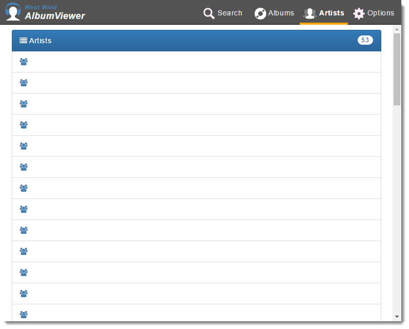

# Upgrading to ASP.NET Core RTM from RC2

ASP.NET Core RTM is finally here.A big congratulation to the .NET Core and ASP.NET teams for getting this massive piece of software into our hands in release mode. It's been a long and challenging road, but looking where we've landed and where it appears where we're heading with .NET Core, I think it was well worth the wait and tribulations.

The first thing I did was upgraded my [AlbumViewer sample application](https://github.com/RickStrahl/AlbumViewerVNext) to the final build, just to see what's involved and as it turns out the upgrade process was pretty easy this time around - mainly replacing NuGet packages and working around one breaking change. I was able to get my app updated and running in about 15 minutes, and then pushed out to my live server all without any hiccups. Nice - that's the first time since this journey began that I can say the update process was relatively smooth (see below).

### Getting Started 
In order to get started head over to the new [dot.net](dot.net) site and pick up the dependencies you need.

If you're installing on Windows and you're using Visual Studio the easiest way will be to download Visual Studio 2015 with Update 3. The new tooling requires Update 3. So the things you need for installing with Visual Studio is:

* [Visual Studio 2015](https://www.visualstudio.com/en-us/products/visual-studio-community-vs.aspx) (any version) or [Visual Studio 2015 Update 3](https://www.visualstudio.com/news/releasenotes/vs2015-update3-vs)
* Preview Tooling Update 2

If you're not using Visual Studio install:

* .NET Core 1.0 Runtime
* .NET Core 1.0 Runtime SDKs

When installing on your server you need to install the .NET Server 

### Moving to RTM Build

I'm happy to report that the actual upgrade to RTM was relatively painless and involved mainly changing NuGet package names to the new version. You can take a look at my [upgrade commit on Github](https://github.com/RickStrahl/AlbumViewerVNext/commit/5e316879db9da5d5993b4cfb0c9151375ef1e2a5) - there are only NuGet package updates and one workaround for the breaking change to JSON serialization which broke my client side application.

You may run into other issues, that I'm not hitting. As always check out the [Announcements Page on GitHub](https://github.com/aspnet/Announcements/issues) that shows all the known breaking changes.

### RC2 Project Upgrade was easy
For me the easiest way to upgrade a project throughout the beta has been  to create a new project of each type of project (Web or Class Library) and compare my `project.json` with the new projects. 

I basically copy the .NET Standard definitions and other framework config settings and replace them in the original.

Then I do a search and replace to replace `-rc2-final` with an empty string to get the final `1.0.0` release bits. All of this update stuff took maybe 10 minutes. The introduction of .NET standard has made this a lot easier as I don't have to reference 50 other trivial NuGet packages explicitly that are now provided through the .NET Standard base version.

If you're upgrading to RTM from an older version I'd recommend you start with new projects from scratch and instead migrate your code into the new project. I've found that easier when I initially upgraded to both RC1 and RC2. 

The biggest changes throughout earlier versions for me have been Entity Framework related changes, so you'll need to likely tweak your model definitions. Luckily in RC2 and RTM EF has finally provided many of the features as part of conventions or attributes so most of the custom model definitions for common cases can be removed.

##AD##

### It's not *all* Rainbows and Unicorns - it never is!
As easy as the actual upgrade was, I did run into a couple problems before I even got to fix my actual project:

* The Visual Studio Preview 2 Tools didn't install smoothly
* The RTM build changes JSON.NET defaults to export camelCased property names by default

### Visual Studio Preview Tooling Failure
Installation of the RTM bits include the .NET Core 1.0 runtime, the SDK, Visual Studio Update 3 and finally the Preview 2 Tooling.

If you're planning on updating Visual Studio you should install:

* Visual Studio Update 3
* Visual Studio Tooling Preview 2

The tooling preview will install the runtimes and SDK required for running and building .NET Core and ASP.NET Core applications.

Unfortunately, I ran into  problems with Visual Studio Tooling update. The install correctly installed the Dotnet Runtimes and SDK and I was able to `dotnet` from the command prompt. 

However, Visual Studio was completely hosed:

* Lots of Package warnings on startup
* Failure to load any project
* Failure to shut down Visual Studio

Several other people seem to have reported the same problems. Apparently this is an upgrade problem when updating from previous versions of tooling and SDKs. Hopefully a clean install won't have these issues.

Luckily it appears there's a relatively easy solution to this problem. The trick to getting Visual Studio into the right state is to uninstall all the .NET Core related tools/SDK and tooling and then reinstall it.

* **Remove the Preview Tooling Preview 2**
* **Remove the .NET Core Runtime SDK (all versions)**
* **Remove the .NET Core Runtime (all Versions)**

Then reverse the steps:

* **Install the .NET Core Runtime **
* **Install the .NET Core SDK**
* **Install the Preview Tooling Preview 2**

And that brought back a fully functional Visual Studio. Note also that uninstalling the Preview Tools (without reinstalling) also makes Visual Studio work again with non .NET Core projects including 'classic' ASP.NET projects.

As mentioned I've seen reports from several others with exactly the same symptoms and solution, so if you run into problems give this a try.

##AD##

### De-Camelizing JSON in ASP.NET Core
In the RTM bits of ASP.NET Core you'll find that JSON API results are automatically converted to **CamelCase**, which is a change from the way that ASP.NET has traditionally returned JSON. Traditionally object names were converted using the same casing as the underlying objects that are being serialized, which is - uhm - predictable.

In the RTM release Microsoft has changed the default serialization behavior so that all properties are automatically camel cased - or really changed to have a lower case first letter (ie. `BirthDate` becomes `birthDate` and  `Birthdate` becomes `birthdate`)


### Case? So what?
While this may be a reasonable change to make, it is fairly significant breaking change, that especially affects client code that depends on APIs. Just about all of my sample applications using APIs where broken due to this issue as APIs are now returning differently typed data, that my JavaScript application no longer knows how to bind.

Here's an example of the result:



Dude, where'd my rocking artists go?

The problem is that my API is looking to bind to values like `{{artist.ArtistName}}`, but it's now really getting `{{artist.artistName}}`, hence the sad empty list, because Angular's bindings are case sensitive and no longer finding the properties by the .NET names as before.

There are two ways to fix this obviously:

* Fix the client side code use camelCase (aeh - no)
* Fix the server side code to generate no camels

##AD##

### Turning off CamelCasing
Luckily this is relatively easy to fix once you know where to get at the JSON serialization settings in ASP.NET Core. As usual you use the `Startup` class and the `ConfigureServices()` method where ASP.NET MVC is added and initially configured.

The following removes the `CamelCaseNamingStrategy` that the `DefaultContractResolver` uses: 

```csharp
services.AddMvc()
        .AddJsonOptions(opt =>
    {
        var resolver  = opt.SerializerSettings.ContractResolver;
        if (resolver != null)
        {
            var res = resolver as DefaultContractResolver;
            res.NamingStrategy = null;  // <<!-- this removes the camelcasing
        }
    });
```

And voila - you're back to the old behavior where the serialized JSON matched your .NET object structure. And my AlbumViewer is working again.

### To CamelCase or Not
Now I haven't made up my mind on whether I like this default casing change or not. But man, I can't help but think that this should have been thought of a long time ago, and not a couple of weeks before an RTM release. 

Personally I prefer to see stuff like this as an easily accessible option, and not something that is rammed down your throat - serialization shouldn't arbitrarily change the naming of properties. While that is often desirable I'm betting there are plenty of scenarios (especially when dealing with .NET to .NET) where you'd much rather have the serialized content reflect the original naming.

It's especially frustrating in that this doesn't just affect server code where you could easily refactor, but client side code that may already be running. It also makes it harder to port existing code to ASP.NET core and it's not exactly something that's super easy to find if you're searching unless you already know that there serializer settings being sent to JSON.NET somewhere in the framework. 

But I guess it's too late. It's done, and at least there is an easy workaround if you know where to look. And now you do...

### Summary
As I said other than the VS install features the ugprade process was pretty painless and the nit about the casing is not a big deal since there is a relatively easy workaround. 

I haven't had much time playing around with the new bits other than updating the sample and [publishing and updating the application on my IIS Server](https://weblog.west-wind.com/posts/2016/Jun/06/Publishing-and-Running-ASPNET-Core-Applications-with-IIS), but I'm glad to see that the list of breaking changes is not massive as it has been for previous releases so it should be relatively easy upgrade projects to the new version from RC2 at least. 

So maybe now we can get busy building stuff for the new platform, knowing that sands can't shift as much as they have been. Onwards...

### Related Posts

* [ASP.NET Core and .NET Core Overview](https://weblog.west-wind.com/posts/2016/Jun/13/ASPNET-Core-and-NET-Core-Overview)
* [Publishing and running ASP.NET Core Application with IIS](https://weblog.west-wind.com/posts/2016/Jun/06/Publishing-and-Running-ASPNET-Core-Applications-with-IIS)
* [Strongly Typed Configuration Settings in ASP.NET Core](https://weblog.west-wind.com/posts/2016/May/23/Strongly-Typed-Configuration-Settings-in-ASPNET-Core)


<!-- Post Configuration -->
<!--
```xml
<abstract>
I installed and upgraded an ASP.NET Core Sample application today and while the actual project upgrade process from RC2 was relatively easy, there were a few hiccups with installation and one of the breaking changes for the RTM release. In this post I'll go over some of the things I ran into and the workarounds.
</abstract>
<categories>
ASP.NET Core,Visual Studio
</categories>
<postid>1624602</postid>
<keywords>
ASP.NET Core,Visual Studio,Preview 2,RTM,CamelCase,Startup Problems
</keywords>
<weblog>
Rick Strahl's Weblog
</weblog>
```
-->
<!-- End Post Configuration -->
