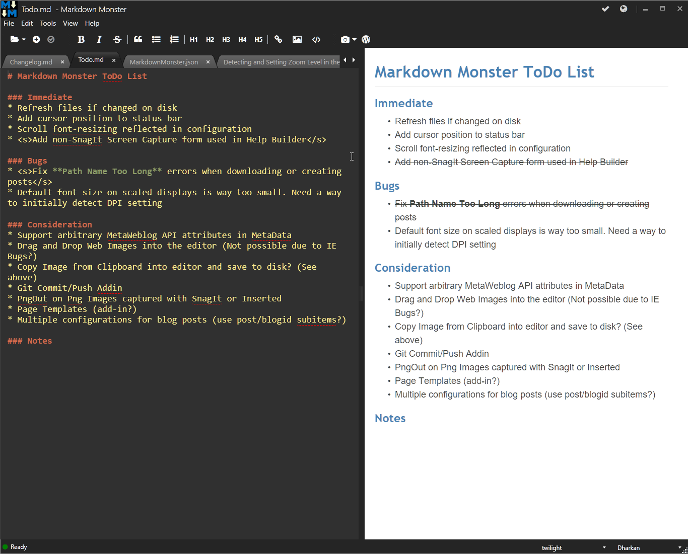

# Detecting and Setting Zoom Level in the WPF WebBrowser Control

While working on [Markdown Monster](https://markdownmonster.west-wind.com), I recently needed to deal with the Zoom level in the Web Browser control. Markdown Monster uses the browser based [Ace Editor](https://ace.c9.io/#nav=about) for its Markdown Editing interface inside of a WPF Webbrowser Control, and one of the features I wanted for the editor is the ability to use standard font resizing keys (ctrl-Scrollwheel or ctrl-+/-) to work to resize the editor.

For reference, here is what Markdown Monster looks like and in this context I'm talking about the editor control on the left of the screen in the tabbed views:



Ace doesn't natively support resizing, but the Web Browser control of course is an HTML document and so supports zooming the view via the standard zoom gestures and keys. The zooming is automatic and 'just works' for a single document because the editor is just a full screen instance of the editor that fills the entire browser window. ctrl-Scrollwheel and ctrl-+/- just resizes as you would expect.

The problem however comes in if you want to **capture** the actual Zoom ratio, and then **reset** it later or as in my case make sure the zoom level always stays at 100%. Easier said than done. As it turns out it's a bit tricky to capture the Zoom level and set it, and worse it requires two completely different mechanisms to deal with reading and writing the value in IE.

* To read I use JavaScript in the browser (called from WPF)
* To write I use the WebBrowser's native `ExecWB()` function

### Reading the WebBrowser Zoom Level
Markdown Monster uses two-way communication with the WebBrowser control to get a reference to the JavaScript window and the Editor instance. This allows for two way communication between the editor and the WPF application where the WPF application can call into the browser to ask it to run JavaScript code and JavaScript code can run C# code (see end of post for more details on how this works).

The easiest way to detect the browser Zoom level in Internet Explorer is to use the following JavaScript code inside of the WebBrowser control:

```javascript
 var zoom = screen.deviceXDPI / screen.logicalXDPI;
```

This gives a value between 10 and 1000 that specifies the Zoom percentage. 

In Markdown Monster I have a custom editor instance that contains methods to perform various tasks on the editor. One of those is `getFontSize()` to retrieve the fontsize and adjust the font size based on the Zoom level. The code looks like this:

```javascript
getfontsize: function () {
    var zoom = screen.deviceXDPI / screen.logicalXDPI;
    
    var fontsize = te.editor.getFontSize() * zoom;
    return fontsize;
},
```

The full method retrieves Ace Editor's Font size and then applies the Zoom percentage to adjust the size. 

The idea is that I will **always** force the browser to stay at 100% zoom size and adjust the font size to reflect the desired zoom. So while the user effectively changes the browser's zoom, rather than displaying the zoomed browser view I adjust the font size to reflect the sizing change.  

This makes it easier to track the font size and get a consistent size for each of the browser controls in each active tab.

The WPF application then calls this JavaScript function with the following code:

```csharp
public int GetFontSize()
{
    if (AceEditor == null)
        return 0;

    object fontsize = AceEditor.getfontsize(false);
    if (fontsize == null || !(fontsize is double || fontsize is int) )
        return 0;
    
    return Convert.ToInt32(fontsize);
}
```

In the code above `AceEditor` is the JavaScript instance of the editor that contains the `getFontSize()` function which is called from the C# code. This returns the adjusted font size which has the zoom percentage applied. (more detail on how I get this AceEditor instance at the end of this post).

##AD## 

### Setting the Zoom Level
The above code gets the font size, but there's a problem now if I do nothing else. The font size returned is adjusted with the Zoom level, but the active browser instance is now set to a custom zoom level the user selected via ctrl-scrollwheel or ctrl-+/-. When I apply the font size it will be applied to the existing zoom level and so appears way too big.

To fix this I need to ensure that **the zoom level is always 100%**. To do this I can now add the following code to **set the Zoom level**:

```csharp
var wb = (dynamic)WebBrowser.GetType().GetField("_axIWebBrowser2",
          BindingFlags.Instance | BindingFlags.NonPublic)
          .GetValue(WebBrowser);
int zoomLevel = 100; // Between 10 and 1000
wb.ExecWB(63, 2, zoomLevel, ref zoomLevel);   // OLECMDID_OPTICAL_ZOOM (63) - don't prompt (2)
```

This code uses **private Reflection** to get an instance of the ActiveX Web Browser control that WPF wraps but doesn't expose publicly. 

> In **WinForms** you can use the `ActiveXObject` instance to get a reference to the same object directly without having to resort to private Reflection.

Once the raw COM browser instance has been retrieved I can call `ExecWB()` with the OLECMDID_OPTICAL_ZOOM flag which is used to set (and supposedly read although I can't get that to work) the zoom level. Ugly as it is, it works to set the Zoom level.

The full GetFontSize() method now looks like this:

```csharp
public int GetFontSize()
{
    if (AceEditor == null)
        return 0;

    object fontsize = AceEditor.getfontsize(false);
    if (fontsize == null || !(fontsize is double || fontsize is int) )
        return 0;

    // If we have a fontsize, force the zoom level to 100% 
    // The font-size has been adjusted to reflect the zoom percentage
    var wb = (dynamic)WebBrowser.GetType().GetField("_axIWebBrowser2",
              BindingFlags.Instance | BindingFlags.NonPublic)
              .GetValue(WebBrowser);
    int zoomLevel = 100; // Between 10 and 1000
    wb.ExecWB(63, 2, zoomLevel, ref zoomLevel);   // OLECMDID_OPTICAL_ZOOM (63) - don't prompt (2)
    
    return Convert.ToInt32(fontsize);
}
```

I can now call this method whenever the zoom level changes.

##AD##

### Detecting Zoom Level Changes
In Markdown Monster I also need to detect when the font size is changed so I can update the default font size setting which is part of a global configuration settings object (using [Westwind Application Configuration](https://github.com/RickStrahl/Westwind.ApplicationConfiguration)) which is also persisted to a config file when the application closes. The setting is global and so applies to all documents including the already open documents.

To detect the Zoom level change I can capture the browser's `onresize` event in JavaScript and then notify the WPF application from the JavaScript.

```javascript
window.onresize = function() {
        te.mm.textbox.resizeWindow();
    }
```

The `mm` instance is an instance of the Markdown Monster editor control which includes a host of methods that are callable from the JavaScript code (more details on how this works at the end of this post).

The C# function on the other end captures the resize event triggered in the browser and applies the font resizing like this:

```csharp
public void ResizeWindow()
{
    int fontsize = GetFontSize();
    if (fontsize > 5)
    {
        mmApp.Configuration.EditorFontSize = fontsize;
        RestyleEditor();
    }
}
```

This browser triggered C# function calls the `GetFontSize()` method described previously and if a valid value is returned assigns it to the default setting. At the same time the editor is then restyled with the current font formatting functions using `RestyleEditor()` which applies font-size, theme, spellcheck options and a few other settings to the current editor window. This ensures that the font size is properly reflected in the active window immediately after we've changed the font size.

This `RestyleEditor()` method is also called each time a new Tab is activated, so that a font size change made through the scrollwheel or ctrl-+/- is applied to all windows that are edited.

That's a lot of disconnected moving parts to make all this happen, but unfortunately that's a necessary evil as this is a key feature to ensure that the editor views are consistent and there's an easy non-configuration based way to update the font size. Ugly but it works.

### Related Topic: Passing objects between C# and JavaScript
In this post I showed a few places where I pass objects from .NET to JavaScript and from JavaScript to .NET which is a neat trick that makes it possible to have rich interaction between the Web Browser control and your WPF (or WinForms) application. As you can see you can capture events and call methods from JavaScript in C# code and you can call JavaScript functions from C#.

This is surprisingly easy to do by adding a method to the JavaScript document that can be called from C#. This method passes in one or more references of .NET object(s) and can return an instance of a JavaScript object.

In Markdown Monster this method is a global function called `initializeInterop()` and it looks like this:

```javascript

// text editor instance passed back to wpf
// methods,props accessible to WPF
window.textEditor = {
   initializeEditor: function() {},
   getFontSize: function() {},
   setFontSize: function() {},
   ...
}

// Called by WPF to pass editor instance
function initializeinterop(textbox) {
    te.mm = {};
    te.mm.textbox = textbox;

    return window.textEditor;
}
```

`window.textEditor` is the main object that the WPF application can interact with which holds many operations that the WPF application can request. Getting and setting of selections, getting and setting the font size, theme, turning on/off of the preview and spell checking etc. This object is initialized at the top of the page, and then returned by `initializeInterop()` when the WPF application calls it.

`initializeInterop()` - as the name suggests - passes the relevant WPF object to JavaScript via parameters, giving JavaScript access to WPF, and returns to WPF an instance of the `textEditor` instance so WPF can manipulate the browser. Voila; two-way communication. What you pass and return is up to you - here I pass the WPF Web Browser control (which also contains many document manipulation methods) to JavaScript, and return a big wrapper object that exposes common features to manipulate Ace Editor.

To use the JavaScript object instance in WPF, the editor instance is cast to `dynamic` as an AceEditor property on the Web Browser/Document control. `initializeInterop()` is called and the `AceEditor` instance is loaded when the document has loaded in the `OnDocumentCompleted()` event handler of the WebBrowser control:

```csharp
private void OnDocumentCompleted(object sender, NavigationEventArgs e)
{
    if (AceEditor == null)
    {
        // Get the JavaScript Ace Editor Instance
        dynamic doc = WebBrowser.Document;
        var window = doc.parentWindow;
        
        // Call into JavaScript and retrieve editor
        AceEditor = window.initializeinterop(this);
                       
       if (EditorSyntax != "markdown")
            AceEditor.setlanguage(EditorSyntax);                

        WebBrowser.Visibility = Visibility.Visible;
        RestyleEditor();
    }
    SetMarkdown();            
}
```

And that's all that it takes - this code passes the WebBrowser instance (`this`) to JavaScript which stores the instance and can call methods on it, and the WPF application receives an `AceEditor` instance that the WPF code can fire methods on. Voila - two-way interaction between C# and JavaScript.

[I've covered this topic a long while ago](https://weblog.west-wind.com/posts/2008/sep/27/calling-javascript-functions-in-the-web-browser-control), but it bears repeating since it's such cool feature that's easy to use yet not widely known. There's so much you can do with a Web Browser control in your applications using this two-way communication mechanism.

##AD## 

### Zooming out
Zoom level detection in browsers is a pain in the ass. In this case I'm only dealing with the Web Browser control and IE 11 support and even then it required two different approaches - using JavaScript in the browser for detection and using a Web Browser control function `ExecWb()` with magic codes to set the zoom level.

The problem is that there are a number of ways to handle zoom levels. CSS now supports zoom levels, but unfortunately it's not tied into the Web Browser Control zooming mechanisms so in IE ctrl-+/- zooming doesn't reflect in the `document.body.style.zoom` property which would be much easier. Other browser have the same problem. To see how fucked up the state of this is see [this StackOverflow Topic](http://stackoverflow.com/questions/1713771/how-to-detect-page-zoom-level-in-all-modern-browsers). Yuk.

Alas, I hope the code in this post might be useful to some of you, at least those of you using a Web Browser control. I know it took me a while to find the right incantation described here and hopefully it might save some of you from having to figure out the same from scratch.


<!-- Post Configuration -->
<!--
```xml
<blogpost>
<abstract>
Zoom level detection in the Web Browser control is a pain and in this article I describe one approach I used to both capture the current Zoom level in order to adjust font sizes, and then also explicitly set the Zoom level in the Web Browser control of a WPF application.
</abstract>
<categories>
WPF,Web Browser Control
</categories>
<keywords>
Web Browser Control,Zoom,Web Browser Zoom Level,Sizing,WPF
</keywords>
<weblogs>
<postid>1670458</postid>
<weblog>
Rick Strahl's Weblog
</weblog>
</weblogs>
</blogpost>
```
-->
<!-- End Post Configuration -->
