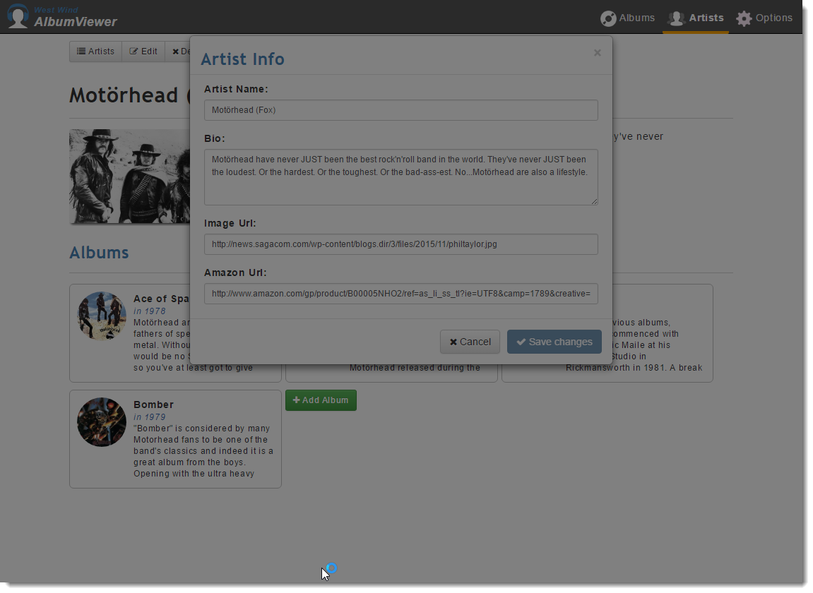
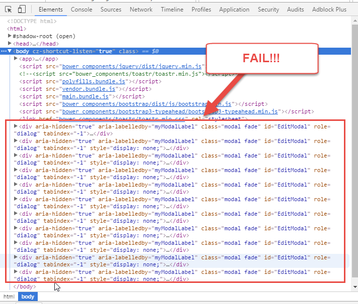

# Bootstrap Modal Dialog showing under Modal Background
I've repeatedly run into the following problem with Bootstrap's modal dialog where the dialog ends up **showing** underneath the modal background:



Ugh. This problem seems to have arrived sometime around Bootstrap 3.33 - prior to that things seemed to work just fine but starting with 3.34 and later things started going south.

### Caused by positioning
The problem is that many modern applications use `fixed`, `absolute` and `relative` positioning to lay out their user interface. The above problem occurs when the Modal dialog sits within a container that has **any parent** that uses either `fixed`, `absolute` or `relative` positioning. The change post 3.34 of bootstrap was that the modal overlay was moved to the DOM root below `<body>` while the actual modal dialog content in this case is sitting inside of a separate nested DOM structure.

```html
<body>

<app>
    <div style="position: absolute">
        ... other content
        <div class="modal">
            ... modal dialog here
        </div>
    <div>
<app>

<div class="modal-overlay"></div>
</body>
```

The problem occurs because the overlay and the other content container are not relative to each other so the `position:absolute` (or fixed) and their z-index values are not directly related to each other. 

The easiest solution  is to move the modal dialog outside of any container and just declare it under the `<body>` element, or - remove any absolute, fixed or relative positioning.

```html
<body>

<app>
    <div style="position: absolute">
        ... other content
    <div>
<app>


<div class="modal">
    ... modal dialog here
</div>
<div class="modal-overlay"></div>
</body>
```

This setup works because there's no top level container above the modal that introduces it's own positioning root.

Problem solved, right?

##AD##

### Not so fast
Well not quite. If you can move your elements - great, but in dynamic applications rendered through a framework like Angular, it's likely you have a component rendering the modal, and you can't control where the element goes. In the first example the `<app>` tag is the Angular application's DOM root and everything rendered dynamically by Angular renders below it. If anything in that tree uses `position: absolute` or `position:fixed` - boom the problem shows up in modals.

The problem is that the `.modal-backdrop` overlay sits in the root of the DOM tree while the other content is buried in a separate DOM node tree. 

If anything inside of that tree is relatively positioned, the z-index can no longer be compared effectively. I tried with a number of values but it **just doesn't work** in this scenario:

```css
.modal-backdrop {
    z-index: 1040 !important;
}
.modal-dialog {
    margin: 2px auto;
    z-index: 1100 !important;
}
```


One workaround is to essentially force the modal out to the body tag with script. Since I trigger the modal in code anyway, it's easy enough to do the following:

```typescript
showEditor() {
    $("#EditModal").modal("show");
    $("#EditModal").appendTo("body");
}
```

This works - sort of. But... this has a nasty side effect as well: Because Angular re-renders the view every time it's accessed, a new #EditModal element is created each and everytime. After a few accesses the 'moved' elements start piling up on the bottom of the page:



Not only that - this behavior also causes duplication of the the elements and on occasion causes the wrong data to come up. 

In my case, because I'm using Angular 2.0 and I control the code, I can fix this by clearing out the modal when I exit the view:

```typescript
showEditor() {
  $("#EditModal").modal("show");
  $("#EditModal").appendTo("body");
}

ngOnDestroy(){
  $("body>#EditModal").remove();
}

```
And this actually works. I get the modal that pops up and gets moved, and I can access it. When I leave the view the extraneous, moved DOM reference is cleaned up.

This works in a pinch but it's clearly not a generic solution.

##AD##

### Remove the Backdrop
There are a host of other solutions that work around this same basic theme moving the modal out of the DOM tree to the root, but I found all of them lacking or not working in some situation.

The only reliable way to get modals to work that I found to fix this entire mess is to simply disable the backdrop altogether. Add this CSS to your global stylesheet:

```css
.modal-backdrop {
    /* bug fix - no overlay */    
    display: none;    
}
```

And the modal dialog will work, albeit without the black overlay:


While this isn't ideal, it does solve the problem cleanly in one place and for all scenarios, so this is clearly the no hassle solution. The black background would be nice but not if it's a detriment to making the application behave incorrectly.

You can also turn off the background on a case by case basis using an attribute on the modal dialog:

```html
<div class="modal fade" id="createModal" data-backdrop="false">
   ...
</div>
```
which works if you have a mixed bag of dialogs that are perhaps defined globally and statically at the root, along with application generated and embedded modals.


### Summary
This isn't exactly news, but after repeatedly running into this problem I decided to write it down so **I** can remember how the heck to fix it next time it happens.

To summarize:

* If possible move the Modal into the `<body>` element
* If possible have no position fixed, absolute or relative elements above the `.modal`
* If possible use code tomove the `.modal` to the `<body>` tag, and remove or move back when done
* If all else fails, remove the background on `.modal-background` with `display: none` or the `data-background=false` attribute.

It's crazy to think that the Bootstrap folks have decided to not fix this common issue. The volume of answers and comments on [this StackOverflow issue](http://stackoverflow.com/questions/10636667/bootstrap-modal-appearing-under-background) as well as [the GitHub issue](https://github.com/twbs/bootstrap/issues/16148) are huge, yet this hasn't been addressed in well over a year and a half.  There's a supposed fix (which moves the overlay into the same DOM tree as the modal) but experimenting with that by explicitly moving it in code just proved to be even weirder with strange opacity behavior and other weird artificats.

For me personally the `display:none` trick is what I went with because it just works without any changes.

If anybody can think of a way we could make this work in a **dynamic** application framework like Angular, leave a comment...

 
### Resources
* [A million questions and answers on this topic on StackOverflow](http://stackoverflow.com/questions/10636667/bootstrap-modal-appearing-under-background)
* [Thread on BootStrap GitHub Repo](https://github.com/twbs/bootstrap/issues/16148)
* [Supposed fix (not integrated)](https://github.com/twbs/bootstrap/pull/16432)

<!-- Post Configuration -->
<!--
```xml
<blogpost>
<abstract>
On more than a few occasions I've run into issues with Bootstrap's Modal dialog rendering incorrectly with the dialog showing underneath the overlay. There are a number of ways around this problem, but none of them are universal that depend on how your pages are laid out. It's especially problematic for applications that dynamically render components where there's no good control on where the elements are placed outside of the components DOM containership. In this post, I describe a few of the workarounds and their limitations.
</abstract>
<categories>
CSS,Angular
</categories>
<keywords>
Modal,Bootstrap,CSS,Angular,Overlay,Fail
</keywords>
<weblogs>
<postid>12344</postid>
<weblog>
Rick Strahl's Weblog
</weblog>
</weblogs>
</blogpost>
```
-->
<!-- End Post Configuration -->
