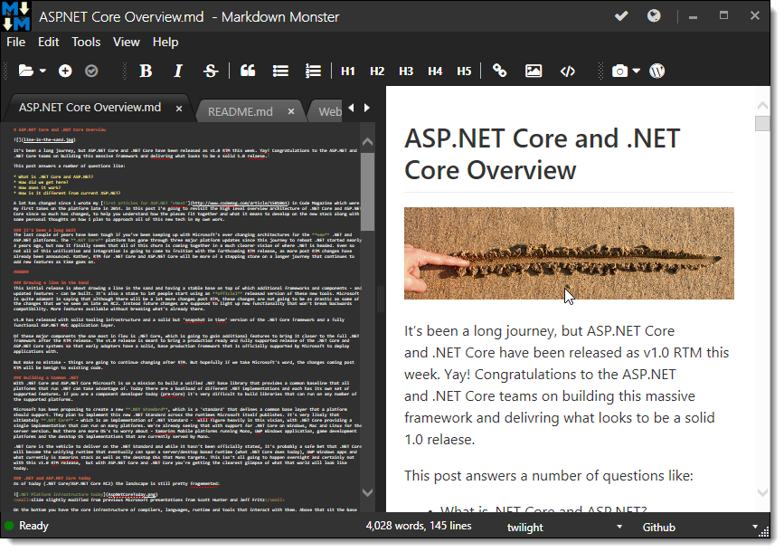

# Capturing Zoom Operations in the WPF Web Browser Control
In my [last post](https://weblog.west-wind.com/posts/2016/Aug/22/Detecting-and-Setting-Zoom-Level-in-the-WPF-WebBrowser-Control) I described a way to capture the zoom level of a Web Browser control in WPF. In [Markdown Monster](http://markdownmonster.west-wind.com) I needed to capture user resizing in the editor, and then save the updated font-size so all open windows can use the new font size for display, and for saving the changed font-size with the configuration options. 

Turns out the approach I took was glitchy when working with certain Windows environments - specifically in VM's where apparently the IE WebBrowser control reports inconsistent system DPI settings. As I was capturing the Zoom level and adjusting font-sizes this caused the display to get smaller and smaller with each zoom query operation which resulted in this unfortunate behavior (the editor view on the right):



Ugh. Clearly the old solution wasn't going to work. I needed a more reliable way to capture Web Browser zooming operations.

### Take 2 - Capturing the raw Web Browser Zoom Gestures
To do this I decided to use the raw DOM events to catpure the mouse wheel and key operations and forward those to the WPF application. The WPF application then handles capturing the new value, saving it into the application configuration and resizing the view, and preempting the native Web Browser behavior in the process.

> For more info on how I pass information back and forth between the Web Browser control and the WPF application please take a look at my [last post](https://weblog.west-wind.com/posts/2016/Aug/22/Detecting-and-Setting-Zoom-Level-in-the-WPF-WebBrowser-Control#RelatedTopic:PassingobjectsbetweenC#andJavaScript) which describes this process in detail.

It turns out this approach is fairly simple and surprisingly allows bypassing the native browser Zoom behavior. It's also an easier approach that can be handled in a more linear fashion than my original Zoom level capture design.

##AD##

To do this I can capture the the `onmousewheel` and `onkeydown` events in the browser. 
To capture the mousewheel in the browser I use this code:

```javascript
window.onmousewheel = function (e) {     
    if (e.ctrlKey) {
        e.cancelBubble = true;
        e.returnValue = false;

        if (e.wheelDelta > 0)
            te.specialkey("ctrl-=");
        if (e.wheelDelta < 0)
            te.specialkey("ctrl--");

        return false;
    }
}
```

The browser fires `onmousewheel` events when you scroll the wheel and gives you a delta of the change. The number will vary depending on the sensitivity - I get 110 or 220 typically which are apparently one or two scroll units. I'm ignoring the delta and just treating each change up or down as a single font size change and that seems to be working predictably although it ignores scroll momentum.

The code checks for the control key down (ie. Ctrl-Scroll operation) and then tries to make sure the event isn't propagated any further by `return false`. Just for good measure `e.cancelBubble` and `e.returnValue=false` are also set.

Likewise I can capture the `Ctrl-+` and `Ctrl-`zoom operations with the `onkeydown` event in the browser:

```javascript
window.onkeydown = function(e) {
    if (e.ctrlKey) {
        if (e.keyCode == 187)
            te.specialkey("ctrl-=");
        if (e.keyCode == 189)
            te.specialkey("ctrl--");
        
        e.cancelBubble = true;
        e.returnValue = false;
        e.preventDefault = true;
        return false;
    }
}
```
Again I make sure to prevent the default event handling explicitly to avoid the default zoom operations to happen.

If a scroll operation or special key operation was detected I'm then passing this event forward to WPF. In this case I have a global `te` object (on the JavaScript end) and its `specialkey()` method. The `te` reference internally holds a reference to the WPF model which contains a bunch of operations that forward information to WPF for processing.

The global JavaScript interaction object does this:

```javascript
specialkey: function(key)   {
        //  mm WPF model, textbox - Web Browser handling ops
        te.mm.textbox.SpecialKey(key);
    },
```

which talks to the .NET `mm` ([Markdown Monster](http://markdownmonster.west-wind.com)) model object which includes a `textbox` control which in turn handles all incoming JavaScript operations. In this case there's a method called `SpecialKey` that handles all key and gesture operations from the Web browser control:

```c#
 public void SpecialKey(string key)
{
    if (key == "ctrl-s")
    {
        Window.Model.SaveCommand.Execute(Window);
    }
    if (key == "ctrl-shift-v")
    {
        Window.Button_PasteMarkdownFromHtml(WebBrowser, null);
    }
    if (key == "ctrl-shift-c")
    {
        Window.Button_CopyMarkdownAsHtml(WebBrowser, null);
    }
    ...
    
    // zooming
    if (key == "ctrl-=")
    {
        mmApp.Configuration.EditorFontSize++;
        RestyleEditor();
    }
    if (key == "ctrl--")
    {
        mmApp.Configuration.EditorFontSize--;
        RestyleEditor();
    }
}
```

Most of the operations in `SpecialKey` map to WPF Command objects or control event handlers, but the zoom operations adjust the editor font size config setting and then simply force the editor to restyle. `RestyleEditor()` is a method in the same C# class that talks back to the captured JavaScript object model and forces the editor to restyle itself. 


```cs
public void RestyleEditor()
{
    AceEditor.settheme(mmApp.Configuration.EditorTheme,
        mmApp.Configuration.EditorFontSize,
        mmApp.Configuration.EditorWrapText);
    
    if (EditorSyntax == "markdown" || this.EditorSyntax == "text")
        AceEditor.enablespellchecking(!mmApp.Configuration.EditorEnableSpellcheck, mmApp.Configuration.EditorDictionary);
    else
        // always disable for non-markdown text
        AceEditor.enablespellchecking(true, mmApp.Configuration.EditorDictionary);

}
```

`AceEditor` is WPF's reference to that same `te` object I used earlier in JavaScript, but this time called from WPF. Calling `setTheme()` reapplies the theme and font settings and enables/disables spell checking based on the stored configuration setting.

> If this two-way communication sounds vague take a look at my [last post](https://weblog.west-wind.com/posts/2016/Aug/22/Detecting-and-Setting-Zoom-Level-in-the-WPF-WebBrowser-Control#RelatedTopic:PassingobjectsbetweenC#andJavaScript) that describes this two-way communication in detail.

The same approach is also used for handling the special zooming key strokes that are native to the IE Web Browser control: Ctrl+= and Ctrl+-. In this application I'm using AceEditor's high level key bindings to detect complex key combinations like Ctrl+= and Ctrl+-:

```javascript
editor.commands.bindKeys({
    "ctrl-n": function() {},
    "alt-c": function() { te.specialkey("alt-c"); },
    "ctrl-o": function() { te.specialkey("ctrl-o"); },
    "ctrl-s": function() { te.specialkey("ctrl-s"); },
    "ctrl-b": function() { te.specialkey("ctrl-b"); },
    "ctrl-i": function() { te.specialkey("ctrl-i"); },
    "ctrl-l": function() { te.specialkey("ctrl-l"); },
    "ctrl-k": function() { te.specialkey("ctrl-k"); },

    // take over Zoom keys and manually zoom
    "ctrl--": function () { te.specialkey("ctrl--"); return null; },
    "ctrl-=": function () { te.specialkey("ctrl-="); return null; },

    "ctrl-shift-down": function () { te.specialkey("ctrl-shift-down"); },
    "ctrl-shift-up": function () { te.specialkey("ctrl-shift-up"); },
    "ctrl-shift-c": function () { te.specialkey("ctrl-shift-c"); },
    "ctrl-shift-v": function () { te.specialkey("ctrl-shift-v"); }            
});

```

This function takes any special key combinations and forwards them for processing in WPF. Note that some combinations automatically forward, so I don't have to do anything special, but most control combinations require forwarding. 

Note that for `ctrl-=` and `ctrl--` i need to `return null` (not `return false` as you might think) explicitly. This notifies AceEditor to not pass the keystroke on.

As mentioned earlier I can also capture these keys with native DOM event handling as I showed at the beginning of the post. Here's is the same logic using the `onkeydown` handler.

```javascript
window.onkeydown = function(e) {
    if (e.ctrlKey) {

        if (e.keyCode == 187)
            te.specialkey("ctrl-=");  // + 
        if (e.keyCode == 189) 
            te.specialkey("ctrl--");  // -

        e.cancelBubble = true;
        e.returnValue = false;
        e.preventDefault = true;
        return false;
    }
}
```

Note that you want to capture `onkeydown` as it's the only event you can cancel out of and avoid default browser behavior as I don't want to have the Web Browser Control's native Zooming to kick in. If you handle `keydown` or `keypress` it's too late and the browser behavior will kick in before you get a chance to handle the event yourself. 

##AD##

### Zoom, Zoom
The good news is that this approach works reliably across different environments and the zoom operation is actually more steady than with the native zooming as it's a little slower - especially if you have a mouse with a [free running, momentum based scroll wheel mouse](http://amzn.to/2cvcITo) like I do. 

I can now use natural scrolling in Markdown Monster to capture the user's zoom operation and map it to my application's font size setting. By simply capturing scroll events and updating my font size based on these events I'm back to having a single point of control where my font size is adjusted. Yay! 

### Resources
* [Detecting and Setting Zoom Level in the WPF WebBrowser Control]( https://weblog.west-wind.com/posts/2016/Aug/22/Detecting-and-Setting-Zoom-Level-in-the-WPF-WebBrowser-Control#RelatedTopic:PassingobjectsbetweenC#andJavaScript)


<!-- Post Configuration -->
<!--
```xml
<blogpost>
<abstract>
If you need to capture Zoom operations in the Web Browser control - either to avoid letting hte user zoom or to capture the zoom operation and take action on it - you need to dig into the Web Browser's DOM events to capture the scroll wheel and key events. In this post I describe how you can do just that by looking at an application that captures scrolling and rather than zooming adjusts the font size of the content.
</abstract>
<categories>
WPF,.NET
</categories>
<keywords>
Web Browser Control,WPF,Zoom,scrollwheel,dpi,keydown,events,DOM
</keywords>
<weblogs>
<postid>1683221</postid>
<weblog>
Rick Strahl's Weblog
</weblog>
</weblogs>
</blogpost>
```
-->
<!-- End Post Configuration -->
