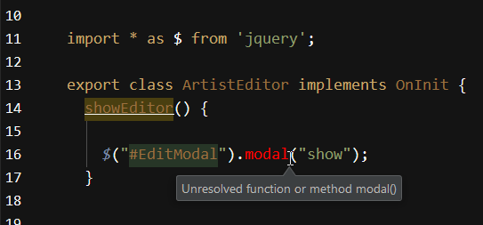
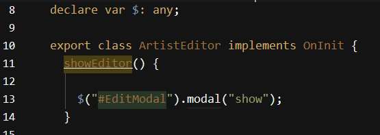

# External JavaScript dependencies in Typescript and Angular 2


In the last few weeks I've finally decided to look more closely at Angular 2 and I'm glad I waited this long as so much has changed since I previously look at this stuff even just a few months ago. I've been dabbling with Typescript for a while, but this has really been the first time I dived in more deeply and I have to say I definitely like working with it. But figuring out how module loading works has been one of the hardest parts of the Angular2/Typescript journey for me thus far.
 
One thing that wasn't real obvious to me was how to properly import **non-typescript libraries and reference them in code**, so the typescript compiler and the Angular runtime is happy with the references. In this post I'd like to share how that works here...

### Working with Typescript references 
For context lets see how module loading works for Typescript modules.

Typescript (like ES6) makes it very easy to import other Typescript dependencies. You map a related JavaScript file using a relative path using `from 'path/tsFileWithNoExtension'` and  reference any exported classes/components in `{class1, class2}` brackets, using the `import` statement.
 
```typescript
import {ArtistService} from "./artistService";
import {Artist, Album} from "../business/entities";
 
export class ArtistEditor implements OnInit {
    artistService:ArtistService = null;
    
    artistList:Artist[] = [];
    activeArtist:Aritst = new Artist();
    
    doSomething() { 
        // full type checking and Intellisense - yay!
        let title = this.activeArtist.Title;
    }
}
```   
 
Depending on which module loader you use, the same works for library imports which are imported from the package folder, so dependencies like Angular are imported like this: 

```typescript
import { Component, OnInit, Input } from '@angular/core';
import { ActivatedRoute } from '@angular/router';
```

these dependencies are pulled by the module loader from the `node_modules` folder. Any components you install with `npm` are available to be imported.

For me, the module loading alone is worth the price of admission for ES6 and Typescript. It provides a clean and self-describing way to import dependencies and breaks up things into logical components as you would in any other language. Hey it only took JavaScript 20 years to get here. Duh! Regardless, compared with ES5 module loading shenanigans this is a huge improvement and (mostly) provided directly by the language.

> #### @icon-info-circle Finding Imports
> Probably the hardest part in working with Angular 2 for me has been figuring out where modules live. Having good Intellisense is key. I've been using [WebStorm](https://www.jetbrains.com/webstorm/) and its **Alt-Enter** reference and type resolution that automatically imports any referenced module dependencies is a huge timesaver for me.

##AD##

### Non-Typescript Components and Classes
So module imports and type resolution at compilation are great for native Typescript components.

However, when it comes to non-Typescript components things aren't quite as straight forward. While there are lots of type definition files available to import existing JavaScript libraries that take advantage of Intellisense from the type definitions, it doesn't always fit. A good example is jQuery - while the type definitions clearly define jQuery's internal interface, if you have any jQuery plug-ins that doesn't provide typings (or you haven't pulled them into your project), the Typescript compiler is going to complain about type mismatches.

### Importing non-Typescript libraries
There are two ways that you can deal with external libraries:

* import the library
* load the library yourself and dereference any globals

### Importing an external library
In most cases you can simply import a library into your Typescript/Angular project. Say I want to import jQuery and Toastr (a small notification box component) you start with:

```
npm install jquery toastr --save
```

The `--save` flag is important so that the components get added to `package.json` and can be found by tools like WebPack and the Typescript compiler to build your code. 

For Intellisense and type checking, Typescript can optionally use type definition files. If the library package includes a Typescript definition (many do), you're done. Otherwise you can import using the [Typings](https://github.com/typings/typings) tool that lets you explicitly import type definitions for most popular libraries. To use the library in your typescript code is then easy.

Once installed you can now reference your library like this in code:

```typescript
import * as $ from 'jquery';
import * as toastr from 'toastr';
```

in every file that uses these components.

Then to call it use the same syntax you always used but with the benefit of Intellisense:

```typescript
$("#mainview").addClass("stacked");
toastr.success("Orders downloaded.");
```
This works fine - you get Intellisense at edit time and type resolution at transpile time. Cool.

This approach uses the module loading features of Typescript/ES6 to load the library. When using WebPack with  Angular 2, doing it this way will pull jQuery and Toastr into the packaged `vendor.bundle.js` file.

### When Module Loading doesn't work so well
Module referencing is nice, but with jQuery I've run into issues. With jQuery I often call a plug-in or dependency that doesn't have a typings file or I simply don't want to deal with importing it for a single small use. Really what I want is just **for Typescript to get out of the way**.

If I use module imports for jQuery and then do something like this:



the compiler complains because it doesn't know about the `.modal()` bootstrap plug-in. Ugh - this is exactly the kind of stuff why people bitch about typed languages. But - there is an easy workaround.

##AD##

### De-referencing Globals
In order to keep the Typescript compiler happy and not end up with compilation errors, or have a boat load of type imports you may only use once or twice, it's sometimes easier to simply manage the external libraries yourself. Import it using a regular script tag, or packaged as part of a separate vendor bundle and then simply referenced in the main page.

So rather than using `import` to pull in the library, we can just import using `<script>` tag as in the past:

 <script src="bower_components/jquery/dist/jquery.min.js"></script>
 <script src="bower_components/toastr/toastr.min.js"></script>

Then in any Typescript class/component where you want to use these libraries explicitly dereference each of the library globals by explicitly using `declare` and casting them to `any`:

```typescript
declare var $:any;
declare var toastr: any;
```

Because this removes any typing from the library the typescript compiler is now happy:



You get no Intellisense though, but that's Ok in this case as all I'm after is referencing this particular plug-in. 

Another approach is to explicitly dereference using a cast (thanks to [Christopher Cook](https://twitter.com/webprofusion) for pointing that out):

```typescript
(<any> $("#EditModal")).modal();
```

although that's quite ugly with all those quotes and brackets - but hey it works and might actually be clearer for one of overrides.

This approach bypasses module loading and bypasses the packaging and bundling provided by tools like WebPack in Angular. This may be what you want - perhaps you want to load from a CDN or maybe you keep bigger libraries out of the packaged bundles to reduce the build time. 

### jQuery and Plugins
If you decide to load jQuery via module loading so you can get it into the Angular 2.0 `bundle.vendor.js` package, you may find that you run into problems if you're using other jQuery plugins that expect to have a global `$` and `jQuery` variable.

For example, in my current sample app I'm building I'm using Toastr and I decided to module load it into my app. Toastr has a dependency on jQuery so it automatically pulls jQuery into the module list. Initially I had intended to just use jQuery from a `<script>` tag, but since Toastr pulls it I don't want the double hit.

So rather than double loading jQuery, it's best to make sure that the module loaded instance can be used with other components. The problem is if you just use module loading the global `$` and `jQuery` vars aren't set and not available to plug-ins. In my app I get complaints from **Bootstrap** plug-in and various jQuery related widgets because they can't find the global `jQuery` reference.

To fix this I do the following in Angular's main module `app.module.ts` to essentially force the global vars from the module loaded reference:

```javascript
// hack - make sure that jQuery plugins can find
//        jquery reference
import * as $ from 'jquery';

window["$"] = $;
window["jQuery"] = $;
```

Then I make sure to load any other libraries that require jQuery load **after** the Angular bundles:

```html
<script src="scripts/web-animations.min.js"></script>

<script src="polyfills.bundle.js"></script>
<script src="vendor.bundle.js"></script>
<script src="main.bundle.js"></script>

<script>console.log('bundles loaded.',$);  // jQuery is set! </script>

<script src="bower_components/bootstrap/dist/js/bootstrap.min.js"></script>
<script src="bower_components/bootstrap3-typeahead/bootstrap3-typeahead.min.js"></script>
```

This feels very hacky, but it works. If you know of a better way to deal with global vars from module loaded libraries, please leave a comment.

### Summary
All of these approaches work, but they obviously work quite differently. You want to be careful and not mix and match behaviors. As I described in the last section, I did not want to load jQuery with module loading **and** a `<script>` tag which would result in double the payload. For each library use only **one** approach and make sure that other components aren't pulling in dependencies you might be double loading.

In review we have essentially two ways to make external non-typescript  libraries available. 

You can import with Module loading if the library supports basic module exports:

```typescript
import * as $ from 'jquery';
import * as toastr from 'toastr';

// later in file
$("#MainView").removeClass("slide-out");
toastr.succcess("Done!");
```

Make sure the module was imported with `npm install` before you reference it. You get strong typing and Intellisense support.

If you need to have globals exposed - globally for plug-ins or other non-typescript dependencies use:

```javascript
// hack - make sure that jQuery plugins can find
//        jquery reference
import * as $ from 'jquery';
window["$"] = $;
window["jQuery"] = $;
```

Alternately, if you simply want to load a library with a `<script>` tag or otherwise access a global reference that's not loaded through the Typescript module loader you can simply de-reference the global variable:

```typescript
declare var $:any;
declare var toastr: any;
```

and work with the untyped variables. You get no Intellisense and the Typescript compiler just assumes you know what you're doing. Any type mismatch failures happen at dynamically runtime. Essentially you work as you would in ES5 code in the past.

There you have it. Choice is good.


<!-- Post Configuration -->
<!--
```xml
<blogpost>
<abstract>
Angular 2.0 and Typescript make it very easy to import external Typescript classes and references using the module loading functionality built into Typescript (and ES6). However, if you need to work with external libraries that aren't built with Typescript you need to do a little extra work in importing and referencing the external libraries. In this post I show two approaches for importing libraries as modules and dereferencing library globals so that the Typescript compiler is happy.
</abstract>
<categories>
Angular, Typescript
</categories>
<keywords>
Angular, Typescript, Module Loading, jQuery, import
</keywords>
<weblogs>
<postid>9583</postid>
<weblog>
Rick Strahl's Weblog
</weblog>
</weblogs>
</blogpost>
```
-->
<!-- End Post Configuration -->
