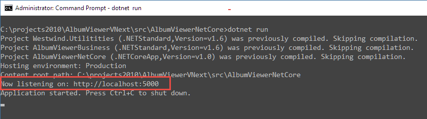
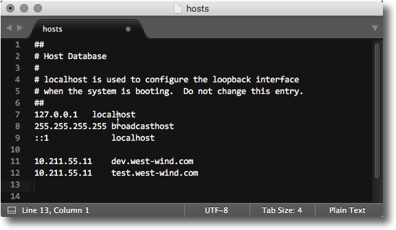

# External Network Access to Kestrel and IIS Express in ASP.NET Core


Today I ported over [my AlbumViewer sample Angular 2.0 application](https://github.com/RickStrahl/AlbumViewerVNext) I worked on for a workshop for the last few weeks, to my ASP.NET Core project. I've been building various different kinds of backends for this Angular 2.0 front end app and it's been very easy to simply swap them out by changing the base URL to the API endpoints.

I've been working on the Angular 2.0 app on my Mac, but the server side ASP.NET I'm moving it to is running on Windows using ASP.NET Core and so I need to run my API application in a Windows VM on Parallels and access this API from the Mac side where the Angular application is running locally using the WebPack dev server. 

In order to access the Windows API service from the Mac requires a bit of configuration as by default both Kestrel and IIS Express only serve requests on localhost. Both servers use default bindings that point explicitly at **localhost** which effectively disables remote access.

In order to make this work there are a couple of configuration steps required:

* Change the default URL binding to a non-localhost address
* Open the Firewall port
* Map a host name to make it easier


### Kestrel: What's the Problem? Url Bindings
The issue is that the default binding that Kestrel uses, binds explicitly to `localhost`. A localhost bound IP won't expose to the external network, so even though you might be able to access other ports on the VM over the network - like IIS running on port 80 - accessing of `http://<WindowsVmIp>:5000/` is not supported without some configuration changes.

When Kestrel starts without any binding customization you get:



which clearly shows that it's using the `localhost` URL.

##AD##

### Override the default URLs
In order to expose Kestrel externally you either have to bind to a specific machine name, IP Address or `0.0.0.0` which stands for all IP Addresses (thanks to [@DamianEdwards](https://twitter.com/DamianEdwards) and @BradyMHolt for their help). 

ASP.NET Core allows overriding the startup URLs as part of the startup process for the Web host and there are a number of ways that you can do this:

* Set the --server.urls command line parameter
* Use WebHost.UseUrls()
* Set up hosting.json

You can override the start this via the launch command line:

```
dotnet run --server.urls http://0.0.0.0:5001
```

In order for this to work make sure that command line argument configuration is enabled as part of the startup procedure:

```csharp
public static void Main(string[] args)
{
    // use this to allow command line parameters in the config
    var configuration = new ConfigurationBuilder()
        .AddCommandLine(args)
        .Build();
    ...
}
```

If you want more control you can also explicitly set the host Url or Urls. In code you can use the following - including reading a configuration setting from a custom command line parameter:

```cs
public static void Main(string[] args)
{
    // use this to allow command line parameters in the config
    var configuration = new ConfigurationBuilder()
        .AddCommandLine(args)
        .Build();


    var hostUrl = configuration["hosturl"];
    if (string.IsNullOrEmpty(hostUrl))
        hostUrl = "http://0.0.0.0:6000";


    var host = new WebHostBuilder()
        .UseKestrel()                
        .UseUrls(hostUrl)   // <!-- this 
        .UseContentRoot(Directory.GetCurrentDirectory())
        .UseIISIntegration()
        .UseStartup<Startup>()
        .UseConfiguration(configuration)
        .Build();

    host.Run();
}
```

With that in place you could run:

```
dotnet run                                 // default on port 6000
dotnet run --hosturl http://0.0.0.0:6001   // explicit
```

The key is the `.UseUrls()` call that applies the host url to the Webhost and as you can see you can apply logic and configuration to decide where the value comes from.

Note that you can specify multiple startup URLs separated by semicolons in the string passed.

### Open your Firewall
Next you need to make sure that your Windows firewall allows access to the requested port.

```
netsh advfirewall firewall add rule name="Http Port 5000" dir=in action=allow protocol=TCP localport=5000
```

or you can use the interactive Windows Firewall application. 

Assuming you used a non-localhost IP address or name, your application should now be externally accessible when you `dotnet run`.

### On the Mac: Create a HOSTS entry
This step is optional, but when developing in a two OS environment I like to make it as easy as possible to identify machines, so I tend to create domain names for the server rather than using an IP address to access it by modifying the HOSTS file on the client machine.  So I have **dev.west-wind.com** locally which maps to the IP address of my Windows virtual machine  in Parallels.



With this in place I can now navigate to my app with:

**http://dev.west-wind.com:5000/index.html**

to get to my ASP.NET Core application on the Windows VM. Schweet!


### Exposing IIS Express to the Network
If you want to use IIS Express and allow external access, you need to explicitly change the bindings in the solution `applicationhost.config` file which can be found in `<solutionRoot>\.vs\config`. Change the **bindingInformation** to:

```xml
<site name="AlbumViewerNetCore" id="2">
    <application path="/" applicationPool="Clr4IntegratedAppPool">
      <virtualDirectory path="/" physicalPath="C:\projects2010\AlbumViewerVNext\src\AlbumViewerNetCore" />
    </application>
    <bindings>          
      <binding protocol="http" bindingInformation="*:26448:*" />
      <binding protocol="https" bindingInformation="*:44319:*" />
    </bindings>
</site>
```

changing the `*:26448:localhost` to `*:26448:*` where 26448 is the IIS Express port.

Then run: 

```
netsh http add urlacl url=http://*:26448/ user=Interactive listen=yes
```

to bind the http.sys entry. 

Finally open the firewall to allow inbound connections to the specific IIS Express port:

```
netsh advfirewall firewall add rule name="Http Port 26448" dir=in action=allow protocol=TCP localport=26448
```

and you should be off to the races.

### Acknowledgements
Many thanks to the following people who provided input to my earlier Twitter questions:

* [Damien Edwards](https://twitter.com/DamianEdwards/)
* [Brady Holt](https://twitter.com/bradymholt)
* [Andrew Lock](https://twitter.com/andrewlocknet) ([related article](https://andrewlock.net/configuring-urls-with-kestrel-iis-and-iis-express-with-asp-net-core/))


<small style='font-size: 0.6em'>
Image credit (stairs): &copy; <a href='http://www.123rf.com/profile_akiyoko'>akiyoko / 123RF Stock Photo</a>
</small>


<!-- Post Configuration -->
<!--
```xml
<blogpost>
<abstract>
Recently I needed to connect to my Windows based ASP.NET Core API from my Mac and in order for that to work some configuration settings are necesary so that the ASP.NET applications can serve HTTP content to the external network connection that this entails. In this post I show what you have to do to enable remote connections both using the Kestrel and IIS Express Web servers.
</abstract>
<categories>
ASP.NET Core,IIS
</categories>
<keywords>
ASP.NET Core,Kestrel,IIS Express,Mac,Network,External
</keywords>
<weblogs>
<postid>24643</postid>
<weblog>
Rick Strahl's Weblog
</weblog>
</weblogs>
</blogpost>
```
-->
<!-- End Post Configuration -->
