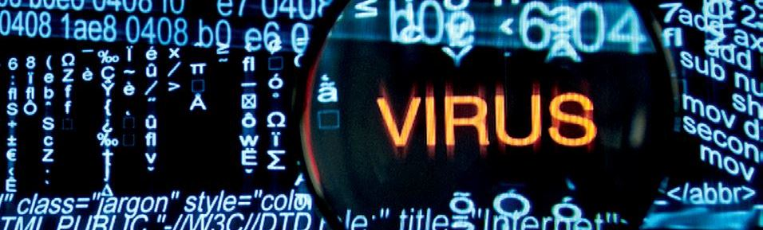
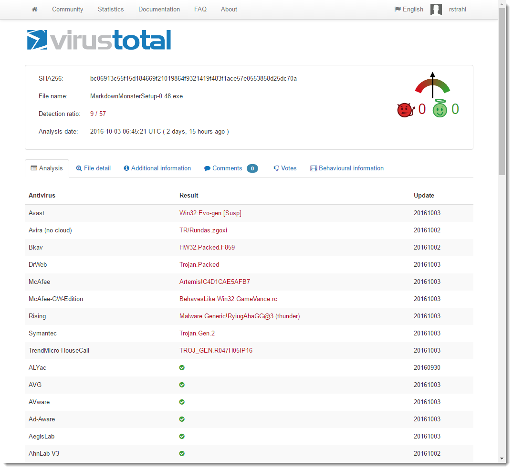
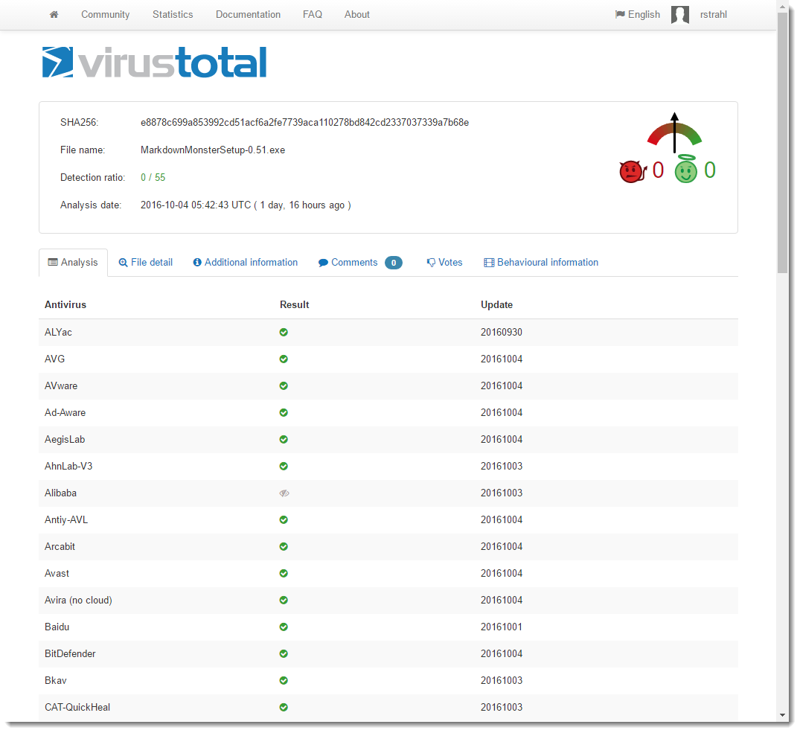
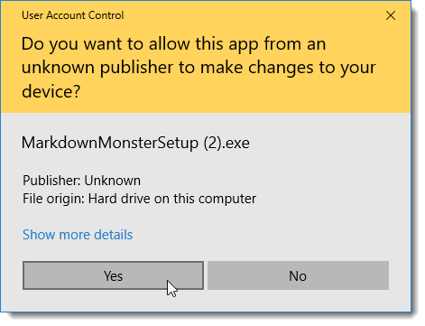
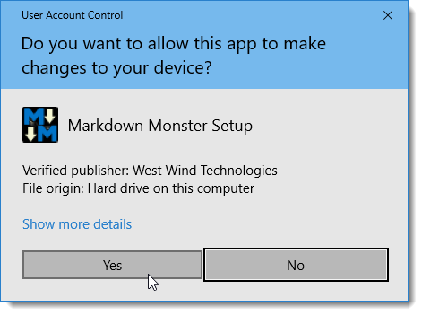

# Dealing with Anti-Virus False Positives



I've been working on [Markdown Monster](https://markdownmonster.west-wind.com) for a while now. It's a standalone desktop application and in recent months I've been plagued with Anti-Virus false positives for the installation executable. I didn't realize anything was wrong at first, until a few occasional emails came rolling in from users telling me their anti-virus flagged the installer - in many cases completely blocking the install process.

My first reaction was - "ah, just a fluke with a false positive". After all I **know** what's in my code and there's nothing threatening in here. But to my chagrin, using [VirusTotal](http://www.virustotal.com/) - which is used by [Chocolatey](http://Chocolatey.org) and other distribution sources - I was coming away with 9 AV failures:



Looks nasty doesn't it? I had to take a closer look.

##AD##

### Figuring out what's going on
Anti-Virus false positives are a pain because it's quite likely if you open the package and see a virus warning you're going to be very hesitant to go any further, my assurances aside :-) Several people contacted me in recent weeks and let me know that the installer was flagged by their Anti-Virus tool. A few were brave and installed anyway - saying they trusted me that there was no malice in these files since they are coming from me. Brave indeed - I'm not sure I'd do the same. Seeing AV warnings on software is something you generally want to take serious.

In this case however, it turns out that it's definitely a case of false positives. How do I know this? 

Well, let me tell you a story...

As it turns out there were a number of factors at play here:

* One third party library that had been flagged as malicious
* One installer platform apparently tagged

In order to track down the problem I tried a boatload of things to try and isolate where the problem was coming from. It took a while but I think I'm out of the woods for now. In this post I walk through the morass of trying to figure out what was causing the false positives and the workarounds that eventually allowed me to get past the problem - after quite a bit of sleuthing and wasted time. I figure it might be useful you find yourself in a similar position with your application...

### Third Party Problem
I started by removing all DLL dependencies from the installed distribution before compiling into the installer. To my surprise, after removing all dependencies VirusTotal came down to 3 AV hits, instead of the previous 9 I started with - a definite improvement.

It turns out that one third party library - hunspell spell checker library specifically -  has had a problem with a very particular version. Doing some research I found that another vendor had built a custom version of hunspell.dll that did some monkey business - and that's what got hunspell flagged as a potential trojan. Removing hunspell immediately dropped a number of the AV hits (down to 3 from 9).

I played around with several different versions of hunspell and found that only the latest version of NHUnspell was flagging AV. I uninstalled and installed an older version and AV no longer flagged those particular items.

I suspect this is also a false positive. After all hunspell is open source and quite popular as it it's used by major pieces of software like most browsers and most open source editors. It's also open source so the code is there for all to see - it'd be hard to hide a trojan in broad view especially in tool with such tightly defined scope and size. But... nevertheless it got flagged and the only way for me to get past this was to use an older version. 

Which is ridiculous if you think about it!

### Installer Woes
This still left me with 3 AV hits one of which was a major vendor - Avast.

At this point I wasn't sure what to try. I had removed all external binaries, and I was still getting errors. 

I then zipped up all code **without using the installer software** ([InstallMate](http://www.tarma.com/) is what I use) - IOW, I just packaged up the entire distribution folder minus Installer package that provides the shortcut, registry keys (for IE version and file association) and Environment (adding to path) registration. And lo and behold - no AV hits.

I then built an empty installer - nothing in it except all the text and image resources - also no AV hits. I then added back the DLLs - no AV hits. Added back my main EXE - and **BAM!** -  back to having AV troubles.

I then also tried just checking the main EXE on its own on VirusTotal and that comes away clean with 0 AV hits as well. 

### MADNESS!
In summary - on its own the Exe is fine. On its own the installer minus EXE is fine. The full distribution zipped up plain without the installer is also fine. All fine, but the combination of installer plus my EXE results in multiple AV hits. 

Yup that makes perfect sense. NOT!

This really makes you wonder how much faith you should have in these anti-virus solutions. If the individual parts are clean but the combined parts trigger, something is seriously amiss in the detection process. Further if you look at the original screen shot of the AV hits, every vendor seems to be triggering on a completely different threat. Again how should this be possible if individually the files are fine, but packaged they are not? How reliable is this stuff really?

##AD##

### Rebuilding the Installer
At this point the only solution I have left to me is to rebuild the installer.

I've used Tarma's Installmate for years and years. It's been easy to work with, very reliable and with all my other products I never had an AV problem. In this case though clearly some magic combination is triggered that sets of AV alarms and I was just not able to shake it.

So - I created a new installer using [Inno Setup](http://www.jrsoftware.org/isinfo.php) which is a very popular and free solution. My install is fairly straight forward in that it copies a fixed file structure and just needs a couple of registry entries, an environment setting and a file association, so it was relatively painless to build a new installer that duplicates what I had with InstallMate. The hardest part was re-creating the installer images in the right format :-)

After building the final install I sent it off to VirusTotal and... it came back clean - no AV hits:



Yay!

Now here's the scary part - I've sent up the file several times and had **the very same** file reanlysed a few times. 2 out of 5 times it came up with one AV hit (for some obscure Chinese AV software). But again - that makes you wonder how reliable all of this AV testing is when several consecutive runs of the same exact file produce different results?

### Signing the Installer and Main Executable
While I was fretting about the fact that this software was probably not getting used at all due to the AV issues, I also decided it's probably a good idea to have the installer and the main Exe signed to prove the identity where it comes from. This is probably doubly important since the code for Markdown Monster is available and it's possible to recompile the application. The Sign Code signature clearly identifies the official version that is published by West Wind Technologies.

I've put off signing my software for a long time, because it's quite the hassle to aquire a certificate, get it installed properly, sign your code and then make sure the certificate is renewed each year. I found out that prices for these Code Signing certs have come down somewhat since I last checked. I ended up with a[ Commodo Certificate from the SSL Store](https://www.thesslstore.com/comodo/codesigning.aspx). And true to form the first certificate that was issued didn't want to properly install into the Windows certificate store. I was unable to export it or otherwise reference it. I had to have it re-issued, but not after wasting an hour trying to get it to work. When the new certificate arrived it 'just' worked.

Security on Windows is always a hassle because it's so bloody unclear on where certificates need to live so that applications that need it can find it.

Here are a few hints about Code Signing an Exe:

* Use the same browser to generate and then install the certificate
* FireFox worked best for me - it allowed easy export of the Certificate
* Chrome and IE installed the cert in the wrong place and I couldn't export to PFX
* FireFox could export to PKCS#12 which is the same as PFX format
* I had to install the certificate to Local Machine/Person to get it to work
* Signtool was not able to find the cert when installed in Current User/Personal 
* Use SignTool.exe to sign using Installed Certificate (rather than PFX)
* Run SignTool as Admin (when cert is installed in Local Machine)

To actually sign a certificate I use the following in my Powershell build script:

```powershell
& "C:\Program Files (x86)\Microsoft SDKs\Windows\v7.1A\Bin\signtool.exe" 
    sign /v /n "West Wind Technologies" 
    /sm /s MY 
    /tr "http://timestamp.digicert.com" /td SHA256 /fd SHA256
    ".\Builds\CurrentRelease\MarkdownMonsterSetup.exe"
```

The `/n "West Wind Technologies"` switch specifies a substring of the Certificate's subject item which includes `CN=West Wind Technologies` so that works. The `/sm` switch uses the machine level certificate which was the only way I could get it to work. I also had to run as an Administrator in order to get at that certificate.


For me this only worked with the certificate installed in the Local Machine store, not the current user and having to run as an Administrator. I couldn't get SignTool to work with the Current User/Personal installed certificate and running without the `/sm` switch - when running as a regular user I always get the message that SignTool can't locate an appropriate certificate. There probably is a way to make this work with current user but I couldn't find the right incantation. If you know how to sign without running as an Admin (and using the certificate store rather than the PFX with a password) please drop a comment.

So when you fire up the unsigned installer it looks like this:



After signing the setup EXE and running the signed installer it goes to a the much less scary looking dialog:




with the MM icon and the West Wind publisher name applied.

While this ended up not having any effect AV hits, it does provide more confidence for people downloading the software.

So now I have a clean AV slate (for now - fingers crossed) and a properly signed Exe which is nice. But man a lot of effort went into making this all happen.

Now to go and sign all the rest of my products properly as well.

##AD##

### Anti-Virus Hell
At the end of the day, this was a major pain in the ass, when essentially it came down to false positive AV scores. But, there's really nothing I could do other than try to work around the issues I mentioned in the end having to completely ditch my perfectly fine installer software for an alternative, just to get a different result. Nothing has changed - the same binaries are deployed as before, the same installation changes are made - one solution flags AV, the other does not. And that is just not cool and leads me to think that much of the AV tracking is not as sophisticated as we'd expect it to be.


To be fair most AV vendors have Web sites to submit false positives and the three I submitted to were responsive to rescanning (and ultimately stating there's nothing wrong with files). But that's not a sustainable solution if you push out new builds that are likely to trigger again in the future.

This is a pain for software vendors to say the least. I'm at the mercy of the AV software that is essentially holding software hostage based on false positives. Nobody wants to install software that is flagged as malware - even if you trust the source.

While searching around and Twittering about the issues I ran into, I got an earful from other developers who've gone through similar pains.

### Markdown Monster
If you previously tried to use Markdown Monster and ran into Anti-Virus warnings, you might want to give it another try. Starting with **Version 0.51** the new installer and signed code is live.

* [Markdown Monster Download Page](https://markdownmonster.west-wind.com)
* [Markdown Monster on Chocolatey](https://chocolatey.org/packages/MarkdownMonster)

<!-- Post Configuration -->
<!--
```xml
<blogpost>
<abstract>
I've been struggling with false positive Anti-Virus warnings for Markdown Monster. In this post I describe what problems I was running into and how eventually managed to get a clean distribution of Markdown Monster out the door.
</abstract>
<categories>
Windows,Security
</categories>
<keywords>
Anti-Virus,False Positives,AV Software,Code Signing,SignTool
</keywords>
<weblogs>
<postid>30580</postid>
<weblog>
Rick Strahl's Weblog
</weblog>
</weblogs>
</blogpost>
```
-->
<!-- End Post Configuration -->
