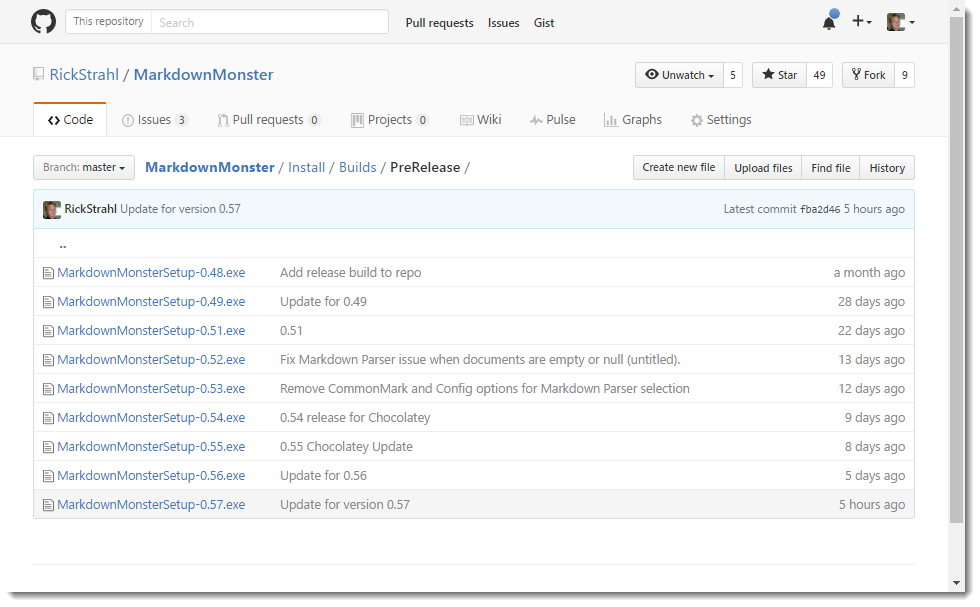
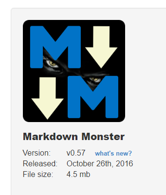
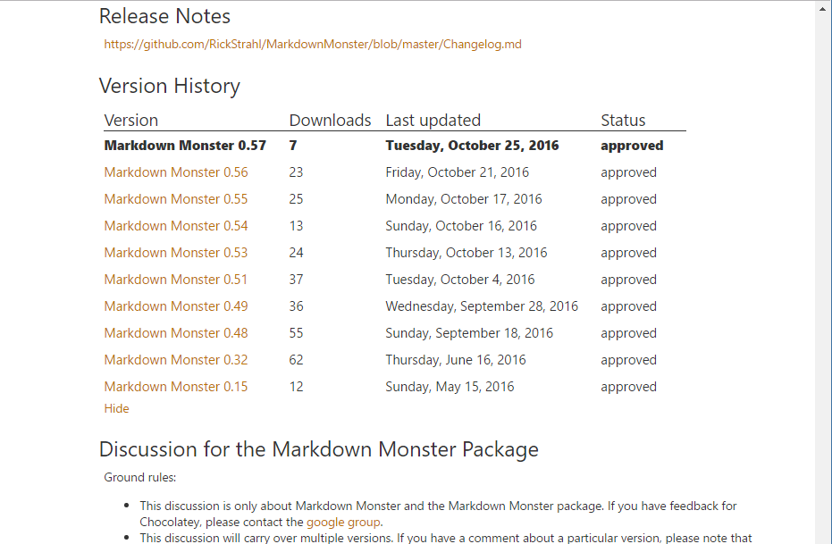

---
title: Automating Installation Builds and Chocolatey Packaging
abstract: Having a quick and easy way to build a final deployable applicationsin a few minutes has been a huge motivation for me. I can update code and release a new build as soon as a feature is added or a bug is fixed, and my release cycle is much more frequent than it was before. I used to be much more conservative with releases - if something was broken it'd have to wait. But with an easy release mechanism all of that has changed and I can push new releases out much more frequently and I really like the fact that it works this way. In this post I describe my deployment processing for Markdown Monster  for creating an installer, publishing it on my Web site and creating and publishing a Chocolatey package.
categories: Windows
keywords: Deployment,Inno,Chocolatey,Powershell
weblogName: Rick Strahl's Weblog
postId: 48176
---
# Automating Installation Builds and Chocolatey Packaging


In my work with <a href="https://markdownmonster.west-wind.com" target="top">Markdown Monster</a> I've been pushing new release (ok **pre**-release) builds out several times a week. It's trivial for me to package my current build into a setup executable and publish it into the right place in a few minutes, simply by using some automated Powershell scripts.

This may not be news to some of you, but for me - someone who doesn't work frequently with desktop applications - having a full build pipeline that goes from build all the way through a deployable Installer and Chocolatey package has been a huge boon for me, when I started implementing it about a year ago or so for all of my desktop apps. 

In this post I'll describe the admittedly simple process I use to create my Markdown Monster packages - installer and Chocolatey package and upload my code to my server and GitHub for releases. I'm writing this more for myself in order to have one place to keep all of this information, but some of you may also find this useful, and perhaps have some anecdotes of your own that you might share in the comments.

### Build Automation
Markdown Monster is a WPF desktop application that has a fairly simple footprint and installation process. It's basically a single folder hierarchy installation (assuming .NET is installed), plus a bunch of registration features - file extension, PATH, IE Version etc. - handled by the installer. Even though it's pretty simple install, getting all the pieces together to create a *one click*  install still involves quite a few steps. 

In my build process there are four grouped sets of operations:

* Building the installer
* Uploading the installer to the Web site
* Pushing a release to Github
* Creating and publishing a Chocolatey Package

which breaks down into a lot more detailed steps:

* Create a distribution folder
* Copy files from various locations into this distribution folder
* Code sign the main EXE
* Run the Installer Packaging (Inno Setup)
* Code sign the resulting Setup EXE
* Create a zip file from the Setup EXE
* Create a version specific copy into the Releases folder
* Publish the release version to my Web server for download
* Commit and Push the release to Github (which will be linked to Chocolatey)
* Build a Chocolatey package that references the release on Git
* Publish the Chocolatey package

Doing all of this manually would be crazy time consuming, but - ahem - I usually start with manual publishing initially before I hit the *"this is too much work"* stage and create an automated build. I think I'm to the point now where, when I create a new project, the build process is hooked up right from the start, because it's easier to do it in stages than all at once. I think when I did last with Markdown Monster, it took the better part of the day to get the build steps all working and tested properly.

Let's take a look and see how I automate these operations.

##AD##

### Building an Installer
As is often the case I started simple with a Powershell script a while back and then kept adding stuff. The first and perhaps most time consuming task is the Install package builder.

My build script looks something like this:

```powershell
$cur="$PSScriptRoot"
$source="$PSScriptRoot\..\MarkdownMonster"
$target="$PSScriptRoot\Distribution"

robocopy ${source}\bin\Release ${target} /MIR
copy ${cur}\mm.bat ${target}\mm.bat
del ${target}\*.vshost.*
del ${target}\*.pdb
del ${target}\*.xml

del ${target}\addins\*.pdb
del ${target}\addins\*.xml

cd $PSScriptRoot

& "C:\Program Files (x86)\Microsoft SDKs\Windows\v7.1A\Bin\signtool.exe" sign /v /n "West Wind Technologies" /sm /s MY /tr "http://timestamp.digicert.com" /td SHA256 /fd SHA256 ".\Distribution\MarkdownMonster.exe"


"Running Inno Setup..."
& "C:\Program Files (x86)\Inno Setup 5\iscc.exe" "MarkdownMonster.iss" 

& "C:\Program Files (x86)\Microsoft SDKs\Windows\v7.1A\Bin\signtool.exe" sign /v /n "West Wind Technologies" /sm  /tr "http://timestamp.digicert.com" /td SHA256 /fd SHA256 ".\Builds\CurrentRelease\MarkdownMonsterSetup.exe"


"Zipping up setup file..."
7z a -tzip "$PSScriptRoot\Builds\CurrentRelease\MarkdownMonsterSetup.zip" ".\Builds\CurrentRelease\MarkdownMonsterSetup.exe"
```

The first part deals with setting up the Distribution folder that can be pushed into the installer (and that actually lives in an external .ps1 file). The code then signs the EXE, runs the installation packaging ([Inno Setup](http://www.jrsoftware.org/isinfo.php)'s CLI), signs the final Setup EXE and finally also creates a zip file that embeds the setup EXE (apparently lots of organizations don't allow downloading of EXEs, but some a zipped EXE is fine - go figure).

All in all this process takes about 20 seconds to run - most of it taken up by Inno Setup - which is not bad for an automated build at any time, using only spit and duct tape :-)

### Creating Releases and Uploading
Once I have a build that's ready to be released I create a copy of the setup exe and store it in a releases folder with a version number. The EXE releases are checked into the Git repo, and published along with the rest of the project and pushed to GitHub.



These releases are ultimately referenced by Chocolatey for specific version downloads when doing a `choco install`.

The checking process and release file creation is manual, because it only happens for actual releases which is not **that** frequent (ie. maybe a few times a week).

I also upload the the final Setup package, the Zip file and a version file to my Web site. The version file is an XML file that is used to check for the latest version and again, I change the version here manually because it only happens when I'm ready to create a final published release.

The version XML file looks like this:

```xml
<?xml version="1.0" encoding="utf-8"?>
<VersionInfo>
   <Version>0.57</Version>
   <ReleaseDate>October 26th, 2016</ReleaseDate>
   <Title>West Wind Markdown Monster 0.57 now available</Title>
   <Detail>
This update adds a new Markdown Parser that better supports Github Flavored Markdown courtesy
of a new Markdown parse: MarkDig. There are also new options for creating links that open in a new window. 

The latest version of the installer and binaries are now code-signed for source verification from West Wind. 

For more detailed release info please see:
https://github.com/RickStrahl/MarkdownMonster/blob/master/Changelog.md
</Detail>
</VersionInfo>
```

This file is used both by Markdown Monster's [internal version checking](https://github.com/RickStrahl/MarkdownMonster/blob/master/MarkdownMonster/_Classes/Infrastructure/ApplicationUpdater.cs#L138). The file is also used by the Web site to get the latest version to display on the home page and the download page.



Once the build's been completed I upload to the Web site with a small Powershell script:

```powershell
$uid= Read-Host -Prompt 'Username' 
$pwd=Read-Host -Prompt 'Password' -AsSecureString
$pwd = [Runtime.InteropServices.Marshal]::PtrToStringAuto(
       [Runtime.InteropServices.Marshal]::SecureStringToBSTR($pwd))

if(!$pwd) {Exit;}

curl.exe -T ".\Builds\CurrentRelease\MarkdownMonsterSetup.exe"  "ftps://west-wind.com/Ftp/Files/" -u ${uid}:${pwd} -k
curl.exe -T ".\Builds\CurrentRelease\MarkdownMonsterSetup.zip"  "ftps://west-wind.com/Ftp/Files/" -u ${uid}:${pwd} -k
curl.exe -T ".\Builds\CurrentRelease\MarkdownMonster_Version.xml"  "ftps://west-wind.com/Ftp/Files/" -u ${uid}:${pwd} -k
```

which makes it quick and easy to get all the files uploaded.

### Chocolatey Builds
I really love [Chocolatey](http://chocolatey.org) and if you don't know about Chocolatey, do yourself a favor and [head over to the site and install it](https://chocolatey.org/). Chocolatey is a packaging solution for Windows that makes it easy for you to download and silently install software with a few steps. You can find most utility and developer related tools on Chocolatey and you can even install software that has to be licensed although in those cases you might have to apply a license before running.  Chocolatey handles downloading and installing packages by running a silent installer. Once installed you can easily update installed packages using the `choco upgrade` command. Because Chocolatey is a command line tool, it's easy to automate and create install scripts with that can download and install all sort of software. Chocolatey has made it **much easier** to set up a working and dev environment on a new machine - quickly.

As a software vendor or tool provider I also **publish** several packages on Chocolatey - cause it's pretty easy to create packages. What's not so nice right now is that it takes quite a while for new packages to get approved due to the review requirements, but that's supposed to be getting better with better automated tooling and additional reviewers.

##AD## 

### Publishing on Chocolatey
I distribute Markdown Monster via Chocolatey. I have to admit that even though I publish several packages I've found it hard to decide on how to best publish my packages on Chocolatey. They provide a number of different ways, where you can either provide a downloaded installer or an embedded installer. After a few iterations I've settled on downloaded installs, but I played around for a while with embedded installers. It seems that embedded installs are more work to create, take longer to upload (and often seem to time out) and take much longer to get approved. There are also a number of rules surrounding embedded installs, that caused me eventually to abandon the idea of embedded installs. So I went back to using downloaded installs.

One key thing to remember about downloaded installs is that you need to make sure to keep all versions you distributed on Chocolatey around - it's not good enough (anymore now with Checksums) to simply point at the current release URL. Rather each version has to provide a unique checksum for each file.

Currently I distribute the current release version via download from my Web site, and release tied versions that provide a version history from Github as part of the Markdown Monster repository. It's important to have access to historic releases if you plan on keeping Chocolatey's version history whereby you can download old versions. The Chocolatey versions then point at the raw files in the GitHub repo.

These releases all point at the GitHub release versions:



### Scripting Chocolatey Package Creation
One of the nice things about Chocolatey is that it's pretty easy to create a package. A package is really just a Nuget XML manifest file and a Powershell script that describes how to run the installer.

This gets tedious though - as you have to grab a checksum and add it to the script file each time, so for a long time my process was manual. 

But finally decided to automate that part as well and it's surprisingly easy with Powershell. The Chocolatey Packaging script I use does the following:

* Grabs just the filename of the latest release build from release folder
* Captures a CheckSum from the file
* Rewrites the `chocolateyinstall.ps1` file with filename and checksum
* Creates Chocolatey Package
* Uninstalls existing Choco package
* Installs new Choco Package from current folder

When I finally decided to automate this process I ended up with this code:

```powershell
# Script builds a Chocolatey Package and tests it locally
# 
#  Assumes: Uses latest release out of Pre-release folder
#           Release has been checked in to GitHub Repo
#   Builds: ChocolateyInstall.ps1 file with download URL and sha256 embedded
cd "$PSScriptRoot" 

# Example: "MarkdownMonsterSetup-0.55.exe"
$file = gci ..\builds\prerelease | sort LastWriteTime | select -last 1 | select -ExpandProperty "Name"
$sha = get-filehash -path ..\builds\prerelease\$file -Algorithm SHA256  | select -ExpandProperty "Hash"

# Echo
write-host $file
write-host $sha

# Fill into Choco Install Template
$filetext = @"
`$packageName = 'markdownmonster'
`$fileType = 'exe'
`$url = 'https://github.com/RickStrahl/MarkdownMonster/raw/master/Install/Builds/PreRelease/$file'
`$silentArgs = '/SILENT'
`$validExitCodes = @(0)

Install-ChocolateyPackage "`packageName" "`$fileType" "`$silentArgs" "`$url"  -validExitCodes  `$validExitCodes  -checksum "$sha" -checksumType "sha256"
"@

# Write it to disk
out-file -filepath .\tools\chocolateyinstall.ps1 -inputobject $filetext

# Delete any existing NuGet Packages
del *.nupkg

# Create .nupkg from .nuspec
choco pack


choco uninstall "MarkdownMonster"

# Forced install out of current folder
choco install "MarkdownMonster" -fdv  -s ".\"
```

This script builds the package and tests it locally from the current folder. By running it I can check for errors, before submitting the package to Chocolatey.

When it's all said and done **and I know the package works locally**, I end up with `.nupkg` package file for my version and I can then just manually do:

```powershell
choco push
```

to push the package to the server. Yay!

As is usually the case with tools, it takes a little time and tweaking to get everything to work just right and work out the odds and ends of edge cases. But overall the process I describe here is easy to setup and also easy to run and maintain. 

At the end of the day I basically have a few scripts:

* CopyFile.ps1  // called form Build.ps1
* Build.ps1  
* Upload.ps1
* Build.ps1    // chocolatey

In addition there are still a few manual steps for final releases:

* Change the version number and release notes in Version.xml file
* Create a version release copy of current build and copy to release folder
* Publish to Github
* Manually change the version number in the Nuget `.nuspec` file

Which is minor for an actual published release and is usually done in a few minutes. I could also automate these steps, but it doesn't seem worth it and... more importantly it's a good idea to review the release version and nuget files to update release notes and double check whether any other info has changed, so I'm OK with manually fixing these up.

In the end the main thing for me is: It works well with minimal fuss.

If you want to take a closer look at how this all works you can check it out in the Markdown Monster GitHub repo:

* <a href="https://github.com/RickStrahl/MarkdownMonster/tree/master/Install" target="top">Markdown Monster Github Repo (install folder)</a>

Here you can find the build scripts, the Inno Installer script, the Chocolatey package and the current and versioned releases.

##AD##

### Build Tools?
So I've been using script files to do this, and it works pretty well. But error handling is pretty marginal, although that's not really been an issue and this isn't exactly a mission critical piece of kit, so if something fails I can look at the errors, fix or comment out whatever code doesn't work and try again. 

But recently after listening to [Scott Hanselman's episode](http://hanselminutes.com/548/cake-build-a-c-make-cross-platform-build-automation-system-with-patrik-svensson) on HanselMinutes about [Cake](http://cakebuild.net/) I'm wondering if I should be using a more fully featured build tool. I would **love** not having to wade through Powershell's godawful syntax.

Looking over the documentation, Cake does look really nice - especially for cross platform projects - but I'm not sure if it buys me much for a relatively simple desktop install as mine. It's something I'm going to keep in mind next time I need to build an install 'pipeline' like what I described above from scratch.

What are you doing for builds - especially for standalone applications like this? Are you doing what I do and use simple script? Or do you use something more sophisticated - drop a line in the comments, curious to hear what others are doing.

### Summary
Regardless of whether you use duct tape and spit as I do with my Powershell scripts, or use a full blown build tool, having a quick and easy way to build a final deployable application in a few minutes has been a huge motivation for me. I can update code and release a new build as soon as a bug is fixed, and my release cycle is much more frequent than it was before. I used to be much more conservative with releases - if something was broken it'd have to wait. But with an easy release mechanism all of that has changed and I can push new releases out much more frequently and I really like the fact that it works this way.

### Resources
* [Inno Installer](http://www.jrsoftware.org/isinfo.php)
* <a href="https://chocolatey.org/" target="top">Chocolatey</a>
* <a href="https://markdownmonster.west-wind.com" target="top">Markdown Monster</a>
* <a href="https://github.com/RickStrahl/MarkdownMonster/tree/master/Install" target="top">Markdown Monster Install Folder on GitHub</a>


<div style="margin-top: 30px;font-size: 0.8em;
            border-top: 1px solid #eee;padding-top: 8px;">
    
    this post created with 
    <a href="https://markdownmonster.west-wind.com" 
       target="top">Markdown Monster</a> 
</div>


