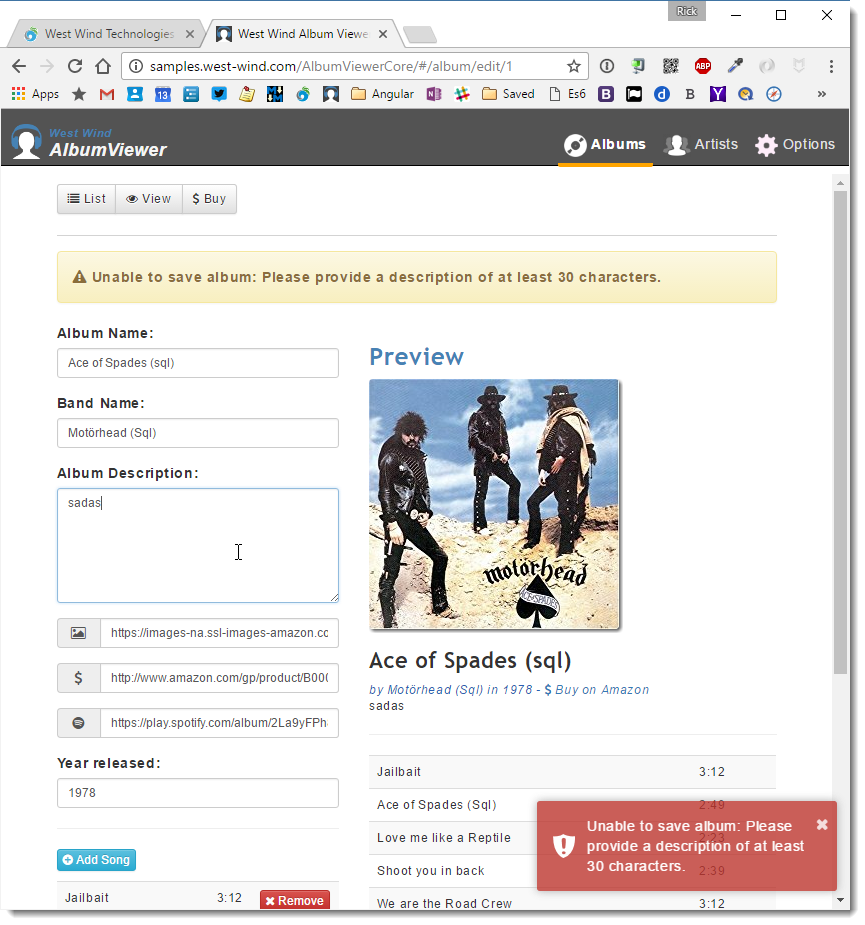

# Error Handling and ExceptionFilter Dependency Injection for ASP.NET Core APIs


While working on my ASP.NET Core API and Angular 2.0 [AlbumViewer sample](https://github.com/RickStrahl/AlbumViewerVNext), one last thing I need to round out the feature set is to make sure that consistent error results are returned to the client. Unhandled errors should also be logged to disk for later reference.

ASP.NET Core does not provide a consistent error response for API errors out of the box. In fact, an error in an API results in the same error result as any other type controller result - an HTML error page (which you can configure) or nothing at all if you don't hook up any error handling middleware. For API's this is generally useless - a client application expecting a JSON result is not going to be able to do anything useful with an HTML error page, so some extra work implementing an **ExceptionFilter** is required. Actually there are a several ways you can implement error handling but ExceptionFilters are amongst the easiest and most flexible to implement. Other alternatives might include custom middleware but I won't cover that in this post.

ASP.NET Core also does not include a built-in file logging service so I have to rely on the excellent 3rd Party [Serilog library](https://github.com/serilog) to provide file logging for me. Additionally getting a logging dependency into a filter via Dependency Injection requires a little extra work. 

In this post I describe how to create an **ExceptionFilter** to create consistent API error responses and use a **Dependency Injected logging provider**. In the process I'll talk a bit about error handling in my API implementation.

### API Error Handling - A Use Case for an ExceptionFilter
In my AlbumViewer API I capture all errors using an MVC **ExceptionFilter**. As you might remember from previous posts, in ASP.NET Core MVC and APIs share a common processing pipeline so any filters you create can be used by both MVC and API controllers. In this case the controller will be specific to API results.

Inside of my API code any unhandled Exception should trigger the ExceptionFilter, which then captures the exception and in response returns a JSON error response in the form of a standard error object. The idea is that **any error** I can possibly intercept will be returned as a JSON response so that the client can provide some meaningful error information. The object returned always has a `.message` property that can that can **potentially** be used to display error information in a front end. 

To start with, here is my initial error filter implementation without any logging:

```cs
public class ApiExceptionFilter : ExceptionFilterAttribute
{
    public override void OnException(ExceptionContext context)
    {
        ApiError apiError = null;
        if (context.Exception is ApiException)
        {
            // handle explicit 'known' API errors
            var ex = context.Exception as ApiException;
            context.Exception = null;
            apiError = new ApiError(ex.Message);
            apiError.errors = ex.Errors;

            context.HttpContext.Response.StatusCode = ex.StatusCode;
        }
        else if (context.Exception is UnauthorizedAccessException)
        {
            apiError = new ApiError("Unauthorized Access");
            context.HttpContext.Response.StatusCode = 401;
            
            // handle logging here
        }
        else
        {
            // Unhandled errors
            #if !DEBUG
                var msg = "An unhandled error occurred.";                
                string stack = null;
            #else
                var msg = context.Exception.GetBaseException().Message;
                string stack = context.Exception.StackTrace;
            #endif

            apiError = new ApiError(msg);
            apiError.detail = stack;

            context.HttpContext.Response.StatusCode = 500;

            // handle logging here
        }

        // always return a JSON result
        context.Result = new JsonResult(apiError);

        base.OnException(context);
    }
}
```

The exception filter differentiates between several different exception types. First it looks at a custom `ApiException` type, which is a special application generated Exception that can be used to send user acceptable error messages to the client. I use these in my controllers for handled errors that I want to use to display in the front end. Typically these are validation errors, or known failures like a login failure.

Next are unauthorized execptions which are handled specially by returning a forced 401 exception which can be used on the client to force authentication. The client can check for 401 errors and redirect to the login page. Note that `ApiError` results can also generate 401 responses (such as on a login error for example).

##AD##

Finally there are unhandled exceptions - these are unexpected failures that the application doesn't explicitly know about. This could be a hardware failure, a null reference exception, an unexpected parsing error or - horror of horrors - a good old developer introduced bug. Basically anything that's - unhandled. These errors generate a generic error message in production so that no sensitive data is returned. Or at debug time it can optionally return the error message and stack trace to provide debugging information. 

In all the use cases the exception filter returns an API error object as a response:

```cs
context.Result = new JsonResult(apiError);
base.OnException(context);
```

which triggers the custom response that **always** ensures an object result with a `.message` property to the client.

> #### @icon-info-circle Displaying Default Error Results
> As an alternative - if you want to see the developer error page on unhandled exceptions - you can also exit without setting the `context.Result` value which triggers whatever the default error behavior was. If you want the default behavior for one or another of the use cases just return. For example for unhandled exceptions I could do:  
>```csharp
>context.HttpContext.Response.StatusCode = 500;
>#if DEBUG
>return  // early exit - result not set
>#ENDIF
>```

Note that the filter implementation uses a couple support types:

* **ApiException**  
A custom exception that used to throw explicit, application generated errors that can be funnelled back into the UI and used there. These typically are used for validation errors or common operations that can have known negative responses such as a failed login attempt. The idea is that this error is used to return a well defined error message that is safe to be used on the client.

* **ApiError**  
A custom serialization type used to return the error information via JSON to the client. Exceptions are not good for serialization because of the sensitive data and complex structure, so a simpler type is needed for serialization. The key property is `.message` that contains a message that is always set - even if it is a non-descript message in the case of unhandled exception. The type also has a `.detail` property that can contain additional information and a collection of `.errors` that can return a set of errors such as a list of validation errors to the client. 

The two classes are implemented like this:

```cs
public class ApiException : Exception
{
    public int StatusCode { get; set; }

    public ValidationErrorCollection Errors { get; set; }

    public ApiException(string message, 
                        int statusCode = 500, 
                        ValidationErrorCollection errors = null) :
        base(message)
    {
        StatusCode = statusCode;
        Errors = errors;
    }
    public ApiException(Exception ex, int statusCode = 500) : base(ex.Message)
    {
        StatusCode = statusCode;
    }
}

public class ApiError
{
    public string message { get; set; }
    public bool isError { get; set; }
    public string detail { get; set; }
    public ValidationErrorCollection errors { get; set; }

	public ApiError(string message)
    {
        this.message = message;
        isError = true;
    }

    public ApiError(ModelStateDictionary modelState)
    {
        this.isError = true;
        if (modelState != null && modelState.Any(m => m.Value.Errors.Count > 0))
        {
            message = "Please correct the specified errors and try again.";
            //errors = modelState.SelectMany(m => m.Value.Errors).ToDictionary(m => m.Key, m=> m.ErrorMessage);
            //errors = modelState.SelectMany(m => m.Value.Errors.Select( me => new KeyValuePair<string,string>( m.Key,me.ErrorMessage) ));
            //errors = modelState.SelectMany(m => m.Value.Errors.Select(me => new ModelError { FieldName = m.Key, ErrorMessage = me.ErrorMessage }));
        }
    }
}
```    

### Using the Exception Filter
To use the Exception Filter I can now simply attach it to my controllers like this:

```cs
[ApiExceptionFilter]
[EnableCors("CorsPolicy")]
public class AlbumViewerApiController : Controller
```

Or you can globally add it like this:

```cs
services.AddMvc(options =>
{
    options.Filters.Add(new ApiExceptionFilter());
})
```

We can now try this out in a controller method like this for simulating an unhandled exception:

```cs
[HttpGet]
[Route("api/throw")]
public object Throw()
{
    throw new InvalidOperationException("This is an unhandled exception");
}
```

and we should end up with a result like this when in debug mode:

```json
{
    message: "This is an unhandled exception",
    isError: true,
    detail: " at AlbumViewerAspNetCore.AlbumViewerApiController.Throw() in
    C:\...\AlbumViewerApiController.cs:line 53 at
    Microsoft.AspNetCore.Mvc.Internal.ControllerActionInvoker.
              <InvokeActionFilterAsync>d__28.MoveNext()",
    errors: null
}
```

and like this in non-debug mode:

```json
{
    message: "An unhandled error occurred.",
    isError: true,
    detail: null,
    errors: null
}
```

##AD##

### Consistent Errors on the Client
A client application can now make some assumptions around the error it receives. For example in my Angular 2.0 client application I use a custom **response error parser** that explicitly checks for objects with a message property and if it finds one uses it or else creates one as part of the Observable `http` call:

```typescript
parseObservableResponseError(response) {
    if (response.hasOwnProperty("message"))
      return Observable.throw(response);
    if (response.hasOwnProperty("Message")) {
      response.message = response.Message;
      return Observable.throw(response);
    }
    
    // always create an error object
    let err = new ErrorInfo();
    err.response = response;
    err.message = response.statusText;
    
    try {
      let data = response.json();
      if (data && data.message)
        err.message = data.message;
    }
    catch(ex) { }
    
    if (!err.message)
      err.message = "Unknown server failure.";
    
    return Observable.throw(err);
}
```

I can then generically parse all API exceptions like inside of the **service** that calls the server API using the Angular `Http` service:

```typescript
// service method
saveAlbum(album) {
    return this.http.post(this.config.urls.url("album"),
                          album)
    .map( response => {
      this.album = response.json();
      return this.album;
    })
    .catch( new ErrorInfo().parseObservableResponseError );
}
```  

The service is then called from a component like this:

```
// component method
saveAlbum(album) {
    return this.albumService.saveAlbum(album)
      .subscribe((album: Album) => {
          this.error.info("Album saved.");
        },
        err => {
          // display the error in error component
          this.error
              .error(`Unable to save album: ${err.message}`);
        });
};
```

In the UI this looks something like this then:



This makes the client side error handling very clean as I never have to figure out what format the error is in. The server returns errors with a `.message` property and the client error parser automatically tries to parse any errors that don't already have an error object into an error object, so that the UI code **always** is guaranteed a consistent object. 

This makes error handling in API calls very easy following a very simple passthrough pattern where the expectation is that everything has a `.message` property (plus some optional additional information).

### Adding Logging with Serilog
Back on the server we now have error handling, but now I also want to log my errors to disk.

If you look back at the initial filter code I left a couple of comment *holes* for logging. 

When unhandled exceptions occur I would like to log those errors to the configured log provider. Personally I prefer file logs, but ASP.NET Core doesn't include support for a built-in file log provider (it's coming in future versions). For now I'm going to use [Serilog](https://serilog.net/), which is an excellent third party log package with tons of integration options including a [rolling file sink](https://serilog.net/). I'll use it to write logs that roll over to a new file daily.

To set this up I'm going to add a couple of Serilog packages and add some additional ASP.NET Logging packages in `project.json`:

```json
"dependencies": {
    ...
    "Microsoft.Extensions.Logging": "1.0.0",
    "Microsoft.Extensions.Logging.Filter": "1.0.0",
    "Microsoft.Extensions.Logging.Console": "1.0.0",
    "Microsoft.Extensions.Logging.Debug": "1.0.0",
    
    "Serilog.Extensions.Logging": "1.2.0",
    "Serilog.Sinks.RollingFile": "3.1.0"
}
```

Next I need to configure logging in the `Startup.Configure()` method:

```cs
// Serilog configuration
Log.Logger = new LoggerConfiguration()
        .WriteTo.RollingFile(pathFormat: "logs\\log-{Date}.log")
        .CreateLogger();

if (env.IsDevelopment())
{
    // ASP.NET Log Config
    loggerFactory.WithFilter(new FilterLoggerSettings
        {
            {"Trace",LogLevel.Trace },
            {"Default", LogLevel.Trace},
            {"Microsoft", LogLevel.Warning}, 
            {"System", LogLevel.Warning}
        })
        .AddConsole()
        .AddSerilog();

    app.UseDeveloperExceptionPage();             
}
else
{
    loggerFactory.WithFilter(new FilterLoggerSettings
        {
            {"Trace",LogLevel.Trace },
            {"Default", LogLevel.Trace},
            {"Microsoft", LogLevel.Warning}, 
            {"System", LogLevel.Warning}
        })
        .AddSerilog();
        
    // ...
}
```

Serilog requires some configuration and the first line above configures the default logger.

### Use the Serilog Singleton?
Serilog actually works as a Singleton, so in theory you could just use `Logger.Log` directly to log to file. Once configured you can simply do something like this:

```csharp
Log.Logger.Information("Applicaton Started");
...
Log.Logger.Information(ex,"Failed sending message data to server.");
```

However, using this approach you bypass any other providers hooked up to the ASP.NET logging pipeline. In this case my application also logs to the Console in debug mode, and I also want to log warnings and errors that ASP.NET generates internally. If I want all of this to go to Serilog's output I have to run through the ASP.NET Logging pipeline which requires that I use configuration through Dependency Injection.

### Injecting the Logger into the Exception Filter
In order to use the logger in my Exception filter I have to first allow it to be injected into the constructor:

```cs
public class ApiExceptionFilter : ExceptionFilterAttribute
{
    private ILogger<ApiExceptionFilter> _Logger;

    public ApiExceptionFilter(ILogger<ApiExceptionFilter> logger)
    {
        _Logger = logger;
    }

    // ...
}
```

I can then add following for the Unhandled Exception handler without:

```cs
_Logger.LogError(new EventId(0), context.Exception, msg);
```

But we're not quite there yet. The standard filter attribute doesn't support dependency injecttion. Once you add dependencies a different approach is required:

* Use the `[ServiceFilter]` Attribute
* Add the filter to the Injection list

Let's change the filter declaration on the controller to:

```cs
[ServiceFilter(typeof(ApiExceptionFilter))]
public class AlbumViewerApiController : Controller
```

In addition I need to declare the `ApiExceptionFilter` as a dependency in the DI configuration in the `ConfigureServices()` method of `Startup.cs`:

```cs
services.AddScoped<ApiExceptionFilter>();
```

And voila - now our logging should work with the injected ASP.NET Logger and I can do:

```csharp
_Logger.LogWarning($"Application thrown error: {ex.Message}", ex);
_Logger.LogWarning("Unauthorized Access in Controller Filter.");
_Logger.LogError(new EventId(0), context.Exception, msg);        
```

Which produces output like the following (for the last item which is the unhandled exception):

```
2016-10-14 18:58:43.109 -10:00 [Error] This is an unhandled exception
System.InvalidOperationException: This is an unhandled exception
   at AlbumViewerAspNetCore.AlbumViewerApiController.Throw() in 
   C:\...\AlbumViewerApiController.cs:line 53
   at Microsoft.AspNetCore.Mvc.Internal.ControllerActionInvoker
                .<InvokeActionFilterAsync>d__28.MoveNext()
```

Yay!

##AD##

### Dependency Injection - not always easier
If you're new to Dependency Injection you probably think that the DI implementation here adds a ton of ceremony around what should be a really simple task. I agree. Having to register a filter and then explicitly using a special attribute syntax to get the injection to work seems like a huge pain in the ass. Especially since it seems that DI could automatically be handled by the standard Filter implemenation. I'm not sure why that doesn't *just* work, but my guess it's for performance as DI does add some overhead.

FWIW, Serilog supports a static Singleton logger instance that you can use and bypass all of the ceremony. If you **just** want to log your own errors and don't care about the rest of ASP.NET's logging features, then you can skip dependency injection entirely and just use the Serilog's Singleton directly:

```csharp
Log.Logger.Error(context.Exception, "An unhandled error occurred. Error has been logged.");
```

which produces the following in the log file:

```
2016-10-15 11:02:09.207 -10:00 [Error] An unhandled error occurred. Error has been logged.
System.InvalidOperationException: This is an unhandled exception
   at AlbumViewerAspNetCore.AlbumViewerApiController.Throw() in
   C:\projects2010\AlbumViewerVNext\src\AlbumViewerNetCore\Controllers\AlbumViewerApiController.cs:line 53
   at Microsoft.AspNetCore.Mvc.Internal.ControllerActionInvoker.<InvokeActionFilterAsync>d__28.MoveNext()
```

Clearly this is a much simpler approach, but you lose the ability to also log to other log providers configured in ASP.NET. In short you have options - you can do things the 'recommended' way or choose a simpler route if that works for you. Choice is good. 

### Alternatives
Creating an exception filter to handle unhandled exceptions is one way to handle errors. It's a reasonably reusable approach - you can create an easily reusable implmentation of a filter that can easily be applied to many APIs and applications.

Another approach could be to create custom middleware that automatically scans for API requests (ie. requests that `Accept: application/json` or `text/xml` perhaps) and handle errors as part of the middleware pipeline. The implementation of such middleware would be conceptually similar, but with the added bonus of having a more common configuration point in the ASP.NET Core configuration pipeline (via `ConfigureServices` and `Configure` methods in `Startup.cs`).

However, personally I feel that using a filter is actually a better choice as in most application exception handling tends to be more 'personal' in that you end up configuring your error logging and perhaps also the error response logic. Using a simple baseline to inherit from or even just re-implment seems more effective than trying to have a do-everything piece of middleware with cryptic configuration switches. 

If there's interest in this we can explore that in a future post - leave a comment if that's of interest to you. For now I feel that an API filter that you can apply to specific controllers offers more control.

### Summary
Exception handling in API application's is rather important as errors - both handled and unhandled - need to be passed to the client in some way to let it know that something went wrong. By having a consistent error format for **all** errors the client can use a common approach to handle errors - you don't want the client to receive HTML error pages that it won't be able to do anything useful with.

The best way to handle this in your ASP.NET Core API is to create an ExceptionFilter that intercepts all exceptions and then returns an error object in a common format. You'll also want to make sure you capture the error information and log it, and to make sure you differentiate between 'known' errors and unhandled errors, in order to not return sensitive data back to the client.

I've been using this approach forever for services, even in pre-JSON days and it works well. It's almost silly that this isn't a built-in feature of the API implementation in ASP.NET core. Since content-negotiation is a thing, why shouldn't error results in those same content negotiated formats also be automatic? But using MVC/API Exception Filters are pretty easy to implement so it's not difficult to create the behavior you want on your own. Either way there's no reason not to return consistent error information for your APIs.


### Resources

* [Album Viewer Sample](https://github.com/RickStrahl/AlbumViewerVNext)
     * [Startup Code](https://github.com/RickStrahl/AlbumViewerVNext/blob/master/src/AlbumViewerNetCore/Startup.cs)
     * [Exception Filter](https://github.com/RickStrahl/AlbumViewerVNext/blob/master/src/AlbumViewerNetCore/_Code/ApiExceptionFilter.cs)
* [Serilog](https://serilog.net/)
* [ASP.NET Core Logging](https://docs.asp.net/en/latest/fundamentals/logging.html)
* [ASP.NET Core Error Handling](https://docs.asp.net/en/latest/fundamentals/error-handling.html)


<small style="font-size: 7pt">
Image Copyright: <a href='http://www.123rf.com/profile_aruba2000'>aruba2000 / 123RF Stock Photo</a><br/>   
Post created with <a href="http://markdownmonster.west-wind.com">Markdown Monster</a>
</small>

<!-- Post Configuration -->
<!--
```xml
<blogpost>
<abstract>
Exception handling in API applications is important as errors - both handled and unhandled - need to be passed to clients in some way to let them display error information. ASP.NET's default error handling doesn't provide for object error results by default, but you can use an ExceptionFilter to intercept exceptions and format them yourself. In this post I look at how to create an API exception filter to create error object responses, and hook up custom logging of those errors to disk.
</abstract>
<categories>
ASP.NET Core,Angular
</categories>
<keywords>
ASP.NET Core,Error Handling,Dependency Injection,ExceptionFilter,MVC,Filter,API,ServiceFilter,FilterAttribute,Angular
</keywords>
<weblogs>
<postid>40310</postid>
<weblog>
Rick Strahl's Weblog
</weblog>
</weblogs>
</blogpost>
```
-->
<!-- End Post Configuration -->
