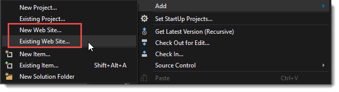
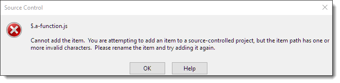
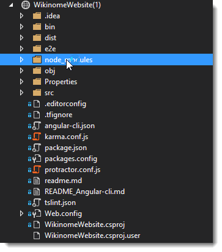
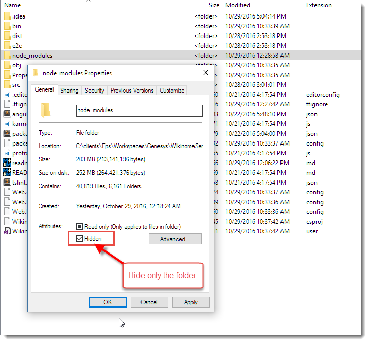
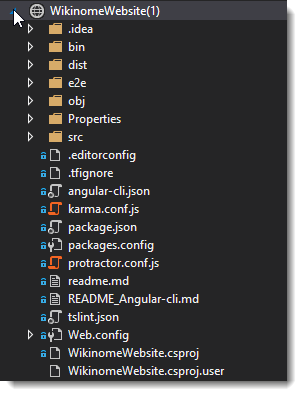

# Excluding the node_modules Folder in Visual Studio WebSite Projects


If you're working on a client side project that includes an NPM folder with a large number of dependencies and you're using a WebSite Project in Visual Studio, you've probably found that this is a terrible combination out of the box. It results in very slow load times and/or file load errors.

### What's the problem?
WebSite Projects (WSP) are a pure file representation on disk, so they show you **all files**, including the crazy large number of files in the `node_modules` folder which isn't excluded by default.

WebSite Projects are created and mapped to a folder:



The problem is that WSPs don't have a project file. There's no file mapping, which is one of the primary reasons why it seems like a good idea for client side projects in the first place; nobody wants to maintain and add files manually to a project when managing files externally.

The downside is that you have **no control** over what gets pulled into the project. There is absolutely **no configuration** in Web site projects. This affects both the files you see in the 'project' as well as for publishing, although for publishing there is at least some control via a `*.pubxml` file where you **can** exclude files and folders from publishing. Unfortunately that's not true for the file content of the 'project'.

In short if you have a massive `node_modules` folder that folder shows in the project. There's no official, built-in way to limit files or folders - which seems rather silly given that this is such a common use case and we're easily 5 years in from when NPM became a common Web development 'thing'.

##AD##

### Why WebSite Projects?
For most ASP.NET applications I actually use **Web Applications** which are functionally opposite to WSP - you have all the control over files in a project so much so that you have to explicitly add every single one. For applications that include .NET code Applications that makes good sense. As it does when you actually work entirely in Visual Studio for your client side project where you manage all files through the IDE. 

But Web Applications fall apart when files are not added and maintained through Visual Studio.

I use WebSite Projects only for static content sites (main site, product sites), or as is the case now when working for a client who insists that the project I'm working on with other tools shows up in Visual Studio and uses the same source control access.

I'm working work on an Angular 2 project, and although I don't actually edit the Web code in Visual Studio - I'm using [WebStorm ](https://www.jetbrains.com/webstorm/) - due to requirements and the TFS source control in use, the Web site needs to be part of the larger Visual Studio Solution. The Web site is pure client side code, with the API and service projects that the Angular app calls living in completely separate projects. Since I'm modifying files external to Visual Studio a WebSite Project seems like the only reasonable choice.

### WebSite Projects Experience
When I created the WebSite Project and added it into the  larger Visual Studio  solution, I found out quickly how terrible the support for client projects is in that configuration.

I ran into two major issues:

* Extremely slow load time as VS parses through 20,000 NPM files
* TFS Errors due to funky filenames (files starting with `$.`)

Initial load of the project took about 5 minutes while Visual Studio **white screened** and only eventually returned. When it came back I got a ton of TFS errors for `$.` files - about 100 of them that I had to CR through.



It's quite remarkable that Microsoft hasn't addressed such a common scenario. Eventually I end up with the node_modules folder in the project.



But - refreshing the folder, or re-opening the solution goes right back to the slow load time and then those very same errors. Seriously???

### Solution: Make `node_modules` Hidden
The solution to provide a reasonable experience is to mark the `node_modules` folder as a **hidden folder**. This effectively hides the folder from Visual Studio and it ignores it in the Solution Explorer.



You can set the hidden attribute on the folder only - no need to set it on all the child items. NPM continues to work with the hidden folder, so there appears to be no ill effect for actual package access.

Once I did this the `node_modules` folder is no longer included in the project and load times are fast:



Yay!

For source control and TFS, I also had to add a `.tfignore` with:

```
\node_modules
```

to ensure that source control also ignores the folder - it doesn't seem to mind the **hidden** folder and otherwise would still try to add it. Hiding the folder also prevents Web Deploy from publishing the files.

So, if you must use WebSite Projects, hiding the `node_modules` folder is the way to go.

I can't take credit for this - I found this as part of a few [StackOverFlow posts](http://stackoverflow.com/questions/32791684/exclude-ignore-a-folder-in-visual-studio-2015-web-project) - but the solution is not clearly identified or searchable, so hopefully this post will make that a little easier to find.

##AD##

### Looking Forward: Visual Studio 15 (VS2017?)
The next version of Visual Studio - version 15 apparently will introduce a new Web project model that's supposed to be a hybrid between Web Applications and WebSite projects. 

There is a project file, but files by default add without explicit adding using an exclusion template. This seems like a pretty obvious solution - shame it took well over 10 years for Visual Studio to figure that one out especially since just about any other Web development tool operates that way.

I haven't played with Visual Studio 15 yet, but I really hope this will be a workable scenario going forward. Visual Studio really needs to have an easier way to deal with free form file based sites.


<!-- Post Configuration -->
<!--
```xml
<blogpost>
<abstract>
If you're working on a client side project that includes an NPM folder with a large number of dependencies and you're using a WebSite Project in Visual Studio, you've probably found that this is a terrible combination out of the box. In this post I describe why this is a problem and how you can work around it with a simple hack.
</abstract>
<categories>
ASP.NET,Visual Studio
</categories>
<keywords>
node_modules,WebSite Projects,ASP.NET
</keywords>
<weblogs>
<postid>52001</postid>
<weblog>
Rick Strahl's Weblog
</weblog>
</weblogs>
</blogpost>
```
-->
<!-- End Post Configuration -->
