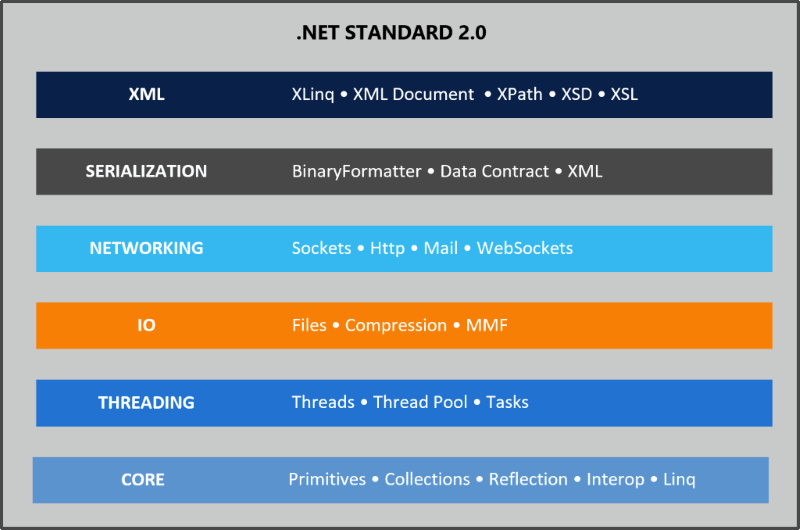
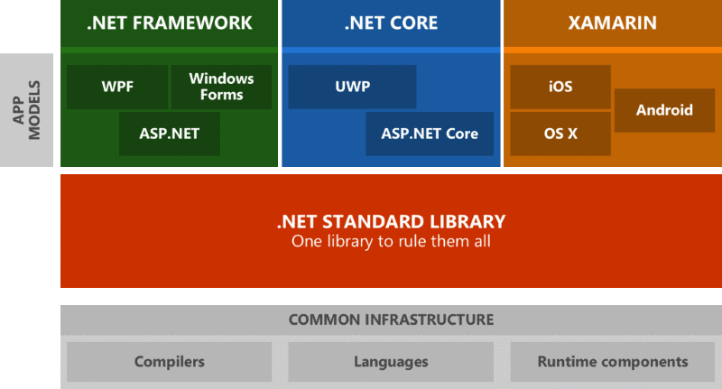
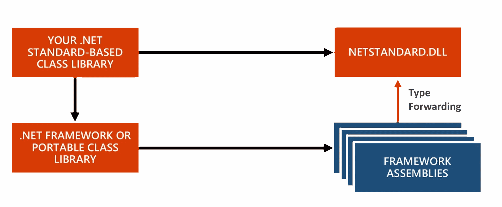
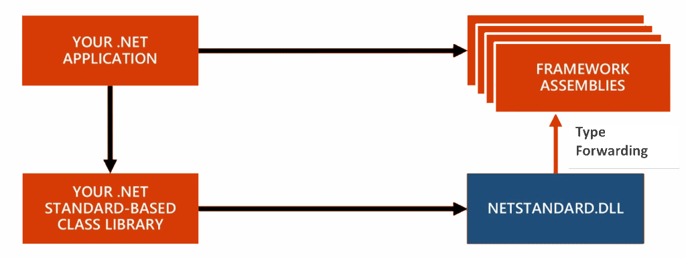

---
title: .NET Standard 2.0 - Making Sense of .NET Again
featuredImageUrl: https://weblog.west-wind.com/images/2016/.NET%20Standard%202.0%20-%20Making%20Sense%20of%20.NET%20Again/PuzzlePieces.jpg
abstract: It's taken awhile but it seems Microsoft is finally nailing the message for .NET going forward and .NET Standard with its common API specification is a huge part in making sure that the same base library of .NET is available on all .NET platforms. In this post I look at what .NET Standard is, how it works and what some of the surrounding issues and impacts are for the .NET Eco system.
keywords: .NET Standard,.NET Core,Cross Platform,BCL,FCL,PCL,2.0,ASP.NET,C#,CSharp
categories: .NET,ASP.NET Core,.NET Core
weblogName: West Wind Web Log
postId: 71760
---
# .NET Standard 2.0 - Making Sense of .NET Again

At last week's .NET Connect event and two-weeks ago at the MVP Summit we got to hear about Microsoft's vision for .NET going forward. A lot of people - myself included - in recent years have wondered what the future of .NET is.

A key component in this process is **.NET Standard**...

It's taken Microsoft a few years of floundering and unclear messaging about the future of .NET, but it seems Microsoft is finally nailing the message for .NET going forward and **.NET Standard**, with its common API specification, is a huge part in making sure that the same base library functionality of .NET is available on **all .NET platforms** in the future.

In this post I look at what .NET Standard is, how it works and what some of the surrounding issues, impacts and benefits are for the .NET Eco system.

### What is .NET Standard?
Here's my definition of what .NET Standard is:

> #### @icon-info-circle .NET Standard is a specification, not an implementation
> .NET Standard describes what a specific implementation like .NET Core, Mono, Xamarin or .NET 4.6 has to implement - at minimum - in terms of API surface in order to be compliant with a given version of .NET Standard.

The actual implementations of today's shipped .NET Standard 1.6 are **.NET Core**, the **full .NET Framework** and **Mono**. The current version of the standard is **.NET Standard 1.6** which shipped when .NET Core 1.0 was released. Implementations can implement additional features beyond .NET Standard in their base libraries but at minimum each implementation **has to** implement the standard APIs of the Standard even if specific APIs end up with **NotSupportedExceptions**.

### .NET Core as a Reference Implementation
As you might expect the API surface of .NET Standard 1.6 coincides pretty closely with the API surface of .NET Core 1.0.x and I expect that .NET Core 1.2 (or whatever the next version will be named) is likely to match very closely to what .NET Standard 2.0 specifies. In that sense it's almost like .NET Core is the reference implementation for .NET Standard at the moment. That may change in the future, but for now that's certainly holding true.

Since .NET Standard is based on full framework APIs, full framework is pretty much compatible with .NET Standard without changes, although there are a few small variations that are addressed by small update releases in .NET 4.6.1 and 4.6.2 etc.

##AD##

### .NET Standard corresponds to the BCL
If you're looking at .NET Standard in terms of the full version of .NET you've used for the last 15+ years, you can think of .NET Standard roughly representing the feature set of the BCL. This is the core .NET library of what used to live exclusively in **mscorlib.dll** and the various **system** dlls.

This roughly corresponds to the core .NET Base Class Library (BCL) and includes the basic type system, the runtime loading and querying operations, network and file IO, and some additional APIs like System.Data. With .NET going cross platform it's important to know that this subset has to be platform agnostic and not expect to run on any specific Operating System.

Here's a rough idea of what you can expect to see in .NET Standard 2.0:

The BCL always has been about core operating system, runtime  and language services, so this OS agnostic requirement shouldn't be a huge issue. Much of the porting work that goes into moving full framework libraries to .NET Core deals with making sure that functionality works across platforms. There are lots of small issues that can trip up things like the difference in path separators between Operating Systems and the way that operating system services like threads/processes are implemented on various platforms.

### Application Frameworks are not part of .NET Standard
The key thing to remember is that if you compare the full .NET Framework to what will be in .NET Standard **you are only getting what is in the BCL**, not what we know as the Framework Class Library (FCL). Full framework as we know it today has additional features piled on top with the FCL Libraries that sit on top of the BCL. Frameworks in this case are application platforms like ASP.NET (System.Web and OWin based), WinForms, WPF, WCF etc. For .NET Core ASP.NET 5 is an Application Framework that lives ontop of .NET Standard. These libraries **are not part of .NET Standard**, but they are implemented on top of it. 

### .NET Standard Versions
The current shipped version of .NET Standard is 1.6 and it roughly coincides with the feature set of .NET Core 1.0/1.1. The feature set in this version is fairly limited and significantly less featured than the full version of .NET and that has caused a lot grumbling in the community. Some of the missing APIs seem really arbitrary often removing overloads or extended features that just end up creating refactoring or code bracketing work.

Because many APIs and features are missing, it's been difficult to port existing libraries to .NET Core/.NET Standard as many basic features are missing. While the missing APIs can often be worked around, it's a not a trivial task to hunt down all the missing APIs in a large applications and adjust code using code bracketing (#if/#else blocks) to potentially run both in .NET Standard and full Framework applications.

Worse - knowing that .NET Standard 2.0 is on the horizon, it's very likely that those workarounds and adjustments won't be necessary in the future, so it's hard to justify putting in the effort to port now. It's no surprise that many library authors - including myself - are holding off and waiting for more API surface to port libraries to .NET Standard/.NET Core.

.NET Standard 2.0 more than doubles the API surface over v1.6, and some major missing or severely decimated APIs like Reflection and System.Data get back their original mojo. According to Microsoft's numbers .NET Standard provides a 149% increase in API surface over .NET Standard 1.6 and climbing which is **quite significant**! Life will be much easier.

In the end the goal is this:

> #### Uniting .NET Implementations
> .NET Standard provides a common base .NET Interface to all platforms that implement it so that no matter which version of .NET you use you'll always see at least the same base feature set.

and you should be able to use the same .NET Standard interface on any of these .NET platforms:

### What about PCLs?
.NET Portable Class Libraries (PCL) had a similar goal as .NET Standard but approached this problem from a different angle. Where .NET Standard uses a fixed set up APIs to describe what comprises a .NET Standard Compliant implementation, PCLs used a union of all the common APIs that included platforms support. When building a PCL you 'check off' the platforms you want to compile the PCL for and the compiler figures out the common APIs that are supported. Effectively, the more platforms you support with a PCL the less API surface there is as each platform actually takes away features.

.NET Standard is different. It's a fixed specification - there are a set number of APIs that **have to be supported** by the implementation, so nothing is taken away by adding platforms. You may see unimplemented APIs (NotSupportedException) in rare cases, but the API will be there. 

This is a much better approach by far: Rather than removing non-universal APIs to shrink the common API surface, the API surface stays the same. On any given platform you can then selectively disable support for features that are not implement, but other platforms that do support it can use it fine. This makes the compiler happy as it sees the same API surface on all platforms and gives the control to you as the developer to decide what features of the API you call - or don't call on specific platforms.

.NET Standard gives developers a common .NET baseline that they can expect to use **regardless which platform they write for**.

### Under the covers
So what is .NET Standard and how does that even work? 

The idea is that each platform implements its specific version of APIs in the .NET Standard and then exposes a .NET Standard DLL that acts as a type forwarder. Applications directly reference only this .NET Standard DLL for each platform for BCL features, which then forwards the actual type resolutions to the actual corresponding assemblies that contain the underlying implementation. 

[Type forwarding](https://msdn.microsoft.com/en-us/library/ms404275(v=vs.110).aspx) works via `[TypeForwardedTo]` attribute that allows mapping a type in a source assembly to a type in another assembly. Essentially this allows .NET Standard to create interface only assemblies that forward all of their types to the underlying system assemblies used or vice versa. What's nice about this is that this process is transparent and that a project can just reference the single .NET Standard Assembly that contains all the required type information, and all the details of actual assembly bindings are handled for you behind the scenes. The compiler and tooling knows which actual assemblies to reference. 

There are two scenarios here:

* **DotnetStandard application that references non framework assemblies**:  

* **Non Dotnet Standard referencing DotnetStandard assemblies**:  

<small>*images taken from [Immo Landwirth's video](https://www.youtube.com/watch?v=vg6nR7hS2lI&feature=youtu.be)*</small>

The reason for the two different scenarios is that both netstandard.dll and mcorlib.dll (or other system.xxx.dll's) include the same types and you can only use one of them in a given application. So a dotnet standard based assembly needs type forwarding whenever an assembly references mscorlib.dll et al. so that only the dotnetstandard types are used. Vice versa, if you build say a full framework assembly, and call a component that references netstandard.dll, it will type forward the netstandard types to mscorlib/system dlls.  So depending on the type of assembly/application you build the type forwarder uses a specific direction for forwarding.

If you want more detailed information on how this works check out this short and concise [video from Immo Landwirth](https://www.youtube.com/watch?v=vg6nR7hS2lI&feature=youtu.be).

This removes the mess of packages/assemblies required to even get a very basic Console application up and running in .NET Core for example. Instead of having to reference 50 packages for a Hello World application as you had to before, you can simply reference .NET Standard and the tooling deals with referencing and packaging all the required dependencies at build time.

This doesn't sound much different than what we had with classic .NET where the runtimes were several monolithic DLLs, but there actually is a quite significant difference when it comes to the underlying implementation. For users the experience is similar to what we had in classic .NET where you can reference a single runtime package, but implementers get the option to separate out their underlying code into many more easily managed packages to distribute and maintain independently. 

This seems like a win-win situation with the simplicity we've come to know with working with .NET for developers using the framework, and the ability to build the framework in a more modular fashion for the framework designers.

Additionally in the future it may be possible to do some tree shaking on the actual code used by your application and compile a native or dynamic binary that truly uses only those pieces of the .NET framework that is actually covered by code. There are limitations to that especially when you throw the dynamic runtime and Reflection into the mix, but it's an interesting idea to think about and something that's already happening to some degree with Universal Windows Apps which can be compiled to native binaries from .NET code.

##AD##

### .CSPROJ - It's baaack!!!
Yup - the `.csproj` project format is coming back to .NET Core.

Along with the release of .NET Standard 2.0 Microsoft is planning on going back to a `.csproj` based project format for .NET Core projects. Current 1.0.x .NET Core projects are using the `project.json` format that was introduced with .NET Core 1.0. But that format - as it turns out - is to difficult to integrate in combination with the other existing .NET platforms where .NET Standard 2.0 runs. Keep in mind that .NET Standard will apply to full .NET framework, Xamarin and Mono to mention a few, and all those existing frameworks rely on .csproj to build their binaries.

As a result Microsoft is backing off the `project.json` **experiment** and going back to the more widely supported `.csproj` XML format, but not without making some fairly major and useful improvements. Before people start screaming about how nice `project.json` was - easier to read, easier to change, easier to generate - the move back to `.csproj` is going to bring some of the favorite features of `project.json` back to the .csproj format. 

The main feature is that .NET Core projects now can use raw folders rather than explicitly added files in the project, so rather than adding every file you can just exclude those files that you don't want as part of the project. This reduces some of the churn traditionally seen in .csproj files and reduces source code conflicts by reordering of references. Project references are also supposed to work directly out of the XML text so you get a similar experience for adding packages in code rather than using the NuGet Package Manager. Finally project GUIDs are planned to be removed removing hard dependencies and exchanging them for pure relative path dependencies instead.

### Lots left to do
It's clear that Microsoft still has a ways to go to get all of these pieces completed. As mentioned above .NET Core 1.2 (or whatever it will be called) is still under heavy development and changing rapidly and there's not even an official preview release at this point. You have to use the experimental/daily feeds to play with this.

.NET Core 1.1 and the new tooling both for the command line tools and the Visual Studio 2017 RC integration - even tough it's once again marked as RC tooling - is very rough and not anywhere near what you would have traditionally consider RC grade tools. 

### Visual Studio 2017 RC
Visual Studio 2017 RC contains a preview of the new `.csproj` based project system for .NET Core but frankly the tooling for .NET Core is a mess right now. It works to get a project to built initially but there are lots of issues in getting the project refs to update properly. This stuff is preview grade and Microsoft has said as much.

We've been in this state for a long time. Microsoft has been up front about this and the tooling does bear the **Preview** postfix, but man it's been over a year and still we dink around with the creaky and limited tooling that works only partially (both from the CLI and from VS). Currently you have to know way too much about the innards of the technology to be productive.

Keep in mind that if you migrate a project from `project.json` to the new `.csproj` format, it's a one way trip - you can't go back once you convert your project and you can't share your project with older versions of Visual Studio. It's possible that this will change, but so far there's no indication that .NET Core .csproj support will be backported into Visual Studio 2015.

Looks like the Visual Studio 2017 release will take us back to the bad old days of where a new version of Visual Studio is required to go along with a specific version of .NET development :-(

##AD##

### The Future of .NET
During the recent MVP summit I had a lot of discussions with developers and the mood I picked up is cautiously optimistic. There is a feeling that things are finally starting to turn around with .NET as a platform with a clear message of where the platform is heading. And it's taken a long time of fumbled messages to get here.
 
.NET Core is clearly where Microsoft is investing most of its effort right now. While it's taken a while, I think MS is proving that they are serious in making .NET the best platform it can be both in terms of performance (as the work on the [TechEmpower benchmarks show](https://www.techempower.com/blog/2016/02/24/performance-competition-is-a-good-thing/)) as well as combining it with the traditional developer friendly tooling that surrounds the platform. It's obviously not all there yet, but it's easy to see the direction that Microsoft is taking to make the platform as powerful as it can be.

And this approach seems to be working!

Microsoft's recent statistics show that .NET usage has been surging over the last couple of years since this open source journey started for them. Once .NET Core reaches its 1.2 status we can hope that even more people will take notice and consider .NET purely based on the merits and benefits it provides, overcoming the 'old Microsoft' prejudice that still rules entire developer communities.

On the other hand it's still an uphill battle. When I go to local JavaScript or generic Web related user groups or events, Microsoft technology isn't even a blip on the radar and in order for .NET to succeed in the long that will have to change. In these circles running server based applications on .NET or Windows (although that's no longer a requirement with .NET Core) is just not in the picture. About the only Microsoft tech I see used is <a href="https://code.visualstudio.com/?utm_expid=101350005-35.Eg8306GUR6SersZwpBjURQ.0&utm_referrer=https%3A%2F%2Fwww.google.com%2F" target="top">Visual Studio Code</a> which inadvertently may have turned into Microsoft's best marketing tool for brand awareness.

But if Microsoft can deliver on the promises they are making for the platform, there's a good chance that the platform will end up with a new Renaissance of developers based purely on the **benefits** it can provide in performance and tooling. The performance story is shaping up nicely. The tooling story is still one in the making and it's hard to say at this point whether it will provide significant benefits. Integrations like one step  Docker image creation, debugging and publishing are good first steps that provide clear benefits for developers, especially those new to these new technologies.

Only time will tell though.

Much depends on how well Microsoft can present its message to the world. The key is keeping the message  simple, keeping buzzwords out of it and focusing on the clear and present benefits .NET can offer in terms of performance and productivity. It's high time the marketing is focused at the hearts and minds of **developers* and not management!

As far as I'm concerned Microsoft is on the right path to make that happen - just don't expect it to happen overnight... it'll take time.

### Resources
* [.NET Standard Overview](https://github.com/dotnet/standard/blob/master/docs/netstandard-20/README.md)
* [.NET Standard Purpose](https://github.com/dotnet/standard/tree/master/docs/netstandard-20)
* [Immo Landwirth video explaining mechanics of .NET Standard Dll](https://www.youtube.com/watch?v=vg6nR7hS2lI&feature=youtu.be)

<small>

post created and published with <a href="https://markdownmonster.west-wind.com" target="top">Markdown Monster</a></small>