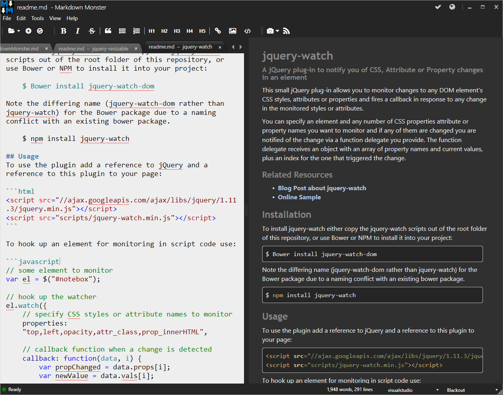
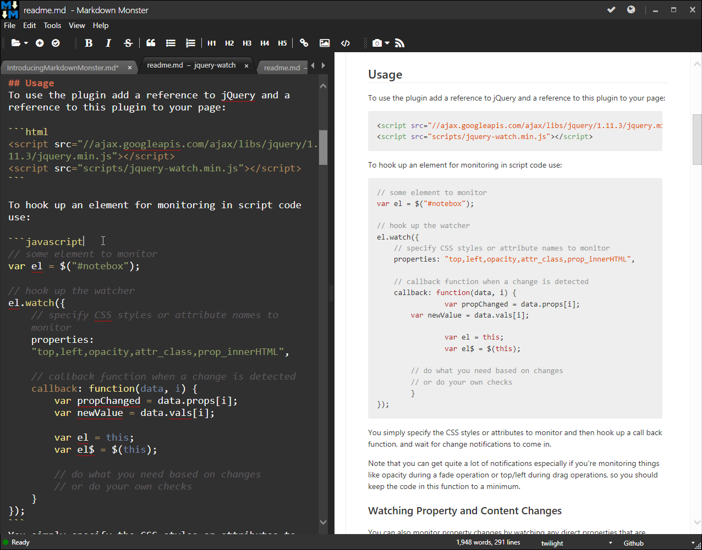
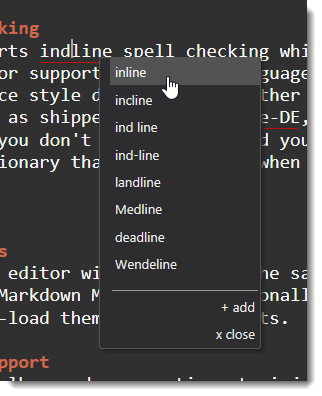
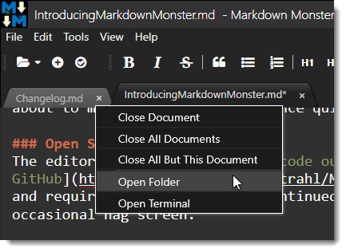

# Introducing Markdown Monster - a new Markdown Editor


I'm happy to announce that Markdown Monster 1.0 RTM is now available. Yay!

If you just want to check it out here are links for the download and more info:

* [Markdown Monster Site](https://Markdownmonster.west-wind.com)
* [Markdown Monster Download](https://Markdownmonster.west-wind.com/download.aspx)
* [Markdown Monster on Chocolatey](https://chocolatey.org/packages/MarkdownMonster)
* [Markdown Monster on GitHub](https://github.com/RickStrahl/MarkdownMonster)  

### Getting Started Video
A couple of weeks ago I created a [Getting Started video](https://www.youtube.com/watch?v=XjFf57Ap9VE) that goes over most of Markdown Monster's features. You can find it on YouTube:

<iframe width="870" height="482" src="https://www.youtube.com/embed/XjFf57Ap9VE" frameborder="0" allowfullscreen>
</iframe>

### What's Markdown Monster?
Markdown Monster is an easy to use and attractive Markdown Editor and Viewer as well as a Weblog Publishing tool. The editor sports syntax colored editing of Markdown text, inline spell checking, an optional live and themable HTML preview, easy embedding of screen shots, images and links, along with a few gentle toolbar helpers to facilitate embedding content into your markdown. The editor's goal is to let you focus on your content creation and not get in your way of your creativity.

There are many small features to make working with Markdown easier: You can import HTML into Markdown from files or the clipboard, export Markdown to HTML files on disk or the clipboard, and quickly access a document's folder in Explorer or a Windows Console Window.

You can also publish your Markdown directly to your Weblog if it supports WordPress or MetaWebLog endpoints. You can manage multiple blogs and even download existing posts as Markdown.

### Why another Markdown Editor
So you might ask, *Why another Markdown Editor?* After all there are several of them already out there and Markdown editing isn't exactly a sexy thing.

Markdown Monster provides all the features you'd expect from a Markdown editor:

* Syntax Colored Markdown Editing 
* Fast text editing using a code editor
* Live Markdown Preview
* Inline Spellchecking and Correction
* Minimal Toolbar/menu support 
* Fenced code blocks
* Github flavored Markdown
* Support for many advanced Markdown features (coutesy of [MarkDig](https://github.com/lunet-io/markdig))

but it also provides a number of additional features that I think are rather useful and important:

* Capturing and Embedding Screen Shots
* Quick embedding of Images and Links
* Easily customizable Preview Themes
* Themeable Editor
* HTML to Markdown conversion
* Built-in Weblog Publishing 
* Easy .NET Based Addin interface to allow extensions

### Extensibility
The last point of extensibility is important to me and a couple of Markdown Monster's key features - the Screen Capture and Weblog Publishing modules - are actually implemented as add-ins. The add-in extensibility allows you to create custom extensions that can hook into the editing and document life cycle so you can embed custom content into posts and perform custom tasks on the document. 

For example, I have a custom add-in that I use to download and publish inventory item information to my Web store using a custom API which makes product editing a lot easier than the online textbox typically used. Other ideas include a snippet manager for custom Markdown Snippets to inject or a Git commit plug-in that can quickly commit and push changes to a git repository, which is useful for Git based documentation or blog systems.

Whether people will take advantage of the [.NET Extensibility](http://markdownmonster.west-wind.com/docs/_4ne0rl1zf.htm) is another thing, but I know I already have and will continue to benefit from this extensibility and keep the core version of Markdown Monster relatively small.

### All Things Markdown
I use Markdown for a lot of things these days:

* Source Code Repositories 
* Documentation in my [Help Builder](https://helpbuilder.west-wind.com) tool
* On my [Support Message Board](https://support.west-wind.com)
* Creating Blog Posts
* General purpose Document editing
* Application integration for any Free Form text
* Support for maximum Markdown Features

In short Markdown for me is just about **everywhere**. It's amazing how quickly it has gone from being something I used for Git repo docs to becoming something I use in just about all aspects of development and daily work.

I started Markdown Monster off as a small pet project for myself a little over a half year ago when another editor I was using started failing. It quickly grew from there as I shared the initial editor with a few people I worked with and they started asking for a few additional features and it quickly grew more serious from there. I decided to make this tool something to be proud of and something that I would **love** to use, and for me at least that's been absolutely true. I practically live in the editor these days - mainly for documentation and blog editing.

A half a year later and a lot of effort later, I'm **really** happy that I went down this path because I ended up with (IMHO) much more usable editor than what I'd found before, and an editor that addresses many of the missing features that I - and most likely many of you - care about to make my editing experience quick and easy.

### Open Source, but licensed
Markdown Monster is open source with [code out in the open on GitHub](https://github.com/RickStrahl/MarkdownMonster), but the software itself is licensed and requires registration for continued use. The download is fully functional, except for the occasional nag screen. 

### A few Screenshots and Feature Overview
The best way to see Markdown Monster is just to try it out, but if you want to quickly get a feel for it here are a few screenshots and some commentary on features. 

### Main Editor
Here's what the main workarea of Markdown Monster looks like:


The main area is made of the edit area on the left, and the preview on the right. The preview is optional and can be collapsed using the *World* button at the of the window.

### Theming for Preview and Editor
Both the preview window and the editor can be themed using the two dropdowns on the status bar on the right. The default editor theme is the dark `twilight` theme and `Github` for the preview. Several other themes are available and you can easily create new themes that match your preferences. Preview theme customization can be very useful to match your site's styling especially when posting Weblog posts.

Here's the MM with the `visualstudio` editor theme and `blackout` preview theme:



### Syntax Colored Markdown and Code
The editor uses syntax colored highlighting for markdown text that highlights things like bold text, headers, lists, html and code in different colors than main body text. 

Certain types of code - HTML, JavaScript, CSS, XML, JSON - also show as syntax colored text inside of fenced code blocks.



### Inline Spell Checking
The editor also supports indline spell checking which provides suggestions. The editor supports different languages and you can add any Open Office style dictionary for other languages that are not provided as shipped(en-US,es-ES,de-DE,fr-FR). If there are words that you don't want highlighted you can add them to a custom dictionary that will be used when editing.



### Multiple Documents
You can have multiple editor windows open at the same time and switch between them. Markdown Monster can optionally remember open documents and re-load them when it restarts.

### Gentle Toolbar support
The editor can use toolbar and menu options to inject Markdown markup into the document, but that's of course optional. However, operations like link and image embedding provide some smart features like preloading URLs from the clipboard and for images optionally copying images to the document folder if loaded from a different location.

### Tab Operations
Tabs show you the active document name, including the full filename on hover. Right clicking on a document tab brings up a context menu that allows you to open the document's folder in Explorer or open a Terminal window.



These are useful for quickly editing images, or for using the command line to do things like make a commit to Git.

### Screen Captures
You can easily capture screen shots with Markdown Monster using either a built-in minimalistic capture utility that allows you to capture windows, or using the popular [SnagIt utility from Techsmith](https://www.techsmith.com/snagit.html).

Here's what the built-in screen capture looks like:


The built-in tool lets you select Windows or Window areas to capture and then displays them in a preview window. Using this capture window you can also capture the active desktop, or an image from the clipboard.

Using SnagIt offers some additional features, like the abililty to choose the capture mechanism for free form selection captures or Window captures and you direct access to the Editor and the various image tools and effects you can apply to the captured image.


> ### SnagIt 13 Issues
> SnagIt 13 currently doesn't work properly with Markdown Monster due to a bug in SnagIt's COM interface - this will be fixed by Techsmith in a future update of SnagIt 13)

### Weblog Publishing
One important feature for me is the ability to take my Markdown and publish it to my blog. Markdown is ultimately turned into HTML and you can use Markdown Monster to create your blog entry text in Markdown and it can publish the document to your Weblog that uses MetaWeblog or Wordpress APIs.

When you're done editing your Markdown text, you can simply click on the blog icon and provide some basic publish info for your entry:


You first need to set up your blog, providing the publish endpoint, username and password and name for the blog. Once configured it will show up in the list.

Weblog posts can be re-posted multiple times as the meta data associated with a post is stored as part of the Markdown at the end of the document.

You can also download existing blog posts and edit them in Markdown Monster. You can use the Weblog post browser to download and search for specific posts to download and edit, and then post them back to the site.


Note that Markdown Monster will **try to parse the HTML** from the existing Weblog post into Markdown, which - depending on the formatting of the HTML - may or may not result in clean Markdown for you to edit. HTML that is simple and uses simple document formatting has a good chance of getting translated, but if the HTML is full of custom tags and inline HTML markup, this HTML will show up as HTML in the document. Your mileage may vary for this feature.

### We want your Feedback
If you try out Markdown Monster and there's a problem, or you're using it and you think there's a common use case that you'd like to see, please, please let us know. We had a lengthy beta/RC period but unfortunately very little feedback in that cycle and I want to make sure that any issues are addressed.

You can post any bugs or feature suggestions on GitHub in the Issue section or you can start a more open ended discussion on our message board.

* [Markdown Monster Github Project Issues](https://github.com/RickStrahl/MarkdownMonster/issues)
* [Markdown Monster Support Message Board](https://support.west-wind.com?forum=Markdown+Monster)

### Let Markdown Monster Eat your Markdown!
Markdown Monster has become an integral part of my toolset and I use it constantly for a lot of different writing tasks. In fact, I'm writing this blog post with it **right now**. 

Give Markdown Monster a try and see if you can't improve your writing productivity with some of its helpful features and functionality.

Chomp!


<!-- Post Configuration -->
<!--
```xml
<blogpost>
<title>Introducing Markdown Monster - a new Markdown Editor</title>
<abstract>
I'm happy to announce Version 1.0 of Markdown Monster a Markdown Editor and Weblog Publishing tool for Windows. In this post I give a quick tour of Markdown Monster and provide links to all you need to know to check out this great new Markdown editor.
</abstract>
<categories>
Windows
</categories>
<keywords>
Markdown,Editor,Weblog,Publishing,Documentation
</keywords>
<isDraft>False</isDraft>
<featuredImage>https://weblog.west-wind.com/images/2016/Introducing%20Markdown%20Monster/MarkdownMonster.png</featuredImage>
<weblogs>
<postid>47381</postid>
<weblog>
West Wind Web Log (Local)
</weblog>
</weblogs>
</blogpost>
```
-->
<!-- End Post Configuration -->
