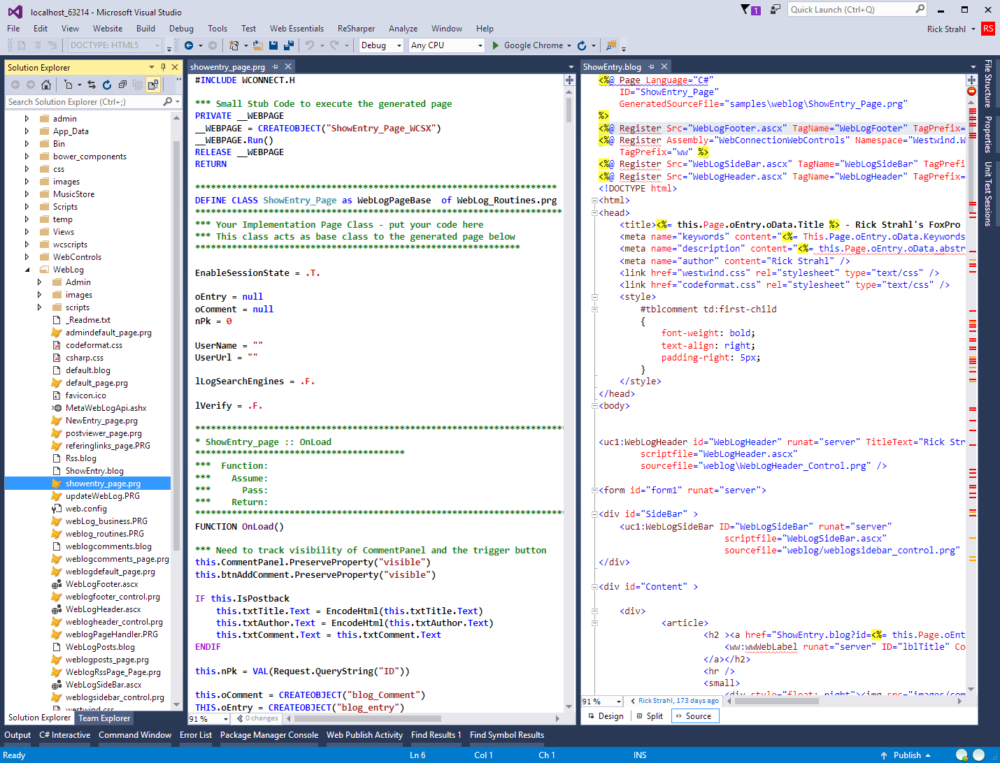
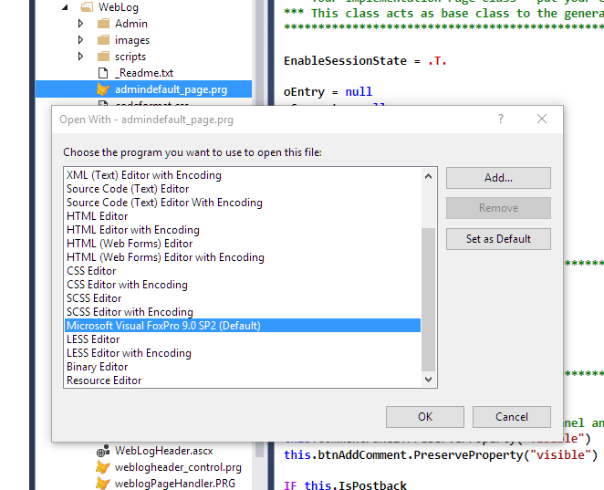
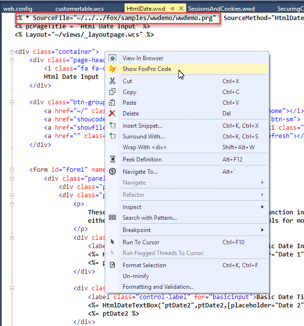

# Visual Studio Gets Support for FoxPro Files

Visual Studio 2015 now has support for FoxPro files by way of a very cool add-in from [Mads Kristensen](http://madskristensen.net/). Mads is a a Program Manager on the Visual Studio Tools team and the prime driver behind extensions for ASP.NET tooling and he has created a cool extension that can take existing **Textmate** style syntax files and render them as syntax highlighted documents. Thanks to [Matt Slay](https://twitter.com/mattslay) who a while back created a [Sublime Text FoxPro language extension](https://github.com/mattslay/Sublime-Text-2-Syntax-Coloring-for-Visual-FoxPro), Mads was able to add FoxPro as a language to the extension language pack. 

End result: You can now view and edit FoxPro files with syntax coloring in Visual Studio natively. Keep in mind this basic syntax coloring support, not a full featured editor with auto-complete. Just the basics...

Here's what this looks like:



You can find out more and install the extension from here:

* [Syntax Highlighting Pack](Packhttp://vsixgallery.com/extension/4773ce75-6f30-4269-9557-1f7c30a47be2/)

or use the Visual Studio Extension Manager to add it directly from within Visual Studio.

You'll also want to install the **File Icons** extension to show appropriate icons for your FoxPro files:

* [File Icons](https://marketplace.visualstudio.com/items?itemName=MadsKristensen.FileIcons)


### Cool!
It's nice to have native support for FoxPro right in Visual Studio, so you can open and edit FoxPro files right from the Visual Studio project. 

This works great when working with [Web Connection](http://west-wind.com/webconnection/), so that you can quickly open PRG files and edit them in-place. If you're Web Control Pages and you keep your PRG files with the script page file, the two files live side by side and you can edit them.

It's also useful for checking out generated script template PRG files while debugging code and you can also open Process class files (manually) in the editor and see your process class code side by side with a template.

Keep in mind the features are limited to syntax coloring. There's no auto-complete support, so you may still want to use the Web Connection add-in to explicitly open FoxPro files in the FoxPro editor.

### Other Editors with Web Connection?
FWIW, you don't have to use Visual Studio or FoxPro either. If you want a different editor for your PRG files - like Sublime text as I've done for years - you can use the **Open With...** option to specify a default editor to open files with. You can map PRG files there to whatever editor you like including the VFP IDE.



Once done double clicking opens the file in the specified editor. I've been using Sublime for years because it fires up quickly, but now I may stick with the built in editor simply for the fact that everything is one place.

### Web Connection and Editing FoxPro Files
Note Web Connection also supports opening Code behind files using the Web Connection Visual Studio Addin:




Web Control Pages automatically open the code behind file. For script and template pages a special page directive allows you to specify what file should be opened - notice the highlight in the code file above:

```html
<% * SourceFile="~/../../fox/samples/wwdemo/wwdemo.prg" %>
```

which lets you specify what file is opened. Here it points at the Web Connection wwProcess class handler file as a relative path to the current document.

The editor that's used can be configured in **web.config** using the following settings:

```xml
<configuration>
    <webConnectionVisualStudio>
        <add key="FoxProEditor" value="" />
        <add key="FoxProEditorAlternate" value="C:\Program Files\Sublime Text 3\sublime_text.exe" />
    </webConnectionVisualStudio>
</configuration>  
```

An empty string value means that the VFP IDE is used, otherwise the file specified by the path is used with the filename passed as parameter.


Any way you slice it - there are now quite a few options for opening FoxPro code in a decent editor - you get to choose what works best for you.


<!-- Post Configuration -->
<!--
```xml
<blogpost>
<title>Visual Studio Gets Support for FoxPro Files</title>
<abstract>
A new Visual Studio extension allows you to open FoxPro files right in Visual Studio with syntax color highlighting which makes working with Web Connection code a lot cleaner as you can keep code windows open right alongside your HTML markup pages.
</abstract>
<categories>
Web Connection,FoxPro,Visual Studio
</categories>
<keywords>
Visual Studio,Editor,FoxPro,Syntax Coloring
</keywords>
<isDraft>False</isDraft>
<weblogs>
<postid>922</postid>
<weblog>
Rick Strahl's FoxPro and Web Connection Weblog
</weblog>
</weblogs>
</blogpost>
```
-->
<!-- End Post Configuration -->
