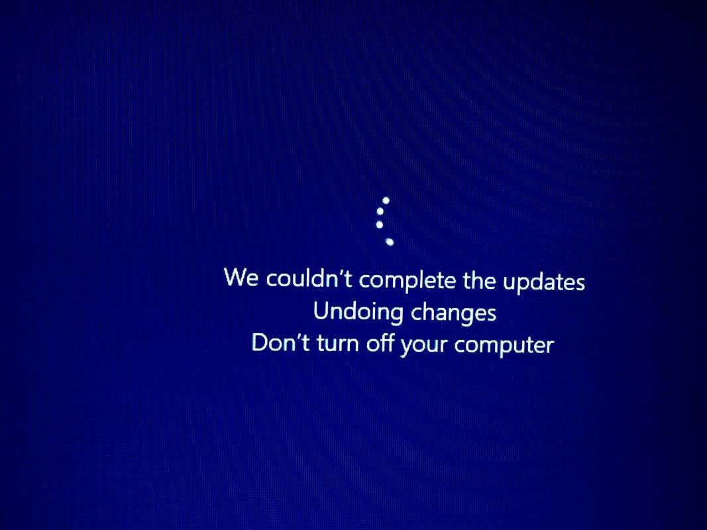
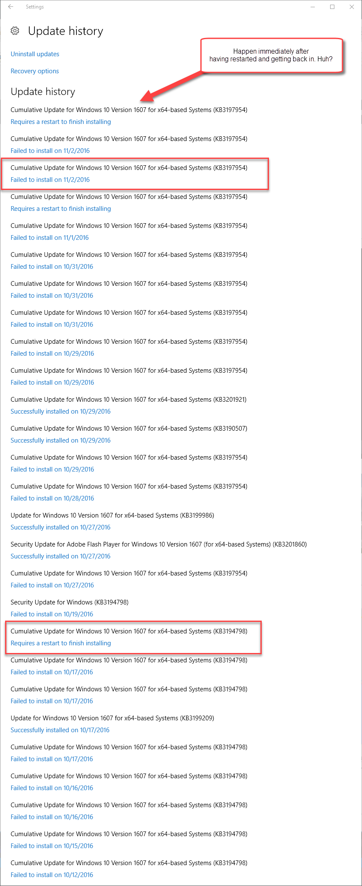
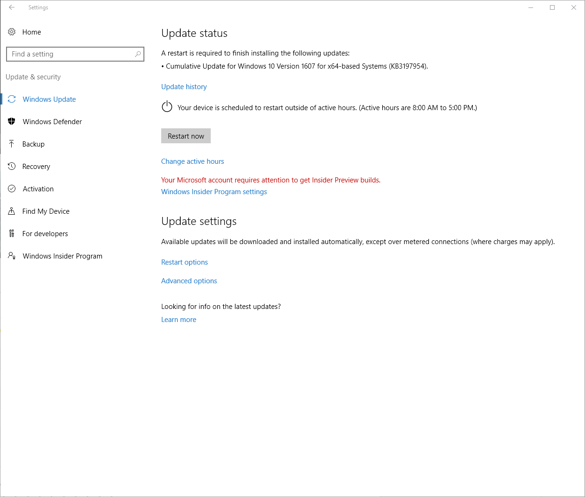
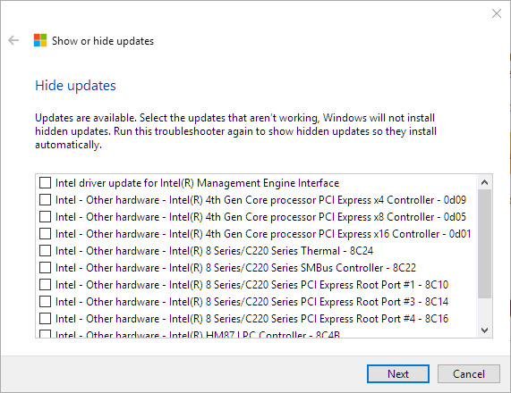

# Windows Update Hell
Once again I'm in Windows Update hell. It's not the first time I've arrived here, but this time around it's a special kind of hell because of Microsoft's misguided policy on update management that makes it damn near impossible to opt out of updates.

### The problem
Some time ago - prior to release of the Windows 10 Aniversary update - I was signed up to the Insiders Program because I wanted to play with some of the new features that came in AU. Specifically the integrated Bash shell and some of the IIS improvements. All went well at the time and when the final of AU rolled around I turned off receiving of Insiders builds to get back onto a stable machine that doesn't update every couple of weeks. Life was back to normal.

About a month ago however things started going sideways. Updates started to fail starting with **KB3194798** and then later with a newer update **KB3197954**. In both cases the updates start installing, get to 96% and then:



All in all this takes 3 restarts to get through. 

### @#!!@ Daily Update Retries
This is bad enough, but it gets worse: The updates continue coming daily wanting to update EVERY day installing the same failed update again and again. 

Due to Windows 10's new policy of an update schedule that checks daily for updates these failed updates - and their 3 restarts - fire every day, without prompting or asking. They just shut down Windows (or wake it up from sleep) in the middle of whatever is happening even if the computer is off. The result is when I return from dinner each night the machine is rebooted. This is made worse for me as I dual boot into the Mac so the updates don't automatically go through their reboot dance.

Check out this fucked up update log:



You'd think the updater might be smart enough to figure out after a couple of failed update attempts that this update isn't going to work. But no that would be too simple...

I also continually see this dialog:



It says there's an update pending even though I've previously - unsuccessfully - installed this update just minutes before. So Windows failed to install an update and immediately decides it wants to immediately install the update **AGAIN**.

The real kicker however is that I can't turn the updates off.

There's a Microsoft Utility that you can download [to explicitly keep certain updates from installing](https://support.microsoft.com/en-us/kb/3073930). I did this with an earlier install and it worked with **KB3194798**, but doesn't with **KB3197954** which never shows up on the list of updates to install. So that's out.


### What I tried
A lot of people had problems with **KB3194798** and there were a lot of workarounds floating around for this one. I tried all of them and had no luck.

I'm on

Windows 10 (1607 14393.187)

### Use the [Windows Update TroubleShooter](https://support.microsoft.com/en-us/instantanswers/512a5183-ffab-40c5-8a68-021e32467565/windows-update-troubleshooter)

This thing says it found things to fix every time it runs:


but in the end this has no effect and the updates continue to fail.

### Remove XBox Scheduled Tasks

Apparently with the original failing update many people reported that the issue was related to a XBox related scheduled task that wasn't shutting down properly and couldn't update. I first disabled, then removed those tasks (I don't use XBox - WTH is this even here, much less screwing with a Windows update?). Microsoft had originally released [Windows 10 1607 Script fix to unblock update for Windows Insiders](https://www.microsoft.com/en-us/download/confirmation.aspx?id=53942) to address this. I ran this but again - no luck.


### Offline Install

Finally I downloaded and installed the initial update completely offline. I:

* Disconnected all devices from the machine
* Shutdown network connections
* Ran the update install locally

Didn't work either.

### Hide Updates
When I originally started having problems with **KB3197954** I was able to use the [Windows Show Hide Update Utility](https://support.microsoft.com/en-us/kb/3073930#bookmark-1607) from Microsoft.



But with **KB3197954** that update doesn't even show up in there so I can't hide it.

* ???
I'm fresh of ideas at this point, short of paving the machine.


### Who you're gonna call?
What's really frustrating about this is that there seems to be no good online resources you can turn to for these type of issues. The answers I did find tended to be scattered all over the place from ServerFault to Microsoft forums (with some really lame Microsoft employee responses - anything useful came from other users) to obscure forums. There was lots of interesting information that was overall helpful but unfortunately not what it took to resolve my issue.

At this point I'm at a loss. I'm not totally adverse to reinstalling - this Windows install pre-dates the initial Windows 10 release, but it's otherwise stable and still quite fast (ie. not Window bit rot that I notice) so I would rather avoid it.

Anybody out there have any other suggestions on what else to look at?

### Sad, Sad, Sad
All I can say is that this sad - really sad. Updates have always been a pain, and failed updates are a reality of life in general. Before those Mac heads go on and say - get a Mac (this *IS* on a Mac) I've had a similar **FAIL** on the OS X with the Yosemite update a year or so back that would not want to install and required a repave as well. 

Failed Updates are OK - but retrying failures over and over again without a way to turn off the pain is definitely not.

### Doing the same failed thing over again, is... Insanity
But continuing to fail repeatedly, doing the same failed update over and over is just plain dumb. With all of this machine logic Microsoft talks about day in and day out, maybe they should spend of that common sense to the Windows Update engine and have some rudimentary logic that can figure out a basic failure pattern and stop making life miserable.

### Tell us what the problem is!
Worst of all is that there are no good troubleshooting tools. Why isn't there a link somewhere that points at a log when an update fails. Or hey, how about an error message that actually says something useful like - hey your video driver is locked or we can't connect to the registration server - anything - instead of "We couldn't complete the updates - now buzz off". I get that you don't want to scare non-technical folks, but a link a small link that allows getting at that info would be freaking glorious compared to this insane opacity. 

Windows update logs aren't the right answer here either because those can be near impossible to parse for a non-Microsoft person, but heck the installer has to know what the last thing it was working on that failed. This isn't rocket science.

Ok I'm done ranting :-) 

<small style="font-size: 8pt">
Post created with <a href="https://markdownmonster.west-wind.com">Markdown Monster</a>
</small>


<!-- Post Configuration -->
<!--
```xml
<blogpost>
<abstract>
I've been fighting Windows Update Hell for the last month with failed updates wreaking havoc on my machine. Updates fail to install completely and roll back and then continue to retry each day. Attempts to turn off the particular update now fails as well, so I'm stuck in this groundhog day like loop of pain. This is a cry for help, in hopes somebody has additional ideas on what to try.
</abstract>
<categories>
Windows
</categories>
<keywords>
Windows Update,Windows
</keywords>
<weblogs>
<postid>55387</postid>
<weblog>
Rick Strahl's Weblog
</weblog>
</weblogs>
</blogpost>
```
-->
<!-- End Post Configuration -->
