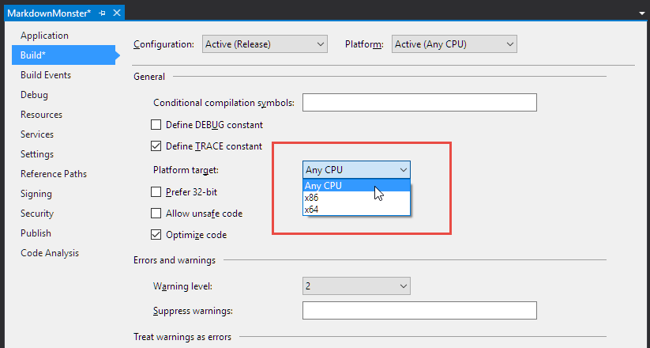
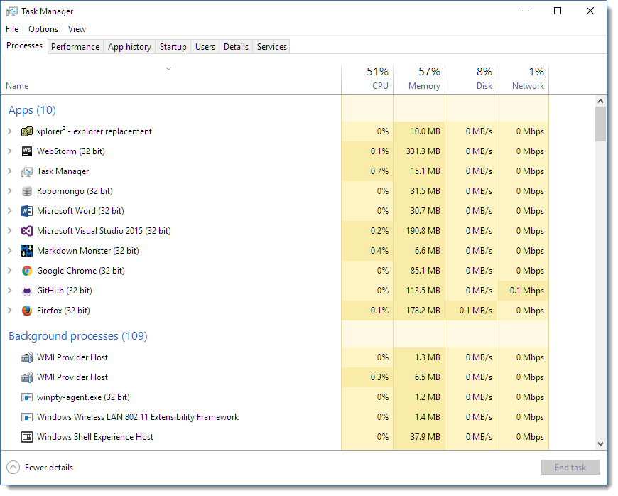
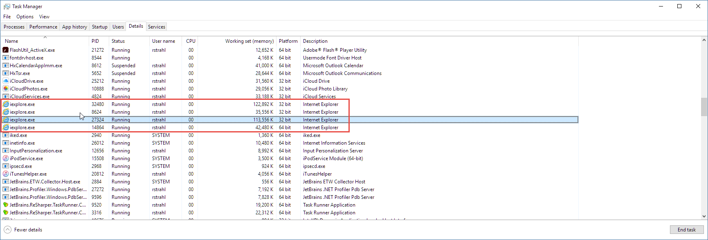

# Downgrading a .NET Applications from 64 bit to 32 bit for the WebBrowser Control


If you're like most developers these days, when you build a Windows desktop or Console application you most likely use the default **Any CPU** target in Visual Studio to build your application:



What **Any CPU** does is essentially build your binary so it can execute either in 64 bit or 32 bit. If you launch an EXE created with **Any CPU** on a 64 bit machine the app will run 64 bit, and will run 32 bit on a 32 bit platform of Windows.

Most of the time this is exactly what you want and it should be your default for most applications.

But, **most of the time is not all the time** and of course I wouldn't be writing this post if Mr. Murphy wouldn't have kicked my ass on something yet again. In this post I describe how [Markdown Monster](https://markdownmonster.west-wind.com) which started out as a 64 bit application ended up getting downgraded to 32 bit and as a result ended up running much more smoothly and reliably. While it's a special case mostly due to the heavy interaction with several WebBrowser controls, it's still something to keep in mind when you're building desktop applications for Windows.

### 64 bit vs 32 bit
Before I get into my application specific issues let's look at advantages and disadvantages of each of the bitness platforms.

These days most of us run 64 bit versions of Windows, so it makes sense to run our applications in 64 bit as well. Or does it? When you open your Task Manager in Windows you're likely to find that a large percentage of the applications you run all day long are actually 32 bit. Take a look at my Task Manager right now:



OK, there are other apps like iTunes, Paint.NET, [Fiddler](http://telerik.com/fiddler), [Beyond Compare](http://www.scootersoftware.com/), Adobe products,  Nitro that I use often and that are 64 bit, but the fact remains: 32 bit for desktop applications is not uncommon and not what you should think of as **legacy**. 32 bit isn't going away anytime soon because a large percentage of Windows apps we all use are running 32 bit.

### 64 bit and 32 bit in .NET
If you build .NET applications you can easily choose between 32 bit and 64 bit compilation modes, or even better you can have the application auto-detect which OS it's running under and use 64 bit or 32 bit depending on the OS bitness. .NET makes it easy to either create pure 64 bit applications or a mixed mode application that can run either in 64 bit or 32 bit mode depending on the OS Bitness that launched it. Most of the time I'd recommend going with the **Any CPU** build target which provides this auto-detect operation of the final executable.


64 bit offers a **much bigger memory virtual address space** (8 TB in theory!) and in theory 64 bit **is the native platform** so it should be faster. It offers larger **64 bit registers** and these can perform some operations in a single operation that requires multiple ops on 32 bit registers due to the register size and improved instruction set. For computationally intensive applications - and especially those dealing with integer or bit math, performance can be considerably improved with 64 bit (up to 2x in theory in reality much less).

In reality, few desktop or Windows Console applications need more than the ~1.5gb effective address space a 32 bit app can address, and I've yet to see any **significant** performance improvement from a 64 bit app over a 32 bit app in typical desktop or business applications.

I have however seen many occasions where the opposite is true, where 32 bit applications are much more snappy than the 64 bit equivalent. And - as it turns out that's true for my Markdown Monster application.

### Running into 64 bit issues with the WebBrowser Control
I've been working on Markdown Monster which is a Windows WPF application, that extensively uses Interop to interact with a number of Web Browser control instances. The application initially was built using **Any CPU** which means it was running as 64 bit application for anybody running on a 64 bit OS.

Making the WebBrowser control behave is tricky business all by itself, but after beating the feature functionality into submission, I noticed that there were occasional and very mysterious hard crashes that would bring the application down. The same operations would randomly fail - sometimes just opening a certain file, sometimes updating an preview. Checking event log data shows non-descript crashes in `jscript.dll` which is the IE Javascript engine. Markdown Monster uses a lot of Javascript - the editor ([Ace Editor](https://ace.c9.io/#nav=abouthttps://ace.c9.io/#nav=about)) is a huge Javascript library that manages the entire editing experience via js script code and the previewer uses a bunch of custom script to manage the preview syncing between the editor and preview windows, with the .NET Application in the middle as a proxy.

It wasn't just me either - a number of users reported some of these mysterious crashing issues on GitHub, often with repeatable steps that wouldn't repeat consistently. Open a specific file and it would fail 1 out of 10 times even immediately after startup going through the same steps. Argh! Those are the worst issues to debug.

### Debugging and 64 Bit
A few days ago [I posted about some 64 bit debugger problems](https://weblog.west-wind.com/posts/2016/Dec/19/Visual-Studio-Debugging-and-64-Bit-NET-Applications) I ran into while debugging my application and while trying to track down some 32 bit vs. 64 bit issues.

I realized that I was seeing **drastically different behavior** between the version being debugged and the version I run standalone. A number of interactions between the WPF application the HTML preview or the editor would fail in the production version which runs 64 bit, but it always worked just fine in the debugger running 32 bit - the problem wouldn't duplicate. Initially I attributed that to the fact the app was running under the debugger but after realizing that the debugger was running 32 bit I actually tried running the app in 32 bit.

### 32 bit Surprise
To my surprise I found that the odd failures I saw in 64 bit - mostly browser interaction related issues in the preview pane - did not occur in the 32 bit version even when not debugging. Things just worked as they were supposed to without the occasional odd failures. The WPF app captures the DOM document and then initializes Interop by passing a .NET reference to the Javascript code, and that code would occasionally and somewhat randomly fail in 64 bit - in 32 bit that code never fails. 

Specifically this code:

```csharp
PreviewBrowser.LoadCompleted += (sender, e) =>
{                
    bool shouldScrollToEditor = PreviewBrowser.Tag != null && PreviewBrowser.Tag == "EDITORSCROLL";
    PreviewBrowser.Tag = null;

    dynamic window = null;
    MarkdownDocumentEditor editor = null;
    try
    {
        editor = GetActiveMarkdownEditor();
        
        dynamic dom = PreviewBrowser.Document;
        window = dom.parentWindow;
        dom.documentElement.scrollTop = editor.MarkdownDocument.LastBrowserScrollPosition;

        // *** THIS FREQUENTLY FAILS IN 64BIT NOT 32BIT
        window.initializeinterop(editor);

        if (shouldScrollToEditor)
        {
            try
            {
                // scroll preview to selected line
                if (mmApp.Configuration.PreviewSyncMode == PreviewSyncMode.EditorAndPreview ||
                    mmApp.Configuration.PreviewSyncMode == PreviewSyncMode.EditorToPreview)
                {
                    int lineno = editor.GetLineNumber();
                    if (lineno > -1)
                        window.scrollToPragmaLine(lineno);                                
                }
            }
            catch
            { /* ignore scroll error */ }
        }
    }
    catch
    {
        // try again
        Task.Delay(200).ContinueWith(t =>
        {
            try
            {
                // *** STILL FAILS IN 64BIT (ie. not a timing error)
                window.initializeinterop(editor);
            }
            catch (Exception ex)
            {
                mmApp.Log("Preview InitializeInterop failed", ex);
            }
        });
    }
};
```        
In 64 bit the code would frequently, but not always fail while trying to call the `initializeinterop()` function - which is a global Javascript function in the preview document. The error states that `initializeinterop` is not found, which is crazy - the document loads and that function is available. Script code is loaded before doc content so the function is always there. Yet in 64 bit I frequently got errors that fired into the exception handler (which would also fail on the delayed retry).

In 32 bit - the exception handler is never triggered. Reviewing my telemetry logs confirms that end users also very frequently see errors with this same issue on 64 bit. With the 32 bit version in circulation those errors have stopped coming in.

In addition to these odd load issues no longer triggering, I also noticed that the editor control was behaving much more smoothly in 32 bit. Text entry is much smoother and the inline preview refreshes that update the preview HTML go much quicker and without affecting the editor's cursor while updating - previously in 64 bit mode a spinning busy cursor would briefly appear.

In theory 64 bit and 32 bit should behave the same, but clearly in this case the reality is that 32 bit and 64 bit have quite different behaviors.

### Internet Explorer and 64 Bit
It's pretty obvious that most of the undesired behavior can be traced back to the WebBrowser control. And the Web Browser control is based on Internet Explorer 11 using [FEATURE_BROWSER_EMULATION](https://weblog.west-wind.com/posts/2011/may/21/web-browser-control-specifying-the-ie-version).

Internet Explorer is a tricky beast when it comes to 64 bit and 32 bit operation. IE runs the standalone browser shell as a 64 bit Windows process, but loads all browsing instance windows into their own 32 bit process. 

With 3 tabs open here's what the IE processes in Task Manager look like:



Notice there's one 64 bit process and three 32 bit processes which presumably belong to each one of the tabs. So even Windows itself is only using the 64 bit host process and then uses 32 bit sub-processes to handle the actual browser tab display. Maybe Microsoft knows something they are not telling us here but it looks like they too prefer to run actual browser content in 32 bit.

### WebBrowser Control
The WebBrowser control in WPF (and also WinForms) is a COM wrapper around the the hostable IE engine and it comes in both 64 bit and 32 bit flavors as you can use the WebBrowser control for either type of application. However in several applications that I've built with the WebBrowser control there are odd issues with the control in 64 bit that never show up in 32 bit. I had forgotten about similar issues that I ran into with [West Wind Web Surge](https://websurge.west-wind.com/) which also uses the WebBrowser control to display load test results.

Also I've noticed that the performance of the application - or maybe more specifically the Web Browser controls running inside of the Markdown Monster application are noticeably more responsive. This is very noticeable while typing in the editor (remember: it's Javascript in a WebBrowser control) and also in the Markdown Monster preview browser that displays the render HTML output from the edited Markdown text. The preview now updates in the background without a funky refresh cursor (pointer with a spinning wheel) showing up on top of the application which happened previously, but is now mysteriously gone. This might just be because the refresh is drastically faster or because there's less blocking code that allows the refresh to occur in the background.

As I mentioned earlier the bug report telemetry bears this out - with several dozen users updated to the 32 bit version running  1.0.30 the various browser initialization errors in the error logs fort that version have stopped while I still see quite a few for older versions.

### WebBrowser Control or something else?
This post and others that mention the WebBrowser control always get a bunch of comments like "Why use the WebBrowser control? Use a Chromium based tool".

Fair enough, but for me that doesn't make sense. There are a number of issues with using Chromium starting with the huge size of distributable as you have to distribute the Chromium runtime, to problems that I know exist with other applications using tools like Awesomium, CEFSharp, WebkitDotnet etc. I'm also not sure how much real two-way interop you can do with these solutions passing .NET objects and Javascript objects back and forth between the host and browser environments in both directions. 

I know the WebBrowser control allows for rich two-way communication because I've built quite a few apps that do this for many years all the way back to the pre-.NET days. So, I stick with what I know. Most of the time when people moan about the WebBrowser control it's because they haven't tweaked the control to behave properly. I suspect the same is true for Chromium based engines - integrating a WebBrowser rendering engine and closely interacting with it is never trivial and while it might solve some issues it very likely introduces others.

There's no doubt the WebBrowser control has many quirks and if you use it in its default configuration it runs in IE7 mode (no kidding). However, the WebBrowser control has a huge number of configuration tweaks and settings and it **can be beat into submission** including most importantly using the IE 11 engine for full HTML 5 and ECMAScript 5+ support. I've built quite a few applications using the WebBrowser control and while I know what a pain it can be, it's a pain I know how to deal with. Once things have been configured right the WebBrowser control is quite capable of running any Web content and provide very rich two-way interaction.

Markdown Monster also does a ton of **two-way communication** between .NET and JavaScript running in the browser with data going in both directions. It's not just DOM manipulation, but .NET is calling into the DOM to perform tasks and the DOM is calling back to .NET to perform tasks in the main shell UI or 'business' logic. I'm not even sure if that's possible with WebKit based implmentations that would have to support this same level of DOM->COM->.NET interoperability. When I've looked at these controls in the past there were significantly less flexible than the WebBrowser control when it came to actual two-way communication. 

But maybe somebody who has built Chromium based apps that have tight integration with their host application can chime in in the comments. I have to plead ignorance here.

### Downgrading to 32 Bit
So since I **am** using the WebBrowser control and I've run into these 64 bit problems I have to make adjustments to deal with it by switching to 32 bit.

To actually downgrade an application to 32 bit mode you should set the build target to **x86** in the Visual Studio build dialog:


I prefer this setting because it's explicit and sets up the application to run 32 bit only.

The other option is to use the **Any CPU** and **Prefer 32 bit** option:


This produces a 64 and 32 bit capable binary that will run 32 bit if launched on an OS that supports 32 bit operation. In reality this has roughly the same effect as the x86 flag since there are no pure 64 bit OS's that don't allow 32 bit at the moment except the headless server versions of Windows like Nano Server and Server Core where UI applications can't run anyway.

I prefer the explicit x86 option precisely because it is explicit. If you use an installer to install your application you likely will have to choose where it installs anyway: - **Program Files** or **Program Files (x86)** -  if you're trying to run in 32 bit mode. But either setting works and has the same effect of running the application in 32 bit mode.

### Summary
I want to be very clear and say that this is not meant to be a post that says - "Don't use 64 bit mode". For most types of applications, running with **Any CPU** and running in 64 bit works just fine. 

But if you are running applications that deal with the WebBrowser control **and you see lots of unexpected hard crashes or DOM access failures** you might want to experiment to see if running in 32 bit mode improves on the undesired behaviors. It looks very much like the WebBrowser control like Internet Explorer in general prefers running in 32 bit mode and comparing the older 64 bit version to the newer 32 bit version of Markdown Monster certainly bears that out for me. It's nice to get the improved 'snappiness' and to not see the occasional oddball I (and others) had previously been seeing. 

In [Markdown Monster](https://markdownmonster.west-wind.com/) the switch to 32 bit from 64 bit is like night and day for application performance and stability, so to me this was a huge win. But again this is a special case because this app relies so heavily on the WebBrowser control. Your mileage may vary but I think this is still a good data point to consider if your 64 bit application runs into 'odd' behavior.

Put this one into the 'good to know' category...

<small>post created with [Markdown Monster](https://markdownmonster.west-wind.com)


<!-- Post Configuration -->
<!--
```xml
<blogpost>
<title>Downgrading a .NET Applications from 64 bit to 32 bit for the WebBrowser Control</title>
<abstract>
Recently while working on Markdown Monster I ran into some odd crashes and behaviors when interacting with the Web Browser control in this WPF application. It turns out that some of these inconsistent behaviors are apparently caused by running hte application in 64 bit mode. Switching to 32 bit mode has made the application and Web Browser interaction much more responsive and has stopped the nagging unexplainable crashes. In this post I look at 32 and 64 bit applications in .NET and outline some of the issues I ran into and how I fixed the problem by switching to building a 32 bit app.
</abstract>
<categories>
WPF,.NET
</categories>
<keywords>
64 bit,WebBrowser Control,WPF,DOM,Interop,Crash
</keywords>
<isDraft>False</isDraft>
<featuredImage>https://weblog.west-wind.com/images/2016/Running%20.NET%20Applications%20in%2032%20bit%20or%2064%20bit/AnyCpuProjectSetting.png</featuredImage>
<weblogs>
<postid>97020</postid>
<weblog>
West Wind Web Log
</weblog>
</weblogs>
</blogpost>
```
-->
<!-- End Post Configuration -->