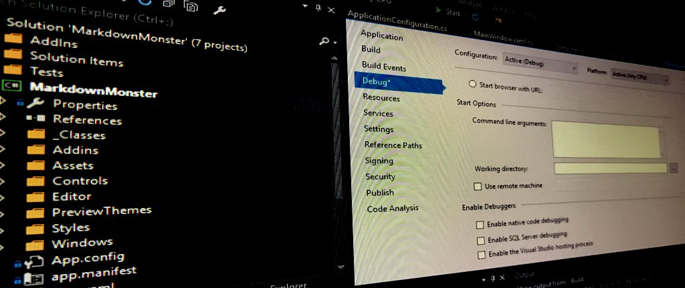
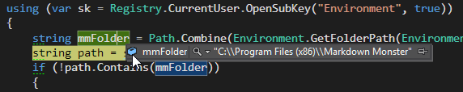
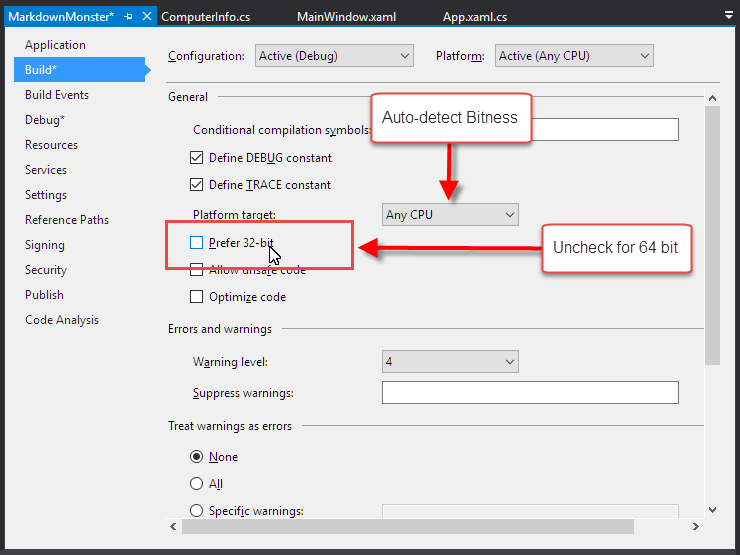
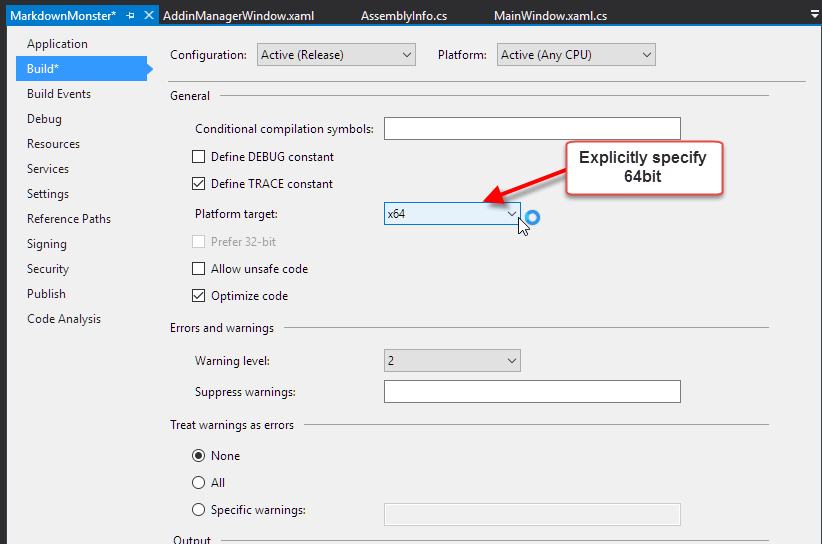
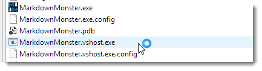
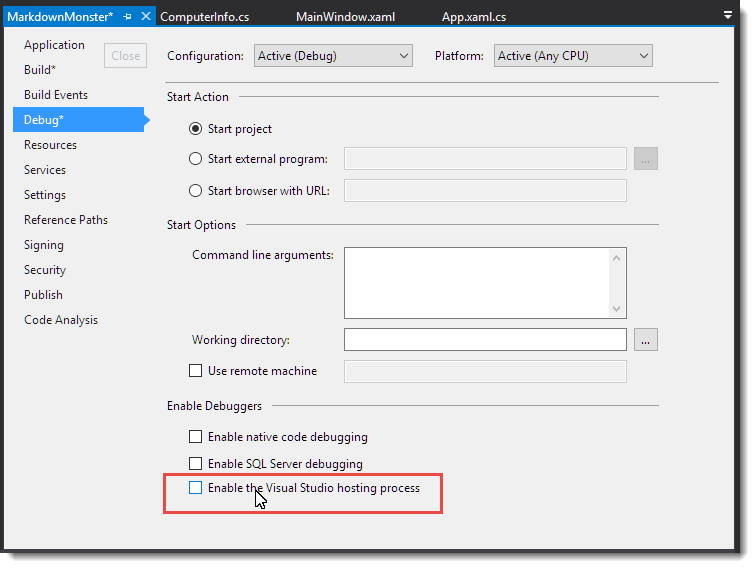

# Visual Studio Debugging and 64 Bit .NET Applications



I've been working on [Markdown Monster](https://markdownmonster.west-wind.com) which is a 64 bit application. I found out the hard way today that when you fire up the debugger in Visual Studio it will launch in 32 bit mode by default even if the application would run 64 bit when run directly. In the process I discovered quite a few things of the debugger I wasn't aware of along with a few suggestions from [Kirill Osenkov](https://twitter.com/KirillOsenkov) that were illuminating and that I'll share here.

### 32 Bit Debugger for 64 Bit Process?
Before we get into this I want to clarify that in most cases it's probably OK to be debugging in 32 bit mode when running what otherwise is a 64 bit application. One of the beauties of a runtime environment like .NET is that it for the most part doesn't have to care what CPU platform you're running under. The framework masks most of those differences for us. If you don't think that's cool, you probably haven't done low level C/C++ style programming before and don't know how much of a pain dealing with bitness can be! That it's so easy in .NET is actually big deal.

32 bit/64 bit issues usually come up in relation to OS features and locations that are different. I ran into the 32 bit issue while debugging some start up configuration check logic in Markdown Monster. MM requires a few file and system registry settings in order to work properly - specifically IE 10/11 browser emulation and an optional path check - in order to work properly. The application checks whether certain values have been set and if not attempts to set them.

As you probably know, system folders and registry paths can vary depending on whether you are running 32 bit or 64 bit. Folders in particular can be different. So one thing MM does is add the Markdown Monster install path to User's path so that you can type `mm Readme.md` or `mm data.json` or `mm web.config` (MM supports editing a few common text formats besides Markdown) to view the document in the editor.

Specifically I am using this code to retrieve the program files folder install path in my app:

```csharp
 string mmFolder = Path.Combine(
       Environment.GetFolderPath(Environment.SpecialFolder.ProgramFiles),
       "Markdown Monster");
 ```

which when running on a 64 bit machine should return (or whatever localized version thereof):

**c:\Program Files\Markdown Monster**

And it does at runtime when running the EXE directly from explorer or the command line. 

However, when running under the debugger in Visual Studio I'm getting:



**c:\program files (x86)\Markdown Monster**

which clearly is a 32 bit path on a 64 bit system. Both are the same **Any Cpu** Visual Studio target as the runtime application, but very different results.

### Uncheck prefer 32 bit
The key setting that affects the debugger behavior is the **Prefer 32 bit** flag which should be disabled if you want to run in 64 bit mode using **Any CPU**.



If you're running the 'raw' debugger against your process that's all that needs to happen to ensure your app runs as you'd expect it to run from Explorer or the command window. 

Even more straight forward though is to force the debug application entirely to 64bit by changing the platform target to **x64**:



Note that neither of these settings are debugger related - they affect whatever build mode (Release/Debug) that you apply it to at runtime, no matter what.

### VSHOST: We don't need you
But wait there's more.

Visual Studio also uses a VSHOST process for debugging your standalone EXE applications. The VsHost process acts as a wrapper around the actual application or assembly you are debugging. When Debugging an EXE style application, by default Visual Studio runs the application in the `yourapplication.vshost.exe` 



This EXE is a small stub loader that actually loads your main assembly (in the EXE) into the default AppDomain of the host and then calls the **[Main]** function on it. For the most part the behavior between native and hosted are the same but there are a few differences.

One of them is that the host process will default and stick to 32 bit **even if the Prefer 32 bit option is not checked**. The only way I could get the host process to work in 64 bit is to explicitly change my project build target to **x64** instead of **Any CPU** which is silly.

After a lengthy [Twitter conversation with Kirill Osenkeov](https://twitter.com/KirillOsenkov/status/809347006049067008) from the Visual Studio team, I walked away with the impression that it's best to turn off the VSHost Debugging features in most cases:

[](https://twitter.com/KirillOsenkov/status/809347006049067008)

As Kirill mentions, the host container is a throw back to older Visual Studio days, and there's actually [very little functionality it provides to the debugging process](https://msdn.microsoft.com/en-us/library/ms242202.aspx), so you are better off not using it at all **unless you need the specific features it provides**.

To turn it off use the **Debug** tab on the Project Settings and uncheck **Enable the Visual Studio hosting process**.



FWIW I'm glad I found out about the non-need for the VSHost process as that's caused me all sorts of grief with locked assemblies in the past. I gladly bypass this extra step.


### Summary
Now with both **Prefer 32 bit** and **Enable the Visual Studio hosting process** off, debugging works as expected in 64 bit mode.

In most cases the differences between 32 bit and 64 bit are not important in your applications, but regardless I think it's a good idea to ensure that you are debugging in the same environment you're expecting to run the application in. It's easy to overlook some odd behavior that only occurs due to the OS differences. My case of checking for the **Program Files** is just one example of that. It took me a while to figure out why the application was not updating the path the way I was expecting to. Especially if you are dealing with the file system and special folder paths, or the registry be very sure that you're getting data to and from the right places.

<!-- Post Configuration -->
<!--
```xml
<blogpost>
<title>Visual Studio Debugging and 64 Bit .NET Applications</title>
<abstract>
Recently while debugging a 64 bit application I found out the hard way that Visual Studio by default will use 32 bit debugging even when running what would otherwise be a 64 bit .NET application. There are a number of options that determine the bitness of your application, but the debugger often behaves differently than your standalone application. In this post I describe, why this might be a problem in some situations and how you can get the debugger to run in 64 bit.
</abstract>
<categories>
.NET,Visual Studio
</categories>
<keywords>
.NET,Debug,64 bit,Bitness,Debugger,Host Process,VSHOST
</keywords>
<isDraft>False</isDraft>
<featuredImage>https://weblog.west-wind.com/images/2016/Visual%20Studio%20Debugging%20and%2064%20Bit%20Applications/VsDebugger.JPG</featuredImage>
<weblogs>
<postid>93548</postid>
<weblog>
West Wind Web Log
</weblog>
</weblogs>
</blogpost>
```
-->
<!-- End Post Configuration -->
