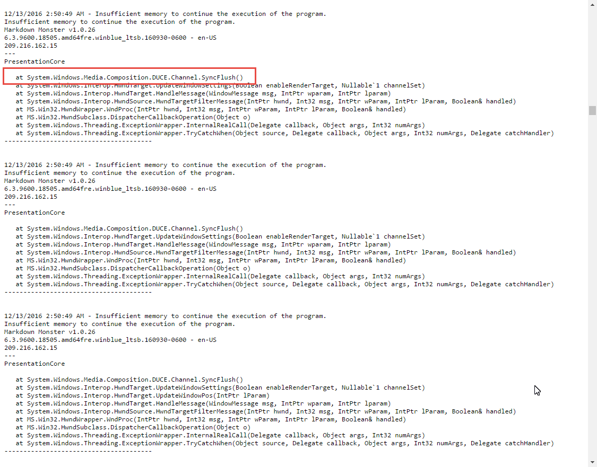

# WPF Rendering DUCE.Channel Crashes due to Image Loading


I ran into a nasty problem yesterday with [Markdown Monster](https://markdownmonster.west-wind.com/) that was causing the application to first hang and then **hard crash**. But it only happened on a very few machines running the application. 

On my desktop development machine everything's fine. My Windows 7 VM I use for testing also works fine. But I ran into the failure when doing a quick run test on my Windows 2012 R2 server which I connect to over RDP and sometimes test my applications. 

Looking at my bug report logs I see these lovely messages:



Yikes! no hint of user code, no idea what that means.

```ini
12/13/2016 10:32:44 AM - Insufficient memory to continue the execution of the program.
Insufficient memory to continue the execution of the program.    
Markdown Monster v1.0.25 
6.3.9600.17328.amd64fre.winblue_r3.140827-1500 - en-GB
128.74.213.13
---
PresentationCore

   at System.Windows.Media.Composition.DUCE.Channel.SyncFlush()
   at System.Windows.Interop.HwndTarget.UpdateWindowSettings(Boolean enableRenderTarget, Nullable`1 channelSet)
   at System.Windows.Interop.HwndTarget.UpdateWindowPos(IntPtr lParam)
   at System.Windows.Interop.HwndTarget.HandleMessage(WindowMessage msg, IntPtr wparam, IntPtr lparam)
   at System.Windows.Interop.HwndSource.HwndTargetFilterMessage(IntPtr hwnd, Int32 msg, IntPtr wParam, IntPtr lParam, Boolean& handled)
   at MS.Win32.HwndWrapper.WndProc(IntPtr hwnd, Int32 msg, IntPtr wParam, IntPtr lParam, Boolean& handled)
   at MS.Win32.HwndSubclass.DispatcherCallbackOperation(Object o)
   at System.Windows.Threading.ExceptionWrapper.InternalRealCall(Delegate callback, Object args, Int32 numArgs)
   at System.Windows.Threading.ExceptionWrapper.TryCatchWhen(Object source, Delegate callback, Object args, Int32 numArgs, Delegate catchHandler)
---------------------------------------
```

**System.Windows.Media.Composition.DUCE.Channel**??? The error manifests as a hard crash that occurs right before the form starts rendering (apparently) and when it happens the app tries to recover and restart and then run repeatedly into the same error which eventually runs out of memory and crashes.

The insidious problem with this failure is that there's no effective way to capture the error because it occurs as part of the WPF rendering pipeline. 

As you can see in the call stack there's none of my application code to catch any failures and the error falls back and is captured by the application wide `App.DispatcherUnhandledException`, which is where the error logging and bug reporting occurs that allows me to see the error at all. This is the **error handler of last resort** and on recoverable errors the handler simply restarts the application, but in this case the failure is total because another restart just fires into the same failure over and over again (which accounts for the hanging) and eventually the process just runs out of memory and crashes hard.

##AD##

### Hardware Errors
A bit of research in the DUCE.Channel errors reveals that it's usually [related to a video hardware driver issues](https://blogs.msdn.microsoft.com/dsui_team/2013/11/18/wpf-render-thread-failures), which makes sense since the problem apparently only affects a small number of machines. Unfortunately information is scarce and basically boils down to **make sure you have the latest video drivers**.

Er, sure that makes sense, but that's not very useful if you have an application that's going out to a lot of generic hardware of all kinds - I have no control over what hardware is used with MM, **and** I knew this app was running without issue a couple of days ago on the same hardware it now fails on.

### Discovery
My lucky break on this was that **I happened to notice the failure right away** on my server. I infrequently install and run the application on my server just to see if it works. Server UIs - with the non-fancy windows theme and slow RDP connection have a way of bringing out errors so that's a good final 'reality check'. I don't do it all the time, but in this case luckily I did.

If I wouldn't have tested on my server I would have never noticed the errors because the code was running fine on the two machines I regularly test with.

Also luckily for me, I **knew that I had a running build** a couple of revs back. I saw errors on build 1.0.25 but I knew 1.0.22 (which was the previous release version) worked fine on the same hardware.

So something in between these two builds was causing the failure which was a huge help in the end as I could run a meaningful code compare.

So I pulled down the known working version (1.0.22) from Git, slapped it into a separate folder and used [Beyond Compare](http://www.scootersoftware.com/) to see everything that had changed.  while While not a lot had changed it was still enough to make this non-trivial that ended up eating up a few hours of trial and error re-installs on the server.

I tried a lot of dead ends before I found the solution here and I'm not going to bore you with those false leads which involved removing a bunch of code, inserting logging statements into the page and compiling and updating the server executable a hundred times or more. Yechh!!! All of that convinced me that the page startup code was loading fine, but failing right at the render stage just before anything became visible, which points at a render failure.

### Image Breakdown
I should have probably look there sooner, but I found the problem in the main window's XAML file.

It turns out that the problem was the icon image for the Page - a PNG file that I had changed recently from a 256x256px image to a 128x128px image:

```xml
<controls:MetroWindow x:Class="MarkdownMonster.MainWindow"
        ...
        Icon="Assets\MarkdownMonster_Icon_128.png" 
/>        
```

In between the two versions I had switched to a new, smaller 128px icon file, and also had run some additional image compression on the file.

It turns out **the 128px image** was the culprit in the failure. Using the 128px image caused a load failure every time on the server, but works fine on my dev box and the Win7 server.

Switching back to the old **256px** image the application started working properly again on all machines. So it looks like it's something in the image that's causing WPF to barf.

I'm not sure exactly what the issue is and why this particular image blows up like this, but it's clear that WPF is having problems rendering the PNG file icon. My guess is there's something in the PNG parser that happens to have a problem on some video hardware.

##AD##

### Summary
The moral of the story is that the problem here lies with WPF and when you see rendering errors, the first thing you should check for are resource related issues. In my (somewhat limited) experience with WPF, most oddball load failures in WPF applications come from something related to resources either not being found or not loading properly. The errors that occur in these scenarios are almost always cryptic and nearly indecipherable.

It helps to have a good back or source control commit that you can roll back to so you can compare what's changed between the two versions. If you run in the error I describe above look for asset or resource related changes first before going down any code debugging path (which is what I did, wasting hours on several dead ends).

It's also pretty sad that WPF fails in this way. An image loading failure causes the application to hang and without a error message that points you anywhere useful - that's terrible behavior and something the WPF team should look at fixing. There has to be a way for WPF's rendering engine to capture the error and provide a more meaningful error message. Clearly WPF is able to report the error, so there should be some state that can be recovered and reported. ANYTHING at all - a file, a hint a sign from god - i don't know anything would have been better than the actual error message.

Hopefully this post provides some additional feedback for those that run into these errors. I'm sure there are  many causes for this same error and the image rendering one might just be one of the symptoms that triggers it. 


<small>This post was created with [Markdown Monster](https://markdownmonster.west-wind.com)</small>

<!-- Post Configuration -->
<!--
```xml
<blogpost>
<title>WPF Rendering DUCE.Channel Crashes due to Image Loading</title>
<abstract>
I ran into a nasty WPF rendering bug that affected only a few select machines. Rendering problems in WPF can be terribly difificult to debug because there often is no additional information on what failed and the exceptions that occur are not trappable but fall back to application wide error handling. In this post I describe a specific failure caused by a 'bad' image WPF can't deal with and how I tracked it down and fixed it.
</abstract>
<categories>
WPF,.NET
</categories>
<keywords>
WPF,DUCE,DUCE.Channel,Crash,Image
</keywords>
<isDraft>False</isDraft>
<featuredImage>https://weblog.west-wind.com/images/2016/WPF%20Rendering%20Crashes%20due%20to%20Image%20Loading/Crash.jpg</featuredImage>
<weblogs>
<postid>90337</postid>
<weblog>
West Wind Web Log
</weblog>
</weblogs>
</blogpost>
```
-->
<!-- End Post Configuration -->
