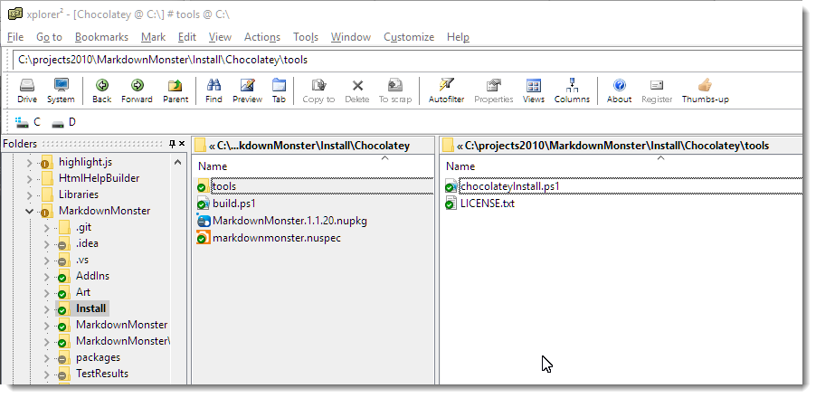
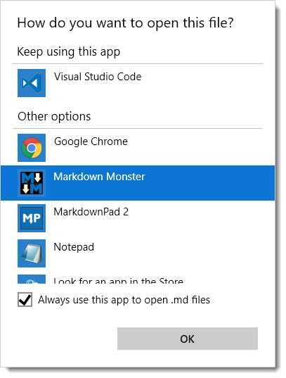
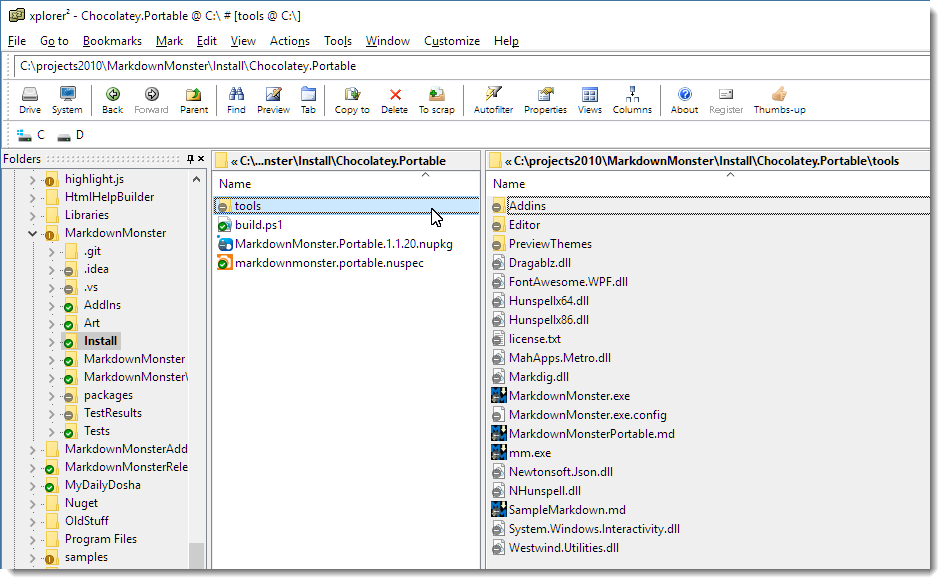

# Creating a portable and embedded Chocolatey Package


Over the last few weeks I've been getting quite a few requests for a portable Chocolatey package for [Markdown Monster](https://markdownmonster.west-wind.com/). A zip file version of a portable install has been available for some time [from the download page](https://markdownmonster.west-wind.com/download.aspx), but a Chocolatey package certainly would streamline the process quite a bit more.

So a couple of weeks ago I finally also put out a portable Chocolatey package and in this post I want to describe the process of creating a portable package, both from creating a low impact installation and for creating an embedded Chocolatey package that contains all the raw source files embedded in the chocolatey package.

But first lets talk Chocolatey - yumm - in general and also about creating standard packages.

### Chocolatey - Distribution made easy
For those of you that haven't used Chocolatey before: [Chocolatey](https://chocolatey.org) is a package manager for Windows that makes it super easy to install and update software on your machine. A single command lets you easily install software and then at any point lets you check for and install updates with another simple command. 

[Once Chocolatey is installed](https://chocolatey.org/) you can install hundreds of common software packages both free and commercial using Chocolatey's silent install process. Note that installing commercial software doesn't remove any licensing requirements - you still have to apply license keys or register as you would have to with full software. Chocolatey simply provides a distribution mechanism for the software.

Installing and updating software with Chocolatey becomes a single line of command line code:

```dos
choco install markdownmonster
```

and to update to the latest version:

```dos
choco upgrade markdownmonster
```

It's nice to be able to do this from the command prompt, but even nicer if you need to set up a new machine where you can create a batch file or POSH script to string a bunch of `choco install` commands together to build up a machine without user interaction.

##AD##

### Creating Packages
You can also **create** Chocolatey Packages either of your own software or - given permissions - from any software that is out there. Chocolatey makes the process of setting up a new package quite easy with:

```dos
choco new markdownmonster
```

A new project creates a `.nuspec` meta data file that describes what the package is, and a `\tools` folder that contains a few Powershell scripts, and a license file. Here's what my full Markdown Monster Chocolatey package folder looks like:



This package downloads a setup.exe file from Github. I publish each version in a special repository and then build a custom `chocolateyInstall.ps1` file that contains the latest version's file name, url and SHA256. As you can see - there's not much to this folder structure.

#### Nuspec Meta Data
The main piece of a package is the `.nuspec` file which contains the meta data that describes what your package is and where to find out more. `.nuspec` should look familiar to .NET developers - it's the same `.nuspec` format that **NuGet** uses with a few additional enhancements. Under the covers the Chocolatey store runs an extended version of NuGet.

The main piece of a package is the `.nuspec` file which is what's used to to show users what your package is and does. Here's what the Markdown Monster one looks like:

```xml
<?xml version="1.0" encoding="utf-8"?>
<package xmlns="http://schemas.microsoft.com/packaging/2015/06/nuspec.xsd">
  <metadata>
    <id>MarkdownMonster</id>
    <version>1.1.20</version>
    <title>Markdown Monster</title>
    <authors>Rick Strahl, West Wind Technologies</authors>
    <owners>West Wind Technologies</owners>
    <licenseUrl>http://markdownmonster.west-wind.com/download.aspx#Licensing</licenseUrl>
    <projectUrl>http://markdownmonster.west-wind.com</projectUrl>    
    <iconUrl>http://markdownmonster.west-wind.com/images/MarkdownMonster_icon_128.png</iconUrl>
    <requireLicenseAcceptance>true</requireLicenseAcceptance>    
    <description>Markdown Monster is...
    </description>
    <summary>Markdown Monster is an easy to use and extensible 
    Markdown Editor and Viewer and Weblog Publisher
    </summary>
    <releaseNotes>https://github.com/RickStrahl/MarkdownMonster/blob/master/Changelog.md</releaseNotes>
    <copyright>West Wind Technologies, 2016-2017</copyright>
    <tags>markdown text editor weblog-publishing weblog blog publishing documentation admin</tags>
    <bugTrackerUrl>https://github.com/rickstrahl/MarkdownMonster/issues</bugTrackerUrl>
    <docsUrl>http://markdownmonster.west-wind.com/docs</docsUrl>
    <mailingListUrl>https://support.west-wind.com</mailingListUrl>
    <packageSourceUrl>https://github.com/rickstrahl/MarkdownMonster</packageSourceUrl>    
  </metadata>
    <files>
        <file src="tools\**" target="tools" />
    </files>    
</package>
```

As you can see most of this info is used to display info to the user when you browse the package contents.

All the logic to actually deploy the package is handled via relatively simple Powershell scripts and a number of POSH helper functions that Chocolatey exposes. Specifically you need to build a `tools\chocolateyInstall.ps1` script, which `choco new` creates for you as a template. Creating this file is mainly an excercise in filling in the blanks: Providing a URL, the name of the executable, the type of install and a SHA checksum.

By default `choco new` assumes you're creating an install for a downloadable installer, which then gets run silently to install the product. The base script very simple, and here is what my full Markdown Monster package script looks like:

```powershell
$packageName = 'markdownmonster'
$fileType = 'exe'
$url = 'https://github.com/RickStrahl/MarkdownMonsterReleases/raw/master/v1.1/MarkdownMonsterSetup-1.1.20.exe'

$silentArgs = '/SILENT'
$validExitCodes = @(0)


Install-ChocolateyPackage "packageName" "$fileType" "$silentArgs" "$url"  -validExitCodes  $validExitCodes  -checksum "5AA2549D88ED8557BA55D2C3EF0E09C15C526075E8E6083B8C703D0CC2679B3E" -checksumType "sha256"
```

If you are creating a package for an existing installer this is likely all that you need, but because it is a Ppowershell script you can perform additional tasks here as necessary. If you do things beyond installing an installer package you'll also want to create a `tools\chocolateyUninstall.ps1` to undo whatever additional tasks you added.

In the example above my build process generates `chocolateyInstall.ps1` this file based on the latest version available in a Releases folder, grabbing the file name and url, and generating the required SHA256 checksum that has to be provided as part of the package installer.

```powershell
# Script builds a Chocolatey Package and tests it locally
# 
#  Assumes: Uses latest release out of Pre-release folder
#           Release has been checked in to GitHub Repo
#   Builds: ChocolateyInstall.ps1 file with download URL and sha256 embedded

cd "$PSScriptRoot" 

#$file = "MarkdownMonsterSetup-0.55.exe"
$file = gci "..\..\..\MarkdownMonsterReleases\v1.1" | sort LastWriteTime | select -last 1 | select -ExpandProperty "Name"
write-host $file

$sha = get-filehash -path "..\..\..\MarkdownMonsterReleases\v1.1\$file" -Algorithm SHA256  | select -ExpandProperty "Hash"
write-host $sha

$filetext = @"
`$packageName = 'markdownmonster'
`$fileType = 'exe'
`$url = 'https://github.com/RickStrahl/MarkdownMonsterReleases/raw/master/v1.1/$file'

`$silentArgs = '/SILENT'
`$validExitCodes = @(0)


Install-ChocolateyPackage "`packageName" "`$fileType" "`$silentArgs" "`$url"  -validExitCodes  `$validExitCodes  -checksum "$sha" -checksumType "sha256"
"@

out-file -filepath .\tools\chocolateyinstall.ps1 -inputobject $filetext

del *.nupkg

# Create .nupkg from .nuspec
choco pack

choco uninstall "MarkdownMonster"

choco install "MarkdownMonster" -fdv  -s ".\"
```

This build script isn't required of course, but for me this makes it super easy to create a new Chocolatey package whenever I'm ready to push a new version up to Chocolatey. If this script runs without errors I can do:

```dos
choco push
```

and have my package published for review.

If you have installer based software that you are distributing, setting up a new Chocolatey package like this is very quick and easy to do for either some commercial endeavor or even for an internal deployment type situation. This full install gives you a quick idea what a typical Chocolatey package looks like. 

To be clear, this is the **opposite** of a portable install and what the title suggests, but we'll get to that. An embedded install looks quite different - and in fact in the case of the Markdown Monster Portable install there's not even a Powershell script at all as we'll see in a minute.

##AD##

### Portable Chocolatey Installs
Quite a few people have been clamoring for a portable Chocolatey package for Markdown Monster, and so I've been looking into making that possible. A while back I built a portable install in a zip file.

The zip install is just a snap shot of the application that can be copied into a single folder anywhere on your machine. The nice thing about .NET applications is, that for the most part, they are fully self contained and Markdown Monster has all related dependencies in a single folder structure. You can run the application from there as long as the basic pre-requisites have been installed: Windows 10-7 and .NET 4.5.2 or later and Internet Explorer 11.

The zip install is a simple xcopy deploy, but even so installing updates at the torrid pace that MM updates are coming out these days becomes a bit tedious with a zip file that you have to download and then unzip into the proper folder. So no surprise that a number of people have been asking for a portable install Choco package that makes it much easier to update the installation.

Chocolatey makes the process a lot easier by using a single command line command:

```dos
choco install markdownmonster.portable.
```

and then:

```dos
choco install markdownmonster.portable.
```

to update the portable install.

The difference between a full install and a **portable** install is that the portable installs are self-contained and install in Chocolatey's private install folder hierarchy rather than Program Files and don't show up in the Installed Programs of the machine. Portable installs also should install without requiring admin privileges so they can be installed on locked down machines.

Personally I think full installs are the way to go given you trust the publisher and you have admin rights to do a full install. There are advantages to full installs - you get all settings that the app is meant to have and an installer listed in **Programs and Features**. It's often also easier to update if the program offers newer versions which are likely to go through a full installer and not the portable one. There seems little point to give up potentially unavailable features for a portable install if you have the rights and trust a full package. 

But for those other use cases where permissions are just not there portable installs can be a good thing to provide.

### Portable Installs - not always as easy
It's not quite as quick as you might think to create a portable install. Portable installs should be self-contained which in rough terms means you should be able to xcopy deploy except for some common pre-requisites.

If you're building desktop applications, typically you end up pairing an installer with the application that handles common installation tasks.  

In Markdown Monster the full installer handles:

* An optional desktop shortcut
* Registry settings to properly enable the Web Browser control
* File associations (for .md and .markdown files)
* Adds to the user's path  
(so you can launch from via `mm readme.md` from the command line)
* Install a custom font (Fontawesome)
* and of course it copies files into the proper system install location (program files)

The full installer for Markdown Monster uses [Inno Setup](http://www.jrsoftware.org/isinfo.php) and Inno does all of [heavy lifting for these tasks with a few commands](https://github.com/RickStrahl/MarkdownMonster/blob/master/Install/MarkdownMonster.iss). And that's what an Installer **should be doing**.

### Step 1 - Ditch what's not needed
When building a portable install you can probably ditch some things that you normally do in an install. A portable install doesn't need a shortcut usually - users who install a portable install will know where the application lives and either access it via command line or if necessary create a shortcut themselves. 

Likewise file you don't have to worry about copying files to a specific location on disk as the install can go anywhere on disk and run. You can put a portable install on a USB stick and it will work.

When installing a portable Chocolatey package, it'll go into `c:\ProgramData\Chocolatey\Lib\MarkdownMonster.Portable` for example with Chocolatey managing the executable launching automatically via its stub launchers (more on this later).

### Portable Friendly Applications
In order to make the portable install work well there were a number of things that had to be handled as part of the application itself rather than letting the installer handle it:

* Installing registry key for IE **FEATURE_BROWSER_EMULATION**
* Adding to the System path (so you can launch with `mm` or `markdownmonster`)
* Font installation for FontAwesome
* File associations for `.md` and `.markdown`

It turns out when I looked more closely at what's involved I could reduce a few of these and move them out of the installer and into the application. 

### Registry Keys
Markdown Monster uses the Web Browser control extensively and in order to work with some of the advanced editors used it requires that it runs the IE 11 engine. By default the Web Browser control runs IE 7 (yup compatibility) but luckily [there are registry hacks that let you set up an application to use a specific version of the IE engine](https://weblog.west-wind.com/posts/2011/may/21/web-browser-control-specifying-the-ie-version).

The IE feature emulation and user path configuration both can be set in the **HKEY_CURRENT_USER** hive, so the application can actually handle that task. Markdown Monster now checks for those keys and if they don't exist creates them on the fly during app startup.

Here are a couple of helpers to check for values and if they don't exist write them into the registry:

```csharp
public static void EnsureBrowserEmulationEnabled(string exename = "Markdownmonster.exe")
{

    try
    {
        using (var rk = Registry.CurrentUser.OpenSubKey(@"SOFTWARE\Microsoft\Internet Explorer\Main\FeatureControl\FEATURE_BROWSER_EMULATION", true))
        {
            dynamic value = rk.GetValue(exename);
            if (value == null)
                rk.SetValue(exename, (uint)11001, RegistryValueKind.DWord);
        }
    }
    catch { }
}
public static void EnsureSystemPath()
{
    try
    {                
        using (var sk = Registry.CurrentUser.OpenSubKey("Environment", true))
        {
            string mmFolder = Path.Combine(Environment.GetFolderPath(Environment.SpecialFolder.ProgramFiles),"Markdown Monster");                    
            string path = sk.GetValue("Path").ToString();
            if (!path.Contains(mmFolder))
            {                        
                var pathList = path.Split(new char[] { ';' }, StringSplitOptions.RemoveEmptyEntries).ToList();
                pathList.Add(mmFolder);                            
                path = string.Join(";", pathList.Distinct().ToArray());

                sk.SetValue("Path", path);
            }                                        
        }
    }
    catch { }
}
```

Remember that this works only with keys in HKCU - you're not going to have access to HKLM keys due to the required Admin permissions. After all that's part of the point of a portable install - it runs anywhere even in a locked down environment. 

### FontAwesome Fonts
The FontAwesome font installation turned out to be unnecessary as I'm using the [FontAwesome.WPF](https://github.com/charri/Font-Awesome-WPF/) library that embeds the font as a WPF resource and provides a number of useful helpers to get the font icons into image and button resources.

I just had to make sure I always use the embedded resource rather than referencing the font directly as I was doing in a few places - oops.

So instead of:

```xml
FontFamily="FontAwesome"
```

I have to use the embedded resource instead.

```xml
FontFamily="pack://application:,,,/FontAwesome.WPF;component/#FontAwesome"
```

Yeah, that WPF resource syntax is hellatious, but it works to ensure I don't need to have FontAwesome installed system wide.

Removing the font makes the main install less intrusive and reduces the size a little as well.

### Unresolved Portable Issue -No File Associations
The only unresolved issue left are the file associations. Markdown Monster registers itself as a handler for `.md` and `.markdown` files, which is nice so you can just double click a file in Explorer and open in Markdown Monster or at least see it as an option if you have something else mapped to it already.

It's easy enough to fix by using **Open With -> Choose another app** in Explorer:



### Building a Portable Install -  Creating a Distribution Folder
The first step in creating a portable install is to create a distribution folder that holds all of the xcopy-able files.

As part of my deployment pipeline I create a `Distribution` folder that holds all of the raw, final files for the installation. I use a Powershell script to copy files from various locations, clearing out unneeded files (`CopyFiles.ps1).

```powershell
Set-ExecutionPolicy Bypass -Scope CurrentUser

$cur="$PSScriptRoot"
$source="$PSScriptRoot\..\MarkdownMonster"
$target="$PSScriptRoot\Distribution"

remove-item -recurse -force ${target}

robocopy ${source}\bin\Release ${target} /MIR

copy ${cur}\mm.exe ${target}\mm.exe

del ${target}\*.vshost.*
del ${target}\*.pdb
del ${target}\*.xml

del ${target}\addins\*.pdb
del ${target}\addins\*.xml

& "C:\Program Files (x86)\Microsoft SDKs\Windows\v7.1A\Bin\signtool.exe" sign /v /n "West Wind Technologies" /sm /s MY /tr "http://timestamp.digicert.com" /td SHA256 /fd SHA256 ".\Distribution\MarkdownMonster.exe"
& "C:\Program Files (x86)\Microsoft SDKs\Windows\v7.1A\Bin\signtool.exe" sign /v /n "West Wind Technologies" /sm /s MY /tr "http://timestamp.digicert.com" /td SHA256 /fd SHA256 ".\Distribution\mm.exe"

```

I also end up signing the two EXEs in the distribution as well as the final Setup EXE for the full distribution.

### Portable Installs And Chocolatey
Once you have a distribution folder and you've figured out how to handle the 'configuration' tasks that you may have to shift into your application to make it work properly, you're ready to build a Chocolatey package.

Chocolatey has many options for building packages. Here are some of the common ones:

* Installer packages (exe, msi)
* Zip packages
* Self-contained Packages

Then there are variations where you can embed your installers or binaries directly into the package, or you can download them. 

Most common commercial packages and also [Markdown Monster's Main Package](https://chocolatey.org/packages/MarkdownMonster), download an installer from the Internet and then execute it which is what I showed earlier in the post. This allows for packages that are small and files that can be maintained externally to Chocolatey server. It also allows third parties to create packages of software that they do not own so that more software is available through Chocolatey.

### Embedded Binary Packages
You can also create embedded packages where the packages themselves contain the binary installers or even the raw source files. So rather than downloading the installer, the installer can be packaged right into the Chocolatey package. Various Chocolatey Powershell commands can then unpack the installer and install. 

The process for these tasks is well documented and usually involves just a few commands. 

The advantage of these kinds of installers is that you don't have to keep online versions of your installers as I have to do with my Markdown Monster releases. Currently I have a new release file on the Github MarkdownMonsterReleases repo for each and every version. Using an embedded package you don't have to hang on to anything yourself, but you can push the actual files directly into the package. This relieves you from having to host each and every release for all eternity on a server somewhere.

Chocolately can effectively become your old version software archive.

### Embedded Source Packages
Another not so well documented package type is a completely embedded package, which means you ship the raw source files directly in your package's `tools` folder. This is what I used for the Markdown Monster Portable package and it basically contains all the files in my `Distribution` folder directly in the package.



What's nice about this approach is that if you already have an xcopy deployable application, all you have to do is dump all your source files into Chocolatey's `\tools` folder and create the Chocolatey `.nuspec` file that describes your package.

If there are no additional configuration tasks, you don't even need to provide a Powershell script file at all because the files are simply copied to the destination folder. In my case there's no POSH script at all.

All that's needed to complete the install then is the `.nuspec` which is pretty much the same as the one shown earlier save the name and a few tag changes (no `admin` tag):

```xml
<?xml version="1.0" encoding="utf-8"?>
<package xmlns="http://schemas.microsoft.com/packaging/2015/06/nuspec.xsd">
  <metadata>
    <id>MarkdownMonster.Portable</id>
    <version>1.1.20</version>
    <title>Markdown Monster Portable Install</title>
    <authors>Rick Strahl, West Wind Technologies</authors>
    <owners>West Wind Technologies</owners>
    <licenseUrl>http://markdownmonster.west-wind.com/download.aspx#Licensing</licenseUrl>
    <projectUrl>http://markdownmonster.west-wind.com</projectUrl>    
    <iconUrl>http://markdownmonster.west-wind.com/images/MarkdownMonster_icon_128.png</iconUrl>
    <requireLicenseAcceptance>true</requireLicenseAcceptance>    
    <description>Markdown Monster is...
    </description>
    <summary>Markdown Monster is an easy to use and extensible Markdown Editor and viewer and Weblog Publisher</summary>
    <releaseNotes>https://github.com/RickStrahl/MarkdownMonster/blob/master/Changelog.md</releaseNotes>
    <copyright>West Wind Technologies, 2016-2017</copyright>
    <tags>markdown text editor weblog-publishing weblog blog publishing documentation</tags>
    <bugTrackerUrl>https://github.com/rickstrahl/MarkdownMonster/issues</bugTrackerUrl>
    <docsUrl>http://markdownmonster.west-wind.com/docs</docsUrl>
    <mailingListUrl>https://support.west-wind.com</mailingListUrl>
    <packageSourceUrl>https://github.com/rickstrahl/MarkdownMonster</packageSourceUrl>    
  </metadata>
    <files>
        <file src="tools\**" target="tools" />        
    </files>    
</package>
```

And you're done!

##AD##

I use a `build.ps1` file to copy the files from my application's release folder to the tools folder, add a license file and then build the package with `choco pack` and finally test it:

```powershell
cd "$PSScriptRoot" 
$sourceFolder = "..\Distribution" 

remove-item ".\tools" -recurse -force

robocopy $sourceFolder .\tools /MIR
copy ..\license.txt .\tools\license.txt

del *.nupkg

# Create .nupkg from .nuspec
choco pack

choco uninstall "MarkdownMonster.Portable"

choco install "MarkdownMonster.Portable" -fdv -y  -s ".\" 
```

This lets me do a local install out of the current folder and I can then test the installation. If that all looks good I can publish with:

```dos
choco push
```

If you're publishing for the first time on this machine you'll need to apply your api key (which you can find in your Account page on Chocolatey.org):

```dos
choco apiKey -k <your api key here> -source https://chocolatey.org/
```

And that's it!

Anytime you submit a package for the first time expect to wait a while for package approval - it can take quite a while. The MM portable package took 2 weeks to get approved, but times can vary depending on the Chocolatey backlog queue. Just don't plan on it showing up the next day.

Overall creating an embedded choco package is among the easiest mechanisms to deploy and for many simple tools and utilities this is probably the preferred way to go even for a primary package. Even for bigger applications like Markdown Monster it makes sense for a secondary portable install which is easy to create assuming the application can self-configure without requiring special admin configuration settings.

Yay for Chocolatey's flexibility to offering you a number of different options for publishing your packages.

### Summary
Chocolatey is an awesome tool to install your software. But it's also great as a vendor to have your software delivered easily to users. I'm finding that about 60% of downloads we track come from Chocolatey which is a significant chunk.

Portable installs are more popular than I would have expected as I got a lot of requests for it (although actual install stats so far don't seem to bear that out yet). 

Creating a portable install took me a while to sort out, not because of Chocolatey, but just in making sure my app could install and work properly without requiring a full admin install. You have to judge carefully of whether your application can function properly without a full install. But if you can make it work, it's quite surprising how many people prefer a portable install.

If you want to take a closer look at how Markdown Monster handles both the full installer, the full Chocolatey install and the Chocolatey portable install, the [installation scripts and Choco packages are part of the source code on Github](https://github.com/RickStrahl/MarkdownMonster/tree/master/Install) to check out.

<div style="margin-top: 30px;font-size: 0.8em;border-top: 1px solid #eee;padding-top: 8px;">
    
    this post created with 
    <a href="https://markdownmonster.west-wind.com" target="top">Markdown Monster</a>
</div>