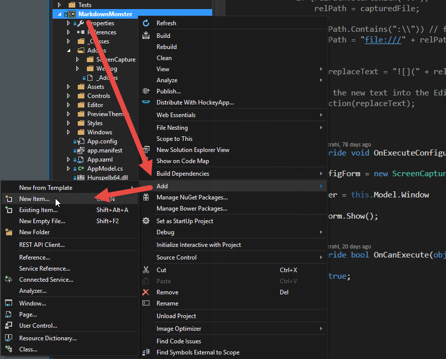
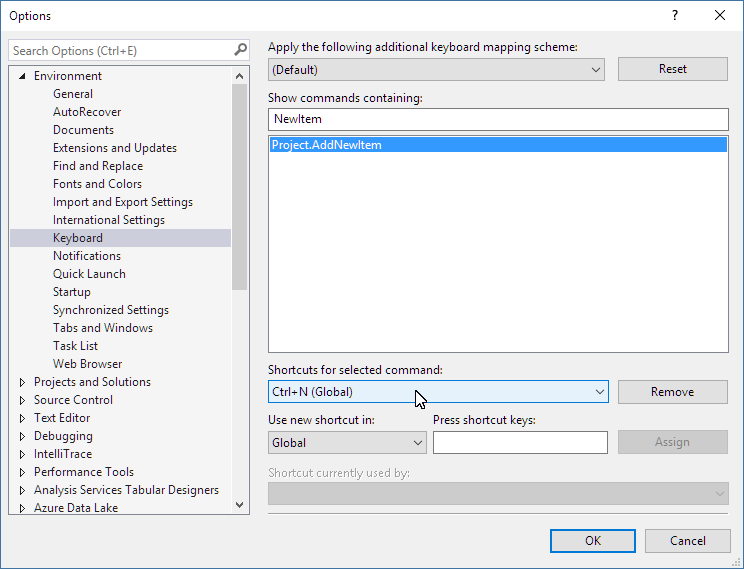
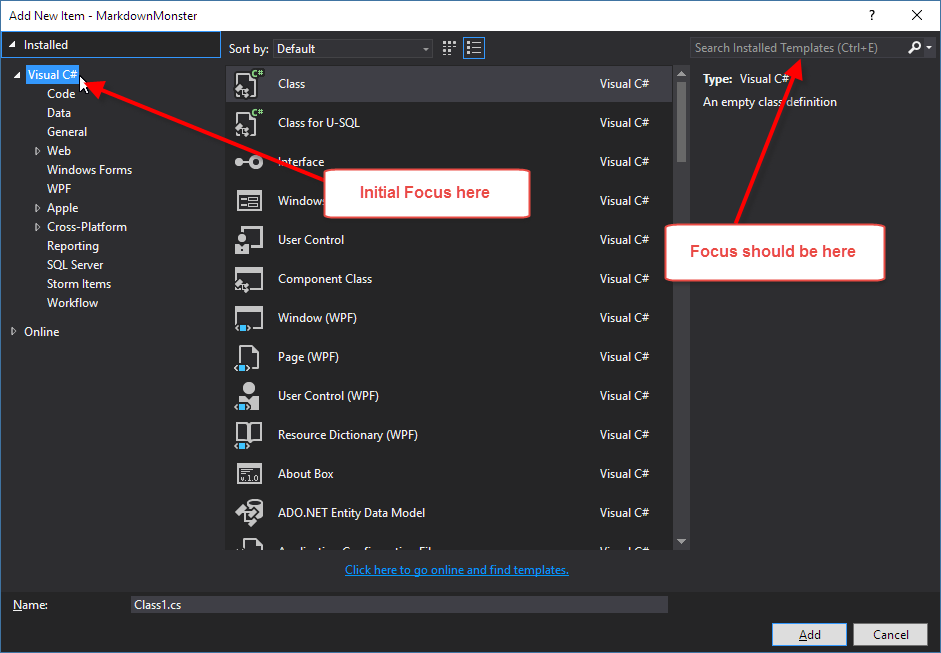
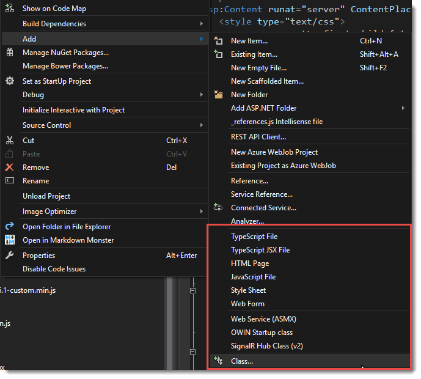
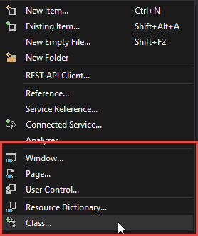
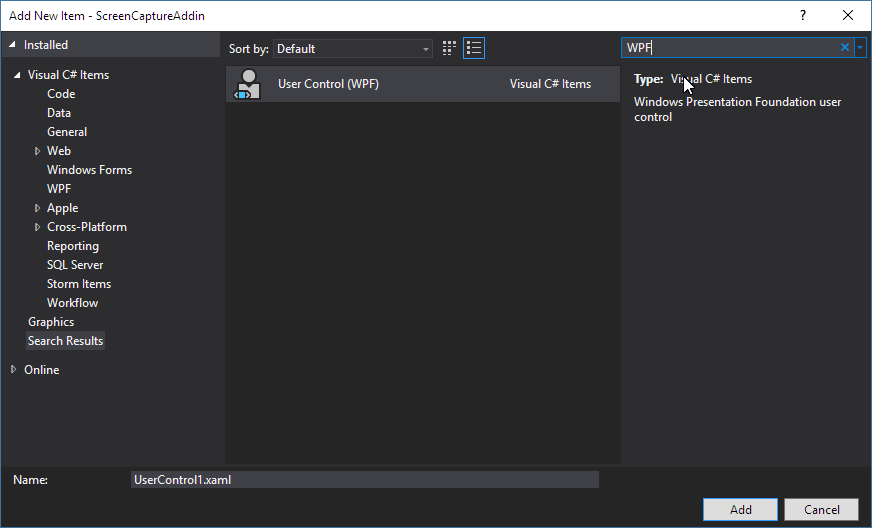
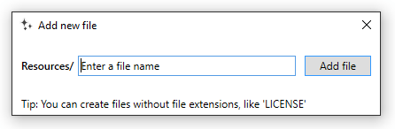
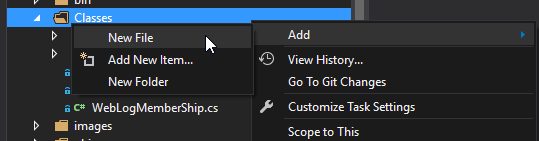
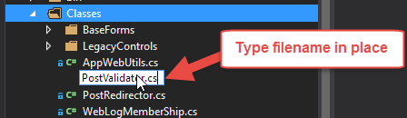
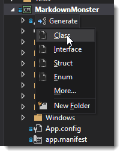

# Adding Files to Visual Studio Projects

When I think of things that annoy me the most in Visual Studio's IDE, the Project **New Item...** Dialog and how it works has to rank at the top of the list.

Adding new files to a project is a common task and honestly I think much of the criticism leveled at Visual Studio from non Visual Studio developers who first use Visual Studio can be traced back to the convoluted way of adding files to a project.

So, here are a few annoyances and a few tips to make adding new items to a project more bearable.

### New Item or New File?
Do you use **New File** or **New Item**? And why are these options buried? The File menu only shows **New File** which is the obvious place to look, but very likely the wrong choice, when you really want the **New Item** dialog.

By default the **New File...** dialog which you want to use most of the time, is not mapped to Ctrl-N as you would expect either - no, that obvious shortcut goes to the **New File** dialog which creates a new file that is not added to the project. Useful in some cases, but generally not applicable when you're working on a project.

The New Item feature is probably the most used context menu action you use at the project level, yet the New Item option is buried in a secondary menu:



The **Add...** option is buried in the middle of the context menu where it's hard to see (because the text is short), and then the **New Item...** option is one level down beyond that. If you're mousing there - it's a pain. 

To me it seems the **New Item...** option should be **at the very top of the first context menu** - not nested - so you don't have to hunt for it. **Add...** can still be there for all the other options, but that **New Item** deserves a more prominent location.

You can also find **New Item...** on the Project menu with  **Project -> New Item** which is a bit easier to discover. But then nobody really looks up there, do they?

##AD##

### Remapping Ctrl-N to the New Item Dialog
Then there are keyboard shortcuts...

As mentioned the default short cut for New Item is **not** Ctrl-N. I'm not sure because of keyboard remappings that happen mysteriously by various installed extensions, but for me the **New Item...** option does not have any key association. 

The obvious key - Ctrl-N - is mapped to the **New File..** dialog, which although similarily named does something completely different. Unlike **New Item**, the **New File** dialog opens a new file loose file and doesn't add it to the project. **New Item** opens a new file and automatically adds it to a project and creates dependent files, adds references etc. that are related to the underlying file template used.

Now I would much prefer Ctrl-N is always mapped to **New Item**. You can fix that easily enough though in the Visual Studio options: 



You just have to make sure that you don't have a key mapping conflict and that nothing else tries to highjack the combo later.

Looks like Visual Studio 2017 defaults **Ctrl-N** to New Item... as you'd expect.

### Use Ctrl-E to jump to Search in the New Item Dialog
Another annoyance is that the New Item Dialog comes up with the tree of high level options selected on the left. You get to pick from the general project types etc. etc. It's nice that that's there, but it's a terrible default. 



It would be much nicer if you could just start typing a type name or extension (html, xaml, ts whatever). But as it is is you have to tab over to the search box or even the item selection list first.

Luckily you can easily use the **Ctrl-E** search shortcut to jump to the search box. Visual Studio recently added the placeholder text into the search box to make that easier to discover, but even so it's easy to miss.

For me, my typical New Item flow is:

* **Ctrl-N** to open new Item Dialog
* **Ctrl-E** to Search box
* **Type search text** like **WPF Window**
* **Tab to list** and scroll to item (if necessary)
* **Tab to filename** and change
* **Press Enter** to add file

That's **a lot of keystrokes** just even with shortcuts to add a new file and that's really what counts as an optimized workflow. This is reasonable only if I need something more complex like a multi-file project item like a WPF form. 

But for a new Class? Do we really need this much overhead to add a single file to a project?

#### The Workflow could be easier!
Ideally I would like to see the New Item search box directly above the list and focused by default. The rest of the flow works as well as you'd expect now.

FWIW, the New Item dialog is a lot faster than what it used to be before Visual Studio 2015 and better yet in VS 2017 RC, now it's a matter of streamlining the workflow inside of it to make it more user friendly and more keyboard friendly especially.

##AD##

### Don't forget the 'Quick' Shortcuts
If you've used Visual Studio for a long time, it's easy to get stuck in a rut and not even pay attention to the menus, but there are actually a number of additional, context sensitive shortcut options on the **Add** shortcut menu:



The menu changes depending on what type of project you are in. The above is for an older WebForms project. The following is for a WPF project and maybe not quite as focused:



These shortcuts don't bypass the **New Item** template but rather open it with the file type you selected already highlight and so is quite a bit quicker to get a new file into a project.

These shortcuts are also available under the **Project** top level menu pad, so **Alt-P** at least gets you quickly to those shortcuts but there's still some keyboarding/mousing to do to select any of them (no shortcut keys) but that's still quicker than using a mouse and the shortcut menu.

### Missing file types
Another annoying problem is that in some project contexts, certain file types are not available. 

For example, I've been working on a WPF project with [Markdown Monster](https://markdownmonster.west-wind.com). MM includes a number of addin class library projects that reference and potentially create their own WPF Windows and Controls. 

Yet when I'm in the **New Item...** dialog there are no options to add a new Xaml Window. There are a million other inappropriate options, but **XAML Window** isn't among them:



Since it's not a single file, but a file with a code behind adding the file manually is quite a pain. The only way that I can effectively do this is to copy an existing window from another project in the same solution and copy it into my project. Then I clear out all the code and rename. That experience really sucks.

All File options should be available to any project type or at the very least to a Class Library project since **anything** can go into a class library.

While I get that the New Item dialog should be context sensitive to the type of project you're using and a WPF form typically doesn't make sense in a Web project, there should still be **an option** to show me everything, since I might be doing something non-standard. In Markdown Monster I have addin projects that can add custom windows, and adding new windows in these project is a royal pain in the butt.

Class library projects in particular though can contain just about anything and you should be able to get at **all the options**.

Keep it context sensitive by default, but at least give me the option of seeing everything via an option box.

### Mads Kristensen's New File Extension
As always, if there's a shortcoming in Visual Studio, [Mads Kristensen](https://twitter.com/mkristensen?lang=en) probably has an extension for it. And true to form there is the [Add New File Extension](https://marketplace.visualstudio.com/items?itemName=MadsKristensen.AddNewFile) which adds the abililty to 'just create a new file':



The extension just lets you type a filename and based on the file name it figures out what template to use and what dependencies to add (which are maintained by the extension, not throught New Item template).

This works great for simple files like C# Classes, JavaScript and TypeScript files, HTML files and number of other single, loose files. It doesn't work quite so well with complex files that are non-Web files. So I can create a Xaml file, and it will create a single empty file, which is not quite so useful as it doesn't hook up the window and code behind (which is painful to do manually).

The addin is also pretty minimal - it mostly creates empty files. So a C# file contains only a `using System` namespace header for example. You get to create the class. Still in many cases this is actually quicker to type in the missing code than going through the new item template UI and having it spit out a template that you have to then refactor to give it the right name and scope. 

The extension is mapped to **Shift-F2** by default so you can get there very quickly, type your filename and off you go.

It's a wonderful tool that I use quite frequently especially for C# classes in a project - it's by far the quickest way to get a new class into a project.

##AD##

It works, especially for single files like classes, HTML, JS, TS etc. But for other things the templates are perhaps a bit limited. Typing in a XAML file doesn't create a codebehind file for example (which makes sense since you wouldn't know what type of xaml it is). Still even with this limitation it's a great easy to use addition to Visual Studio. [Go get it now](https://marketplace.visualstudio.com/items?itemName=MadsKristensen.AddNewFile) if you don't already have it installed and remember **Shift-F2**.

### Visual Studio 2017 - some improvements
Visual Studio 2017 sets the Ctrl-N shortcut properly to the New Item dialog as it should be. 

For project templates it seems there's no change, but there's a new solution-less Folder Project mode that offers much, much lighter weight adding of files.



followed by letting you type the filename into the project template:



although that creates a completely blank file without any templating at all which isn't... really all that useful.

The really sad part is that this feature only works in Folder projects, which are essentially just file based projects that show you what's on disk - ie. the VS Code or Sublime style approach. It doesn't work in normal projects. for that we have to stick to Mads' extension.

### Resharper's Shortcut Menu
[Resharper](https://www.jetbrains.com/resharper/) also has a context menu that makes this a little easier. Press Alt-Insert and you get project context sensitive options to add new files.



This works very fast and well for the base items on this menu like Class, Struct, Interface and Enum. But even though there's a **More...** option that brings up a dialog with more options, the choices there are rather limited. For example, in a WPF project I only see Resource Dictionary, not User Control, Window, Resources etc. that you would expect.

### Summary
Visual Studio and support tools provide a huge variety of ways to create new items in projects, but most are rather key intensive. Visual Studio really is in need of a very quick and keyboard (or single mouseclick of the context menu) centric approach to getting new files into a project. The current New Item dialog which most people use is a dreadful waste of developer time.

Even with all of those different ways to get files into a project it still seems the process is incredibly task intensive. The VS 2017's Folder Project seems like a good starting point as an alternate option, but more file type focused templates are required to make that more viable. Mads' extension provides some of that, but this is something so fundamental that it should be baked in. After all just about any editor supports quick editing of files.

Why am I harping on this? I'm convinced that this is one of the main reasons people people perceive Visual Studio as a slow beast. The new file dialog and co is the epitome of what a prescribed approach offers and by forcing people down a complex path to do simple things you're creating a perception of complexity and overbearing. The prescribed approach is very useful, but you should also have quicker and easier options available, preferably by default.

Regardless, for today's needs, with so many options available it pays to review your process of how you perform common tasks like adding files to projects to shave off some precious developer seconds wasted on repetitive tasks like adding files to a project.


<div style="margin-top: 30px;font-size: 0.8em;
            border-top: 1px solid #eee;padding-top: 8px;">
    
    this post created with 
    <a href="https://markdownmonster.west-wind.com" 
       target="top">Markdown Monster</a> 
</div>

<!-- Post Configuration -->
<!--
```xml
<blogpost>
<title>Adding Files to Visual Studio Projects</title>
<abstract>
Visual Studio has a boat load of ways to add new files to a project and various extensions and tools provide even more ways to do the same. Even so the experience to add new files to a project in Visual Studio is one of the most tedious tasks. Here's what bugs me and how I try to work around the verbosity of it all.
</abstract>
<categories>
Visual Studio
</categories>
<keywords>
Visual Studio,New File,Dialog,Add,Class
</keywords>
<isDraft>False</isDraft>
<featuredImage></featuredImage>
<weblogs>
<postid>126204</postid>
<weblog>
West Wind Web Log
</weblog>
</weblogs>
</blogpost>
```
-->
<!-- End Post Configuration -->
