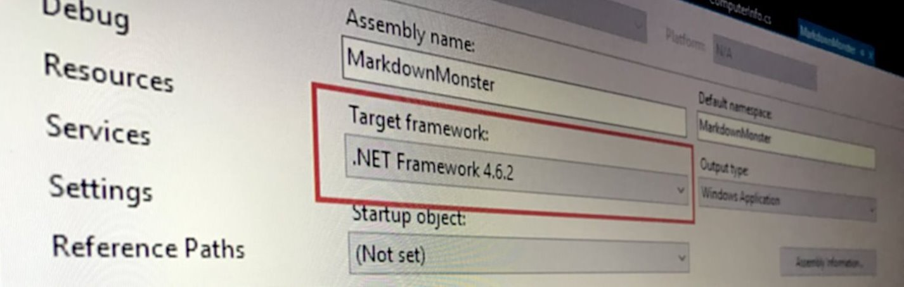
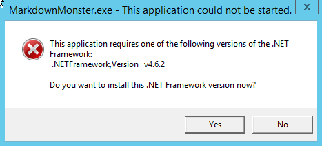
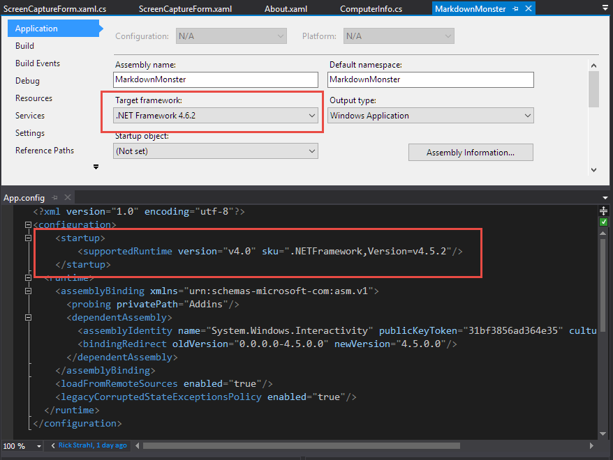

# Faking out the .NET Runtime Version



I've been struggling with a high DPI problem in [Markdown Monster](https://markdownmonster.west-wind.com) as it relates to the built-in screen capture functionality. In a nutshell, if running a second (or third) monitor that is using High DPI scaling, the screen capture selection mechanism fails to properly select desktop windows. WPF doesn't understand multi-monitor DPI scaling so it uses the first monitor's DPI setting for mapping screen locations which causes the screen capture highlight windows to be off by a given ratio. There are ways to figure out the right ratios, and manually force WPF into multi-monitor DPI mode, but there are other issues that make this very difficult (involving a bunch of native code) to solve on .NET 4.6.1 and earlier.

The good news is that .NET 4.6.2 introduces some new runtime features that make WPF multi-monitor scale aware and provides system metrics correctly on multiple, scaled displays. First shot running on 4.6.2 proves the basic code that works on a single monitor, now also works on secondary monitors. Yay!

Problem solved right?

##AD##

### .NET Runtime Adoption
Not so fast. The current version of Markdown Monster runs against .NET 4.5.2 which is typically my go to version of .NET that I use for destop/console applications. It's been out for a long time and available on just about any machine that runs at least .NET. 4.5 was released with Windows 7 and 4.5.2 was released as part of one of the follow up releases. In short - you can pretty much assume 4.5.2 is always there on Windows 7 or better machines which is all that Markdown Monster supports anyway. For the few others - well, let them download a later version.

There have been very few API changes in later versions, although there have been some nice runtime enhancements (new 64 bit compiler, better garbage collector, improved memory management, DPI management improvements - all in 4.6) but really these features are all pretty minor.

Until last week 4.6 and the new features were all "Meh!" to me. Until I needed a feature in the new version - 4.6.2.

Particularily this feature:

> ####  @icon-desktop Per-Monitor DPI Support
>WPF applications are now enabled for per-monitor DPI awareness. This improvement is critical for scenarios where multiple displays of varying DPI level are attached to a single machine. As all or part of a WPF application is transitioned between monitors, the expected behavior is for WPF to automatically match the DPI of the app to the screen. It now does.
>
>In previous versions, you would have to write additional native code to enable per-monitor DPI awareness in WPF applications.

Ok, so now it's time to ship 4.6.2, right? Done and done!

Uh, no not quite.  4.6.2 is relatively new and a lot less people are running 4.6.2 compared to 4.5.2 or even 4.6.1 which means people have to deal with downloads of the .NET Runtime when launching for the first time:



Ack! Not what I want to see, especially when I'm running an application I just installed for the first time. 

This is what you see when you try to run Markdown Monster on one of my test VM machines that has only 4.6.1 installed. Not only that but I actually found out that even my dev machine, which usually is pretty much up to date with Insider builds and various beta software also didn't have .NET 4.6.2 installed. Saaaay whaaaaat? I was as surprised as you might be :-)

So **requiring** 4.6.2 would come with some pain for users that I'd rather not imbue upon them.

So, now what?

### A quick review of .NET 4.0 Runtimes
When .NET 4.0 was released and the subsequent .NET 4.5 and 4.6 releases, .NET changed direction when it came to version updates. 

> All .NET 4.x.x Runtime updates are **in-place** updates replacing older versions of the runtimes.

This means when you install a new version of .NET 4.x.x you replace whatever previous version of .NET 4.x.x you had previously installed. On a system that runs 4.6.2 you can run applications that require 4.0, 4.5, 4.5.1, 4.5.2, 4.6 and 4.6.1 - 4.6.2 supersedes all these previous versions and replaces all previous ones. A machine that 4.5.2 installed can run all 4.x versions and up to 4.5.2 and so on.

It's debatable whether this is a good idea or not, but it does make it easy to stay up to date. When a new version comes around you can simply update and get all the features of the new runtime. All your old apps requiring older versions continue to run. New apps that want to use latest also work. And as a benefit, you also get the benefits of internal fixes and optimizations even if your app is targeting an older version of the framework. 

It's important to understand that you always run the same, installed version of the runtime regardless of the compiler targets. Even when you target .NET 4.0 you are running against the installed runtime of 4.6.2 (or whatever). The idea with this is that you are always using the latest runtime, which - if Microsoft is doing their job right - **should always be backwards compatible**: Old code should always work on the new runtime. And for the very largest part, Microsoft has upheld that premise.

When you pick a particular runtime, .NET compiles against a version specific set of **reference assemblies** (see [Immo's recent and excellent video on Reference Assemblies for more info](https://www.youtube.com/watch?v=EBpY1UMHDY8)) so the compiler knows **exactly** what's available for the targeted version. 

> The actual installed runtime that your runtime application binds to is **always the same**, regardless of whether you run a 4.0 or 4.6.2 application. 
>
>The version specific compiler target simply denies you access to the parts of the runtime that the targeted version does not support.


To specify which runtime is used, you compile against a specific .NET Runtime Target as set in the project file, and specify a runtime hint in the form of a configuration setting in your `app.config` file for when the app starts:

```xml
<?xml version="1.0" encoding="utf-8"?>
<configuration>
    <startup> 
        <supportedRuntime version="v4.0" sku=".NETFramework,Version=v4.6.2"/>
    </startup>
</configuration>
```

The hint really tells .NET to look for that version and if it doesn't exist throw up the runtime not installed error shown earlier.

> The hack here is this: You can change the runtime hint and force .NET to think it's loading a different version than what you compiled against. 

Like it or not, for the most part this scheme - although seemingly full of pitfalls - is working out pretty well for .NET.

##AD##

### Fakeout: Compiling against a newer Versions, Specifying an Older One
Ok, back to my DPI Scaling problem. My issue is that I would like to use .NET 4.6.2's new features, but I don't want force a new installation hit for users that don't have .NET 4.6.2 right now. I want my cake and I want to eat it too!

In order to get the new DPI features to work **I have to** compile my application and target .NET 4.6.2:



But! I can **also** specify the runtime version to a lower version in my app.config file as shown above. So compile against 4.6.2, but hint for 4.5.2.

Gotcha!


Now when I run my application it is actually compiled against 4.6.2 (ie. the 4.6.2 features are enabled), but the actual loader thinks it's running 4.5.2. 

What this means is:

If I have .NET 4.6.2 installed I get all runtime enhancements of 4.6.2. For me this means I get the new DPI Scaling features from 4.6.2 **if 4.6.2** is installed on the machine. 

If I don't have 4.6.2 installed the app still runs but simply uses whatever features are available on the older version. It just works as long as I don't hit .NET feature API that don't exist in 4.5.2.

In practice this means on my dev machine that has 4.6.2 I see the correct behavior of the application in regards to multi-monitor DPI scaling for the screen capture. On my VM that runs 4.6.1, that same code does not work. And the Win7 VM running 4.5.2 works fine, but the multi-monitor DPI code doesn't work properly there either. The bottom line is that I get exactly what I expect: It works perfect when 4.6.2 is installed, and older versions run without prompting for an .NET Runtime update.

Note, given what I said earlier about running newer version of the runtimes you would think even compiling 4.6.1 should work when 4.6.2 is installed - I tried, but it doesn't work. The new DPI features only work in 4.6.2 so there must be some internal runtime checking happening in the WPF code.

### Watch your APIs!
The big caveat with this is that if you reference any new features that are newer than 4.5.2 (what I specify in the `app.config`), then those features will break **at runtime**.

Since the DPI features I'm interested in are not accessed from code, but rather are internal to the runtime, things **just work** when 4.6.2 is installed and fall back to existing 4.5.2 behavior (or whatever version in between is installed) when it's not.

IOW - best of both worlds!

> Faking Runtime Versions is a hacky way to have my cake - a widely available runtime without new installs - and eat it - get newer runtime features **if available**.

##AD##

### Hack Alert!
Using this kind of runtime fakery has some big caveats:

If you accidentally reference APIs that are newer you can cause errors that you may never see yourself while testing, because presumably you're using a recent runtime. Since you're running the newer version all works fine for you, but may not for those running older versions. It may be hard to duplicate those errors because you are not running that older runtime.

Remember any failures then are **runtime failures** - the compiler thinks I'm building a 4.6.2 application so it won't be any help telling me when I'm using a newer API. You won't see the failure until that code runs and then only on a machine that's running on the older version.

A good way to get the compiler to help in this scenario is to roll back your app to the runtime version you expect to be the lowest you want to run and make sure there aren't any illegal APIs. So in my case I should compile against 4.5.2 just to ensure that I'm not using newer APIs. If Ok then I can switch back to 4.6.2 when ready for the final build.

In reality the deltas between .NET versions is pretty small. I can't think of any post 4.5 features I use in any of my code. For example, there isn't a single thing in Markdown Monster that breaks during compilation between the two targets.

### Summary
So, is this something you should do with your application? Definitely not, **unless you have a really, really good reason to do so**, and you know what you're getting into.

Ultimately the official and best solution is to go ahead install the actual target version that you want to run, which in my case would be 4.6.2. And perhaps that's Ok for your app. Installing a .NET version update isn't the end of the world especially if the percentage of people who need to do so is relatively small.

For Markdown Monster we're seeing less than half of people using .NET 4.6.2 (at least from our error logs), but with 4.6.1 we get closer to 80%. Given that 60% of people running MM for the first time would have to install the .NET runtime if I forced 4.6.2, this is not the experience I want to shoot for. It's hard enough to get people to try out new software in the first place, without scaring them off by having to install another system component for the privilege.

In addition, quite a few people are skiddish about installing new versions of .NET, especially the 4.6 versions which initially had a number of breaking changes/bugs that have since been addressed and have gotten somewhat of a bad rap.

For me and Markdown Monster using this hybrid approach lets me run 4.6.2 where available and lets everybody else get a less perfect experience for the multi-monitor DPI experience, but in return require no upgrade, which is a good compromise for me. 

If that feature is important enough to warrant a .NET upgrade, they can do so on their own terms without being forced into it. It's a compromise I can happily live with. As time goes on more people will end up on 4.6.2 (or later) and this problem will fade away.

Just remember: Caveat Emptor, for you and your applications your mileage may vary.

### Resources

* [Try it out: Markdown Monster](https://markdownmonster.west-wind.com)


<!-- Post Configuration -->
<!--
```xml
<blogpost>
<title>Faking out the .NET Runtime Version</title>
<abstract>
I've been struggling with DPI Scaling issues in WPF in Markdown Monster and .NET 4.6.2 has a few fixes that address the problems I've been working on. However, requiring 4.6.2 is a problem due to lowish adoption rates and skittishness about installing new versions of .NET. In this post I show a little hack that allows me to compile my app to .NET 4.6.2 but don't require user to have that version installed so those that have it can take advantage of the updates.
</abstract>
<categories>
WPF, .NET, Windows
</categories>
<keywords>
DPI,WPF,.NET Runtime,.NET,
</keywords>
<isDraft>False</isDraft>
<featuredImage>https://weblog.west-wind.com/images/2017/FakingOutTheDotnetRuntime/RuntimeFaking.jpg</featuredImage>
<weblogs>
<postid>112755</postid>
<weblog>
West Wind Web Log
</weblog>
</weblogs>
</blogpost>
```
-->
<!-- End Post Configuration -->
