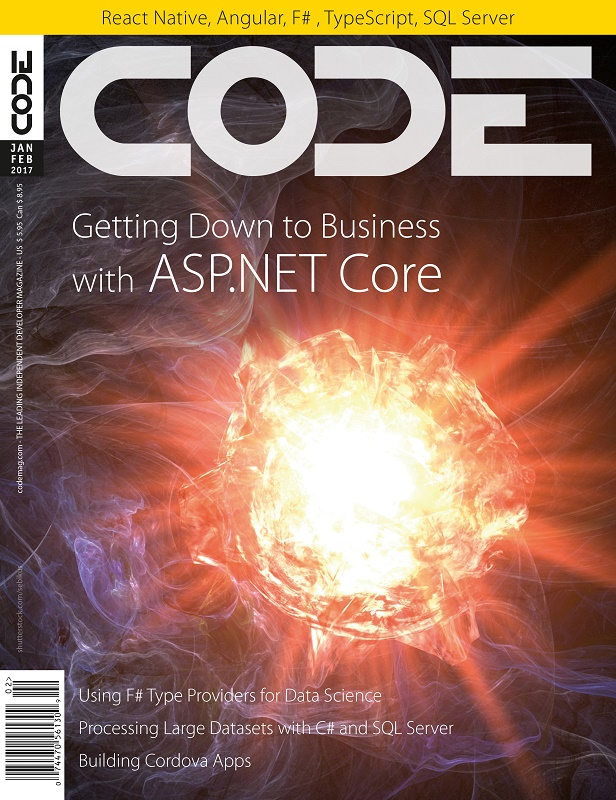

# New CODE Magazine Article: Getting down to Business with ASP.NET Core

The January/February 2017 issue of Code Magazine has an ASP.NET Core article of mine as the lead cover article:

[](http://www.codemag.com/Magazine/Issue/5ea99ef6-fff5-49cc-98d3-8c63942c4a27)

Yay!

You can check out the magazine when it arrives, or you can take a look online on the CODE Magazine Site to read it there:

* [Getting down to Business with ASP.NET Core](http://www.codemag.com/Article/1701061)
* [Get a print copy of CODE Magazine](https://www.codemag.com/magazine/subscribe/rickstrahl)


### Two ways to approach ASP.NET Core
The article is a follow up to my previous [Getting to the Core of ASP.NET Core Article](http://www.codemag.com/article/1609071) article which took a very low level approach to describing how ASP.NET Core works from the ground up using command line tools and working its way up from the very basics to a simple Web application.

This new article takes a different approach and discusses how to build a more typical ASP.NET Core backend to an Angular front end application. The article focuses only on the backend (I'll cover the Angular 2 front end in a later article perhaps) and building a REST based service to provide the data to the Angular 2 front end. 

The sample application is a mobile friendly Album Viewer Web application that you can check out here:

* [Album Viewer online Sample](https://samples.west-wind.com/AlbumViewerCore/#/albums)  


* [West Wind AlbumViewer on GitHub](https://github.com/RickStrahl/AlbumViewerVNext)

Here's what the app looks like in desktop mode:


and here in Mobile mode on a phone:


This CODE magazine article focuses entirely on the ASP.NET back end portion of the application and describes how to set up a new ASP.NET Core project, separate business and Web logic into separate projects. As with the last article the pace is such that I start at the very beginning with the basics and then build up from there. You'll see how to build up an entity model to return your data, deal with Entity Framework 7's different and more limiting features in a business object, and much more. I start with simple query results, go into more complex queries and updates that require more than a simple update. In short - the typical things you run into when you build a real world application. While the sample is fairly simple, it does highlight many real world issues that you run into.

In addition the article also points out a few side issues like ensuring your app can serve proper CORS content so you can test a Javascript front end application that runs on a different domain/port properly and setting very simple authentication without delving into the .NET Identity morass.

At the end I also demonstrate how to switch the database engine - I start with SQL Server and then switch to SqLite - and then move the entire application as is to a Mac and run the ASP.NET server without changes from there.

All in all this article covers a wide swath of features that you are very likely to deal with in even the simplest applications.

Check it out - I hope it'll be interesting and or useful to you in picking up ASP.NET Core.

### Read a Magazine!
There aren't many magazines left around with so much online content around, but it sure is nice holding a paper copy in your hand sometimes. I still love the feel of reading an actual paper issue - especially if it has one of my own articles in there :-)

CODE has a special deal going for signing up for a subscription, so check it out

* [Sign up special for CODE Magazine](https://www.codemag.com/magazine/subscribe/rickstrahl)


<div style="margin-top: 30px;font-size: 0.8em;border-top: 1px solid #eee;padding-top: 8px;">
    
    this post created with 
    <a href="https://markdownmonster.west-wind.com" target="top">Markdown Monster</a>
</div>


<!-- Post Configuration -->
<!--
```xml
<blogpost>
<title>New CODE Magazine Article: Getting down to Business with ASP.NET Core</title>
<abstract>
The latest issue of CODE magazine features my `Getting down to Business with ASP.NET` Core article as the cover article. The article focuses on building an ASP.NET Core backend for an Angular 2 front application, covering all aspects of separating business and Web app logic, dealing with EF Core data access in related tables, CORS to be able to run across domains and simple authentication in a client centric REST service application. Check it out.
</abstract>
<categories>
ASP.NET Core, ASP.NET, Angular
</categories>
<keywords>
ASP.NET Core,REST, Angular, EF Core, Repository,CORS
</keywords>
<isDraft>False</isDraft>
<featuredImage>https://weblog.west-wind.com/images/2017/New%20CODE%20Magazine%20Article%20Getting%20down%20to%20Business%20with%20ASP.NET%20Core/aspnetcoreArticle.jpg</featuredImage>
<weblogs>
<postid>114979</postid>
<weblog>
West Wind Web Log
</weblog>
</weblogs>
</blogpost>
```
-->
<!-- End Post Configuration -->
