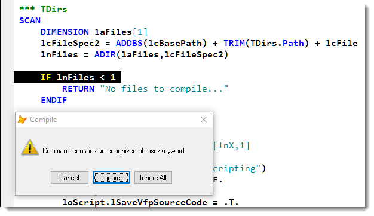
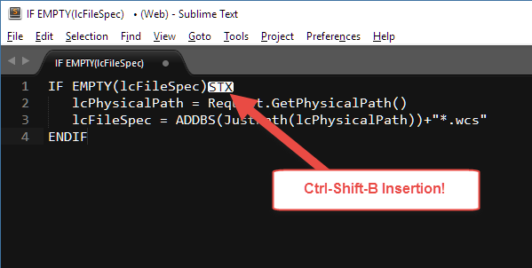
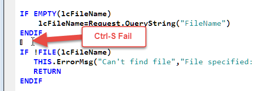

# Syntax Errors in the FoxPro Editor caused by Extended Characters
I keep running into weird errors, when trying to save program files in the FoxPro editor on occasion. For some reason I end up with errors like the following:



What could be wrong with that line of code? Even if the variable name was invalid the compiler should always be able to process a simple expression like this, right?

10 minutes later and after checking the code around it, I finally figure out that I have to...

### Watch those Control Characters
If you look closely at the line of code highlighted, you'll notice that there's an extra space at the end of that line. Or rather what **appears** to be an extra space.

As it turns out that's no space - it's an invisible control character sequence that I accidentally inserted by way of my Visual Studio biased fingers :-) I pressed Ctrl-Shift-B to build my project (a Visual Studio key combo) which in turn embedded a character combination into the editor. That *invisible* character is interpreted as an extra character on the line of code and so the line actually becomes invalid. 

It becomes obvious if you take the text and paste it into another editor like Sublime Text:



The result: The code doesn't compile and you get the above error. Remove the extra character an life is good again.

### Moral of the Story
This happens to me on a regular basis. The FoxPro editor is notorious for its crappy handling of control characters - even those it knows about like Ctrl-S. For example, if you hit Ctrl-S multiple times in a row quickly the first time will save, while subsequent Ctrl-S combos will inject characters into the document.



This also causes syntax errors which often get left in the document, but at least this one you can see and the compiler can point you at the offending line or code block.

Other key combos though - like my **Ctrl-Shift-B** compile twitch are more difficult to catch when the compiler complains because they are invisible and it looks like there's nothing wrong.

The ultimate moral of the story is: If you see an error that clearly isn't an error make sure it's not just an extra character that snuck into the document.


<div style="margin-top: 30px;font-size: 0.8em;
            border-top: 1px solid #eee;padding-top: 8px;">
    
    this post created with 
    <a href="https://markdownmonster.west-wind.com" 
       target="top">Markdown Monster</a> 
</div>

<!-- Post Configuration -->
<!--
```xml
<blogpost>
<title>Syntax Errors in the FoxPro Editor caused by Extended Characters</title>
<abstract>
The FoxPro editor is prone to allow extended cahracters into the editor - some of which may be invisible and can cause some really nasty compiler bugs that are 'invisible'. Here's an example how that happened to me and how it caused me to think I'm going nuts.
</abstract>
<categories>
FoxPro
</categories>
<keywords>
FoxPro,Editor,Control Characters,Compiler Error
</keywords>
<isDraft>False</isDraft>
<featuredImage>http://west-wind.com/wconnect/weblog/imageContent/2017/Syntax Errors in the FoxPro Editor caused by Extended Characters/SyntaxError.png</featuredImage>
<weblogs>
<postid>924</postid>
<weblog>
Web Connection Weblog
</weblog>
</weblogs>
</blogpost>
```
-->
<!-- End Post Configuration -->
