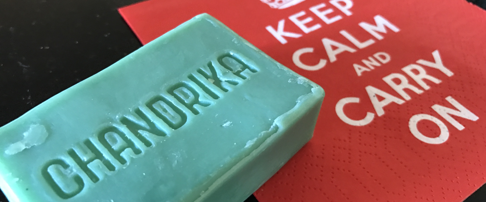

# Empty SoapActions in ASMX Web Services



I still deal with a lot of customers who need to interact with old school SOAP services. Recently I worked with a customer who needed to implement a SOAP Service based on an existing WSDL specification. If at all possible I try to avoid WCF for 'simple' SOAP services, as ASMX services are almost always easier to implement, deploy and maintain than the morass that is WCF.

As is often the case with SOAP (and XML/Schemas) getting this service set up to match the behavior of an existing service ran into a few snafus. Namespaces had to be customized and a few types had to be adjusted. That's pretty much standard fare.

### 'Empty' SoapActions? Really?
But another problem and the focus of this post is that several of the SOAP clients that are calling this service where calling this service with empty `SOAPAction` headers.

```txt
SOAPAction: ""
```
Uh - Ok. 

While this apparently legal per SOAP spec, it's a pretty pointless thing to do. Also as it turns out, ASMX Web Services do not like the empty soap header.

When you try to call it like this:

```xml
Content-Type: text/xml
Connection: Keep-Alive
SOAPAction: ""
Accept: */*

<soap:Envelope xmlns:soap="http://schemas.xmlsoap.org/soap/envelope/" 
               xmlns:ns2="http://theirdomain.com/theirservice">
	<soap:Body>
	<ns2:getNextOrder  />
	</soap:Body>
</soap:Envelope>
```

Notice the blank SOAPAction. This then results in this lovely error:

```xml
<?xml version="1.0" encoding="utf-8"?>
<soap:Envelope xmlns:soap="http://schemas.xmlsoap.org/soap/envelope/" xmlns:xsi="http://www.w3.org/2001/XMLSchema-instance" xmlns:xsd="http://www.w3.org/2001/XMLSchema">
  <soap:Body>
    <soap:Fault>
      <faultcode>soap:Client</faultcode>
      <faultstring>System.Web.Services.Protocols.SoapException: Server did not recognize the value of HTTP Header SOAPAction: .
   at System.Web.Services.Protocols.Soap11ServerProtocolHelper.RouteRequest()
   at System.Web.Services.Protocols.SoapServerProtocol.RouteRequest(SoapServerMessage message)
   at System.Web.Services.Protocols.SoapServerProtocol.Initialize()
   at System.Web.Services.Protocols.ServerProtocolFactory.Create(Type type, HttpContext context, HttpRequest request, HttpResponse response, Boolean&amp; abortProcessing)</faultstring>
      <detail />
    </soap:Fault>
  </soap:Body>
</soap:Envelope>
```

> System.Web.Services.Protocols.SoapException: Server did not recognize the value of HTTP Header SOAPAction: .

### What's the problem?
If you take a closer look at the expected inputs for the service methods from the ASMX test pages you can see that SOAP 1.1 expects a SOAPAction with the method name specified:

**SOAP 1.1**

```xml
POST /pinnacleApi/PinnacleOrderService.asmx HTTP/1.1
Host: localhost
Content-Type: text/xml; charset=utf-8
Content-Length: length
SOAPAction: "getNextOrder"

<?xml version="1.0" encoding="utf-8"?>
<soap:Envelope xmlns:xsi="http://www.w3.org/2001/XMLSchema-instance" xmlns:xsd="http://www.w3.org/2001/XMLSchema" xmlns:soap="http://schemas.xmlsoap.org/soap/envelope/">
  <soap:Body>
    <getNextOrder xmlns="http://order.ejb3.session.server.p2.actual_systems.com/" />
  </soap:Body>
</soap:Envelope>
```
SOAP 1.2 on the other hand does not require a soap header:

```xml
POST /pinnacleApi/PinnacleOrderService.asmx HTTP/1.1
Host: localhost
Content-Type: application/soap+xml; charset=utf-8
Content-Length: length

<?xml version="1.0" encoding="utf-8"?>
<soap12:Envelope xmlns:xsi="http://www.w3.org/2001/XMLSchema-instance" xmlns:xsd="http://www.w3.org/2001/XMLSchema" xmlns:soap12="http://www.w3.org/2003/05/soap-envelope">
  <soap12:Body>
    <getNextOrder xmlns="http://order.ejb3.session.server.p2.actual_systems.com/" />
  </soap12:Body>
```

and figures out the service action based on the element name inside of the SOAP body - `getNextOrder` in this case. 

For this customer the request is actually running as a SOAP 1.2 request, but the included SOAPAction makes the ASMX engine think that the request is coming in as a SOAP 1.1 request. ASMX gets confused by the empty SOAP Action and hence the error message.

### How to fix this?
Luckily there's an easy solution to this problem which involves stripping off the SOAP header if it is 'empty'. And by empty I mean blank or as in the case of this particular client `""`.

The 'official' way to manage request and response manipulation in ASMX services involves creating a [SoapExtension](https://msdn.microsoft.com/en-us/library/7w06t139(v=vs.100).aspx), which involves creating an extension which then has to look at the incoming request stream and rewrite it.

But there's actually a much easier solution by falling back to `System.Web` features. Since ASMX Services run in the ASP.NET `System.Web` pipeline we can actually manipulate the incoming ASP.NET request directly and simply do this:

* Make sure there's a Global.asax file in your project
* Add a Application_BeginRequest method like this:  
```cs
void Application_BeginRequest(object sender, EventArgs e)
{
    var soapAction = Request.Headers["SOAPAction"];

    if (string.IsNullOrEmpty(soapAction) || soapAction == "\"\"")
        Request.Headers.Remove("SOAPAction");
}
```

### Summary
Clearly this is a special use case that doesn't happen very often, but when it comes to Soap clients doing weird stuff that's certainly not uncommon. You never know what you're going to get especially when interfacing with an existing legacy application running somewhere else.

Nobody seems to ever do SOAP the same way.

I like running ASMX services rather than WCF because there's a lot of things you can tweak more easily with ASMX services and this is a good example. I reserve usage of WCF for WS* services and there WCF's complexity is actually warranted for the tweaking of request/response messages. If this was WCF I'd have to look into message parsers and a hierarchy of classes to implement just to make a simple change in the request pipeline. Here I can simply change a header using the standard ASP.NET features which is nothing short of trivial and which makes for a nice quick fix.

Now if we could only say goodbye to SOAP altogether for good, life would be a lot easier :-)

<!-- Post Configuration -->
<!--
```xml
<blogpost>
<title>Empty SoapActions in ASMX Web Services</title>
<abstract>
Recently I had to deal with an ASMX Web Service that was receiving empty SoapActions from the client. ASMX doesn't like that, but luckily there's an easy work to strip out the errant Soap header.
</abstract>
<categories>
ASP.NET,Web Services
</categories>
<keywords>
ASMX SOAPAction Empty ASP.NET
</keywords>
<isDraft>False</isDraft>
<featuredImage>http://west-wind.com/wconnect/weblog/imageContent/2017/Empty-SoapActions-in-ASMX-Web-Services/SoapAction.png</featuredImage>
<weblogs>
<postid>142001</postid>
<weblog>
West Wind Web Log
</weblog>
</weblogs>
</blogpost>
```
-->
<!-- End Post Configuration -->
