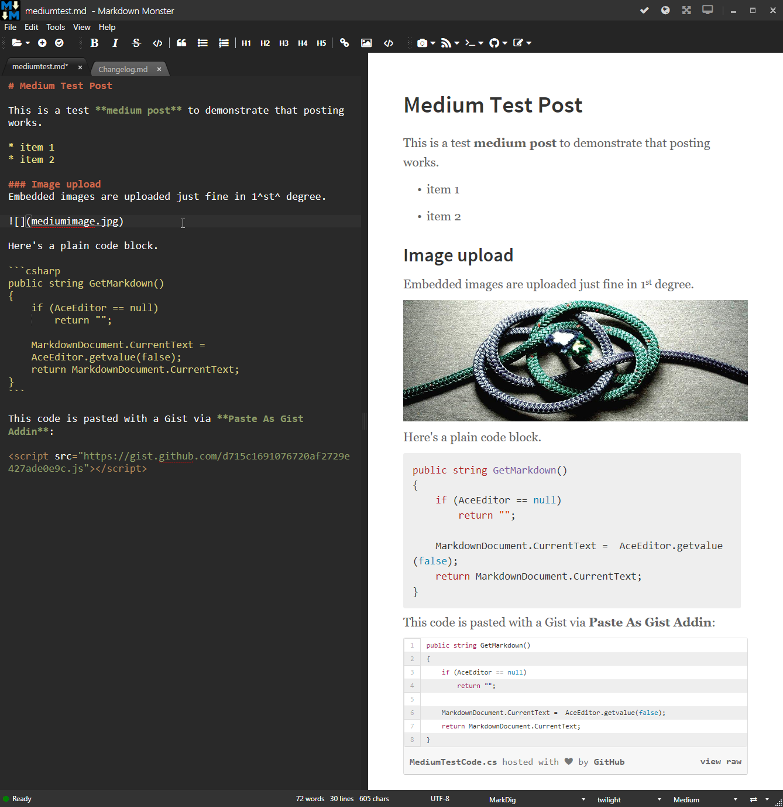
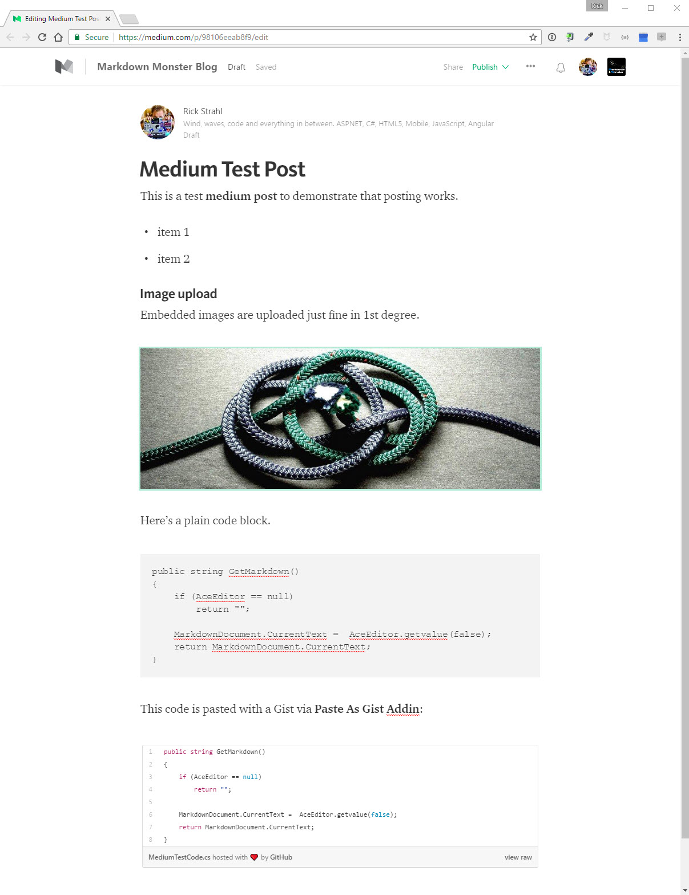
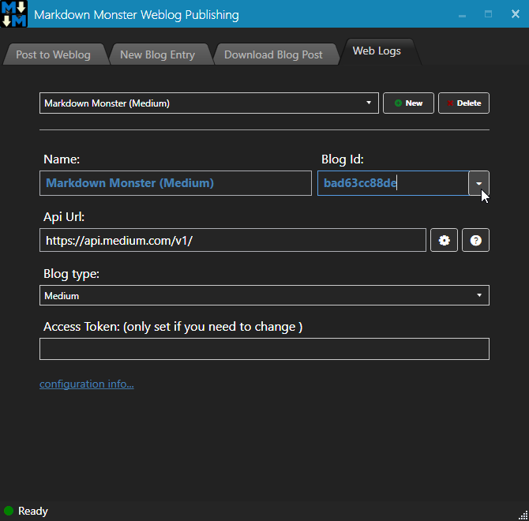
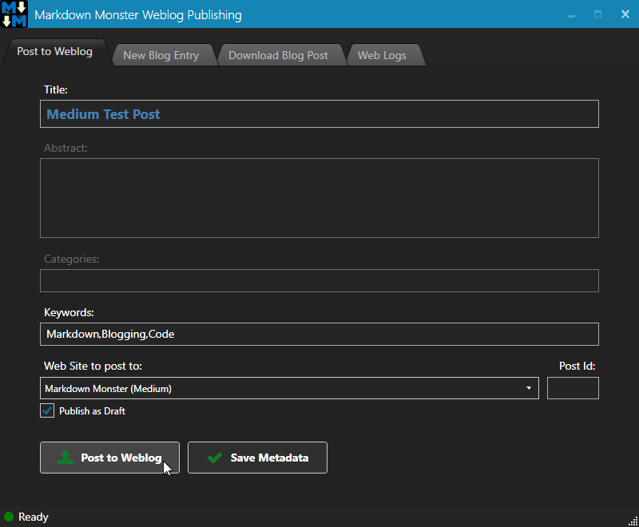

# Medium Publishing Support in Markdown Monster

I've just hooked up Medium Weblog publishing support in [Markdown Monster](https://markdownmonster.west-wind.com). A lot of people are posting on Medium platform these days, and there have been a fair number of requests for using Markdown to create new Stories/Posts. It's a nice option to create your initial content in Markdown Monster and then push it up to Medium when you're ready to publish.

Here's a test post created in Markdown Monster:



and the corresponding post when published on Medium:



### Good News, Bad News
The good news is that basic Medium publishing support is now available in Markdown Monster. The bad news is that support is limited to **one-time publishing** of a story/post, because **the Medium API doesn't support updating of existing posts**. 

Wait what? Yup, Medium lets you push a story to their server via their API, but it doesn't have any support at all for updating existing posts or even downloading of existing posts (unless you use some other means like the RSS feed). So you can push an initial post, but there's no way to externally update it -- you can only do that in Medium's Web editor.

Lame, right? It's clear that Medium has no interest in opening up publishing any more than this limited API since it's been in place for a couple of years now. There was talk of extending it by some medium folks but that never was actually followed up and here we are.

### Code Snippets
Another issue with Medium for software developers is that Medium doesn't have any built in code highlighting. If you post markdown code as shown in the screen shots above in the first code block, the code will be formatted, but show no syntax coloring. 

It works, but kind of a bummer - if you have posts with lots of code the non-highlighted code looks pretty boring.

There are alternatives:

1. Use ScreenShots of Code
2. Embed Github Gists


I'm not a big fan of option 2. If you have to change code later as invariably happens because of comments :smile:, you have to re-shoot and upload another image. This certainly is supported and Markdown Monster's ability to just paste images from the clipboard certainly makes that process pretty easy. But it's still a pain, and users can't easily copy code, nor is the code 'really there' and indexed by search engines. For me personally images are a non-starter.

Another option is to some sort of code embedding service like Github Gists. There's a Paste Code As Gist addin that you can install from the addin manager that makes it easy to highlight a block of code in your text and create a Gist from it that gets embedded into your document.

Here's what that embedded Gist looks like inline

<script src="https://gist.github.com/d715c1691076720af2729e427ade0e9c.js"></script>

### Configuration for Medium
Configuration for medium involves setting up a new Weblog in the Weblog Publishing dialog.

* Open the Weblog Publishing Dialog
* Go to the Web Logs tab

You'll see this:



To set up a new Medium Account follow these steps:

* Set the WeblogType to Medium
* Enter an Access Token which is a Medium Integration Token
* Then click the down button on the Blog ID
* Pick your Publication to publish to

### Getting a Medium Integration Token
To get a Medium Access token you need to grab it from the Medium site in your configuration settings.

* Go to your Medium Account 
* Click User account
* Click Settings
* Scroll to **Integration Tokens**
* Enter a description for the token
* Click *Get Integration Token*
* Copy the token to the clipboard
* Paste it into the Access Token field in Weblog Configuration 

### Publishing to Medium
The Medium API is extremely limited and has no support for any extended features. Basically the only thing that the client can send is the actual HTML and images, and tags.



Abstracts and Categories are ignored, so those fields are disabled in your publish dialog.

### Limited but still Useful
Yeah it really sucks that Medium has an incredibly lame API. But being able to get an initial post to Medium is still pretty useful especially if you do a good job of editing your posts before you send them up to Medium for public sharing.


<!-- Post Configuration -->
<!--
```xml
<blogpost>
<title>Medium Publishing Support in Markdown Monster</title>
<abstract>

</abstract>
<categories>

</categories>
<keywords>
Markdown,Medium,Markdown Monster,Blogging,Medium Api
</keywords>
<isDraft>True</isDraft>
<featuredImage></featuredImage>
<weblogs>
<postid>47396</postid>
<weblog>
Markdown Monster (Medium)
</weblog>
</weblogs>
</blogpost>
```
-->
<!-- End Post Configuration -->
