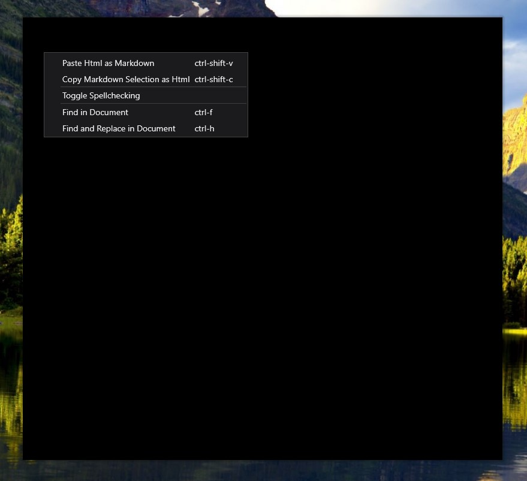

# Video Rendering Issues for WPF Windows


Over the last half a year I've had a couple of Github Issues coming into [Markdown Monster](https://markdownmonster.west-wind.com) for some odd startup rendering failures. Markdown Monster would come up with a completely black screen, but underneath it all the application would actually still be live. 

Now I was never able to reproduce this myself which made this really tricky to track down. Thankfully Tom Robinson [posted an issue](https://github.com/RickStrahl/MarkdownMonster/issues/136) a few days ago and followed up with a bunch of information that allowed me to track this down eventually using a workaround I'll describe here.

Tom posted a screen shot (since I can't dupe it) that demonstrates the **black hole of a screen**:



The Window comes up totally opaquely black, but it's actually 'live' in that menus pop up and the window can be moved around the screen. In fact, it's also possible to drag the Window to another screen and depending on which screen it's moved onto the window then starts rendering. According to Tom (and one other report) dragging the Window from an external monitor onto the native laptop monitor always brings the screen back to life. Starting on the laptop monitor as well seems to render right from the start.

All of this points at video problems - some weird combination of video card and monitor interaction that's causing the screen to not refresh properly. Easy to call, but not a good explanation to give to a user.

Hrrrmph! 


### Video Card Issues
This issue is very rare - I got two bugs reported for this over the last half a year - but it's related to specific video hardware and how WPF interacts with it. WPF uses hardware acceleration and DirectX for rendering its UI and if there's an issue with a video driver you can get all sorts of odd issues (and crashes - eek).

Both of the cases in question where using **nVidia Quadro M200M video cards**, so it's likely the issue is related to that particular card/driver combo, although several people have mentioned in the comments that they've seen this behavior with other applications on a few other video cards as well. 

For both users other applications were also affected. Specifically both users reported problems with the **Chrome browser** when running in full screen mode with the same behavior described above. There may be other places with WPF based applications where this manifests as well.

Note that this probably doesn't affect **every** WPF application. Markdown Monster uses the [MahApps.Metro UI framework](https://github.com/MahApps/MahApps.Metro) which does all sorts of custom window drawing to provide the Metro styling for the application's windows. MahApps is a fairly graphics intensive process that replaces the stock WPF window rendering with custom drawn windows on startup and likely the reason that the video driver issues are kicking in. Standard WPF Windows are less likely to exhibit these problems.

### Workaround: Disable Hardware Acceleration
After [a bunch of back and forth](https://github.com/RickStrahl/MarkdownMonster/issues/136) on the issue on Github, the eventual solution to fixing the problem for affected machines is **to turn off hardware accelerated rendering** for the WPF application.

I was pointed to this solution [by a 3 year old post from Keith Fink](https://blogs.msdn.microsoft.com/dsui_team/2013/11/18/wpf-render-thread-failures/) of the DSUI team at Microsoft. Towards the end of the article, Keith points out that rendering crashes and failures can often be resolved by forcing the system or application to turn off hardware assisted rendering if it looks like there's a hardware or driver problem.

There is a registry key that can be set to a `DWORD` of `1` to disable hardware rendering at: 

```txt
HKEY_CURRENT_USER\SOFTWARE\Microsoft\Avalon.Graphics\DisableHWAcceleration	DWORD
```

But this is a hammer solution, for a problem that might not affect but a few applications.

### WPF ProcessRenderMode
Luckily there's a much better solution for .NET applications via the static `System.Windows.InteropRenderOptions.ProcessRenderMode` property that can be set at application startup. In Markdown Monster I've added a `DisableHardwareAcceleration` option to the configuration settings which trigger the following code in application's startup in `app.xaml.cs`:

```cs
protected override void OnStartup(StartupEventArgs e)
{

    if (mmApp.Configuration.DisableHardwareAcceleration)
        RenderOptions.ProcessRenderMode = System.Windows.Interop.RenderMode.SoftwareOnly;
        
    ...
}
```

And that seems to work for the two users that have reported this issue that have been affected. Yay! That solves a mystery that's been nagging at me for a while even if it's a pretty blunt fix.

### Summary
While this is a blunt, brute force fix, at least it is a solution to a problem a very few people have run into. Nobody likes to be told there's a problem with their hardware or drivers, but at least this solution gets past this rather debilitating bug that otherwise renders Markdown MOnster nearly useless. This workaround will allow running MM even if there is a problem.

The good news trying this setting on my test machines, performance for Markdown Monster doesn't seem noticeably impacted by this setting. Markdown Monster doesn't do anything fancy with video and animations, although MahApps does a bit of UI animation to their initial window rendering. Even so I can't really tell the difference running with the flag on on several machines of different caliber.

Here's to hoping that this is truly isolated to a few rogue video cards and not a broader problem, but given how few reports there have been of this behavior I'd guess this indeed an isolated failure. But maybe a few more people will chime in response to this post. If you've run into this problem with Markdown Monster, please leave a not in the comments or on the Github issue so I can add additional hardware info into the [FAQ documentation I've added to the docs](https://markdownmonster.west-wind.com/docs/_4uj0kfglm.htm).

If you have a WPF application with rendering failures, the `ProcessRenderMode` setting might help isolate the problem to a hardware specific issue. While I don't like saying - "Hey it's your hardware that's bonking", having a last ditch workaround is nice to have and at least provides some level of justification for that weak excuse. :-)


### Resources
* [WPF Render Thread Failures](https://blogs.msdn.microsoft.com/dsui_team/2013/11/18/wpf-render-thread-failures/)
* [Original Github Issue: Blank Screen](https://github.com/RickStrahl/MarkdownMonster/issues/136)

<div style="margin-top: 30px;font-size: 0.8em;
            border-top: 1px solid #eee;padding-top: 8px;">
    
    this post created with 
    <a href="https://markdownmonster.west-wind.com" 
       target="top">Markdown Monster</a> 
</div>


<!-- Post Configuration -->
<!--
```xml
<blogpost>
<title>Video Rendering Issues for WPF Windows</title>
<abstract>
Recently I ran into a few reports of black screen of death rendering of Markdown Monster when starting up from a very few users of the application. They reported the screen just shows black, while actually being responsive to moving and showing menus etc. Also moving to another screen often fixes the problem. It turns out this is a hardware related issue with WPF with certain video hardware/monitor combinations. In this post I describe the problem and the workaround to get the application to render properly even on compromised hardware.
</abstract>
<categories>
WPF,Windows
</categories>
<keywords>
WPF,GPU,Hardware Acceleration,Black Screen,Window,MahApps
</keywords>
<isDraft>False</isDraft>
<featuredImage>https://weblog.west-wind.com/images/2017/VideoRenderingIssuesInWPF/blackhole.jpg</featuredImage>
<weblogs>
<postid>143088</postid>
<weblog>
West Wind Web Log
</weblog>
</weblogs>
</blogpost>
```
-->
<!-- End Post Configuration -->
