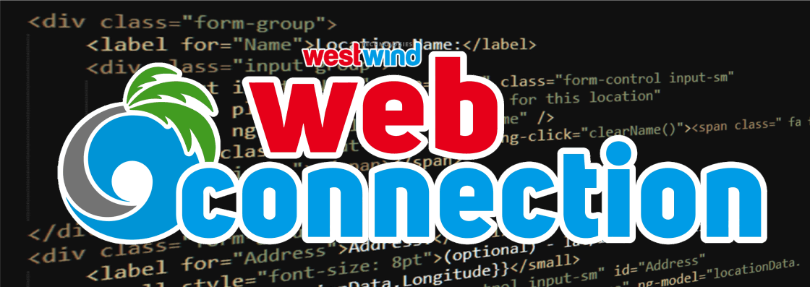
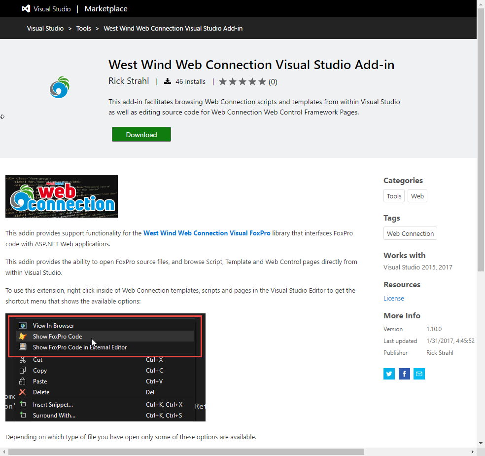
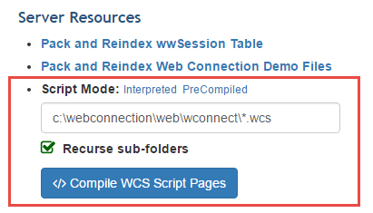
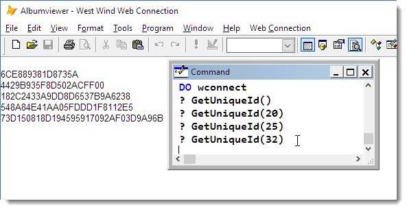

# Web Connection 6.10 Release Notes

<a href="https://west-wind.com/webconnection" target="_blank"></a>

[West Wind Web Connection](https://west-wind.com/webconnection) 6.10 has been released today and there are a a number of enhancements and a few new features in this update release. There are also a couple of breaking changes, so be sure to read those if you are upgrading from previous versions.

I'm going to break down the changes into Web features that are specific to Web Connection and General Purpose features that concern the more general Internet and Client Tools functionality, that will eventually also find their way into [West Wind Internet And Client Tools](https://west-wind.com/WestwindClientTools.aspx).

This is a fairly long post - if you just want the quick and dirty list go to

* [What's New in Web Connection](http://west-wind.com/webconnection/docs/_s8104dggl.htm)

Otherwise here's more detail:

* [Html Encoded Script Expressions](#HtmlEncodedScriptExpressions)
* [Updated Visual Studio Addin](#UpdatedVisualStudioAddin)
* [Admin Script Compilation](#AdminScriptCompilation)
* [wwUserSecurity Password Encryption](#PasswordEncryption)
* [GetLogicalPath() and Rewritten Urls](#GetLogicalPath)
* [Updated Markdown Parser](#MarkdownUpdates)
* [SFTP Support - FTP over SSH](#SFTPSupport)
* [wwUtils::GetUniqueId()](#GetUniqueId)
* [wwUtils::SplitString()](#SplitString)
* [wwEncryption::ComputeHash() and HMAC](#ComputeHash)

## Web Features
Let's start with the Web Features that are relevant for building Web applications with Web Connection.

<a name="HtmlEncodedScriptExpressions"></a>
### Html Encoded Script Expressions: `<%: %>`
When building Web content it's important that you Html encode content. Html content encoding essentially makes HTML text safe, and is a huge step towards preventing cross site scripting attacks because script tags are encoded as text, rather than being left as executable HTML tags that run inside of your document. 

Html Encoding takes angle brackets (`<` and `>`), quotes, ampersands and a few other characters and turns them into HTML safe entities that are not evaluated. By doing so you prevent script injection, so if anybody tries to inject a script tag like `<script>alert("Gotcha");</script>` into your content that attempt will be foiled.

Web Connection has always included an `EncodeHtml()` function that can be used so you could always do:

```html
<%= EncodeHtml(poOrder.Notes) %>
```

With Web Connection 6.10 there now is an easier way to do the same thing:

```html
<%: poOrder.Notes %>
```

So rather than having to explicitly specify the `EncodeHtml()` function using `<%: expression %>` does the same thing. The syntax is compatible with ASP.NET WebForms which also uses that same syntax for encoded content.

It's a nice convenience feature and I recommend you use it on **all** of your script expression tags, **except** where you explicitly do not want it! In most cases where you display user entered input, **you want to HTML encoded text**.

<a name="UpdatedVisualStudioAddin"></a>
### Updated Visual Studio Addin
We've updated the [West Wind Web Connection Visual Studio add in](https://marketplace.visualstudio.com/items?itemName=RickStrahl.WestWindWebConnectionVisualStudioAdd-in) and added it to the Visual Studio Gallery. 



This means the addin can now be installed from Visual Studio itself via  **Tools -> Extensions and Updates**. Because it's an installed extension in Visual Studio and it lives in the Extension Gallery, the addin can now automatically update itself if an update is available. It should show on the Updates tab in the Extension Manager and on the Visual Studio Notifications list.

The new addin also supports Visual Studio 2017 which brings a number of very cool productivity enhancements and a much more lightweight Web development experience.

<a name="GetLogicalPath"></a>
### wwRequest::GetLogicalPath() now returns Proxied and UrlRewrite Urls
The `Request.GetLogicalPath()` now properly returns the active URL the user sees, even if the URL was rewritten by tooling like IIS UrlRewrite or and internal proxy redirection.


For example, if you are using UrlRewrite to route extensionless URLs to a Web Connection Process class (UrlRewriteHandler) you now get:

```foxpro
** Original Url is: http://localhost/albumviewer/api/album/516
lcUrl = Request.GetLogicalPath()
* lcUrl  =  /albumviewer/api/album/516
*   not  =  /api/UrlRwriteHandler.av  (redirected url)

lcRedirectedUrl = Request.ServerVariables("PATH_TRANSLATED")
* lcUrl  =  /api/UrlRwriteHandler.av  (redirected url)
```

Previously GetLogicalPath() would always return the redirected path only.

If you are using URL redirection on your Web Server, you probably know that when you rewrite a URL on the server to a new location the original URL is lost to the redirected target URL. 

A typical example for Url Rewriting is to rewrite Extensionless Urls to a specific Web Connection Url. For example, check out this request trace from an Extensionless URL in the AlbumViewer:


The original URL is:

```txt
/albumviewer/api/album/516
```

and it's rewritten to:

```txt
/albumviewer/api/RewriteHandler.av
```

The RewriteHandler is Web Connection's route handler that gets fired when a re-written request is found and you can overwrite this handler to route requests to the appropriate handler. The most common thing to do is simply route a method of the current class. [You can find out more about this process in the documentation](http://west-wind.com/webconnection/docs/_4gm0xijr7.htm).

If you are logging requests or otherwise want to **find out what the original URL the user sees in the address bar is**, you had to explicitly look at the `HTTP_X_ORIGINAL_URL` header value in `Request.ServerVariables()`.

Web Connection 6.10 now always returns the original URL when a request is proxied. The logic internally first checks for the proxy path and if found uses that. If not found that then `PATH_INFO` variable is returned as before.

This is important for applications that generate URLs on the fly and need to figure out relative paths or fully qualified to embed into the page or to send out as email links for example. It's a minor feature, but an important one for those of you that use URLRewrite.

<a name="AdminScriptCompilation"></a>
### Admin Script Compilation
The Admin page can now properly compile MVC Style Script pages via the Admin page and this link:



This operation can run through either a single folder or all folders of your site and find all matching files you specify via the wildcard and recompile the script files.

While this feature was there previously it didn't actually work with the new scripting engine, and it didn't support recursive compilation.

Using this option can allow you to run with pre-compiled scripts if you didn't explicitly run through all scripts and upload them to your site.

There's also a new `wwScripting::CompileAspScript()` method that lets you compile and individual script. The above script compilation features use this method to handle the script compilation. You can look at `WCSCompile()` in wwServer.prg if you want to see how that works.

<a name="PasswordEncryption"></a>
### wwUserSecurity Password Encryption
We've added the ability to encrypt passwords in the wwUserSecurity class by setting the new `cPasswordEncryptionKey` property to a string value used as the hash encryptionkey. 

If the `cPasswordEncryptionKey` property is set, any `SaveUser()` operation on the object causes the password property to be encrypted if it is not encrypted yet. Encrypted passwords are post-scripted with ~~ to detect whether the field is encrypted or not.

The password encryption uses id salted SHA512 hashing to produce the password hash used in the user security table.

By default `cPasswordEncryptionKey` is empty so no password encryption occurs unless you explicitly specify it. 

If you plan on using this feature I would highly recommed that you sublcass the `wwUserSecurity` class and set the `cPasswordEncryptionKey` as part of the class. How you set the value is up to you, whether it's simply a static value you assign or whether you retrieve the key from some known save location like Azure Key Storage or likewise service.

> ### @icon-info-circle Password Hashing is One-Way
> Please note that once you encrypt passwords you can't retrieve them for users. Hashing is basically a one way trip and any authentication that compares passwords hashes an input value to match stored password hash. The only way to 'fix' a password for a user if they've lost it, is for them to create a new one.

### wwUserSecurity Structure Changes
As part of the updates for encrypted passwords we also made some changes to the structure of the wwUserSecurity table. These changes go beyond the password field, but since we had to make changes anyway we updated the table to use `VARCHAR` characters for all text fields.

The new structure is:

```foxpro
CREATE CURSOR usersecurity ;
(    PK          V (40),;
   USERNAME    V (80),;
   PASSWORD    V (80),;
   FULLNAME    V (80),;
   MAPPEDID    V (40),;
   EMAIL       M ,;
   NOTES       M ,;
   PROPERTIES  M ,;
   LOG         M ,;
   LEVEL       Y ,;
   ADMIN       L ,;
   CREATED     T ,;
   LASTON      T ,;
   LOGONCOUNT  I ,;
   ACTIVE      L ,;
   EXPIRESON   D )
```

If updating from the old version you should also run the following command to trim white spaces off the fields:

```foxpro
REPLACE ALL PK with TRIM(PK), ;
            USERNAME WITH TRIM(USERNAME),;
            PASSWORD WITH TRIM(PASSWORD),;
            FULLNAME WITH TRIM(FULLNAME),;
            MAPPEDID WITH TRIM(MAPPEDID)
```            

> #### @icon-warning Breaking Change
> The change above is a breaking change and you have to ensure you change the database structure of any existing tables to match this new schema.


<a name="MarkdownUpdates"></a>
### Updated to a new Markdown Parser Library
Markdown conversion was introduced in Web Connection 6.0. Markdown is a simple text editing format that generates HTML output using a very simple markup language that can be easily typed as text. Markdown is awesome to use instead of text input as it allows simple markup like bold and italic text, lists, headers and so in with a very text like format that doesn't require a special editor. Adding simple interactive editing features like a toolbar is also pretty easy to accomplish just with some simple javascript.

Web Connection's Markdown support comes via the MarkdownParser class and more typically through the Markdown function that it exposes. To parse Markdown you can simply do:

```foxpro
lcMarkdown = "This is some **bold** and *italic* text"
lcHtml = Markdown(lcMarkdown)
```

More commonly though you're likely to use markdown in your HTML pages to write out rich content. For example on the message board each message's body in a thread is displayed with:

```html
<div class="message-list-body">
    <%= Markdown(loMessage.oMessage.Body) %>
</div>
```

or if you have a custom configuration options for formatting the Markdown:

```html
<div class="message-list-body">
    <%= poMdParser.Parse(loMessage.oMessage.Body) %>
</div>
```

In Web Connection 6.10 we've switched from the .NET [CommonMark.NET](https://github.com/Knagis/CommonMark.NET) package to the [MarkDig](https://github.com/lunet-io/markdig) parser. MarkDig supports Github flavored markdown, automatic URL linking, and a slew of other standards that sit on top of markdown out of the box that in older versions we had to implement on our own. Besides the simplicity Markdig also is much easier to extend and quite a bit faster especially since it can perform most of the add-on operations we needed to do in FoxPro previously now internally.

> ### @icon-warning Breaking Change
> This is a breaking change and in order to use the Markdown Features in Web Connection 6.10 you need to make sure you include the **Markdig.dll** with your Web Connection distribution. This replaces the CommonMarkNet.dll that was previously used.


## General Purpose Features
The following features are focused on the general purpose library portion of Web Connection. These are also features that will show up in future versions of [West Wind Client Tools](http://west-wind.com/WestwindClientTools.aspx).

<a name="SFTPSupport"></a>
### SFTP Support with the wwSFTP Class
One of the most requested features in both Web Connection and Client Tools over the years has been support for secure FTP. Secure FTP is a tricky thing to provide as there are several standards and because the built-in Windows library that Web Connection uses - WinINET - doesn't support any secure FTP features.

In Web Connection 6.10 there's now support for SFTP which is FTP over SSH via the [wwSftp Class](http://west-wind.com/webconnection/docs/_4tc1eh7ne.htm). The class is based on the familiar `wwFTP` class and the interface to send and receive files remains the same as with the original wwFtp class.

```foxpro
loFtp = CREATEOBJECT("wwSftp")
loFtp.nFtpPort = 23

lcHost = "127.0.0.1"
lnPort = 23
lcUsername = "tester"
lcPassword = "password"

*** Download
lcOutputFile = ".\tests\sailbig.jpg"
DELETE FILE lcOutputFile

lnResult = loFtp.FtpGetFile(lcHost,"sailbig.jpg",".\tests\sailbig.jpg",1,lcUsername,lcPassword)

this.AssertTrue(lnResult == 0,loFtp.cErrorMsg)
this.AssertTrue(FILE(lcOutputFile))


*** Upload a file
lcSourceFile = ".\tests\sailbig.jpg"
lcTargetFile = "Sailbig2.jpg"

lnResult = loFtp.FtpSendFile(lcHost,lcSourceFile,lcTargetFile,lcUsername,lcPassword)
this.AssertTrue(lnResult == 0,loFtp.cErrorMsg)
```

There are both high level (all in one upload/download file functions) and low level functions. The low level function require that you open a connection explicitly and fire each operation, potentially multiple times. Again this maps the existing old `wwFtp` functionality:

```foxpro
loFtp = CREATEOBJECT("wwSftp")

loFtp.cFtpServer =  "127.0.0.1"
loFtp.nFtpPort = 23
loFtp.cUsername = "tester"
loFtp.cPassword = "password"

loFtp.FtpConnect()

*** Change to a specific folder - convenience only - you can reference relative paths
this.AssertTrue(loFtp.FtpSetDirectory("subfolder"),loFtp.cErrorMsg)

*** Create a new directory
this.AssertTrue(loFtp.FtpCreateDirectory("SubFolder2"),loFtp.cErrorMsg)

*** Send a file into the new directory
this.AssertTrue(loFtp.FtpSendFileEx(".\tests\sailbig.jpg","subfolder2/sailbig.jpg")==0,loFtp.cErrorMsg)

*** Download the file just uploaded
this.AssertTrue(loFtp.FtpGetFileEx("subfolder2/sailbig.jpg",".\tests\sailbig2.jpg")==0,loFtp.cErrorMsg)

*** Delete it
this.AssertTrue(loFtp.FtpDeleteFile("subfolder2/sailbig.jpg")==0,loFtp.cErrorMsg)

*** And delete the folder
this.AssertTrue(loFtp.FtpRemoveDirectory("Subfolder2"),loFtp.cErrorMsg)
```

> #### @icon-warning No FTPS support
> Note that this feature **does not support FTPS** which is yet another protocol that uses TLS over FTP which is considerably less common than the SFTP over SSH protocol implemented by this class.


<a name="GetUniqueId"></a>
### wwUtils::GetUniqueId()
This routine lets you generate semi to fully unique IDs based on GUIDs. You can specify a size between 15 and 32 characters with 32 characters preserving the full fidelity of a GUID. Any value smaller gives you somewhat unique (definitely a lot more unique than SYS(2015) though) values.



<a name="SplitString"></a>
### wwUtils::SplitString()
This function provides the same functionality as ALINES() but adds the important abililty to split very long lines (that exceed 254 characters) with MEMLINES() into additional lines.

This is **critical** for any sort of **code parsing library** that generates code with string literals which cannot exceed FoxPro's literal string limit. 

This function is used internally in wwScripting and webPageParser and the Markdown parser but can be useful for anything else that needs to generate code output.

<a name="ComputeHash"></a>
### wwEncryption::ComputeHash() adds HMAC Hash Algorithms
wwEncryption::ComputeHash() adds HMACSHA1, HMACSHA256, HMACSHA384 and HMACSHA512 algorithms. HMAC algorithms use complex salting cycles to add complexity and delay to generated hashes using an industry standard and repeatable algorithm.

Note the HMAC related functions require that you specify a Salt value for the hash.

### wwDotnetBridge now supports TLS 1.2
wwDotnetBridge fires up a new instance of the .NET Runtime inside of Visual FoxPro when it launches and as such any configuration set for the app has to be set as well. A number of people using wwDotnetBridge ran into problems with HTTPS content not working correctly because older versions of .NET don't default to support TLS 1.2. 

In Web Connection 6.10 we always enable TLS 1.2 support (and conversely disable obsolete and insecure SSL3 support). The old version only allows support for TLS 1.0. This affects any HTTP clients whether directly using HTTP clients or using libraries (such as Credit Card Processing APIs, REST APIS etc.) that use HTTPS internally.

## Summary
Phew, a lot of stuff in this release. There are also a number of small bug fixes and minor performance tweaks based on Message Board discussions in the last few months.

As always, we actively encourage feedback, so if you run into a bug or have a feature request, let us know by posting a message in the support forum.

* [West Wind Wind Message Board Support Forum](https://support.west-wind.com)


<div style="margin-top: 30px;font-size: 0.8em;
            border-top: 1px solid #eee;padding-top: 8px;">
    
    this post created with 
    <a href="https://markdownmonster.west-wind.com" 
       target="top">Markdown Monster</a> 
</div>


<!-- Post Configuration -->
<!--
```xml
<blogpost>
<title>Web Connection 6.10 Release Notes</title>
<abstract>
West Wind Web Connection 6.10 has been released and here's a detailed run down on all the improvements and new features in this new maintenance release version.
</abstract>
<categories>
Web Connection,FoxPro,Client Tools
</categories>
<keywords>
Web Connection
</keywords>
<isDraft>False</isDraft>
<featuredImage>http://localhost/WebLog/images/2017/Web-Connection-6.10-Release-Notes/VisualStudioAddin.png</featuredImage>
<weblogs>
<postid>925</postid>
<weblog>
Web Connection Weblog
</weblog>
</weblogs>
</blogpost>
```
-->
<!-- End Post Configuration -->
