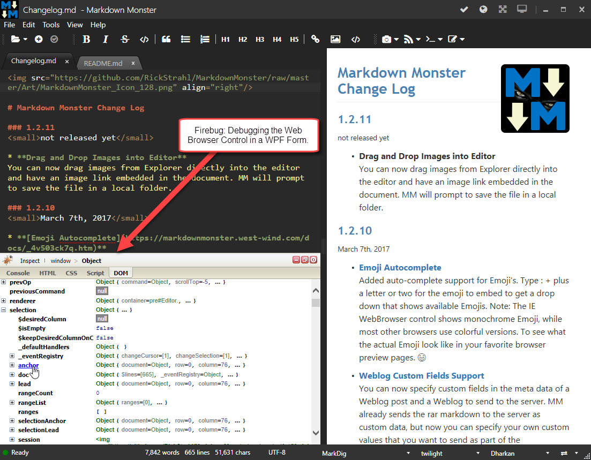

# Debugging the Web Browser Control with FireBug

[](https://getfirebug.com/firebuglite)

I have a lot of WPF and WinForms applications that use the Web Browser control. My latest project, [Markdown Monster](https://markdownmonster.west-wind.com), heavily uses the Web Browser control with an embedded Ace Editor instance and there's quite a bit of code that manipulates the editor via JavaScript code that's often driven from WPF and can't be debugged externally.

### Debugging Web Browser Controls Sucks
But debugging this code when it runs in a Web Browser Control is a royal pain in the ass: While IE has full Web Browser F12 tools, those same tools are not available inside of the Web Browser control unfortunately. The reason: The tools are part of the Internet Explorer Shell host container, not the actual Web browser instance. There's no built in debugging support in the actual Web Browser control itself. 

This means no debugger, no console, no document view - **no nothin'**.

Personally, I've been lucky: Either I've been able to debug outside of the Web Browser control loading up the page(s) in a standalone instance of Chrome or IE, or I've muddled through with string based output written to a custom HTML statusbar control that overlays the document. But writing out strings is a far cry from being able to see real object state in active objects.

### Blast from the Past: FireBug Lite
Enter Firebug Lite... this JavaScript library is basically a Console add-in for your browser that provides what developer tools provide as a standalone runnable JavaScript script that you can plug into any page.

I've used [Firebug Lite](https://getfirebug.com/firebuglite) **way back** in the days of IE 7/8 to get a minimal debugging experience in those ancient browsers when there were no debugging tools at all in them and it was a life saver. Running inside of the Web Browser control is actually a very similar scenario.

Well, it turns out [Firebug Lite](https://getfirebug.com/firebuglite) can also be used inside of a Web Browser control and compared to what I've done in the past, it's freaking awesome:



Yeah I know this is basic stuff, but compared to **not having** a Console that can display live object state with a value thrown to `console.log()`, this is a **huge improvement** over my previous string only debugging. 

I've been able to get by even with some fairly hairy JavaScript code in Markdown Monster (like the spell checking and auto-complete stuff), but I've been lucky in that these more complex features could run externally in a standalone browser where I could run developer tools. But there are plenty of things in Markdown Monster that rely on objects or methods that interact with the WPF host application, and that stuff can only run in the Web Browser control and the context of the application. 

Firebug Lite is a gift to provide some debugging help with this!

Firebug Lite has been around forever, and it works well for the console and for DOM viewing and basic manipulation.

If you're running scripts from the file system however, you can't load those scripts, so the debugger won't work for that unfortunately. It'd be nice to have, but I can get what I need from `console.log()`.

### Hooking it up
Hooking up Firebug is as simple as adding a script to the top of the `<head>` tag of an HTML page and telling it to display itself automatically.

```html
<!DOCTYPE html>
<!-- saved from url=(0016)http://localhost -->
<html>
<head>
    <meta charset="utf-8" />
    <meta http-equiv="X-UA-Compatible" content="IE=edge" />
    <title>Markdown Monster Editor</title>

    <script type="text/javascript"
            src="https://getfirebug.com/firebug-lite.js#startOpened,overrideConsole">
    </script>
    ...
</head>
```

Note that the options are passed via a hash tag that enables a couple of flags. FireBug also supports running in an external window via the `startInNewWindow` option, but I found that behavior spotty in the Web Browser control - the window often wouldn't open.

> #### @icon-warning Local HTML Files and Security
> Note that you can't use the debugger or source viewer to look at code of scripts that are loaded from the file system due to security restrictions in the browser.

I now leave that tag as a comment in the document and when I need to debug, I just un-comment the block and add my console.log code into the page.

### Works with any Application that uses the Web Browser Control
Note although I'm using this with my WPF application, this will work with any application that uses a Web Browser control and as long as you control the page that you are working with can set the `<script>` tag to load FireBug Lite can be injected into the page.

This means it works in WPF, WinForms, Visual Basic 6 and older, Visual FoxPro, Delphi, MFC  and any other tool that might be using the ActiveX Microsoft Web Browser Control which is awesome.

While you're at it remember that you can make the [Web Browser control run the latest installed version of Internet Explorer via Registry hack or the Edge Mode Meta Header](https://weblog.west-wind.com/posts/2011/may/21/web-browser-control-specifying-the-ie-version). IE 11 is HTML 5 compliant and keeps up with most browser standards these days, so IE 11 is a solid browser that is always available in a Windows application running Windows 10, 8 or 7 (forced upgrades on the older Windows versions).

### Running with it
While full debugging support is a major missing feature for the Web Browser control even with Firebug, the ability to embed `console.log` commands and get full fidelity state information for objects is immensely valuable. 

If you're running an 'application' or a SPA inside of your Web Browser control then you can easily embed `console.log` commands strategically in the code you need to debug and find out more information about the state of any particular code. 

In Markdown Monster I also have many operations that are triggered from the .NET host application. In many cases this means I trigger JavaScript actions from WPF code and it's important to understand that these operations run in the context of a single JavaScript context switch. IOW the DOM doesn't visually update until the calling WPF code completes. This has some interesting consequences for code you might want to debug because `console.log()` commands - like any other JavaScript command - have to wait their turn at the single threaded JavaScript 

For example, in the following code AceEditor references a JavaScript object from WPF code and **all** of the AceEditor commands run in the same unit of execution because the UI look in JavaScript never gets a chance to execute:

```csharp
var id = "image_ref_" + DataUtils.GenerateUniqueId();

dynamic pos = AceEditor.getCursorPosition(false);
dynamic scroll = AceEditor.getscrolltop(false);

// the ID tag
html = $"\r\n\r\n[{id}]: {image}\r\n";

// set selction position to bottom of document
AceEditor.gotoBottom(false);
SetSelection(html);

// reset the selection point
AceEditor.setcursorposition(pos); //pos.column,pos.row);

if (scroll != null)
    AceEditor.setscrolltop(scroll);
```

If I have `console.log()` commands in any of those code blocks and there's a failure - the `console.log()` commands never get to write their output. :confounded:

So how do you log out information when an error occurs?

First you can hook up `window.onerror` and inside of there handle any errors. Depending on the security environment of your application that may or may not produces the desired result.

But, if you know where the failure is in your application the better way to handle this is to temporarily add an exception handler around the code in question. You can capture the exception and echo back the error information. And just as important any pending `console.log()` requests are going to be displayed now because the app isn't hard crashing anymore.

So if I want to find a problem and get my logging of messages prior to errors and the error message to work in a function I'm calling from .NET I can do this in the JavaScript:

```javascript
gotoBottom: function (ignored) {
    try {
        console.log('entered gotoBottom');   // this now logs even if there's an error below
        var row = te.editor.session.getLength() - 1;
        var column = editor.session.getLine(row).length; // <!-- missing te.editor: BOOM
        te.editor.selection.moveTo(row, column);
    } catch (ex) {
        console.log(ex.message); // and I get the error message
    }
},
```

Localized error trapping is always better than falling back to the global error handler. In this case I had a problem with an invalid object reference by accidentally leaving off a parent object reference. When running the code above the error message from the log immediately told me what the problem was (*editor not defined*).

This sort of troubleshooting code is usually temporary. Once I know the code runs I can remove the try/catch and the console log commands.

### The little Things that make a big Difference
This is most definitely a more low level approach to debugging. It's not like using a step through debugger, but again, it's a heck of a lot better than no log output and especially useful when you need to check object state. This has helped me track down countless naming and missing identifier issues that previously were difficult to catch because I was sure my code was actually fine. One look at a log trace makes it easy to see where the issue is.

Sometimes it's the little things in life, especially when you find that old and forgotten goodie you've left lying around in the attic. FireBug Lite has that attic quality for me, like an old friend neglected but not forgotten. If you're working with the WebBrowser control on any platform and you need to debug - Firebug Lite's the way to get your sanity back.


### Resources
* [FireBug Lite Embeddable Debugger](https://getfirebug.com/firebuglite)
* [Specifying the IE Version in Internet Explorer](https://weblog.west-wind.com/posts/2011/may/21/web-browser-control-specifying-the-ie-version)


<div style="margin-top: 30px;font-size: 0.8em;
            border-top: 1px solid #eee;padding-top: 8px;">
    
    this post created with 
    <a href="https://markdownmonster.west-wind.com" 
       target="top">Markdown Monster</a> 
</div>

<!-- Post Configuration -->
<!--
```xml
<blogpost>
<title>Debugging the Web Browser Control with FireBug</title>
<abstract>
If you need to debug JavaScript code or layout issues in a Web Browser control inside of a Windows desktop application, you've probably found that the experience sucks. Although Internet Explorer on which the control is based suppports rich developer tools, those are not available in the Web Browser control. Enter an oldie but goodie: FireBug which is an embeddable Console implementation that provides a lot of the features that you find in modern browser developer tools and with a couple of lines of html you can add this debugger into your application.
</abstract>
<categories>
WPF, WinForms
</categories>
<keywords>
Web Browser Control, Debug, FireBug
</keywords>
<isDraft>False</isDraft>
<featuredImage></featuredImage>
<weblogs>
<postid>167510</postid>
<weblog>
West Wind Web Log
</weblog>
</weblogs>
</blogpost>
```
-->
<!-- End Post Configuration -->
