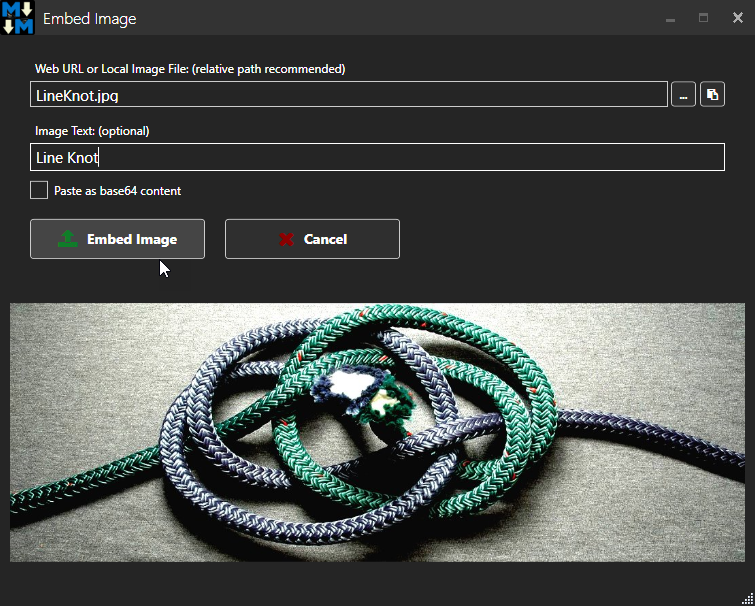
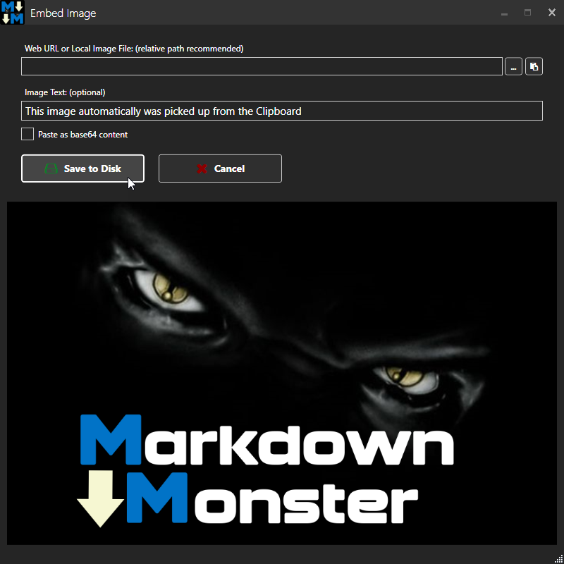
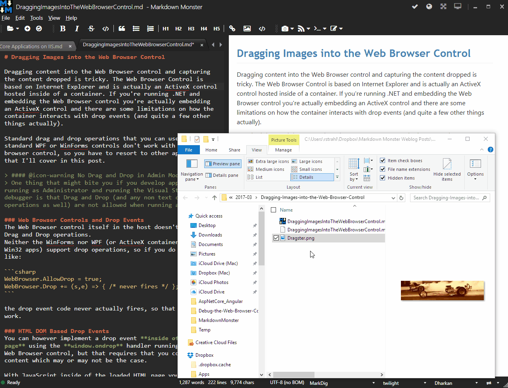

# Getting Images into Markdown Documents and Weblog Posts with Markdown Monster

One good justification for using a rich editor for editing Markdown or a Weblog entry is that you can provide some additional features above and beyond what a simple text or code editor can provide.  When you're creating content you are usually dealing with a number of things beyond plain text like code snippets, feature widgets and most importantly - **images**.

Just about any document you create is likely to include some visual content in the form of images and getting images into documents should be as quick and easy as possible. In this post I describe all the different ways available in Markdown Monster to add images to Markdown content.

### Markdown Monster and Images
Because images are so important Markdown Monster offers quite a few ways to embed images into a Markdown document:

* Type it in using Markdown `` or HTML syntax
* Using the **Embed Image Dialog** to select images or Urls
* Paste images from the Clipboard
* Drag and Drop image files from Explorer into the document
* Use the Screen Capture Tool to Capture Screen Shots

The goal is to provide all these options because there are a lot of different ways we often interact with images. Sometimes we browse for images in folders, other times we pick up images off a Web page simply copying it to the clipboard and other times we just want to pick a file from disk and embed it. 

All of those options are supported along with the base feature of just typing an image link into the Markdown.

### Embedding a Markdown Image Link
Markdown is a text format so naturally you can type in the Markdown representation of an image using `` to put an image reference directly into the editor.

Some typical image markup may look like this:

```markdown
Here's an image of a drag racer in action:


Move along.
```

If the image exists in a local and linkable folder the `` and you know the URL or file you're linking to this bit of simple syntax is often the quickest way to get an image into the page.

Markdown also supports **raw HTML syntax**, so if you need to adorn your image with additional tags or styles you can do that as well:

The following HTML is also legal Markdown:

```html

```

Note that how well this works and the syntax used may depend on where this markdown or HTML will end up getting rendered. For example, GitHub doesn't allow style information and instead allows a few attributes like `height`, `width`, `align` to provide some of these feature with special syntax.

If you use the HTML output created by Markdown Monster however the raw HTML passes through and you'll see the styled content as shown above.

### Using the Embed Image Dialog
The most visible way to embed images into your Markdown is to use the Toolbar Image icon (or Alt-I) to bring up the **Embed Image** dialog.

Typing raw Markdown image links - using the `` Markdown syntax - works of course, but in most cases I either **don't remember** the file name I'm trying to embed, or I'm dealing with an image that isn't local to my document and needs to be saved to the local folder first.

This is where the Embed Image Dialog comes in:



The dialog is smart enough to pick up URLs or images from the clipboard when first loaded or if you re-activate the window when no image has been selected yet. The dialog also shows a preview of the image you're pasting so you get an idea at what you're looking at.

The dialog accepts input from 3 sources:

* Files on disk
* Http Urls
* Clipboard Images

It also offers to save document non-relative files or pasted images to a local relative folder. You can also optionally embed images directly into the Markdown/HTML document as base64 embedded image content.

#### Files on Disk
You can easily select files from the file system and embed them in your page by using the file open button (...) and selecting a file from the file selection dialog.

If the file you're selecting is not in a relative folder to the currently open document or more than 1 level below the current document you get the option to save the file in a new location relative to the document. Markdown Monster then creates a link to the new file as a relative link.

#### HTTP URLs
You can also type a Web Url to an image directly in the first textbox of the dialog to embed that image. As with local files, the image is previewed.

If an image URL - a Url that ends in an image extension -  is on the clipboard that URL is automatically filled into the textbox. Likewise if the field is empty and you navigate away from the form to say a Web Browser to copy a URL, the URL is automatically filled in when the form is reactivated saving a few keystrokes.

#### Images from the Clipboard
You can also paste images from the clipboard into this dialog with `Ctrl-v`. As with the Web URL if you open the dialog and an image is on the clipboard, the image is pre-selected in the previewer and if you navigate away and re-activate the window with an image on the clipboard the image is automatically picked up and displayed.

Pasted images have to be saved to disk first so the dialog looks slightly different with a **Save to Disk** button choice:



When you click it the image is saved to disk first. Then once the file exists the image's new file is shown in the the file Textbox.

When you click OK the file is embedded into the page.

#### Embed Images as base64 embedded Image Content
Finally you can also optionally embed the image as **base64** content directly into the Markdown document. This can be useful in some situations where you want to have a self contained HTML document that doesn't have external dependencies.

Markdown Monster creates a **reference image link** in the page which looks like this:

```markdown
Here's an image:

![][image_ref_a32ff4ads]

More text here...
...

[image_ref_a32ff4ads]: data:image/png;base64,iVBORw0KGgoAAAANSUhEke02C1MyA29UWKgPA...RS12D==

```

The image itself is marked with a reference ID which is then embedded at the bottom of the document with the actual base64 encoded image data.

While this can be useful be aware that this image data is going to be **very large and very ugly**. It's added at the very bottom of the document so it mostly stays out of the way, but it makes the Markdown document - and the resulting HTML page **huge**. Use this feature only if you don't have no other way to link image content, otherwise it's almost always better to embed links to external image files or URLs.

This is feature that's been requested by a few people over time and it was easy enough to add, but I still would recommend thinking carefully of whether you want to use this. So much so that you have to click this checkbox - the base64 checkbox is not a tab stop so that it doesn't easily get set by accident.

### Pasting Clipboard Images into the Markdown Document
One very productive feature when dealing with images is to copy and paste images. If you pick up images off the Web it's often easiest to copy the image from the Web browser (using `Copy Image` on the browser context menu) and then simply pasting the image into the document. Likewise a lot of people love to use **Alt-PrtScn** to capture an active window and just paste that, although I'd argue the built-in screen capture tools do a better job for most scenarios like capturing mouse pointers allowing delayed captures and more control over what you're capturing.

Pasting images from the clipboard directly into a Markdown document was one of the **most frequent requests** I've received for Markdown Monster. I was somewhat non-committal on this feature as I didn't use image pasting all that frequently. I use the screen capture tools a lot or save images to disk and then embed them with the Image dialog.

Bit incidentally right around the same time I started looking into this I started using [Better TweetDeck](https://chrome.google.com/webstore/detail/bettertweetdeck-3/micblkellenpbfapmcpcfhcoeohhnpob?hl=en) which adds the ability to paste images directly into tweets rather than embedding by file and that really set me off on realizing how useful it is to be able to just paste images from the clipboard. With support for image pasting in Tweetdeck and Markdown Monster I find I'm using it **all the time now** and really miss it when it's not available in other places.

Long story short I underappreciated how productive image pasting can be compared to manually capturing, saving images in the proper location and then importing an image. Copying, pasting and saving is simple a lot faster.

Markdown Monster makes this process very easy - simply copy an image to the clipboard and then paste. MM will prompt to save the file for you (or you can embed it into the document as  base64 as well) and then embed the resulting - hopefully relative - link to the image file.

I love it because this feature actually changed the way I work in other places outside of MM as I think about pasting images a lot more these days and a lot of places - Twitter, Facebook, Github - all support this functionality in some capacity.

### Dragging Images into the Markdown Document
You can also drag images into the Markdown Editor from Windows Explorer. Simply find the file in Explorer and then drag it to the location where you want to see it in the Markdown document:



If you're dragging the file from a non-relative location or location down further than one level (`..\`) below the document you're editing, MM prompts to save the file in a local path relative to the document - by default in the document's folder. 

### Screen Captures
If you need to get screen captures into a page you can of course use Alt-PrtScn to the clipboard and then paste the image as shown above. That works fine, and for many cases that may be perfectly fine.
However, if you need more control over capturing or you need to capture the mouse pointer, some sort of UI interaction (like a highlighted menu option or selection) that’s not really possible with Alt-PrtScn. For that scenario you can use the built-in screen capture feature of Markdown Monster.


Screen captures using the built-in Screen Capture feature in Markdown Monster
Markdown Monster supports the basic built-in capture tool you see above, or — if you own SnagIt from Techsmith — you can use the built-in SnagIt integration to capture image using SnagIts superior image capture and editing tools. Either way both ways are directly integrated with MM and make it very quick to get captured images directly embedded into your document.

### PNG File Optimization
When you save a PNG images from the clipboard or a file, MM will try to optimize and compress that image losslessly in the background. 

After a PNG file is saved it runs a lossless image optimizer against the PNG image to reduce the size of the file. Typical image size reductions for images saved from clipboard are 20-30% typically, for others it depends how optimized the images are in the first place. I find for images from Paint.NET I typically see a 10-15% smaller image, 10-20% or more from SnagIt images. But your mileage will vary.

Compression ratios may vary but it's nice to not have to worry too much about the level of PNG compression of your image tool (or the producer of the PNG) and let the optimizer do the work for you in the background.

> #### The PNG Optimizer works in the Background
> Please be aware that the PNG optimizer runs in the background asynchronously, so images are not immediately available. Depending on size and machine speed optimization can take from a few seconds to a few minutes. If you publish your image (to Git or your Blog for example) before optimization is complete you may end up with the non-optimized image. Images are replaced in place, but only after optimization is complete.

### Comparing Image Size for jpg and png: Manual but a good Idea!
In the future it might be nice to also compare sizes of images created as PNG and JPG and pick the smaller of the two. For a number of things PNGs are preferrable both in size and quality (since they're lossless), but not quite sure how to best provide UI for this since the optimization operations are quite slow and would hold up the workflow. Currently I often save images both as PNG and JPG and pick the one that's smaller for my document. If you think this is nit-picking - the size differences between formats can often be quite drastic and for large files like Weblog post banner files that are often quite large it can mean the diffence between an 80k image or 500k image. For big images in particular it pays to compare image sizes!

My manual workflow for this is:

* Paste or embed an image with the Image dialog
* Save as Png
* Save as Jpg
* Right click on the doc tab, Open Folder
* Compare the file size of both png and jpg files
* Delete the larger one
* Change the image file extension in the document if necessary

Manual - yes. Worth it for large images: Definitely if you can save 100k or often much more for every image load on your connection!

### What's next? Storage Mechanisms
There's still more that can be done in this space - one thing that has already come up and has been addressed with addins today - is the ability to save images to other storage spaces like Azure Blob Storage, or Imgur or some other storage mechanism like DropBox or OneDrive.

I've looked at this a few times and backed out of implementation because the feature set of MM is still in flux - there are a lot of paths that lead to saving images in MM and the way this works differs quite considerably in places. To build a consolidated image saving mechanism will require a fair bit of abstraction and some internal UI logic (for picking save location etc.) that makes this trickier than just a simple provider API.

Today if you want to save and embed images using a custom store you have to create an Addin to make it happen. One such addin exists in the form of the [Save Image to Azure Blob Storage Addin](https://github.com/RickStrahl/SaveToAzureBlob-MarkdownMonster-Addin) (you can load it from **Tools -> Addin Manager**:


This is a full featured addin that duplicates some of the functionality in the **Embed Image Dialog** so this is not trivial to create. However, to create one for other storage providers or image services, they could probably copy and modify this existing addin and hook up the appropriate API functionality.

This will get easier in the future as we figure out a better way to make providers more generic, either via a direct image saving Provider API that can be extended and plugged into, or via single addin that provides upload capabilities to various providers. 

I'm hoping to hear from you fine people, to see what's important you in the way of providers, and hopefully can solicit some participation in creating extensions that can interface with other services. The code for both [Markdown Monster](https://github.com/rickstrahl/MarkdownMonster) and all the [Addins](https://github.com/RickStrahl/SaveToAzureBlob-MarkdownMonster-Addin) is available on Github and open for comments and discussions.

### Summary
And here you thought Image embedding is an open and shut book, right? Image embedding is a preferential thing for most people - everybody does it a little differently and for this reason Markdown Monster tries to provide a number of different ways that you can get your images into the page efficiently.

I know thinking about the image workflow and adding features like image pasting and dragging images directly into the document have really improved my productivity while creating content and I hope the options in Markdown Monster can provide some of these same benefits to you.

So if you haven't checked into the image embedding features in Markdown Monster, experiment a little and see if you can't optimize your own workflow and make image embedding more efficient.


### Resources
* [Markdown Monster](https://markdownmonster.west-wind.com)
* [Save Image to Azure Blob Storage Addin](https://github.com/RickStrahl/SaveToAzureBlob-MarkdownMonster-Addin)


<!-- Post Configuration -->
<!--
```xml
<blogpost>
<title>Getting Images into Markdown Documents and Weblog Posts with Markdown Monster</title>
<abstract>
One good justification for using a rich editor for editing Markdow or a Weblog entry is that you can provide some additional features above and beyond what a simple text or code editor can provide.  When you're creating content you are usually dealing with a number of things beyond plain text like code snippets, feature widgets and most importantly - **images**. Markdown Monster
</abstract>
<categories>

</categories>
<keywords>
Markdown,Images,Pasting,Drag and Drop,Markdown Monster,Editor,Weblog
</keywords>
<isDraft>False</isDraft>
<featuredImage></featuredImage>
<customFields>
	<customField>
		<key>mt_custom</key>
		<value>My custom value</value>
		<id>771</id>
	</customField>
</customFields>

<weblogs>
<postid>245</postid>
<weblog>
Rick Strahl WordPress
</weblog>
</weblogs>
</blogpost>
```
-->
<!-- End Post Configuration -->
