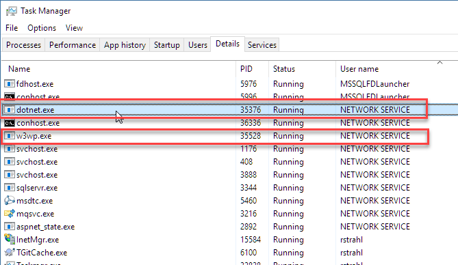
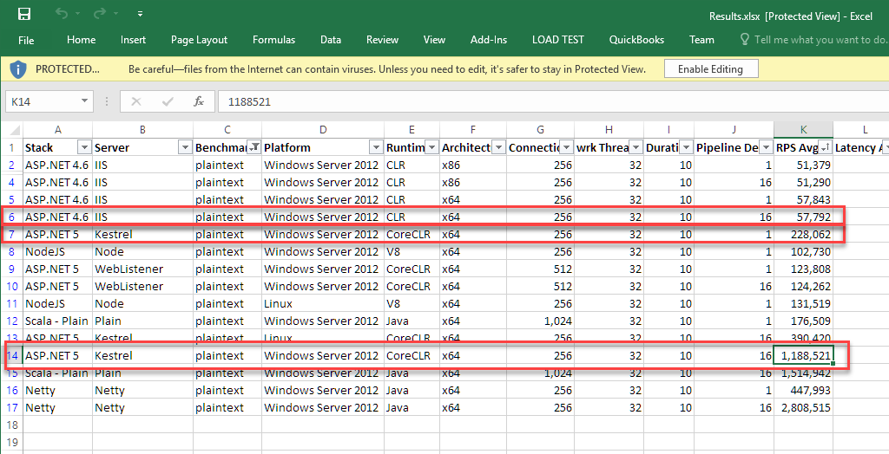
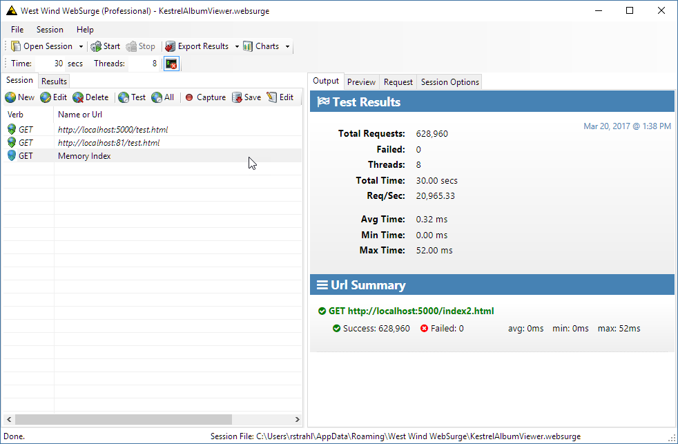
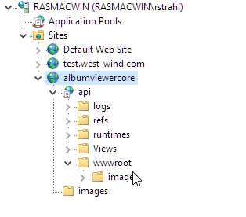

# More on ASP.NET Core Running under IIS
My [last post on ASP.NET Core and IIS](https://weblog.west-wind.com/posts/2016/Jun/06/Publishing-and-Running-ASPNET-Core-Applications-with-IIS) generated a lot of interest and also a lot of questions and discussion in the commment section to warrant a follow up post. In this post I address a few common themes that keep coming up in regards to IIS hosting of ASP.NET Core applications.

### A quick Review of IIS Hosting for ASP.NET Core
When using ASP.NET Core on Windows, your most likely setup involves using IIS as a front end to the ASP.NET Core **Kestrel Web Server** that actually runs your ASP.NET Core application. 


IIS acts as a front end proxy to the backend Kestrel Console application that hosts the .NET based Kestrel Web server. 

In this scenario, IIS uses a very low level and early pipeline **AspNetCoreModule** that intercepts all requests pointed at it (via a module mapping) and then forwards those requests to Kestrel on a different port. Requests come in on standard HTTP ports (80 and 443 for SSL) and IIS proxies the incoming requests to a different port that Kestrel is listening on.

By default the module configuration forwards all requests to Kestrel, but you have some very limited control over what gets routed to the module.

Why do you need a proxy? Kestrel is a raw Web server that knows how to serve HTTP requests, but it doesn't include support for hosting multiple services on the same port, host headers, easy SSL configuration and any number of other useful features that a full featured Web service like IIS provides. Some of these features may come in the future, but today it's very likely that if you have a public facing Web site or service you'll need some sort of front end Web server that proxies relevant requests to Kestrel.

##AD##

### Process Identity
One important aspect of running a Web application is process identity. When using IIS the process identity is determined through IIS Application Pools, and that IIS identity is carried forth to the ASP.NET Core Kestrel process. This means if you set the Launch Identity for the IIS Application Pool to a specific account, the ASP.NET Core Module launches the Kestrel process under that same account.

It's easy to see if you open Task manager and look at the `w3wp.exe` process (there may be more than one for each application pool so you have find the right one which you can do by looking at the command line aruments in Process Explorer or Task Manager) and the `dotnet.exe` process. In this example, I'm using my local desktop machine and I've set the Application Pool identity to **Network Service**:



You can see that both `w3wp.exe` and `dotnet.exe` - which runs the Kestrel Web server process - are using the same **NETWORK SERVICE** account. Keep in mind that you may have multiple application pools, and multiple instances of .NET Core Application's running at the same time in which case each application pool and kestrel process will launch in their associated security context.

In the example above, I only have the IIS AppPool active to demonstrate the Identity is indeed transferred to the the Kestrel process.

Both of these will run using the same User Identity so both should have the same set of permissions to access local disk resources, network resources and access to connections over the network.

If you need to use Windows credentials for things like SQL Server Authentication, then you can choose to use an account that has the necessary access right on the domain or local machine to make that happen.

### IIS Application Pool Lifetime
One important feature you gain by using IIS as a front end to your ASP.NET Core application is that you get to take advantage of IIS's lifetime management features. The IIS Admin service can ensure that your application gets launched when the AppPool starts, and gets shut down when the AppPool shuts down. 

If Kestrel crashes the Admin features provided by the ASP.NET Core Module also trigger for **dotnet.exe** to get relaunched.

If you make changes to the Application Pool and end up changing the Identity or any other feature, the Application Pool is shut down and Kestrel with it, and then restarted with the new Application Pool and settings. IIS handles draining of the request pipeline keeping the old application pool alive and requests are completed while routing new requests to a new Application Pool. This is the same behavior IIS has always provided but it essentially extends that same behavior to Kestrel.

So even though you're running a separate Web Server in Kestrel, your ASP.NET Core application as a whole behaves pretty much the same way ASP.NET Applications have always behaved in IIS when it comes to application life time.

### Performance
Ah yes, performance is a big issue. The ASP.NET team has done a phenomenal job of creating an extremely fast Web server in Kestrel. At a very low level, Kestrel's throughput is roughly 20x faster than classic ASP.NET on Windows. It's also nearly 5x faster at serving content natively vs. serving it through IIS:


<small>[based on official ASP.NET benchmark results](https://github.com/aspnet/benchmarks/blob/dev/results/Results.xlsx)</small>

The difference is ridiculously large, but in real world applications you are unlikely to see **that kind** of performance difference for all but very, very lean microservices, as heavy processing for database access, disk and network access kick in and negate just about all of this raw throughput performance.  

Still low level performance at the protocol and service level is significant as it also means better resource usage which can lead to better scalability even for heavier Web applications.

It might seem that if you're using IIS, you're ham stringing yourself to a slow Web server compared to Kestrel, right?

It's not quite so simple.

I set up some local load test with [West Wind Web Surge](https://websurge.west-wind.com) and when hitting a simple, static test.html page with both IIS and then with Kestrel I'm seeing that IIS is vastly faster at serving this content.

Here's a quick short run test against both with WebSurge (all running through a published app in a local folder in release mode, with server GC enabled and all logging turned off):

* **Kestrel: 13,750+ req/sec**  
This serves an index page from disk using the static file middleware.


* **Kestrel (Memory Served Index): 20,950 req/sec**  
This serves a static HTML string from a raw controller action. No DI no other code than the method returning static html.


* **IIS: 54,000+ req/sec**   
IIS running a static index page in a published application.


Whoa, what? 

IIS is faring much better here. My guess is it has to do with caching as IIS is surely serving the content entirely from cache while Kestrel is reading and writing out the static content each time which would account for some of this large difference. 

To be fair the Kestrel application (my albumviewer) isn't optimized for this low impact use case and the entire pipeline for the Web API and MVC is fired up. Still - I would have expected much better performance and I'm not sure why the performance is practically the same as what I see with classic ASP.NET applications. I've not seen any run away performance numbers with Kestrel in my own testing.

And yes I made sure I'm running a Release build and I don't have console logging enabled :smile:.

Curious to hear what some of you are seeing on Windows in your testing or what special steps you're taking to optimize your ASp.NET Core based applications.

Rather than dwell on Kestrel and ASP.NET Core performance, I think it's more telling how efficiently IIS is able to serve static content. 

Bottom line - IIS is plenty fast for static content and it provides automatic content compression for static content. It's a good idea to use IIS for static file serving.

Unfortunately that's not as easy as one might hope out of the same application.

> You can try these out yourself in my [ASP.NET Core AlbumViewer project](https://github.com/RickStrahl/AlbumViewerVNext) - it includes the [West Wind WebSurge](https://websurge.west-wind.com) `.websurge` file to quickly test running against both IIS hosted and raw Kestrel. It'd be good to see this tested on a beefy Windows Server install which I have not done.

##AD##

### Mixing IIS and Kestrel Content
The ASP.NET Core module is hooked up in `web.config` and takes a filter path to determine what it should look at and pass to Kestrel for processing.

By default the configuration globs everything and passes everything to Kestrel for processing. This includes static content.

Here's what the aspnetcore module configuration looks like by default:

```xml
<configuration>
  <system.webServer>
    <handlers>
      <add name="aspNetCore" path="*." verb="*" modules="AspNetCoreModule" resourceType="Unspecified" />
    </handlers>
    <aspNetCore processPath="dotnet" arguments=".\AlbumViewerNetCore.dll" stdoutLogEnabled="false" stdoutLogFile="..\logs\stdout" forwardWindowsAuthToken="false" />
  </system.webServer>
</configuration>
```

The `path="*"` setting  means that **all requests** to the server are forwarded to Kestrel.

If you want to have Kestrel only handle requests in an **api** folder you can do:

```
path="api/*"
```

or if you only want to handle only extensionless urls:

```
path="*."
```

That works beautifully to filter requests and handle only requests in the API folder for the first and only extensionless URLs in the second case.

### Fail
As nice as that is, the second part needed to let IIS serve everything else falls flat on its face because an ASP.NET Core Web site has to be rooted in the binary folder (the Content Root) rather than the wwwroot (Web Root) folder.

What this means is that IIS's root folder is the Content Root not the Web Root which is not what you'd want. 

For example, I can't say:

```
http://localhost/index.html 
```

which is a 404. Instead I'd have to do:

```
http://localhost/wwwroot/index.html
```

Aargh. Seriously? Yup and I still don't understand why this couldn't have been cleaner where the Site/virtual could be configured on the `wwwroot` folder.

But today this approach simply doesn't work. Even if you were willing to explicitly reference the wwwroot folder, this leaves the Content Root with all of its binary files and web.config exposed to the Web which is definitely not a good idea!

### Do it yourself!
One alternative is that you explicitly map static file extensions to the IIS StaticFileModule in IIS **before** the ASP.NET Core module and use some custom rewrite rules to route all requests to the wwwroot folder.

I can't take credit for this, the following comes courtesy of Imran Baloch who has a [post on how to set up the Static file handlers and rewrite rules in a post](https://weblogs.asp.net/imranbaloch/leveraging-iis-static-file-feature-in-aspnetcore). 

The following is pretty much lifted directly from Imran's post with the addition of html file handling by IIS:

```xml
<configuration>
  <system.webServer>  
    <rewrite>
        <rules>
            <rule name="wwwroot">
                <match url="([\S]+[.](html|htm|svg|js|css|png|gif|jpg|jpeg))" />
                <action type="Rewrite" url="wwwroot/{R:1}" />
            </rule>
        </rules>
    </rewrite>

    
    <handlers>      	
      	<add name="StaticFileModuleHtml" path="*.html" verb="*" modules="StaticFileModule" resourceType="File" requireAccess="Read" />
      	<add name="StaticFileModuleHtm" path="*.htm" verb="*" modules="StaticFileModule" resourceType="File" requireAccess="Read" />
        <add name="StaticFileModuleSvg" path="*.svg" verb="*" modules="StaticFileModule" resourceType="File" requireAccess="Read" />
        <add name="StaticFileModuleJs" path="*.js" verb="*" modules="StaticFileModule" resourceType="File" requireAccess="Read" />
        <add name="StaticFileModuleCss" path="*.css" verb="*" modules="StaticFileModule" resourceType="File" requireAccess="Read" />
        <add name="StaticFileModuleJpeg" path="*.jpeg" verb="*" modules="StaticFileModule" resourceType="File" requireAccess="Read" />
        <add name="StaticFileModuleJpg" path="*.jpg" verb="*" modules="StaticFileModule" resourceType="File" requireAccess="Read" />
        <add name="StaticFileModulePng" path="*.png" verb ="*" modules="StaticFileModule" resourceType="File" requireAccess="Read" />
        <add name="StaticFileModuleGif" path="*.gif" verb="*" modules="StaticFileModule" resourceType="File" requireAccess="Read" />
        <add name="aspNetCore" path="*" verb="*" modules="AspNetCoreModule" resourceType="Unspecified" />
    </handlers>

    <aspNetCore processPath="dotnet" arguments=".\AlbumViewerNetCore.dll" stdoutLogEnabled="false" stdoutLogFile=".\logs\stdout" forwardWindowsAuthToken="false" />
  </system.webServer>
</configuration>
```

As you can see you explicitly map each static resource explicitly to the IIS StaticFileModule. You may be able to get away with using any file with an extension (*.*) as well, but it's probably better to be very explicit. The rewrite URL then basically looks for specific extensions in a URL and if it finds it automatically prepends the wwwroot base url to the url. The URL is rewritten without affecting the browser's url, so all relative paths continue to work as you would expect on the front end in the browser.

##AD##

It's a shame that that the AspNetCoreModule doesn't provide this functionality out of the box for all requests that are not handled by the ASP.NET Core module (ie. when you put a stricter filter on the core module like `*.` or `api/*`). At the very least the default template should add the configuration settings above as a comment to allow quickly setting up IIS for what it is really good for in a local site.

But for now the above is a great starting point for providing drop in static file features from IIS.

### Static and Dynamic Sites/Virtuals
It's also possible to work around this by creating two web sites or a web site and a virtual. You run all of your static content out of the root Web site and you can then set up a child directory as an IIS Application/Virtual where you run your ASP.NET Core application.

This is not a uncommon approach as it also helps in building optimized server instances that can focus on only serving dynamic content and static content which often require different sets of optimization settings.

If you're building a rich client application for your front end - like an Angular or React app for example - you are probably already developing your applications as separate sites anyway with the development server running on a different port than your Web backend.

You can do the same with IIS and Kestrel.

The simplest thing is to use two separate domains:

* web.mysite.com  (or just mysite.com)   - static content
* api.mysite.com                         - API


If two host header domains are overkill for you, you can also accomplish the same thing with IIS Virtual Directories or a site and virtual directory: 

* Set up the IIS Site root in the **wwwroot** Web Root Folder
* Create a sub Application in the Content Root Folder

Here's what this looks like:



The api folder now points at the ASP.NET Core application, while the site root points at the wwwroot folder where the actual files live.

So now I can navigate to:

```
http://localhost:81/index.html
```

and 

```
http://localhost:81/api/api/albums
```

Note the double api/ reference because my API in this case was set up to use an API prefix.

For this to work properly I would probably want to change the routing in the application to remove the /api prefix in the route and just handle the requests directly off the root.

So:

```csharp
[HttpGet]
[Route("api/albums")]
```

to:

```csharp
[HttpGet]
[Route("albums")]
```

which then lets me use this URL:

```
http://localhost:81/api/albums
```

and now the routing works.

This works fairly well for modern JavaScript applications that only load up static content, but it's much more difficult to do the same with a server rendered MVC application because there you mix static and dynamic content much more liberally.

Whether you choose to use the Rewrite URL approach and run everything in a single site, or you break out static and dynamic content into separate sites really depends on the type of application you are building. If you're building a rich JavaScript front end application the separate site approach is very easy to work with. However, if you are building a server rendered MVC application that approach doesn't really work so well because you want your static content to be part of your application's folder structure rather than pointing to an external Url.


### Summary
The current state of the hosting environment on windows sure seems like it is a lot more complicated than what we had previously with 'classic' ASP.NET that 'just works'. By using IIS as a front end to the Kestrel Web Server as is recommended on Windows the complexity of setting up and running a site is more involved as you are essentially configuring two separate environments and as you've seen with the static content configuration it can be a bit messy to get content separated between the dynamic and static content.

Although this post points out some of the pain points I've run into, it's clear that ASP.NET Core offers many improvements and a lot of potential for improving the hosting process in the future. It's also quite likely that Kestrel will eventually become a more full featured Web Service (as opposed to a raw Web Server) to provide some of the Infrastructure features that we need to use IIS or some other front Web server for today.

I hope this post has been useful in covering some issues that come up frequently. I'd also be curious how you use IIS and Kestrel together and make the most of the strengths of each of the platforms. Chime in if you have a good integration story to share...


### Resources
* [IIS and ASP.NET Core Rewrite Rules for Static Files and HTML 5 Routes ](https://weblog.west-wind.com/posts/2017/Apr/27/IIS-and-ASPNET-Core-Rewrite-Rules-for-AspNetCoreModule)
* [Publishing and Running ASP.NET Core Apps on IIS](https://weblog.west-wind.com/posts/2016/Jun/06/Publishing-and-Running-ASPNET-Core-Applications-with-IIS)

<div style="margin-top: 30px;font-size: 0.8em;
            border-top: 1px solid #eee;padding-top: 8px;">
    
    this post created with 
    <a href="https://markdownmonster.west-wind.com" 
       target="top">Markdown Monster</a> 
</div>