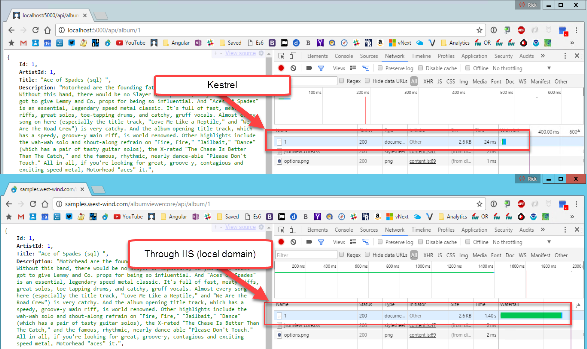

# Odd Performance Issue with ASP.NET Core And Permissions under IIS

I ran into a rather baffling problem recently.




<!-- Post Configuration -->
<!--
```xml
<blogpost>
<title>Odd Performance Issue with ASP.NET Core And Permissions under IIS</title>
<abstract>

</abstract>
<categories>

</categories>
<isDraft>False</isDraft>
<featuredImage></featuredImage>
<keywords>

</keywords>
<weblogs>
<postid></postid>
<weblog>
Web Connection Weblog
</weblog>
</weblogs>
</blogpost>
```
-->
<!-- End Post Configuration -->
