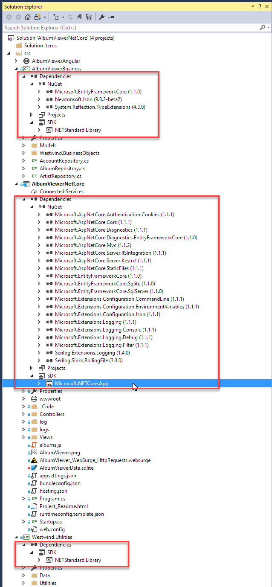
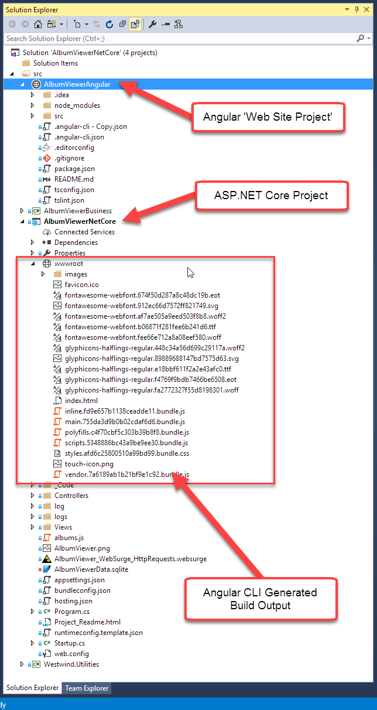
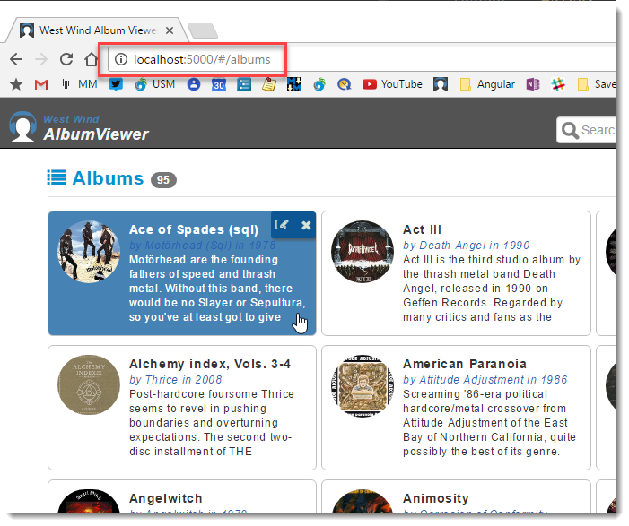

# Updating my AlbumViewer Sample to ASP.NET Core 1.1 and Angular 4

As those of you that come here frequently know, I've been building and updating an ASP.NET Core sample API project called AlbumViewer. It's a small AlbumViewer application that tracks artists, albums and tracks in a small application that provides typical CRUD operations as well as authentication and application management features. It's been my 'reference project' that I use to experiment with ASP.NET Core as well as Angular, and I've dragged it through all the many versions that started with early previews of ASP.NET Core all the way up to .NET Core 1.1 and .csproj, as well an original Angular 1 application dragged through all the way to Angular 4.0.

In this post I want to briefly touch on the latest set of updates, which are:

* Moving from .NET `project.json` based projects to `.csproj` projects
* Moving from Angular 2.x to Angular 4
* Moving from an Angular Starter template to the Angular CLI
* Rethinking about how to setup an Angular Project in a ASP.NET Core Solution

### The AlbumViewer Application
The sample AlbumViewer application is available on Github:

* [West Wind Album Viewer ASP.NET Core & Angular Sample on Github](https://github.com/RickStrahl/AlbumViewerVNext)

and you can check it out online at:

* [Live AlbumViewer Application](https://samples.west-wind.com/AlbumViewerCore/#/albums)

The application is a mobile friendly Web application that browses Albums, Artists and Tracks. It also supports editing of the data via a simple client and server based authentication mechanism.

The application runs in full browser mode:


as well as in mobile mode:


The UI is bootstrap based and it feels a bit dated by now (after all this app is now going on nearly 4 years), but it's certainly functional to as a responsive Web app on all devices.

There's more info on the [repo's home page](https://github.com/RickStrahl/AlbumViewerVNext) on features and how to set this up if you want to play with it.

### Moving to .csproj from project.json - Uneventful
As I've mentioned I've carried this project forward from the early ASP.NET Core betas to the current version. The latest update moves the application to the new `.csproj` project system and .NET Core 1.1.

I had some trepidation before I started given how old this project was, but surprisingly this process went very smooth.

I used Visual Studio to update by:

* Installing VS 2017
* Opening my old `project.json` project
* VS offers an upgrade

Done!

As part of the update process my code has moved to [.NET Standard 1.6.1](https://weblog.west-wind.com/posts/2016/Nov/23/NET-Standard-20-Making-Sense-of-NET-Again) which has significantly reduced the Package clutter seen in .NET Core projects:



Notice that the Westwind.Utilities project has no dependencies outside of .NET Standard which is very nice compared to the nasty clutter that occurred in older versions before .NET Standard! There are a few natural dependencies in the business object project which is roughly what you would see in classic .NET projects. The Web project has quite a few small granular dependencies - this still looks a bit messy, but is not too far off what we had in classic ASP.NET projects with package dependencies for various application level framework components. Regardless the amount of packages in place here is much more manageable and mostly deals with dependencies you would expect in a typical project.

### dotnet migrate
So the update process worked the first time and surprisingly the application came up immediately and **just ran*! There was one problem with Entity Framework (discussed later) that forced me to roll back the EF packages, but otherwise the application just ran on the first try. Again - yay!

If you're not using Visual Studio, or you're running on mac or linux you can also install the latest .NET Core SDK then:

```txt
dotnet migrate
```

which performs the same task as Visual Studio's project migration which simply uses this command line tooling. For kicks I rolled back my project and did the upgrade with **dotnet migrate** and ended up with an identical configuration and a running application.

So Kudos to the .NET project folks - the migrate functionality seems to be working very well.

#### Update project.json to 1.1 first then Migrate
One piece of advice though: If you plan on doing the project.json migration, move your project.json based project to the latest version (1.1) first and make sure everything runs. 

**Then** upgrade the project to `.csproj` using `dotnet migrate` or Visual Studio's migration. This is one less thing to worry about. FWIW, I migrated from 1.0.1 and everything still worked, but I still would recommend going as far as you can with project.json before moving over.

### .csproj only works in Visual Studio 2017
Remember that once you switch to `.csproj` based projects, you can no longer use Visual Studio 2015 - **you have to use VS 2017** as the new tooling is not going to be back ported to VS 2015. This feels like a step back to the old days of .NET where Visual Studio versions had to be matched with .NET versions, but at least that's only forward compatibility. Visual Studio 2017 supports all old project types so it's easy to move development forward to VS 2017. I've been on VS 2017 for nearly half a year and VS 2015 is no longer installed.

VS 2017 also **requires** migration to .csproj. You can't open project.json based projects in Visual Studio 2017 without migrating the project to .csproj.

Another thing to keep in mind that when .NET Core 1.2 (or whatever the next full version will be named/numbered is) ships the `dotnet migrate` command will be retired, so this is meant as an intermediary tooling feature. Project.json too will be discontinued and no longer supported - 1.1 is the last version that works with it. 

So the time to migrate is now if you have older .NET Core projects.

If you're curious what exactly changed in migrating from project.json to .csproj here are the two Github commits that include all the changes in the AlbumViewer project:

* [Update to csProj](https://github.com/RickStrahl/AlbumViewerVNext/commit/fa37c9fc22cb0f03aa4512cda178843fd45a4f60)
* [Update to .NET Core 1.1](https://github.com/RickStrahl/AlbumViewerVNext/commit/0dda286455417fa0ec0e203b8131c5ccaa9bb0de)

### Entity Framework Regression Bug
I ran into an issue with Entity Framework for 1.1.1 right away in the AlbumViewer application. Specifically I was unable to run a query that projects a result property based on `.Count()` or other aggregate operations:

```csharp
public async Task<List<ArtistWithAlbumCount>> GetAllArtists()
{
    return await Context.Artists
        .OrderBy(art => art.ArtistName)
        .Select(art => new ArtistWithAlbumCount()
        {
            ArtistName = art.ArtistName,
            Description = art.Description,
            ImageUrl = art.ImageUrl,
            Id = art.Id,
            AmazonUrl = art.AmazonUrl,
            
            // THIS LINE HERE IS THE PROBLEM IN EF 1.1.1
            AlbumCount = Context.Albums.Count(alb => alb.ArtistId == art.Id)
        })
        .ToListAsync();
}
```

The problem in the code above is the `AlbumCount` property and `Albums.Count()` - removing the count makes the query work. This was found by quite a few people and is discussed in some detail here on Github:

* [Invalid query produced when projecting DTO containing subquery that returns a single element](https://github.com/aspnet/EntityFramework/issues/7714)


The only way to work around that issue was to roll back to EntityFramework 1.1.0:

```xml
<PackageReference Include="Microsoft.EntityFrameworkCore" Version="1.1.0" />
<PackageReference Include="Microsoft.EntityFrameworkCore.SqlServer" Version="1.1.0" />
<PackageReference Include="Microsoft.EntityFrameworkCore.Sqlite" Version="1.1.0" />
<PackageReference Include="Microsoft.AspNetCore.Diagnostics.EntityFrameworkCore" Version="1.1.0" />
```

The bug is acknowledged but there's no 1.1.x update. It'll be fixed for the 1.2.x release. For now using the older 1.1.0 packages is the way to get around this unless you want to jump into pre-release packages. Sure wish the 1.1.x package was updated.

And that's it for the server side .NET updates

### Moving to the Angular CLI
Once the ASP.NET application had been moved I decided to also move the Angular front end application to use the Angular CLI. The Angular CLI is the 'official' command line interface for creating and running new Angular projects, and building final production output for your project. The CLI has a ton of additional features, like run tests, adding new components of all types, but so far I've been focused on using the core features of the CLI which is new projects, running the application with the development and live-reload server and building final production output.

I've struggled for quite a while with finding the right solution to creating new Angular projects. I've gone through a bunch of different starter template projects, even ended up using a custom one I created for a while. While this worked all these solutions have always been problematic once Angular rev'd - getting Angular and dependencies properly updated was always a major undertaking that usually involved creating a new project with the latest starter template and then diffing the two configurations.

The Angular CLI has been around for quite a while, but until recently I wouldn't touch it because early iterations produced some pretty horrible starter projects. However, in recent versions ramping up to the 4.0 release of Angular, the Angular CLI started to improve drastically, producing clean starter projects that closely follow the Angular style guide and provide a minimal template that provides most of what you need and no more.

There are still a few pain points - like the lack of automatic routing hookups, but overall the CLI provides a very usable and productive project after running `ng new`. Routing is missing a sample route hookup, so you have to find the right dependencies and set up your first routes manually which is not the most obvious thing. Luckily the Angular documentation is very good, and shows how to do add the necessary pieces.

### Upgrading to the Angular CLI from a Starter Template
All that said about the CLI, I had to migrate my existing WebPack based template installation to the CLI project. The good news is that this wasn't as much of a pain as a I thought it would be. This is due to the fact that the Angular CLI produces a project that has most of the dependencies already defined.

The approach I took was:

* Create a new CLI project
* Copy my existing application's App folder contents
* Add any non-referenced dependencies to angular-cli.json
* Add all dependencies and declarations to **app.module.ts**
* Copy routes from old route config to new config

To my surprise the application fired right up and ran after getting the module configuration properly set up. The process was a lot easier than I thought.

This brings home a big point I've been making about Angular for a long while: While setup and configuration can be a bit overwhelming, once you get into the guts of building an application the process is very straightforward and logical, and... crazy productive. Upgrading to the Angular CLI reflects that as well - the main application code ran without any modifications whatsoever. The move to the Angular CLI only required getting the configuration properly set up to map to the setup the CLI creates.

### Upgrading to Angular 4
Angular 4 was released a few weeks back and there are many improvements, most of which live behind the scenes and provide improved performance and smaller runtime packages for the base vendor bundles and your own transpiled production code.

I'd been running Angular 2.4 previously, and the upgrade to Angular 4 was almost a non-event. [The Angular site has update instructions](http://angularjs.blogspot.com/2017/03/angular-400-now-available.html) (scroll down a little) that show the the `NPM` commands to update all packages including the CLI. After that simply run the application just as you did before and you're off to the races. 

Very nice.

Since upgrading to Angular 2.0 final, I've not had to do any upgrade specific fixing of code to the AlbumViewer project which is pretty cool, especially given all the major pre-release pain that those of us crazy enough to play with Angular before release (for a loooong time) went through. Upgrades have been smooth with no hiccups for me personally. Each release has a few changes including some relatively small breaking changes, but these are usually very minor and affect not very common use cases. It appears the Angular team is trying very hard to not break backwards compatibility even with the major release of 4.0.

### Managing ASP.NET Core and Angular together
One thing I've been going back and forth on with various projects has been how to break out the client and server side of the application. In my previous iterations of the AlbumViewer I had use a custom starter template and shoehorned that starter template into my ASP.NET application's wwwroot folder. The end result was that I had all my source files off wwwroot/app and then had the final build get the data into the root **/wwwroot** folder.

While this worked this has always been a pain, because it's a customized setup that requires moving things around after using any type of starter template. These templates - including the Angular CLI want to run out of a dedicated folder and making that happen inside of the ASP.NET Core project itself is not really clean.

The ASP.NET Core Repository does provide JavaScript Services:

* [JavaScript Services for ASP.NET Core]https://github.com/aspnet/JavaScriptServices)

This library consists of a bunch of Yeoman project templates plus some pretty cool ASP.NET Core backend services that interface with NodeJs to provide server side pre-rendering of JavaScript/Angular code.

While this stuff is pretty cool, it still doesn't really fit the project layout that Angular projects naturally want to use. 

Ideally I want to use the official solution for creating new projects which is the Angular CLI with its supported mechanism for updating to the latest versions, and as cool as the ASP.NET JavaScript services are, when it comes time to update you're back on your own.

### Breaking out the Angular Project
So, rather than continuing down the 'everything Web in one project' approach, I decided to break out the Angular project into its own folder and 'Web Site' project. The Angular application now lives in it's own folder on disk, and is accessible in Visual Studio as an old school Web Site project. 



I don't actually edit the Angular project in Visual Studio as I use [WebStorm](https://www.jetbrains.com/webstorm/) for my client side development. But it's nice to have the Angular project part of the solution so I can see the code there and make the occasional quick edit from VS. The key thing is that the Server Web API and Angular Front End projects are separate.

I like this because while developing I am already running a separate server for my front end project, using the Angular CLI server on port 4200, connecting the Web API server on port 5000. This means I have to already build my Web API in such a way that * it supports remote connections with CORS anyway
[it supports remote connections with CORS anyway](https://weblog.west-wind.com/posts/2016/Sep/26/ASPNET-Core-and-CORS-Gotchas).

This means I can potentially run my backend API and my front end as completely separate Web sites. 

To make switching between sites a bit easier I use a client side configuration service class in which I define a `baseUrl` that determines where the server will be accessed:

```typescript
@Injectable()
export class AppConfiguration {
  constructor(){
      this.setToastrOptions();
      console.log("AppConfiguration ctor");

      if(location.port && (location.port == "3000") || (location.port== "4200") )
        this.urls.baseUrl = "http://localhost:5000/"; // kestrel

      //this.urls.baseUrl = "http://localhost:26448/"; // iis Express
      //this.urls.baseUrl = "http://localhost/albumviewer/"; // iis
      //this.urls.baseUrl = "https://samples.west-wind.com/AlbumViewerCore/";  // online
  }

  urls = {
    baseUrl: "./",
    //baseUrl: "http://localhost/albumviewer/",
    //baseUrl: "http://localhost:5000/",
    //baseUrl: "https://albumviewer2swf.west-wind.com/",
    albums: "api/albums",
    album: "api/album",
    artists: "api/artists",
    artist: "api/artist",
    artistLookup: "api/artistlookup?search=",
    saveArtist: "api/artist",
    login: "api/login", //"api/login",
    logout: "api/logout",
    isAuthenticated: "api/isAuthenticated",
    reloadData: "api/reloadData",
    url: (name,parm1?,parm2?,parm3?) => {
      var url = this.urls.baseUrl + this.urls[name];
      if (parm1)
        url += "/" + parm1;
      if (parm2)
        url += "/" + parm2;
      if (parm3)
        url += "/" + parm3;

      return url;
    }
  };
```

Using this approach it's very easy to switch the server between different locations by injecting the **AppConfiguration** service and then using the `config.urls.url()` function to build up a url:

```typescript
@Injectable()
export class AlbumService {
  constructor(private http: Http,
              private config:AppConfiguration) {
  }

  albumList: Album[] = [];
  
  getAlbums(): Observable<Album[]> {
    return this.http.get(this.config.urls.url("albums"))
        .map((response)=> {
          this.albumList = response.json();
          return this.albumList;
        })
        .catch( new ErrorInfo().parseObservableResponseError );
  }
  ...
}
```

This makes it super easy to switch between backends. For example, I find it useful during development sometimes to just use the static backend on my live samples server because I know it's always up and running. Other times I want to use my local development server because I know i'll be making changes to the server as I work.

### Building Output into wwwroot
If you don't want to run two separate Web sites/virtuals for your front end and backend code you can still generate all of your output into the server's wwwroot folder easily enough. In fact I set up my **angular-cli.json** file to point at the wwwroot folder in the server project:


```json
{
  "apps": [
    {
      "outDir": "../AlbumViewerNetCore/wwwroot"
      ...
    }
    ...
}
```

This always builds the application into the `wwwroot` folder when I build a production build with:

```dos
> ng build --prod
```

This produces the final packaged Angular application output into the Web app's wwwroot folder that I can ran in a single Web site:



### Summary
This project has been an interesting one for me and the excercise of keeping it up to date with the latest versions is a great reference to understand some of the core features of both the server side ASP.NET Core and .NET Core frameworks as well as the Angular bootstrapping code.

I'm happy to say that the latest set up updates for both the .NET and Angular pieces have been spectacularily painless, compared to crazy churn that was happening with both frameworks not so long ago. Both Microsoft and Google seem to have gotten the memo that breaking code for each minor release is going to piss people off and eventually drive them away from your products. 

And it looks like it's working. Both ASP.NET and Angular Updates to major new versions and build tools happened with minimal effort.

Here's to many more updates that are as relatively painless as this.

<div style="margin-top: 30px;font-size: 0.8em;
            border-top: 1px solid #eee;padding-top: 8px;">
    
    this post created with 
    <a href="https://markdownmonster.west-wind.com" 
       target="top">Markdown Monster</a> 
</div>