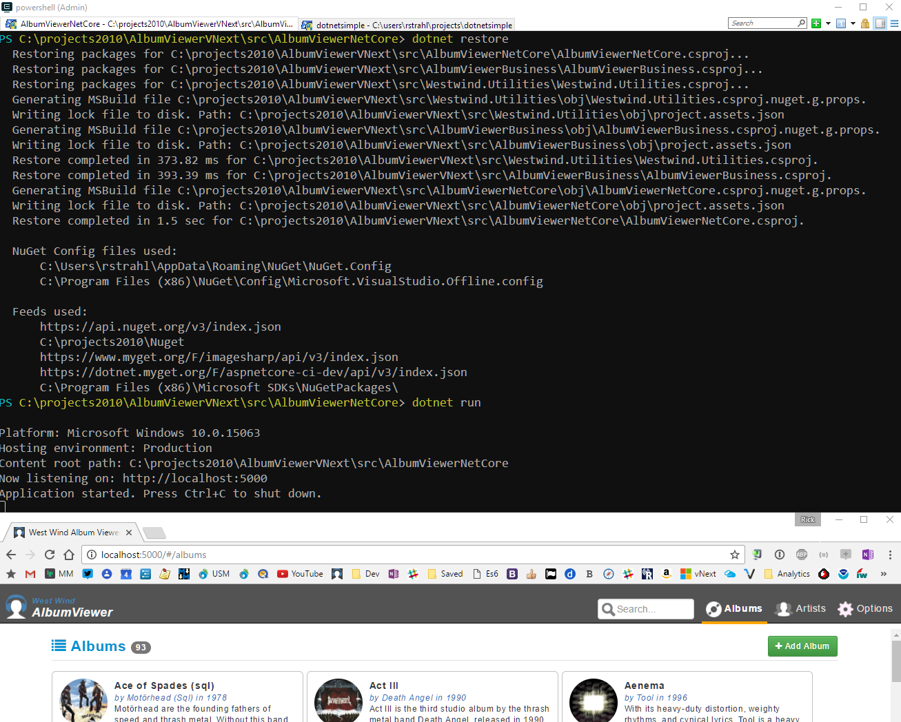

# Adding Docker to my existing ASP.NET Core AlbumViewer


For those of you who have been following my blog, you probably know that I've been using my AlbumViewer sample application as a test bed for playing around with ASP.NET Core and Angular and I've shown a few examples of the application running on non-Windows platforms.

Docker of course is at the top of the current hype machine these days. Docker certainly embodies some great concepts, but it took me a while to get my head around Docker's model and to actually start using it. The base technology sounds a lot more intimidating than it is and with just a handful of commands and a little bit of automation you can accomplish some pretty compelling functionality.

I thought I'd share my journey here in the context of my ASP.NET Core and Angular sample application, which always makes for a good and by now familiar use case. 

### What is Docker and why should we care?
Docker makes it possible to package applications, application services and potentially your entire development environment in a reliable and easily reproducible way. In a way Docker is a way to componentize all the major technology pieces in an application and create an entire application made up of these components. Because each of these components run in a standard and known hosted environment - typically a Linux machine or VM - it's possible to recreate an execution environment including the host OS **exactly** every time it is deployed. And because Docker components are essentially self-contained packages they are easy to deploy and share.

### Getting Started with Docker
The base concepts of Docker are straight forward and you can take advantage of containers even with the most basic behavior for testing and simply getting your feet wet running .NET Core applications under Linux.

I actually got inspired to do this after watching my good buddy [Dan Wahlin's ng-conf Docker Session](https://www.youtube.com/watch?v=socWfhPJptE). Dan has a knack for condensing down technologies to just what you need to know in a conversational mode and this session is another great example of that. If you're new to Docker - check it out. I'll cover some of the same material here in more condensed form as well so read on.

### Docker: A Tale of Images and Containers
For those of you that have not looked at Docker, it is a container technology that essentially allows you encapsulate a runtime environment including all the tools, technologies, settings and dependencies you need to run your application. You can package all that into a **Docker Image** which is essentially a blueprint that encapsulates all the pieces that make up that particular piece of your application. 

In the example I use here, the application image is made up of the base .NET runtime and tools, plus the application's physical representation on disk. Another image represents the the front end Web server and yet another may describe a database engine and its configuration. Images are abstract - they merely **describe** the components that make up the image. 

Once you have an image you can create a **Docker Container**, which is a physical instantiation of the image. A container hosts all the pieces described in the Image in real physical form. A container runs in its own isolated Docker container which is similar to a Virtual Machine, but much more light weight. Docker containers generally launch very quickly - a .NET runtime container starts up in less than a second typically which is one of the benefits of containers:  you get most of the isolation and all of the repeatability of a VM, but without all the overhead of a heavy VM.

You can run multiple containers simultaneously and all the containers can potentially communicate with each other. Docker provides special network and virtualization management that lets components interact with the host network and physical storage as well as providing a bridge network that lets several containers communicate with each other.

To put this more concretely consider that you can run your ASP.NET Core application in one container, a front end Web Server like NGinx in another, and a database server like MongoDb, MySql or Sql Server (or all of them) in another.

To bring multiple containers together you can combine containers using **Docker-Compose** which lets you configure several containers and fire them up simultaneously.

### Using `docker build` and `docker run`
Enough abstract talk - lets create a container from our application. I'll start by creating a new .NET console application and running it under docker. I'll follow that up with creating a dockerized version of the AlbumViewer Web app.

The first step is to make sure Docker is installed. I'm not going to go through the steps here, but you can find install instructions for your platform on the Docker Web site. Make sure Docker works as described on the installation page.

You should be able to type:

```txt
docker -v
dotnet
```

into a Terminal window and get a response.

Next you can clone the AlbumViewer Sample from:


and change into the `src/AlbumViewerNetCore` folder of this solution. This the ASP.NET Core project that runs the API backend for the application.

To test you should be able to do:

```powershell
dotnet restore
dotnet run
```

and you should be able to run the application:



to make sure it runs properly on Windows (or whatever platform you're working on) first.

### Creating our First Docker Image
Now let's create a docker file for the ASP.NET Core application. As it turns out creating a docker image is quite easy. We start by creating a `Dockerfile` (filename without an extension) that looks like this:

```docker
FROM microsoft/dotnet:1.1.1-sdk

MAINTAINER Rick Strahl

ENV ASPNETCORE_URLS=http://*:5000
ENV ASPNETCORE_ENVIRONMENT=Release

# Allow access to port 1433 for SQL Server access
# Note: App runs with SqLite by default so this is
#       not actually required but if you switch to
#       SQL Server it'll work too
EXPOSE 1433

# copy publish folder contents to web root
COPY ./bin/Release/netcoreapp1.1/publish /var/www/albumviewer

# set the working folder in the container 
# where we copied files to
WORKDIR /var/www/albumviewer

# Run the app out of this folder
CMD ["/bin/sh", "-c", "dotnet 'AlbumViewerNetCore.dll'"]
````

For a simple configuration this is all that's needed.

Now let's create a container. In order to do this there are a couple of things that should happen. We need to first ensure the application is 'published' which means the dotnet compiler has created the `./bin/Release/netcoreapp1.1/publish` folder.

To do this we can run this command in powershell in the project folder:
```txt
dotnet publish
```

Next we build the container:

```txt
docker build -t westwind/albumviewer:albumviewer .
```

This builds a container from the image and if it succeeds the image should show up when you list containers with:

```txt
docker ps -a 
```


To bring up containers you can use:

* docker build
* docker run or docker start

To combine containers into a group you use `docker-compose`.

Let's take a look how we
and you can compose several containers together using **docker-compose**. Compose lets you drive the behavior of multiple containers such as what ports to expose and map, what volumes to map to disks and how the network behaves.

Because a Docker Image is tied to a specific version of an OS and host, the results of running a docker application should always be the same regardless on which platform or hardware you are running the application assuming any external resources like remote servers and network access are configured correctly.

### Images, Containers and Hosts
Docker uses what is known as **containers** to host docker **images**. 

Images are blueprints that describe what your application should look like - they contain instructions on what dependencies on other Docker Images are needed to run your application, and then contains instructions for starting and running your application inside of that container. 

Containers host images and are essentially a very lightweight OS snapshot that is configured for your to host your application. The container is what provides the necessary directory structure, the network access and more that is made available to your image.

Containers should be considered **transient** - meaning they are created when the container is started and completely torn down when you shut it down. Any changes made to the container are lost when it stops.

For this reason, any persistent data needs to be stored externally to the container - either on servers like a data store backend, other services running elsewhere on the network, or by exposing a file volume that is mapped into the container from the host.

Containers run inside of a host environment - for typical Docker applications on Windows and the Mac this means they run inside of a light weight Alpine Linux VM. On Windows this VM runs in Hyper-V, on the Mac it runs using VirtualBox and on Linux it runs natively on the live OS. Windows also supports Windows Containers run natively on Windows 2016 or Windows 10 host, but these containers are generally much more heavy weight and for obvious reasons only work on Windows.

### Docker Images
The first and most basic building block is a Docker Image. 

A Docker image can contain whatever settings you need to run a particular application along with all the settings, and potential shell commands to get the application to start.

An image is a blue print that holds all the settings needed to run an application on the host container. Docker then lets you **run** that image, which instantiates it and executes it in the container.
instances


