# Creating a Markdown Monster Addin: Save Images to Azure Blob Storage


One of the main reasons why I created the [Markdown Monster](https://markdownmonster.west-wind.com) is that I wanted a Markdown and Weblog Publishing solution that is easily extensible with a relatively easy addin model using the same platform Markdown Monster is built with: **.NET**. 

There are lots of editors that do Markdown editing, but generally they are just editors with a few fixed editor related features. Markdown is such a versatile format and there are million ways it can be used that it really makes sense to extend base editor features with custom functionality both for base editing and publishing functionality as well as for custom use cases in specialized applications.

Perhaps you need a way to post raw Markdown or converted HTML to a custom Web site that doesn't support standard Weblog publishing APIs. Maybe you need to embed external data or service features into your Markdown frequently, or you want to execute some external code to commit data to a repository or generate static content. Or maybe you want to build custom preview support for one of the special Markdown based language extensions to build presentations, graphs or data analysis representations. The sky's the limit really, once you have an easy addin model that gets you to your own code, along with an easy to use interface to interact with Markdown Monster's own API and user interface.

Markdown Monster includes a **.NET based addin model** that makes it easy to extend its built-in feature set. In this post I'll show how to use C# and .NET to create a new Markdown Monster Addin, and demonstrate a real life use case of an **Azure Blob Image Uploader** that plugs directly into Markdown Monster.

You can check out this addin, by installing it from Markdown Monster's Addin Manager or the source code at:

* [Save To Azure Blob Storage Markdown Monster Addin](https://github.com/RickStrahl/SaveToAzureBlob-MarkdownMonster-Addin)

##AD##

### Addin Registry
Markdown Monster ships with an Addin Manager that shows all publicly shared addins. 

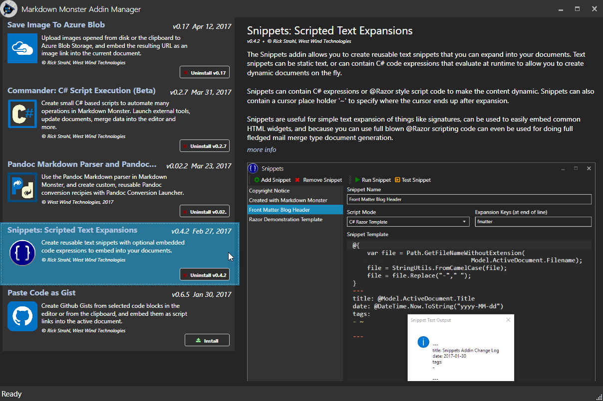

Markdown Monster is a relatively new application so there aren't a lot of addins in the registry **yet**, but hopefully others will end up sharing their addins in the registry. Part of the reason for this post is to encourage other developers to create new addins and share them in the registry for usage by all MM users.

### Extending Markdown Monster with C#/.NET
There are two ways that you can extend Markdown Monster. Markdown Monster is a .NET application so you can use .NET code to extend it. There are two ways to do this:

* **Use the Commander C# Script Addin**  
The [Commander C# Scripts Addin](https://github.com/RickStrahl/Commander-MarkdownMonster-Addin) is a great way to create small, 'scripty', non-visual functionality that extends Markdown Monster. Common things you do include creating inserting and updating text in the Markdown document, executing external applications and creating custom output formats. Lots of power, but it is essentially script code.

* **Create a Markdown Monster Extension**  
For more complex extensibility or extensions that require user interface support a Markdown Monster Addin is a better choice. While Scripts get access to the same object model, full Addins can hook into the application life cycle, can interact with the user interface and even bring up forms and other UI components on their own. 

In this post I'm going to focus on creating addins and I'll start by describing how to create a new addin and some of the basic features you can perform, then dive in and build a more practical addin that allows you to save Images to Azure Blob storage and embed those images into the current document.

I'll briefly describe how to create a new addin from scratch and then show a specific example of creating an addin that allows saving of images to Azure Blob storage and embedding the resulting link into the current document.

The resulting Addin I discuss here looks like this:

 

and you can find it on Github here: 

* [SaveToAzureBlob-MarkdownMonster-Addin on GitHub](https://github.com/RickStrahl/SaveToAzureBlob-MarkdownMonster-Addin)

### Creating a new Markdown Monster Addin
The easiest way to create a new Markdown Monster Addin is to use the [Markdown Monster Addin Project Visual Studio Template](https://marketplace.visualstudio.com/items?itemName=RickStrahl.MarkdownMonsterAddinProject). You can install this template from the Visual Extensions in Visual Studio:

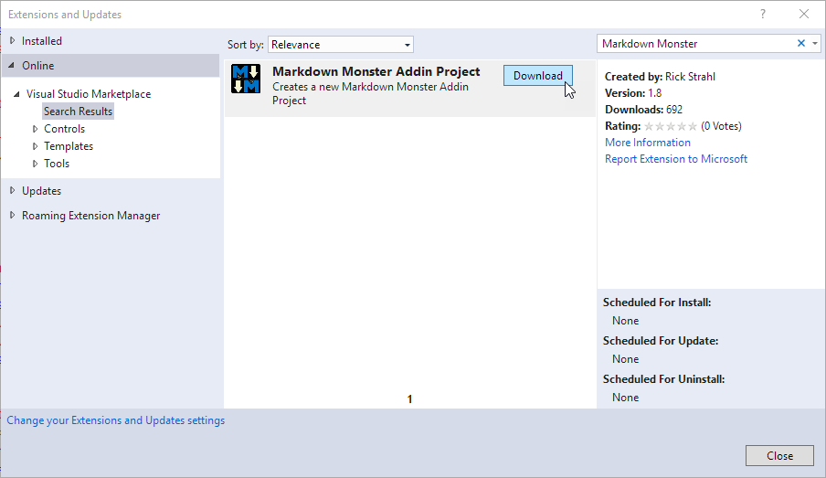

Once added you've added the new extension you have to restart Visual Studio. You can then create a **New Project**:

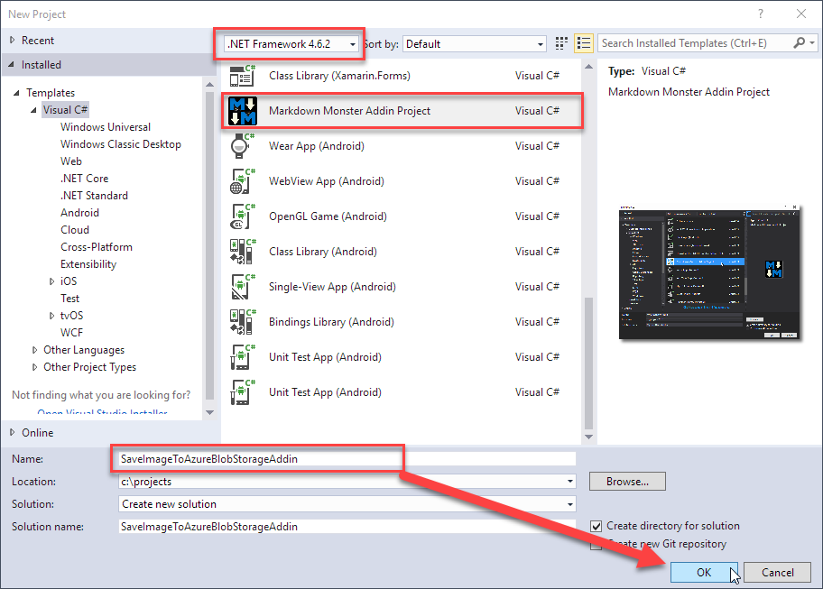

### A couple of Ground Rules
There are a couple requirements for Markdown Monster Addins:

* **Addins must be built for .NET 4.6.2 or later**  
It's important that an Addin at least uses this .NET version since Markdown Monster is compiled with 4.6.2 as you otherwise can't reference the Markdown Monster assembly. MM can run on older versions of .NET but any extensions have to use 4.6.2 or later.

* **Addin final assemblies must have an **Addin** postfix**  
The final addin output DLL has to have a file name ending in **Addin.dll**. If you didn't name your addin with an **Addin** postfix, make sure you add it to the the **Assembly Name** explicitly as shown in this figure:

  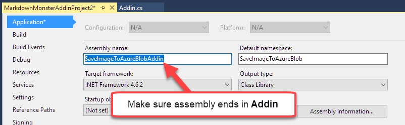

When it's all said and done you should now have a Visual Studio project that builds to the Markdown Monster's Addin folder.

The template sets up a very basic addin class for you. The following screen shot shows the project and the full initial addin class:

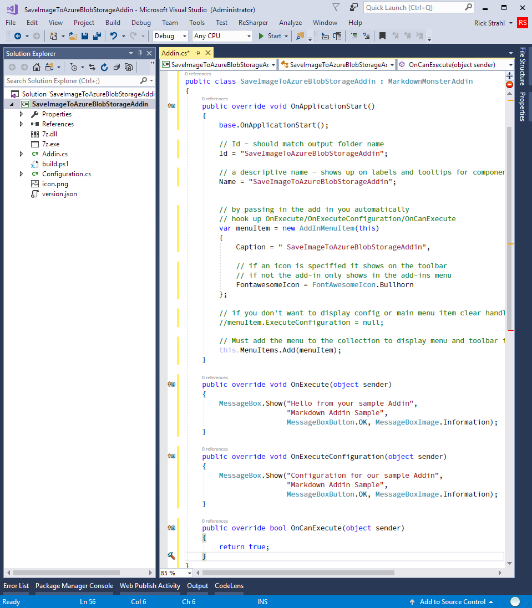

An Addin implements `OnApplicationStart()` which is used to configure the addin. This is mostly used to configure the name of the Addin and the UI for the button on the toolbar. If you don't want it to show on the toolbar, simply don't add the menu item to the `MenuItems` collection. The key method for addin operation is `OnExecute()` which is fired when you click the button on the toolbar (or use the assigned hotkey). 

Addins expose a number of additional lifecycle event handlers that let you know when documents are opened, activated, saved, when commands are fired and so. We won't look at those in this post which only deals with the `OnExecute()` method to handle Azure Image blob uploading, but there's [more info in the documentation](http://markdownmonster.west-wind.com/docs/_4ne1cgnor.htm).

##AD##

### Building and Running the Addin
Once the Addin's been created you can build it, which writes out the assembly Markdown Monster's common Addins folder:

```txt
%appdata\Markdown Monster\Addins\SaveImageToAzureBlobStorageAddin
```

The Addins folder is where Markdown Monster looks for addins, and it scans for any subfolders that contain a `*Addin.dll` file. If found any addin that implements `IMarkdownMonsterAddin` is loaded. My addin inherits from `MarkdownMonsterAddin` which already implements this interface.

To check out if it works, just start Markdown Monster as you normally would - from the start menu or the desktop shortcut. Debugging doesn't work out of the box - I'll show how to hook it up later. The running stock addin looks like this:

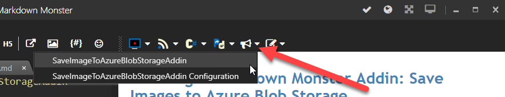

The bullhorn icon is the default icon for a new addin. If you click the icon you should get a hello message from the addin. Clicking on the drop down button and clicking on the configuration link gives a configuration message.

### What can you do?
Addins use .NET so you can write **any .NET code** you want to use in your addin code. Markdown Monster exposes its rich object model to add-in authors so you can interact with the active document inserting or updating content, executing external code using processes for example automating file and source control operations. You can have an addin that triggers content generation for Web site builders like Wyam, Jekyll or Hexo using either external process calls, or by using APIs provided by these providers.

Here are a few common things you can do in an addin:

##### Update and mark up selected Text
```cs
// modify selected editor text
var text = GetSelection();
text = "<small>" + text + "</small>";
SetSelection(text);
RefreshPreview();
```

##### Open a new Tab from a File
```cs
// open a tab
var file = Path.Combine(mmApp.Configuration.CommonFolder,"MyAddinConfiguration.json");
OpenTab(file);
```

##### Run an External Process
```cs
var docFile = ActiveDocument.Filename;

var pf86 = Environment.GetFolderPath(Environment.SpecialFolder.ProgramFilesX86);
var folder = Path.Combine(pf86,"SmartGit\\bin");
var exe = Path.Combine(folder,"smartgit.exe");

var pi = Process.Start(exe,docFile);
if (pi != null)
    ShowStatus("Smartgit started...",5000);
else
    Model.Window.ShowStatus("Failed to load Smartgit...",5000);
```

##### Bring up a Custom Form 
```cs
var form = new PasteImageToAzureWindow(this);
form.ShowDialog();

if (!string.IsNullOrEmpty(form.ImageUrl))
{
    SetSelection("");
    SetEditorFocus();
    RefreshPreview();
}
```            

These are just some examples of what you can do, but really - **the sky's the limit**. Anything you can dream up in code, you can plug into an addin.

### Debugging your Addin
The **Markdown Monster Addin Project Template** pretty much sets up everything you need **except the ability to debug your addin**. To do this you need to manually configure the debug startup program and point at the Markdown Monster installation in Program Files:

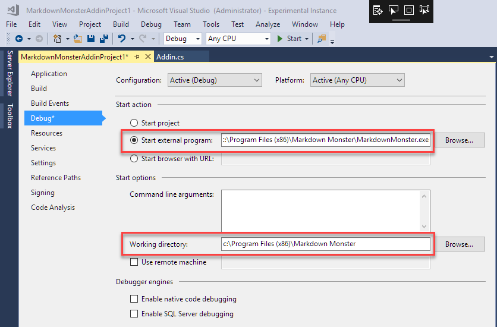

Point the debugging **Start External Program** setting at the installed `MarkdownMonster.exe` in the install folder (Program Files(x86) by default).

Now you can start the addin from Visual Studio and debug your addin, set breakpoints and step through code like you always with any other .NET component.

Sweet! We now have a working albeit kinda useless Markdown Monster addin. So, let's add some useful functionality.

## Saving Images to Azure Blob Storage
A while back [James Chambers](https://twitter.com/canadianjames?lang=en) contacted me and asked about the ability to add images to his blog posts and store those images in Azure Blob Storage. According to James his current process was to manually add images to Blob Storage and then manually link the URL in his Markdown document. While that's not too difficult this process can be made much more streamlined by making it easy to select images from disk or the clipboard and uploading them.

What I want to do next is:

* Create the logic to upload an image and embed the URL into the Document
* Create a form that lets me pick a file or paste from the clipboard
* Create configuration on the form that allows me to specify an account
* Add an Image Preview when a file is selected or pasted
* Miscellaneous image pasting logic

### First Things First: An Azure Image Uploader Class
The first thing to do is to build a generic uploader for Azure Blob data. I'm using the **Azure Storage SDK** which is done by adding the `WindowsAzure.Storage` NuGet package to the project.

With the SDK installed uploading images is pretty straight forward. The class implements two methods: One that uploads a file from disk and another that uploads from a WPF ImageControl, which is useful for capturing clipboard images directly into an image control and then directly to Azure.

Here's the code for the Azure Image Uploader:

```cs
public class AzureBlobUploader
{        
    public string ErrorMessage { get; set; }


    private bool UploadStream(Stream stream, string blobName, CloudBlobContainer container)
    {
        CloudBlockBlob blockBlob = container.GetBlockBlobReference(blobName);

        // Create or overwrite the blob
        blockBlob.UploadFromStream(stream);

        return true;
    }

    public string SaveFileToAzureBlobStorage(string filename, string connectionStringName, string blobName = null)
    {
        if (filename == null || !File.Exists(filename))
        {
            ErrorMessage = "Invalid file name. No file specified or file doesn't exist.";
            return null;
        }

        var blobConnection = AzureConfiguration.Current.ConnectionStrings
            .FirstOrDefault(cs => cs.Name.ToLower() == connectionStringName.ToLower());

        if (blobConnection == null)
        {
            ErrorMessage = "Invalid configuration string.";
            return null;
        }

        try
        {
            CloudStorageAccount storageAccount = CloudStorageAccount.Parse(blobConnection.DecryptConnectionString());
            CloudBlobClient blobClient = storageAccount.CreateCloudBlobClient();
            CloudBlobContainer container = blobClient.GetContainerReference(blobConnection.ContainerName);
            container.CreateIfNotExists();
            container.SetPermissions(new BlobContainerPermissions { PublicAccess = BlobContainerPublicAccessType.Blob });

            bool result = false;
            using (var fileStream = File.OpenRead(filename))
            {
                result = UploadStream(fileStream, blobName, container);
            }

            if (!result)
                return null;

            var blob = container.GetBlockBlobReference(blobName);

            return blob.Uri.ToString();
        }
        catch (Exception ex)
        {
            ErrorMessage = ex.GetBaseException().Message;
            return null;
        }
    }

    public string SaveBitmapSourceToAzureBlobStorage(BitmapSource image, string connectionStringName, string blobName)
    {

        var blobConnection = AzureConfiguration.Current.ConnectionStrings
            .FirstOrDefault(cs => cs.Name.ToLower() == connectionStringName.ToLower());

        if (blobConnection == null)
        {
            ErrorMessage = "Invalid configuration string.";
            return null;
        }

        try
        {
            CloudStorageAccount storageAccount = CloudStorageAccount.Parse(blobConnection.DecryptConnectionString());
            CloudBlobClient blobClient = storageAccount.CreateCloudBlobClient();
            CloudBlobContainer container = blobClient.GetContainerReference(blobConnection.ContainerName);
            container.CreateIfNotExists();
            container.SetPermissions(new BlobContainerPermissions { PublicAccess = BlobContainerPublicAccessType.Blob });

            // strip leading slashes - Azure will provide the trailing dash
            // on the domain.
            if (blobName.StartsWith("/") && blobName.Length > 1)
                blobName = blobName.Substring(1);

            var extension = Path.GetExtension(blobName).Replace(".", "").ToLower();
            BitmapEncoder encoder;

            if (extension == "jpg" || extension == "jpeg")
                encoder = new JpegBitmapEncoder();
            else if (extension == "gif")
                encoder = new GifBitmapEncoder();
            else if (extension == ".bmp")
                encoder = new BmpBitmapEncoder();
            else
                encoder = new PngBitmapEncoder();

            encoder.Frames.Add(BitmapFrame.Create(image));

            bool result;
            using (var ms = new MemoryStream())
            {
                encoder.Save(ms);
                ms.Flush();
                ms.Position = 0;

                result = UploadStream(ms, blobName, container);
            }

            if (!result)
                return null;

            var blob = container.GetBlockBlobReference(blobName);

            return blob.Uri.ToString();
        }
        catch (Exception ex)
        {
            ErrorMessage = ex.GetBaseException().Message;
        }

        return null;
    }

}
```    
The Azure SDK is mercifully easy to work with and the SDK methods are very self-descriptive so the code doesn't need much explanation.

The uploader returns the URL that Azure creates when the image is successfully uploaded, or `null` if an error occurs, in which case you can check the `ErrorMessage` property.

#### Azure Security
About the only thing worth mentioning about this code is that you need to provide a **connection string** and a **container name** for the blob . The connection string is what is provided to you in the Azure portal in the Storage area of the individual Blob Account you'll be using to write to and which looks something like this (not a valid key, yo - so get your own!).

**DefaultEndpointsProtocol=https;AccountName=westwindblob;AccountKey=xdfRTd22f6w2s4rtF3J9ezg6WsnQ==**

When you upload, you'll provide the connection string which effectively provides the Azure account, and a specific container that the blob is uploaded to and a 'file path' which is really just a string path separators. Azure breaks out the forward slashes into a simulation of paths when served over HTTP.

To visualize this better here's what an uploaded file looks like in the Azure portal.

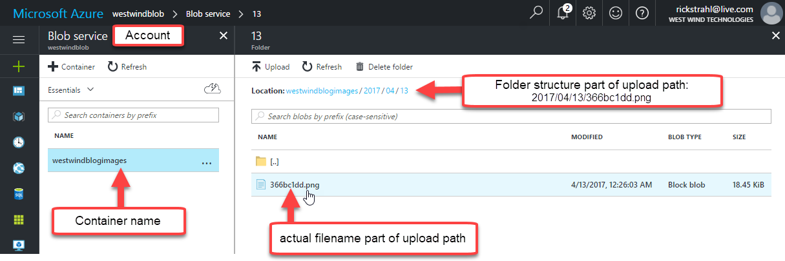

You can also use the [Azure Storage Explorer](http://storageexplorer.com/) which makes it much easier and much quicker than the portal to view and delete (during development) your uploaded images:

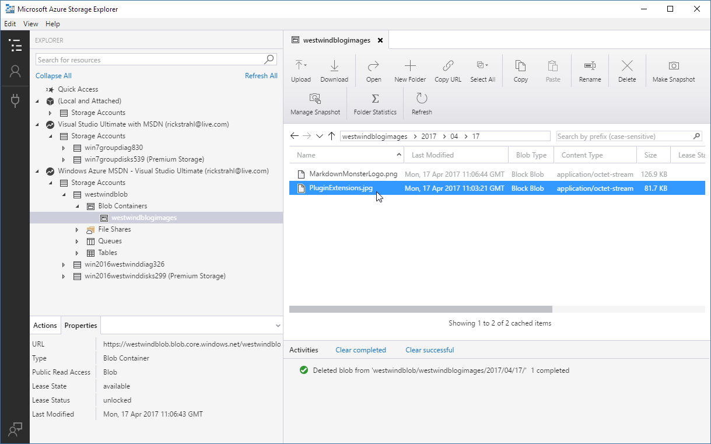

### Storing Azure Connections
In order to make this easier to work with in the Addin, I created an `AzureBlobConnection` object, and a collection of `AzureBlobConnections` property on a Configuration object the addin automatically generated. This list lets me keep track of multiple accounts and easily select them. So rather than using a connection string as input for my Azure upload methods I use a descriptive connection string name that is more user friendly in the User interface later.

To do this I need a connection object:

```cs
public class AzureBlobConnection
{        
    /// <summary>
    ///  The unique name for this connection - displayed in UI
    /// </summary>
    public string Name { get; set; }


    /// <summary>
    /// The Azure connection string to connect to this blob storage account
    /// </summary>
    public string ConnectionString { get; set; }

    /// <summary>
    /// Name of the container to connect to
    /// </summary>
    public string ContainerName { get; set; }

    
}
```

and a place to store and persist these connections.

Multiple connections can then be stored in a configuration class which in this case has a single property that is the list of connections:

```cs
public class AzureConfiguration : BaseAddinConfiguration<AzureConfiguration>
{        
    public List<AzureBlobConnection> ConnectionStrings { get; set; }

    static AzureConfiguration()
    {            
        Current = new AzureConfiguration();
        Current.Initialize();
    }
        
    public AzureConfiguration()
    {
        ConfigurationFilename = "SaveToAzureBlobStorageAddIn.json";
        ConnectionStrings = new List<AzureBlobConnection>();
    }
}
```

The base configuration class is automatically generated when you create a new addin via the project template. I added **ConnectionStrings** property to hold the list of connection strings a user can configure.

The configuration class can be accessed as `AzureConfiguration.Current` and it knows how to persist itself when you call the `.Write()` method on it.

##AD## 

### Using the Uploader in the Addin
Ultimately I want to create a UI that lets me select or capture an image to upload, but for now to demonstrate that the uploader works and produces the right output in the document's text, I'll hard code a file to upload and then embed the result link into the page.

```cs
public override void OnExecute(object sender)
{
    var connection = AzureConfiguration.Current.ConnectionStrings.FirstOrDefault();
    var uploader = new AzureBlobUploader();

    // for now simulate with a hardcoded file
    var imageUrl = uploader.SaveFileToAzureBlobStorage(@"c:\temp\sailbig.jpg",
        connection.ConnectionString,
        "2017/04/12/sailbig_01.jpg");

    if (!string.IsNullOrEmpty(imageUrl))
    {
        SetSelection("");
        SetEditorFocus();
        RefreshPreview();
    }
}
```

This works and produces output like this in the markdown document:

```markdown

```

The uploader does its thing to get the image uploaded and produces a URL. I can then take that URL and paste it at the current selection point using `SetSelection()` and writing a Markdown image expression. I then also want to ensure that the editor gets focus and that the PreviewWindow in MM is refreshed.

Easy!

### Creating a UI
Selecting of files however is a visual operation as is pasting an image, and as I already discussed earlier it's also necessary to let the user specify an output filename and provide a connection string and container name. 

All of this really requires a Window to display and interactively handle the user input and here's the UI that I created to represent these operations:

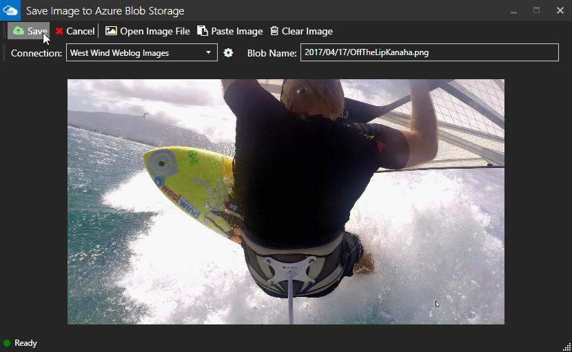

The form lets you select a connection, which maps to entries from the ConnectionString collection I mentioned earlier. You can also specify a BlobName which is the final filename along with a relative path. This value is set by default to the current data and a random filename. Once you select a file the name is updated to reflect the original filename.

You can also paste images into this document. If you have an image on the clipboard simply paste it into the document using the **Paste Image** button, or pressing **Ctrl-v**. If no image is selected yet, any image on the clipboard is automatically loaded and shown. The idea is if you have an image on the clipboard and activate the form all you have to do is adjust the filename if necessary and press **Save**.

When you click save the actual **uploader.SaveFileToAzureBlobStorage()** or **uploader.SaveBitmapSourceToAzureBlobStorage()** are invoked to send the image to the server.

You can check out the complete source code for the form on Github:

* [PasteImageToAzureWindow Code](https://github.com/RickStrahl/SaveToAzureBlob-MarkdownMonster-Addin/blob/master/SaveImageToAzureBlob-MarkdownMonster-Addin/PasteImageToAzureWindow.xaml.cs)

There's quite a bit of code in this form that deals with pasting of images and dealing with both file loaded and pasted images and calling the appropriate upload methods. There's a bunch of logic that tries to make the process of getting image data into the form and uploaded as quickly as easy.

You can peruse the code to see how all that works - the code is straight forward but there's quite a bit of it.

There's also an additional configuration form that allows you to configure one or more connections:

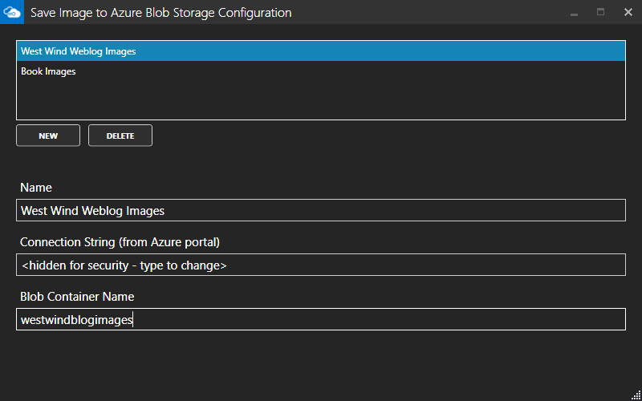

This form lets you enter new connections, and handles automatically encrypting the connection string for storage on disk. The connection string is stored in encrypted format and decrypted only when sending images to Azure.


### Capturing Image Upload Results and Embedding Into the Document
The form operates as a modal form and the form operation is hooked up to the addin with this little bit of code:

What I want to end up with in the Addin code is this for the `OnExecute()` implementation:

```cs
public override void OnExecute(object sender)
{          
    var form = new PasteImageToAzureWindow(this);
    form.ShowDialog();

    if (!string.IsNullOrEmpty(form.ImageUrl))
    {
        SetSelection("");
        SetEditorFocus();                                
        RefreshPreview();
    }
}
```        

Normally a modal form is a bad idea, but embedding an image means I need to actually upload the image, capture the URL and then embed it **at the current cursor location**.  I really have to wait for a response before I can go forward in the main form otherwise the cursor is likely to move. 

The form uses the `ImageUrl` property to let the caller know what to embed. If the string is `null` the user either canceled or something went wrong, otherwise the image URL is captured and set up as a `` expression into the Markdown document text.

And that's it - my addin is complete

### Installing your Addin on a non-dev Machine
By default any addin you create is compiled and dropped into the local account's Addin folder for Markdown Monster. You can also manually copy your addin into this folder by:

* Copying build output folder `%appdata%\Markdown Monster\Addins\MyAddin` to a new location

This allows you to install and share your addin manually.

### Publishing your Addin to the Markdown Monster Addin Registry
If you've built an addin that has more broad general appeal you can publish it to the Markdown Monster Addin Registry. You can find out more at:

* [Markdown Monster Addin Registry](https://github.com/RickStrahl/MarkdownMonsterAddinsRegistry)

To publish an addin and have it show up in the Addin Manager as a downloadable addin:

* Create your Addin as a Github Repository
* Create a unique Id for your Addin (camel cased name)
* Make sure your repo has a `\Build` and `\Build\Distribution` folder
* Make sure required files are provided (addin.zip, icon.png, version.json, screenshot.png)

If you created your addin from the **Markdown Monster Addin Project Template**, the structure of your project will already be set up correctly. In the project folder there is a `build.ps1` Powershell script that you can run to create a `Build` folder that contains the required zip file, icon, screenshot and version.json files. Note that all the source files live in the original project folder and `build.ps1` copies the files to the `Build` folder. Any changes to these files should be made in the **project folder**.

### Markdown Monster Addin Git Repository Guidelines
In order to submit a Markdown Monster addin to the repository you need to use a Git repository and publish your addin with source code and a **very specific structure** for your `\Build` folder.

The structure of the repo **has to include** the following folder and structure:

```
\              
    \Build
        addin.zip         // zip of Distribution folder   
        icon.png          // Square 256x256 PNG logo for addin
        screenshot.png    // screenshot - try to keep the width under 1000px
        version.json      // version info
        \Distribution     // compiled Addin DLLs and version
            yourAddin.dll         // name *must* end in *Addin.dll
            <dependency dlls>
            version.json          // same  file as Build folder
    \src
        <source files>    // source files for your addin      
Readme.md 
```
The filenames in the the `\Build` folder are fixed (addin.zip, icon.png, screenshot.png, version.json).

The `Readme.md` file in the root should have information about your addin, what it does, any special steps needed to configure and any additional info required. When listed in the Addin Manager in Markdown Monster this is the page users are directed to to find out more about your addin.

The Distribution folder should look like this:

```
\Distribution
    yourAddin.dll         // name *must* end in <addinName>Addin.dll
    <dependency dlls)
    version.json          // same  file as Build folder
```

The `build\distribution` folder holds all files that go into the Zip file and is there for reference. 

### version.json
`version.json` holds version and descriptive information about your addin. This file is queried in the addin list and if more information is requested about the addin. This file should live both in the `Build` folder so the Addin Manager can read it on a public URL, and embedded in the .ZIP file for determining the current installed version of your addin.

Here's an example what `version.json` should contain:

```json
{
	"id": "SaveImageToAzureBlob",
	"name": "Save Image to Azure Blob",
	"summary": "Upload images from disk or the clipboard to Azure Blob Storage, and embed the resulting URL as an image link into the current document.",
	"description": null,
	"version": "0.12",
	"minVersion": "1.1.18",
	"author": "© Rick Strahl - West Wind Technologies",	
	"updated": "2016-12-19T12:12:40Z"
}
```
Here's what each of those keys means:

#### id
The unique ID for the addin. This will also be the `Addins\Foldername` that gets created in the Addins folder and it should match the `Addin.Id` you are using in your Addin implementation.

#### name
This is the display name for the addin which is shown in the registry.

#### summary
A short paragraph description of what the addin does which is used for the addin display list. It should fit into 2-3 lines and at most 200 characters (we strip longer abstracts). Be concise.

#### description
Detailed information about your addin. You can be verbose here to outline features, operation and if necessary add configuration or settings that need to be made for this addin to run.

#### version
The version of your addin. This is the version that shows in the in the registry and is what's used to determine whether your addin requires updating. Please use sem ver style versioning (ie. major.minor.build where build is optional).

### minVersion
This is the Markdown Monster minimum version required to run your addin. As Markdown Monster changes over time the addin interface and what you can access through the addin may change and you don't want to allow your addin to run on versions that don't support it. If trying to install an add to MM with a lower version you'll get an error message to encourage updating to the latest version.

#### author
This should hold the name of the author and/or company and a copyright notice.

#### updated
Should reflect a valid JSON date. The format is ISO 8601 with UTC time. `2016-12-19T12:00:00Z`. We recommend you use 12:00:00Z for the  time portion of the date string.

### The Zip File
The zip file of your add-in should contain all binaries needed to run the add-in but most definitely **should not include** any assemblies that are already loaded by Markdown Monster. Make sure you turn **Copy Local** on any files that Markdown Monster ships.

### Submitting to the Addin Registry 
Once you've created your repository you can submit your Addin to this registry:

* Fork the [Markdown Monster Addins Registry Repository](https://github.com/RickStrahl/MarkdownMonsterAddinsRegistry)
* Update `MarkdownMonsterAddinRegistry.json` and add your Addin at the bottom
* Open a Pull Request and submit to the this repo

If your pull request is approved and merged the addin will show in the addin manager inside of Markdown Monster and will be downloaded and installed from the Git repo.

Before approval, on our end we'll check out your addin to ensure it does what it's supposed to and if all looks good, we'll accept the PR and your addin will be live and show up in the MM Addin Manager. If there are issues, we'll comment on the PR.

### Addin Registry Policy
Note that we reserve the right to refuse admission of any submission for any reason whatsoever, although we hope that that won't be necessary. The main concerns are copyright and security concerns so be aware of that.

### Summary
And there you have it - a lot of information on how to create a Markdown Monster addin. 

Plus a hopefully useful example of how to embed custom content into your Markdown content using Azure Blob Storage images. Although this is a very specific example, it's easy to use this addin as base implementation for creating addins for other providers like AWS storage, or Imgur Images for example. I leave that excercise to you dear reader since I personally have no need for those :grin:.

I hope this post has given you some ideas of what's possible. Being able to plug in custom functionality in any tool is powerful and I hope Markdown Monster makes extensibility easy with an accessible addin API that exposes most of MM's functionality with simple commands and many common tasks reduced to simple method calls.

Now - your turn! What's your great addin idea? Get cookin'...

### Resources

* [Save To Azure Blob Storage Markdown Monster Add-in on Github](https://github.com/RickStrahl/SaveToAzureBlob-MarkdownMonster-Addin)
* [Markdown Monster Web Site](https://markdownmonster.west-wind.com/)
* [Markdown Monster on Github](https://github.com/RickStrahl/MarkdownMonster)
* [Markdown Monster Addin Documentation](https://markdownmonster.west-wind.com/docs/_4ne0rl1zf.htm)
* [Markdown Monster Addin Registry](https://github.com/RickStrahl/MarkdownMonsterAddinsRegistry)


<div style="margin-top: 30px;font-size: 0.8em;
            border-top: 1px solid #eee;padding-top: 8px;">
    
    this post created with 
    <a href="https://markdownmonster.west-wind.com" 
       target="top">Markdown Monster</a> 
</div>