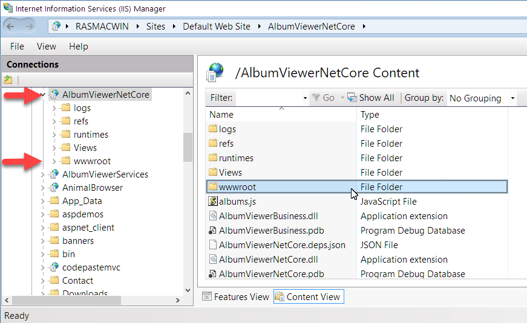

# IIS and ASP.NET Core Rewrite Rules for Static Files and Html 5 Routing


If you're running ASP.NET Core under Windows with IIS, you'll want to take advantage of letting IIS serve up your static content and handle your HTML 5 Client and home routes. IIS is very efficient at handling static content and content re-routing and in this post I describe how you can configure ASP.NET Core applications using the AspNetCoreModule and IIS Rewrite Rules.

When running ASP.NET Core under IIS, a special module handles the interaction between IIS and the ASP.NET Kestrel Web Server. There are a number of ways how you can handle the interaction between IIS and Kestrel in regards to what server handles what specific types of requests.

I talked about this in my [More on Running ASP.NET Core](https://weblog.west-wind.com/posts/2017/Mar/16/More-on-ASPNET-Core-Running-under-IIS) on IIS post a few weeks back. Based on the discussions that followed, the most interesting part of that post revolved on how to set up IIS correctly to allow separation of the API content that the  Web API application creates and the static content that the rest of the site requires. In this post I revisit that discussion that revolved around handing off static content to IIS, and in this post I add a few additional considerations regarding client side routing and root URL handling.

### IIS and Kestrel
When running ASP.NET Core applications in production, it's a recommended practice to run a front end Web Server to handle the 'administrative' part of a typical Web server. There's more to a Web Server than merely serving up content from a source, and full featured Web Servers provide a number of features that Kestrel does not provide natively and arguably shouldn't.

##AD##

I've shown the following diagram a few times recently, but it's good to show it yet again to visualize how IIS and Kestrel interact when you run ASP.NET Core applications under IIS:


Kestrel is ASP.NET Core's internal Web Server and when you run an ASP.NET Core application you usually run Kestrel as part of the .NET Core application. Unlike classic ASP.NET which integrated tightly with IIS, ASP.NET Core handles its own Web server processing through a default Web server implementation that is Kestrel. Kestrel is very high performance Web server that is optimized for raw throughput. It's considerably faster in raw throughput than running ASP.NET, but at the same time it's also a basic Web Server that doesn't have support for the full feature set of a full Web Server platform like IIS, Apache or even something more low level like nginx. Kestrel has no support for host headers so you can't run multiple Kestrel instances on the same port, content caching, automatic static file compression or advanced features like lifetime management of the server process.

While it's certainly possible to run Kestrel on a single port directly, most commonly you typically end up running Kestrel behind a front end Web server that acts as a proxy. Incoming requests hit the front end server and it forwards the inbound requests from port 80 or 443 typically to Kestrel on its native port. The front end can handle static file serving, content caching, static file compression, SSL certs and managing multiple sites tied to a single IP on port 80.

On Windows this typically means you'll be running Kestrel behind IIS as shown in the figure above.

> Although I show IIS here, the same principles discussed in this article can also be applied to other Web Servers that act as front ends, such as nginx, Apachy or HA Proxy on Linux. This article discusses the issues in terms of IIS, but the concepts can be applied to other Web Servers on other platforms with different configuration settings.

### Use the right Tool for the Job
When building Web applications, you'll want to break out what server serves appropriately. Typically this means:

##### IIS
* Handles Static Files
* Handles HTML 5 Client Side Routing

##### Kestrel
* Handles all API Requests

### The AspNetCoreModule
When you run in IIS, there's an **AspNetCoreModule** that handles the interaction between IIS and Kestrel. 

In order to use the AspNetCoreModule on a Windows server, make sure you install the [Windows Server Hosting Bundle](https://www.microsoft.com/net/download/core#/runtime) from the runtime download site. Alternately you can also install the module as part of the full Dotnet SDK installation.

ASP.NET Core applications don't run 'in place' but rather are published to a special `publish` folder that contains all the runtime, library and application dependencies as well as all the Web resources by way of a publishing process.

When you publish an ASP.NET Application with `dotnet publish`, the process creates a `web.config` file that includes a hook up for the **AspNetCoreModule**.

The `web.config` looks like this:

```xml
<?xml version="1.0" encoding="utf-8"?>
<configuration>
  <system.webServer>
    <handlers>      	
        <add name="aspNetCore" path="*" verb="*" modules="AspNetCoreModule" 
             resourceType="Unspecified" />
    </handlers>
    
    <aspNetCore processPath="%LAUNCHER_PATH%" arguments="%LAUNCHER_ARGS%" 
                stdoutLogEnabled="false" stdoutLogFile=".\logs\stdout" forwardWindowsAuthToken="false"/>
  </system.webServer>
</configuration>
```

The AspNet Core module is a low level IIS module that hooks into the IIS pipeline and rewrites the current URL to the Kestrel server running on the specified port with which the appliction is configured - 5000 by default. 

By default, as requests are fired against IIS, every request in the Web site or Virtual is forwarded to Kestrel.

### Isn't the AspNetCoreModule enough?
In and of itself the AspNetCoreModule forwards each and every request to Kestrel. It works - your application will run, but this makes your backend application also handle every static file from the front end.

This isn't ideal for a couple of reasons:

* Kestrel's static File Middleware is rather slow
* There's no support for content caching or compression

Even if there was a better static file module for your ASP.NET Core app, I'd argue that static file serving is better left to a front end Web server rather than tying up Kestrel resources.

The better course of action is to let IIS handle the static files and let Kestrel deal only with the API or server generated content requests that the application is designed to serve.

### Static Files in IIS, API requests in Kestrel
To separate commands we can take advantage of **UrlRewriting** in IIS. We can essentially take over all non-API URLs and let IIS serve those directly.

To do this is not as trivial as it might seem. ASP.NET Core applications run out of a root publish folder which is designated as the IIS Web Root, but the **actual** Web content the application serves lives in the **wwwroot** folder.



In other words, the module automatically retrieves content out of the **wwwroot**  folder when serving static content via some internal rewrite logic.

What this means is that you **can't** just simply point the ASP.NET Core app at your API url:

```xml
<add name="aspNetCore" path="api/*" verb="*" modules="AspNetCoreModule"  />
```

and expect that to take care of letting only your API requests be handled by Kestrel.

While this works for API requests, this leaves all other requests to be served by IIS - out of the **root folder** as the base. The problem is the root folder contains all the application DLLs, configuration files etc. rather than the actual Web content, which lives in the `wwwroot`. This effectively opens the root folder with the DLLs and config files to the world. Not a good idea, that - don't do it!

##AD##

The work-around is to use UrlRewrite to create static file mappings in IIS to specific extensions and route those explicitly into the **wwwroot** folder with re-write rules.

Here's what that looks like in `web.config`:

```xml
<?xml version="1.0" encoding="utf-8"?>
<configuration>

  <system.webServer>
	<rewrite>
        <rules>
            <rule name="wwwroot-static">
                <match url="([\S]+[.](html|htm|svg|js|css|png|gif|jpg|jpeg)$)" />
                <action type="Rewrite" url="wwwroot/{R:1}" />
            </rule>
        </rules>
    </rewrite>
    
    <handlers>      	
        <add name="StaticFileModuleHtml" path="*.htm*" verb="*" modules="StaticFileModule" resourceType="File" requireAccess="Read" />
        <add name="StaticFileModuleSvg" path="*.svg" verb="*" modules="StaticFileModule" resourceType="File" requireAccess="Read" />
        <add name="StaticFileModuleJs" path="*.js" verb="*" modules="StaticFileModule" resourceType="File" requireAccess="Read" />
        <add name="StaticFileModuleCss" path="*.css" verb="*" modules="StaticFileModule" resourceType="File" requireAccess="Read" />
        <add name="StaticFileModuleJpeg" path="*.jpeg" verb="*" modules="StaticFileModule" resourceType="File" requireAccess="Read" />
        <add name="StaticFileModuleJpg" path="*.jpg" verb="*" modules="StaticFileModule" resourceType="File" requireAccess="Read" />
        <add name="StaticFileModulePng" path="*.png" verb ="*" modules="StaticFileModule" resourceType="File" requireAccess="Read" />
        <add name="StaticFileModuleGif" path="*.gif" verb="*" modules="StaticFileModule" resourceType="File" requireAccess="Read" />
        <add name="aspNetCore" path="*" verb="*" modules="AspNetCoreModule" resourceType="Unspecified" />	       
    </handlers>

    <aspNetCore processPath="%LAUNCHER_PATH%" arguments="%LAUNCHER_ARGS%" 
                stdoutLogEnabled="false" stdoutLogFile=".\logs\stdout" forwardWindowsAuthToken="false"/>
  </system.webServer>
</configuration>
```

This configuration forwards all common static files into the wwwroot folder which bypasses the AspNetCoreModule. Rewrite rules fire before the AspNetCoreModule gets control so all the static files get processed by IIS.

Note that I leave the AspNetCore module path at `*`to allow anything not captured by the static file module mappings to still fall through to Kestrel, so there won't be broken links for unhandled file types.

One big win in this is that IIS is very fast and has very low overhead with static file processing. IIS utilizes the **http.sys Kernel Cache** for content caching and any files cached are served without ever hitting the IIS pipeline directly out of kernel code which is about as fast as you can get on Windows. Additionally IIS very thoroughly handles both client and server side cache settings, Gzip compression and more. 

> For static file performance it's going to be hard to beat IIS on Windows. So let IIS do the job it's really good at and serve static files with IIS!

### Html 5 Routing
If you're building rich client applications using a client side JavaScript framework, chances are you are also using HTML 5 client side routing that uses [HTML 5 Pushstate](https://developer.mozilla.org/en-US/docs/Web/API/History_API) to create clean client side URLs.
    
Html 5 Client Routing uses route paths that look like familiar server paths. For example this is a client route to a particular in my [Angular AlbumViewer sample](https://github.com/RickStrahl/AlbumViewerVNext):

```
http://site.com/albums/1
```

Html 5 routing works with client side pushstate events that intercept URL navigation. This allows frameworks like Angular to intercept URL requests to perform client side route navigation that makes it possible to navigate back to a saved URL after the client application is no longer loaded in the browser.

This works fine for client side routing, but client side routes can also cause requests fired to the server. When pasting a captured client side URL into a new browser window the client side application is not yet loaded and the URL pasted is then interpreted by the browser as a **server request** which will likely results a **404 - not found** response from the server. Not good...

To work around this, the server needs to intercept incoming requests and distinguish between legit server requests - API routes and Static File requests for the most part - and these client side URLs. We could handle this inside of the ASP.NET Core application with some custom middleware routing logic, but that introduces overhead into the application that can and probably should be handled more easily with IIS and UrlRewriting.

Using IIS UrlRewrite we can intercept non-file/directory and non-API routes and instead serve up the `index.html` page as content. By rewriting the URL the original URL stays intact, but the content returned is index.html. When the page loads the client side framework can detect the URL and navigate the client side application to the appropriate deep linked page.

Using IIS Rewrite here's how we can handle the logic to detect client routes on the server:

```
<rule name="AngularJS-Html5-Routes" stopProcessing="true">
    <match url=".*" />
        <conditions logicalGrouping="MatchAll">
            <add input="{REQUEST_FILENAME}" matchType="IsFile" negate="true" />
            <add input="{REQUEST_FILENAME}" matchType="IsDirectory" negate="true" />
            <add input="{REQUEST_URI}" pattern="^api/" negate="true" />
        </conditions>
    <action type="Rewrite" url="wwwroot/index.html" />
</rule>
```

This serves the content of index.html if the request doesn't point at a physical file or directory, or at the API url. Here I assume the API requests start with an api prefix. If you use something else or use multiple apis with different prefixes adjust the match pattern (or multiples) accordingly.

In order for this to work however, make sure you have also have a hard coded **base URL** set in index.html:

```html
<head>
  <base href="/" >
  <!--<base href="/albumviewernetcore/" >-->
  ...
</head>
```

which in this case points at the root site. If your site runs out of a virtual then the base URL has to change.

### Using Hash Bang Routing might be easier
HTML 5 Client side routing can be confusing and as you can see there are a few configuration requirements. This is one of the reasons I often prefer old style hash bang client routes like `#/albums/1`. They don't look quite as clean since they are prefixed by the `#`, but they **just work** without any special workarounds on the server. Client frameworks like Angular let you choose between the default HTML 5 routing or hash bang routing.

In Angular you can activate Hash Bang routing by specifying a custom LocationStrategy provider with:

```json
providers   : [
    { provide: LocationStrategy, useClass: HashLocationStrategy },
    ...
]    
```

### Dealing with the Default URL
Another required rule is to handle the default `/` or *blank* route. The AspNetCoreModule apparently fires before the IIS Default Documents can be processed. If you don't handle the default route, it is sent on to Kestrel. Again it works, but since we're forarding all other static files, the default page is probably a good one to also let IIS handle.

Here's another rewrite rule to deal with the default route:

```xml
<rule name="empty-root-index" stopProcessing="true">
	<match url="^$" />
	<action type="Rewrite" url="wwwroot/index.html" />
</rule>
```

And voila! 

You should now have IIS handling most static files, the default empty route and handle HTML 5 routing requests to non API locations.

##AD##

### All together now
For completeness sake here's the full `web.config` file that contains the combination of all of the discussed rules in one place:

```xml
<?xml version="1.0" encoding="utf-8"?>
<configuration>
  <system.webServer>
    <rewrite>
      <rules>
      	<rule name="wwwroot-static" stopProcessing="true">
          <match url="([\S]+[.](html|htm|svg|js|css|png|gif|jpg|jpeg)$)" />
          <action type="Rewrite" url="wwwroot/{R:1}" />
        </rule> 
        
        <rule name="empty-root-index" stopProcessing="true">
          <match url="^$" />
          <action type="Rewrite" url="wwwroot/index.html" />
        </rule>
      
        <!-- 
             Make sure you have a <base href="/" /> tag to fix the root path 
             or all relative links will break on rewrite 
        -->
    	<rule name="AngularJS-Html5-Routes" stopProcessing="true">
          <match url=".*" />
          <conditions logicalGrouping="MatchAll">
                <add input="{REQUEST_FILENAME}" matchType="IsFile" negate="true" />
                <add input="{REQUEST_FILENAME}" matchType="IsDirectory" negate="true" />
                <add input="{REQUEST_URI}" pattern="api/" negate="true" />
          </conditions>
          <action type="Rewrite" url="wwwroot/index.html"  />
        </rule> 
      </rules>
    </rewrite>

    <handlers>
      <add name="StaticFileModuleHtml" path="*.htm*" verb="*" modules="StaticFileModule" resourceType="File" requireAccess="Read" />
      <add name="StaticFileModuleSvg" path="*.svg" verb="*" modules="StaticFileModule" resourceType="File" requireAccess="Read" />
      <add name="StaticFileModuleJs" path="*.js" verb="*" modules="StaticFileModule" resourceType="File" requireAccess="Read" />
      <add name="StaticFileModuleCss" path="*.css" verb="*" modules="StaticFileModule" resourceType="File" requireAccess="Read" />
      <add name="StaticFileModuleJpeg" path="*.jpeg" verb="*" modules="StaticFileModule" resourceType="File" requireAccess="Read" />
      <add name="StaticFileModuleJpg" path="*.jpg" verb="*" modules="StaticFileModule" resourceType="File" requireAccess="Read" />
      <add name="StaticFileModulePng" path="*.png" verb="*" modules="StaticFileModule" resourceType="File" requireAccess="Read" />
      <add name="StaticFileModuleGif" path="*.gif" verb="*" modules="StaticFileModule" resourceType="File" requireAccess="Read" />
      <add name="aspNetCore" path="*" verb="*" modules="AspNetCoreModule" resourceType="Unspecified" />
    </handlers>
    <aspNetCore processPath="dotnet" arguments=".\AlbumViewerNetCore.dll" stdoutLogEnabled="false" 
                stdoutLogFile=".\logs\stdout" forwardWindowsAuthToken="false" />
  </system.webServer>
</configuration>
```

### Summary
Running ASP.NET Core application under IIS definitely is quite different than running classic ASP.NET applications under IIS. In the old versions everything was self-contained within IIS - in the brave new world of ASP.NET Core there's a lot of extra configuration that has to happen to make things run properly. That's progress for 'ya. 

All griping aside what I've described here has been pretty common fare for Linux based Web systems for a long time where it's common to use a front end Web server that hooks to a back end application service. The logic behind this is that a service backend should really only deal with its service implementation and not have to support the full gamut of Web service features - that's what a front end Web server like IIS, nginx, Ha-Proxy and the like can provide.

I still feel that a lot of what I've shown in this article could have been baked as options into the AspNetCore module because this is clearly the 90% case when running under IIS. If not that then at least the `web.config` should include some of these IIS Rewrite rules in commented form. 

But, with the list written down, it's easy to cut and paste now, and you can pick and choose which of these routing features you'd like to use. For most applications I build I think I'll end up using the setup I've described here.

I hope you'll find this useful - I know I'll be back here copying these rewrites on my next project myself...

### Resources
* [ASP.NET Core Documentation on IIS Hosting](https://docs.microsoft.com/en-us/aspnet/core/publishing/iis)
* [Publishing and Running ASP.NET Core Applications with IIS ](https://weblog.west-wind.com/posts/2016/Jun/06/Publishing-and-Running-ASPNET-Core-Applications-with-IIS)
* [More on ASP.NET Core Running under IIS](https://weblog.west-wind.com/posts/2017/Mar/16/More-on-ASPNET-Core-Running-under-IIS)
* [My ASP.NET Core AlbumViewer Sample](https://github.com/RickStrahl/AlbumViewerVNext)


<div style="margin-top: 30px;font-size: 0.8em;
            border-top: 1px solid #eee;padding-top: 8px;">
    
    this post created with 
    <a href="https://markdownmonster.west-wind.com" 
       target="top">Markdown Monster</a> 
</div>