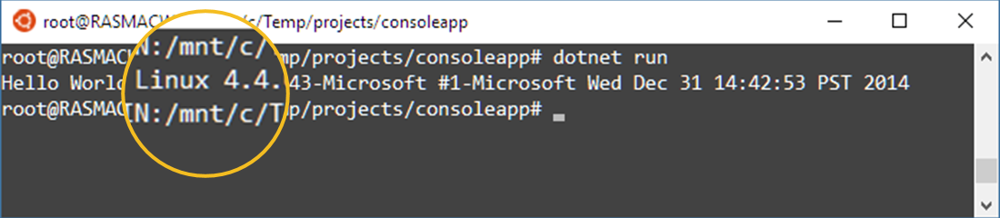
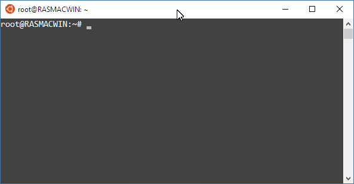
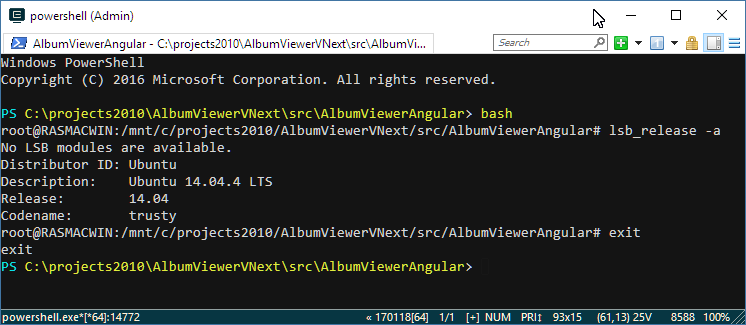
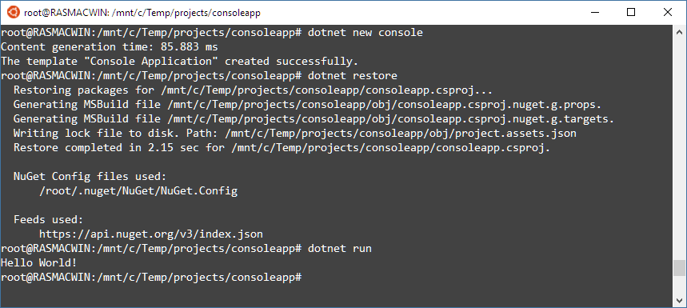
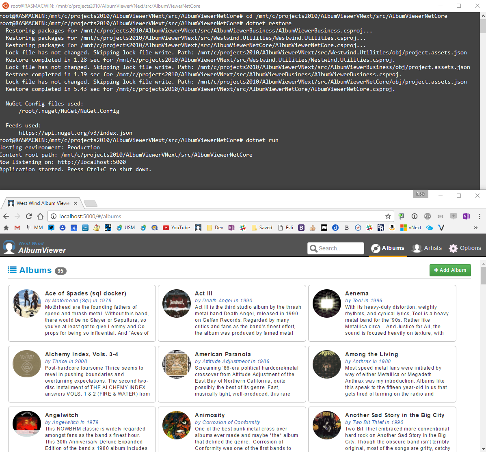

# Running .NET Core Apps under Windows Subsystem for Linux (Bash for Windows)



The Windows Subsystem for Linux (WSL), also known as **Bash on Ubuntu for Windows** makes it very easy to get your feet wet with Linux on Windows 10 without having to set up Virtual machines or installing any software to get Linux up and running. Check out [Scott Hanselman's excellent post today](https://www.hanselman.com/blog/SettingUpAShinyDevelopmentEnvironmentWithinLinuxOnWindows10.aspx) (as I'm writing this) on some of the developer features of the WSL shell. In fact, it was a few tweets from Scott yesterday that prompted me to play around with WSL and .NET Core today and write this post.

### What's WSL?
WSL is a built in feature of Windows 10 (Anniversary Update and later) that's always available by simply typing **Bash** into the Start menu. You get a Bash command prompt:



From here you have access to a headless Ubuntu (14.04 or 16.04 with Creators Update) instance with a full Linux file system and access to the host network connection and other hardware.

WSL is not a VM - if you open Hyper-V manager in Windows there's nothing running. Rather WSL is a custom implementation of the Linux shell that natively maps Linux api and commands to Windows, and executes them using standard Linux command line tools. This sounds like it'd be very buggy but it appears that this is working very well indeed - well enough in fact to execute a dotnet Web application in the subsystem as I'll show in this post.

##AD##

### Accessing Windows Files From Linux
WSL can access the Windows File System using a special drive mount:

```txt
/mnt/c/
```

gets you to the Windows C drive and from there the entire disk is available. All drives are mapped this way.

#### Opening Bash in any Windows Folder: Type Bash
In fact you can open a Windows Command or PowerShell prompt anywhere on your local drive, simply type `Bash` and be in that folder in the Bash Linux shell:



The shell loads in the active Windows folder and I can run all commands that are in scope of that folder. Here I'm displaying the Ubuntu version using `lsb_release -a`. 

Note that `exit` puts me right back into Powershell, but if I changed folders in Bash the PS shell will not reflect the change when I get back - ie. the original shell's scope is preserved as you would expect.

#### Access Linux Files from Windows: Look but don't touch!
You can also **look** at the Linux file system from Windows at:

```txt
C:\Users\<user>\AppData\Local\lxss\rootfs
```

but [it's very important that you don't change files on the Linux Partition from Windows](https://blogs.msdn.microsoft.com/commandline/2016/11/17/do-not-change-linux-files-using-windows-apps-and-tools/). 

I didn't know this and promptly modified files with an editor from Windows, only to see them show up in the Windows Explorer, but not with actual Linux file listings which means the directory table is actually corrupted for that folder I was working in. Clearly **not** a good idea.

Moral of the story:

* It's Ok to modify Windows files from WSL
* It's not Ok to modify Linux files from Windows

This is a bummer, but not as big of a deal as you might think - you can happily work with and modify data on your Windows drives and access those from the Bash shell. It's also nice in that you can use your existing Windows project folders for any .NET Core applications - there's no need to copy files around between the two platforms. You can of course still do that - if you rather use Git to completely restore files on the Linux instance and explicitly work of Linux folders. Just keep in mind that you can't easily edit files using a decent editor from Window - you're more or less limited to command line tools available inside of the headless Linux instance.

### Using `dotnet` Command Line Tools in WSL
So let's see if we can create a .NET application in the Bash shell for Windows.

The first step is:

* Install the .NET SDK for Linux

Go to [dot.net for Linux/Ubuntu](https://www.microsoft.com/net/core#linuxubuntu) and follow the installation instructions there. 

To find out the Ubuntu version running, use this command:

```bash
lsb_release -a
```

and then follow the rest of the install instruction on the SDK installation page.

##AD##

### `dotnet new` in WSL
With the SDK installed you can now use the `dotnet` command line tooling to create new projects, build, publish and so on.

To create a new project do this:

* Start the Bash shell from the Start Menu
* Navigate and create a folder for your project. For example:
cd /mnt/c/Temp/projects/consoleapp
* `dotnet new console`
* `dotnet restore`
* `dotnet run`

Here's what all this looks like in the Bash Shell:



Just to prove that this is really Linux that's running the application and we can change the code easily from Windows with any editor, let's edit the `Program.cs` source file to the following:

```cs
using System;

namespace consoleapp
{
    class Program
    {
        static void Main(string[] args)
        {
            Console.WriteLine("Hello World! "  + 
                  System.Runtime.InteropServices.RuntimeInformation.OSDescription);
        }
    }
}
```

Then do:

```txt
dotnet run
```

from the command line and you get:


Schweet!

### Running ASP.NET
The code above is obviously very simple so you'd expect that to work, but what about something a little more realistic?

I have an [ASP.NET Core AlbumViewer application](https://github.com/RickStrahl/AlbumViewerVNext) that is a bit more real world in that it accesses a database, deals with authentication and various ASP.NET support features. This application lives in a Windows folder, but using the Linux Bash shell I can just navigate to that project folder and then run the application out of that folder.

To try this out yourself you can clone the Repo from here:

* [AlbumViewer Sample from Github](https://github.com/RickStrahl/AlbumViewerVNext)

Make sure it works under Windows before trying the Linux Bash Shell.

Assuming the app works I can now do the following:

* Open the Windows Bash Shell
* Navigate to the Web project folder
(cd /mnt/c/projects/AlbumViewerVNext/src/AlbumViewerNetCore)
* dotnet restore
* dotnet run

And this should just work:



The app fires right up and just like on Windows serves requests on port 5000. No changes it just works, and I have an app that's running under Linux. Heck I could even fire up the same application under Windows on a different port **at the same time**.

##AD##

### Say Whaaat?
And there you have it - a .NET console app running under the Linux subsystem in Windows. No VMs, no complicated setup - the subsystem is just always available to you and it's a relatively painless way to experiment with running your .NET Core applications under Linux without having to set up anything special.

Ok, I know - NodeJs has done that for many years, but seeing this work with .NET is **still pretty exciting**. And having an easy way to test an application under Linux with the Bash for Windows shell without having to set up a VM is a really nice addition to Windows as a Developer Platform.

You can check to see if things break running under Linux (subtle differences in features, apis and file naming for example) and generally see how things work. The application has full access to the Linux OS including the file system (unlike the Windows shell) so as far as the app is concerned it's native on Linux.

Given that Microsoft states this is not a 'full' version of Linux it's pretty impressive that you can run a relatively full featured Web application without a hiccup is very promising for this tech.

You should understand that WSL is a developer feature of Windows 10. It doesn't exist on server OS versions and so this is meant as a helpful tool for developers. It's not a replacement for deploying a .NET Core application on proper Linux VM or running an application under Docker. FWIW, it might also be possible to run Docker under WSL and bypass the need for a separate Alpine VM running in Hyper-V. I haven't tried this but it's something worth checking out which would be a nice way to test Docker installs locally on 'native' Linux. If this doesn't work yet, I suspect this is part of the greater plan for Microsoft of integrating the Windows and Linux more smoothly at least on a developer machine. Maybe somebody's tried this out - if so please chime in in the comments.


Anyways, give the Windows Subsystem for Linux a spin with your .NET Core apps - it's easy enough to get started with and is an easy way to ease into familiarizing yourself with Linux. And I know that can be slow going - I'm still struggling with it, but anything that makes it easier helps!

### Resources

* [What's new in Bash/WSL in Windows 10 Creator's Update](https://blogs.msdn.microsoft.com/commandline/2017/04/11/windows-10-creators-update-whats-new-in-bashwsl-windows-console/)
* [Don't change Linux Files from Windows in WSL](https://blogs.msdn.microsoft.com/commandline/2016/11/17/do-not-change-linux-files-using-windows-apps-and-tools/)
* [Album Viewer Sample Application](https://github.com/RickStrahl/AlbumViewerVNext)
* [Hanselman: Setting up a Shiny Development Environment within Linux on Windows 10](https://www.hanselman.com/blog/SettingUpAShinyDevelopmentEnvironmentWithinLinuxOnWindows10.aspx)

<div style="margin-top: 30px;font-size: 0.8em;
            border-top: 1px solid #eee;padding-top: 8px;">
    
    this post created with 
    <a href="https://markdownmonster.west-wind.com" 
       target="top">Markdown Monster</a> 
</div>