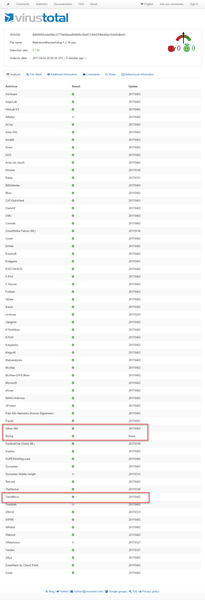
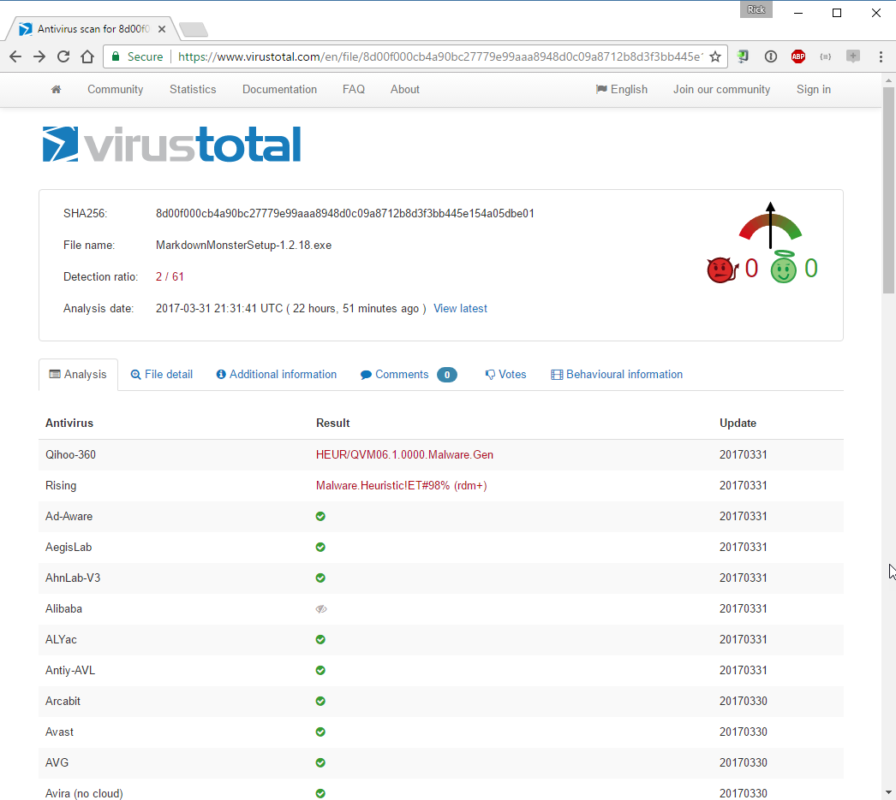
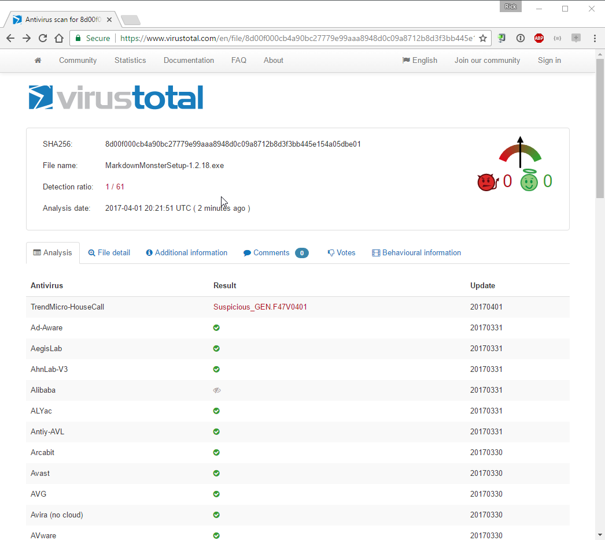
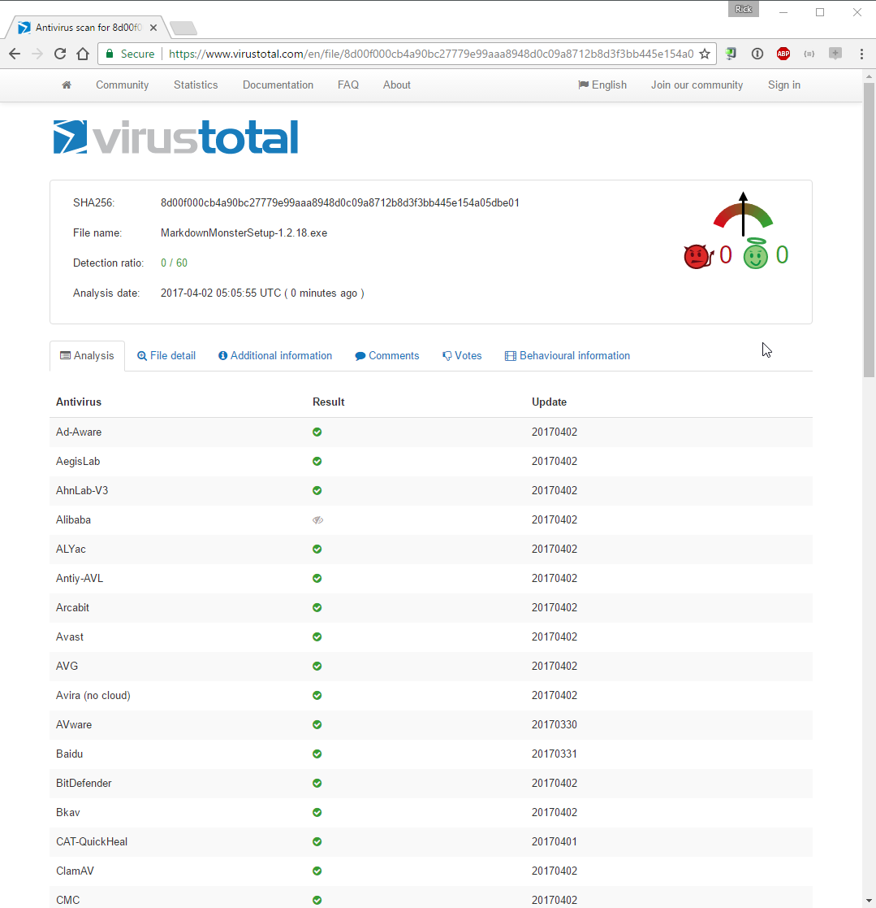

# Virus Scanning Madness

I've been struggling with virus reports in [Markdown Monster](https://markdownmonster.west-wind.com) when using a service like [VirusTotal](https://www.virustotal.com/). Markdown Monster is a desktop application, and [it's published on Chocolatey](https://chocolatey.org/packages/MarkdownMonster), which uses VirusTotal to show potential problems with malware in software. Chocolatey submits all verified packages to VirusTotal and links to the report page.

[VirusTotal](https://chocolatey.org/packages/MarkdownMonster) is a Web based service that takes an input binary - typically an installation package or zip file - and then runs around 60 Virus Scanners over that file and produces a report that looks like this:

On the surface this sounds like a great service, but I've found out the hard way that a lot of the scanners that VirusTotal uses are rather obscure and produce - often randomly - false positives.

### Test 3 times, get 3 different Results
Today I uploaded a new version of Markdown Monster to Chocolatey. Then I checked the VirusTotal report and it showed 2 hits:

The two scanners - Rising and Qihoo-360 - are quite frequently the culprit of these false positives and they've been a thorn in my side for some time. Both of these are Chinese scanners and both are basically not easily accessible for English speaking users. 

The problem is this: Many times I can simply rescan a file on VirusTotal and get a different result. Notice that the previous VirusTotal report and the following two are against the same file with the same exact SHA256 signature which means it's the same file.

 

and finally (which is from the same report as the original picture in this post):

So, get this: Same file (same SHA256), 3 runs, 3 different results. All results include all the same scanners, but multiple runs produces different results. If you scroll back up to the first, long listing that shows all results and no errors, I've highlighted the same scanners that flagged in the two failure scenarios above.

##AD##

### Madness
While most of the scanners on the list are consistent, it's kind of distressing to see this sort of behavior pop up. As mentioned Rising and Qihoo, are almost constantly flagging my uploads (several different products). Re-scanning often produces different results. So as you might guess I often end up re-scanning the results.

However, a few months ago, I ran into more serious issues with VirusTotal, where a whole slew of scanners were flagging my packages. I was using different installer technology at the time ([InstallMate](https://www.tarma.com/)) and I would see all sorts of crazy flip flops of various virus scanners, including the big name scanners. There was no malware of course, but yet a bunch of scanners - randomly - declared the software as malware. Again, re-scanning frequently would produce drastically different results.

I did a bunch of experimentation like creating empty installs (didn't flag), with installs including only small parts of the application (lots of flags) etc. I eventually on a whim decided to create the installer with a different installer product ([Inno Setup](http://www.jrsoftware.org/isinfo.php)) which is what I'm using now. Things improved, but I still see these randomized inconsistencies I'm showing in the screenshots above. 

But the bigger issue is that I know there was no malware involved when I was running the InstallMate installs. Yet it was flagged consistently. The author of InstallMate was very helpful, but ultimately it's some byte pattern in the installer runtime that's apparently triggered the malware detection. Switching to a different installer skirted that problem. I don't think this is a problem in InstallMate, but in the **inexact science of malware scanning** and the devastating effects it can have on a software install. And the fact that **this shit is taken as gospel**. 

If you get flagged there's little you can do effectively. Yes most vendors let you submit a false positive report. But this is a tedious process with each vendor having their own process and procedures. I tried this with a couple of vendors and while they were generally helpful, it was still an incredibly time consuming process, and of course next time I submit a new version I'm right back to square zero.

### Why does this matter?
This is scary because this basically means that **any random pattern** in your application can set off malware checks that flag your distributed software. Let that sink in for a minute. 

The really belligerent part of this is the fact that I can go in and re-scan my package binary and get a different result. So now if I get a flagged result, I tend to go in and re-scan until I get a passing result. How lame is that? 

If you're a software vendor, having a bunch of malware hits in a virus scan report is a problem. Even with only obscure scanners flagged, I've noticed that download counts are significantly lower than packages that don't have any, which makes sense. As an end-user trying to use a package or product - when you see a malware report, no matter how obscure your natural reaction will be to not install that package which is a natural and expected reaction. But the damage that a false flag does here can be a significant detriment to downloads.

##AD##

But if the results are so fickle, the reality is that a lot of the virus scanning becomes meaningless, not just for those scanners that produce false positives, but all the others that get dragged down with it.

It's a sad state of affairs and there's practically no recourse if there is a problem. As a vendor you can submit a false flag report to most AV vendors (but some you can't or they are unresponsive and not surprisingly the Rising and Qihoo are amongst them), but then who wants to submit a bunch of reports on various web sites every time there's a problem.

It's a sad state of affairs - for vendors that get false flagged, and for end users who can't always trust these type of cumulative reports. It also makes you wonder how effective virus scanning really is in finding a legitimate threat.

### What about you?
If you package and distribute software, how do you deal with this problem? I'm pretty sure almost any vendor distributing software runs into this issue from time to time, and looking over **validated packages** on Chocolatey, there are many that are flagged with the exact problems I describe here. Heck, **even Chocolatey itself got flagged** recently and continues to show up with a false positive occasionally :scream:. So it's not just me and my Murphy-loves-me syndrome. Reports from others would be helpful.

    
    this post created with 
    <a href="https://markdownmonster.west-wind.com" 
       target="top">Markdown Monster</a> 

