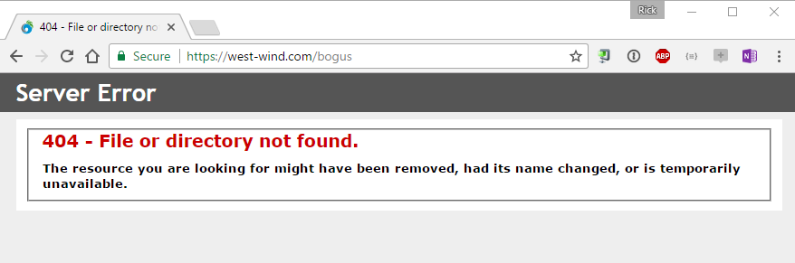
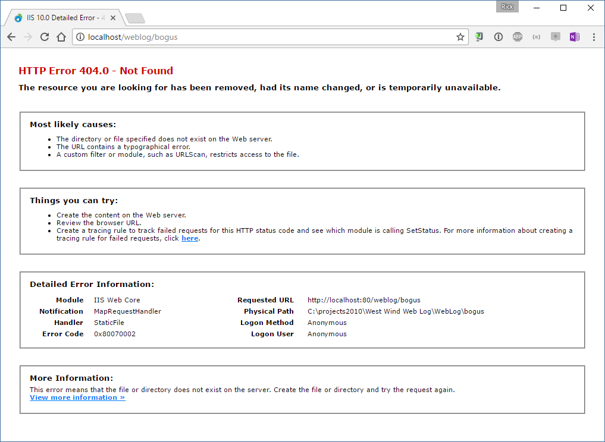
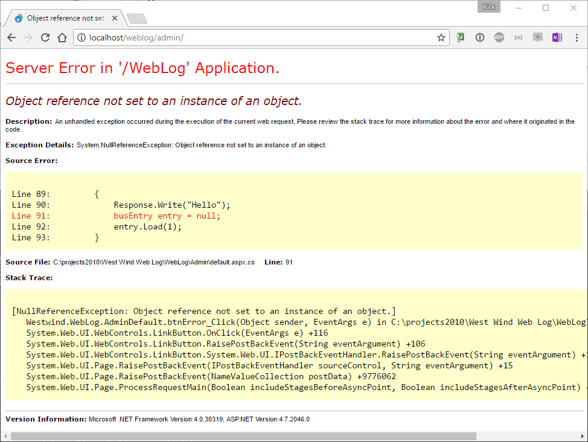

# Bypassing IIS Error Messages in an ASP.NET Application


IIS Error messages can be a bear to manage when building ASP.NET applications. IIS has a boatload of locations where error handling can be configured. When building Web applications, most of the time you want IIS to get out of your way and let your application handle serving error messages.

> **Note**: this post discusses error handling in full framework ASP.NET - not ASP.NET Core

Unfortunately if you leave the default behavior in place you'll end up getting error pages like this:

  
<small>**Figure 1** - Default IIS Error Messages are a bit terse.</small>
  
Which is a rather terrible experience for an end user. You'll see similar pages for 404's and full 500 pages.

### The Short of it
Let's fast forward to the quick solution, which is to explicitly tell IIS to get out of the way of error messages. To let your application handle errors and control the error display, there are two steps:

* **Use the `Response.IisTrySkipIisCustomErrors` flag**
  ```cs
  Context.Server.ClearErrors()
  Context.Response.IisTrySkipIisCustomErrors
  ```
* **Set the HttpRuntime to pass through all Response output**
  ```xml
  <system.webServer>
    <httpErrors existingResponse="Passthrough" />
  </system.webServer>
  ```

This should be all that you need to get ASP.NET (full framework) to pass through **all** HTTP responses from your application. 

For more detailed information, read on.

##AD##

### Response.TrySkipIisCustomErrors
As the name of the property suggests this flag can be used to turn off IIS custom error handling on a per request basis.

It's easy enough to do this whenever you have access the `HttpContext.Response` property.

```cs
Server.ClearError()
Response.TrySkipIisCustomErrors = true;
```

once you are sure you've handled the error. Note that in most cases you'll also want to clear the error. If you don't, IIS either throws up a default error page, or in some cases, an empty response as the request leaves the ASP.NET pipeline. Clearing the error takes care of that. However, don't clear the error before you've captured `Server.GetLastError()` - otherwise you can't access the error information.

You can set this `TrySkipIisCustomErrors` property anytime before the Response gets sent out to IIS - ie. anytime before any output is sent explicitly.

### Passing through the Error Response 
If you use `Response.TrySkipIisCustomErrors` alone you'll find that even with the flag set to true,  the response still fires IIS errors rather than the content you return. 

It's necessary to explicitly force the original response to pass through to IIS when an error occurs with the following configuration setting in `web.config`:

```xml
<system.webServer>
<httpErrors existingResponse="Passthrough" />
</system.webServer>
```

### CustomErrors in IIS
A huge cause for confusion around errors in IIS and ASP.NET is the `<customErrors>` config element. Because it has so many options and dependent behaviors it's often difficult to figure out exactly what combinations of error handlers are in effect.

The `CustomError` section in web.config lets you configure how errors are processed in an ASP.NET/IIS application. Essentially this setting lets you control what happens if your application doesn't handle an error in the application. 
```xml
<system.web>
    <customErrors mode="RemoteOnly" />
</system.web>
```

`RemoteOnly` shows detailed error information on localhost, and IIS error messages if remotely connecting. Other choices here are `On` and `Off`.

If CustomErrors are `On` (or you're remote), the default custom error handling behavior pushes any error status code from an ASP.NET application to the IIS Custom Error Messages. On a remote machine you get a very simple error message:

  
<small>**Figure 2** - Standard IIS error display </small>

On the local machine you often get detailed IIS error messages that point at a faulting module or component:

  
<small>**Figure 3** - The local IIS error page has a lot more information about the error.</small>

As you can see this page has a lot more info on it compared to **Figure 1** meant to help a local developer potentially troubleshoot an error which is quite nice. Locally error pages often have a wealth of useful IIS error info on them. Note that this error is specific to **IIS** Error messages.

If you run an ASP.NET application on the local machine and it produces an ASP.NET error - you get the Yellow Screen of Death (YSOD):

  
<small>**Figure 4** - The ASP.NET Yellow Screen of Death (YSOD). Lots of developer information available locally.</small>

The `<customErrors>` key is the source of endless confusion in IIS because **there are so many different operating modes** that affect it, including the switch settings, the IIS execution mode, whether you are local or remote and whether your application handles errors or not. 

As you can see there are a rather large number of permutations between custom Errors, local or remote access, and how your ASP.NET error handling is set up. 

The general rule is to run with the `RemoteOnly` flag which locally shows errors (in ASP.NET) and displays terse error messages on the server.

The moral of the story is this: Make sure when you test any error handling UI/output, **make sure you test it both on your local test setup as well as on the server**. The behavior might be drastically different even with the same exact settings.

### Application Specific Errors
There are a number of different ways that you can handle errors in ASP.NET applications and where you handle errors depends on the application's context and how you want to approach error handling in general.

Most applications should display custom error messages. More importantly - if you're building an API or Service error messages should be returned in the appropriate API error format - a JSON or XML response perhaps. 

For the two most common types of applications:

* **HTML Web Applications**   
These types of apps usually tend to capture their own errors and should display an error page. Usually you keep the original error code but the error is presented in the application's user interface context, typically with a custom error handler and application safe error page routine.

* **APIs**   
APIS and Services typically handle errors on their own as well and should return a response in the proper response format requested by a client. So if building a JSON backend service for a Web front end you **always** want to return JSON never an HTML server default message.


### Handling ASP.NET Application Errors
Ideally your application code should handle errors closely to where the error occurs. In an MVC or API application this typically means via a error ActionFilter, for WebForms this might mean an OnError handler in a base WebForm.

If you tightly control the errors in your application with one of these:

* **MVC/Web API Controller Error handlers**
* **MVC/Web API Error Filters**
* **WebForm error handlers**
* **HttpHandler or HttpModule Errors with try/catch**
* **Application_OnError()**

What's important here is that if your application returns an HTTP fault code (5xx, 4xx messages), IIS considers the request an error and tries to override your generated output through its custom error processing which includes the logic in `customErrors` discussed in the previous section.

To get around this, you can apply the `Response.TryIisSkipCustomErrors` setting in the error handling code, **just before writing out a custom response** with your error response.

### Last Resort Error Handling in ASP.NET
For all errors that you don't handle as part of your Web application processing, ASP.NET fires on `HttpApplication.Error` event which is mapped to `Application_OnError()` in global.asax. This handler captures any Error that occurs during ASP.NET Pipeline processing and hasn't been handled. This can be errors that occur outside of the application handling of MVC/WebForms/Handler requests, as well as errors inside of your Web application code that aren't explicitly handled.

I use a fairly boiler plate implementation of `Application_OnError` that demonstrates some of the tasks I are usually needed in basic error handling code.

```cs
protected void Application_Error(object sender, EventArgs e)
{
    try
    {
        try
        {
            Response.Filter = null;
        }
        catch { }

        Exception serverException = Server.GetLastError();
        WebErrorHandler errorHandler = null;

        //Try to log the inner Exception since that's what
        //contains the 'real' error.
        if (serverException.InnerException != null)
            serverException = serverException.InnerException;
        
        // Custom logging and notification for this application 
        AppUtils.LogAndNotify(new WebErrorHandler(serverException));

        
        if (App.Configuration.DebugMode == DebugModes.DeveloperErrorMessage)
        {
            Response.TrySkipIisCustomErrors = true;
            Server.ClearError();
            Response.StatusCode = 500;
            MessageDisplay.DisplayMessage("Application Error", "<pre style='font: normal 8pt Arial'>" + ErrorDetail + "</pre>");
            return;
        }
        else if (App.Configuration.DebugMode == DebugModes.ApplicationErrorMessage)
        {
            Response.TrySkipIisCustomErrors = true;
            string StockMessage =
                    "The Server Administrator has been notified and the error logged.<p>" +
                    "Please continue on by either clicking the back button or by returning to the home page.<p>" +
                    "<center><b><a href='" + App.Configuration.WebLogHomeUrl + "'>Web Log Home Page</a></b></center>";

            // Handle some stock errors that may require special error pages
            var HEx = serverException as HttpException;
            if (HEx != null)
            {
                int HttpCode = HEx.GetHttpCode();
                Server.ClearError();

                if (HttpCode == 404) // Page Not Found 
                {
                    Response.StatusCode = 404;
                    MessageDisplay.DisplayMessage("Page not found",
                        "You've accessed an invalid page on this Web server. " +
                        StockMessage);
                    return;
                }
                if (HttpCode == 401) // Access Denied 
                {
                    Response.StatusCode = 401;
                    MessageDisplay.DisplayMessage("Access Denied",
                        "You've accessed a resource that requires a valid login. " +
                        StockMessage);
                    return;
                }
            }

            Server.ClearError();
            Response.StatusCode = 500;
            
            // generate a custom error page
            MessageDisplay.DisplayMessage("Application Error",
                "We're sorry, but an unhandled error occurred on the server. " +
                StockMessage);

            return;
        }

        // default behavior
        return;
    }
    catch (Exception ex)
    {
        // default error handling
        if (App.Configuration.DebugMode == DebugModes.Default)
        {
            // and display an error m
            essage                
            Response.TrySkipIisCustomErrors = true;

            // Just throw the exception
            throw ex;
        }
        else
        {

            Server.ClearError();
            Response.TrySkipIisCustomErrors = true;
            Response.StatusCode = 200;
            MessageDisplay.DisplayMessage("Application Error Handler Failed",
                    "The application Error Handler failed with an exception." +
                    (App.Configuration.DebugMode == DebugModes.DeveloperErrorMessage ? "<pre>" + ex.ToString() + "</pre>" : ""));
        }

    }
}
```

Notice that there's quite a bit of logic here, mostly to deal with various error codes and error handling scenarios. I use multiple error modes to allow for default error handling (ie. yellow screen of death or YSOD), application error handling (application level error page) or developer error handling which is a custom generated error page that mixes application level error display with most of the info you also see on the YSOD. Not all of this is required or fully generic, but hopefully this gives a good idea of what I want my error handler to do. You can pick and choose the pieces you need from this semi-boilerplate code.

Note the use of `Response.TrySkipIisCustomErrors`, which is used in multiple places right before a specific response is returned to IIS. 

##AD##

### ASP.NET doesn't capture all Errors
It's important to understand that although IIS and ASP.NET are closely coupled, ASP.NET doesn't control the entire Request pipeline. Depending on how you configure the pipeline (especially **RunallmanagedModulesforAllRequests**) IIS still controls the entry point of the application and runs a number of native, non .NET modules to handle requests. 

If an error occurs in a non-managed module, it supersedes anything you do in your code - in fact your code is unlikely to ever even fire. Web site based authentication errors (for Windows/Basic/Digest that use Windows accounts), request filtering violation, application pool errors, binding errors are some examples that fall into this category. 

These are relatively rare or specialized scenarios, but nevertheless these are scenarios that happen. Just be aware of them.

### Summary
As you can see ASP.NET applications have a lot of different hook points for capturing error information and forwarding that information. Most applications should rely on Web application specific handlers to capture and handle errors as this is closest to the application to take potentially useful actions based on error types.

Luckily for all intents and purposes of an ASP.NET application, the following commands get your ASP.NET application at least past these issues:

```xml
<system.webServer>
    <httpErrors existingResponse="Passthrough" />
</system.webServer>
```

Ensure that before each error output generation you add bypass IIS Custom Error settings:

```cs
Context.Server.ClearErrors()
Context.Response.IisTrySkipIisCustomErrors
```

In most situations this is what you want to use for your ASP.NET applications.