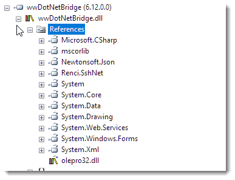
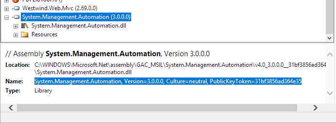

# GAC Assemblies with wwDotnetBridge

[wwDotnetBridge](https://west-wind.com/wwdotnetbridge.aspx) allows you to load random .NET assemblies from the local machine by explicitly referencing a DLL (assembly) file from disk. 

It's as easy as using the `LoadAssembly()` method to point at the DLL, and you're off to the races:

```foxpro
loBridge = GetwwDotnetBridge()

*** load an assembly in your path
IF (!loBridge.LoadAssembly("Markdig.dll"))
   ? "Couldn't load assembly: " + loBridge.cErrorMsg
   RETURN
ENDIF   

loMarkdig = CREATEOBJECT("Markdig.MarkdownPipelineBuilder")
* ... off you go using a class from the assembly
```

Assemblies are found along your foxpro path, relative paths from your current path (`.\subfolder\markdig.dll`) or of course a fully qualified path.

### GAC Assemblies
Things are a bit more tricky with assemblies that live in the Global Assembly Cache (GAC), which is a global registry of 'global' .NET assemblies. Although the GAC has lost a lot of its appeal in recent years with most components migrating to NuGet and local project storage as the preferred installation mechanism, most Microsoft assemblies are "GAC'd" and of course all the base framework assemblies all live in the GAC.

.NET assemblies that are signed have what is known as a **Fully qualified assembly name** which is the name by which any assembly registered in the GAC is referenced. To load an assembly from the GAC the preferred way to do that is to use this special name. 

Here's what it looks like for loading the Microsoft provided System.Xml package for example:


```foxpro
loBridge.LoadAssembly("System.Xml, Version=4.0.0.0, Culture=neutral, PublicKeyToken=b77a5c561934e089")
```

The GAC is nothing more than a special folder in the `C:\Windows\Microsoft.NET\assembly` folder that is managed by the .NET Framework. This folder hierarchy contains assemblies that are laid out in a special format that ensures uniqueness of each assembly that lives in the GAC by separating out version numbers and sign hashes. Go ahead and browse over to that folder and take a look at the structure - I'll wait here. Look for some common things like `System`, `System.Xml` or `System.Data` for example.

wwDotnetBridge provides a few common mapping so you can just use the assembly name:

```cs
else if (Environment.Version.Major == 4)
{
    if (lowerAssemblyName == "system")
        AssemblyName = "System, Version=4.0.0.0, Culture=neutral, PublicKeyToken=b77a5c561934e089";
    else if (lowerAssemblyName == "mscorlib")
        AssemblyName = "mscorlib, Version=4.0.0.0, Culture=neutral, PublicKeyToken=b77a5c561934e089";
    else if (lowerAssemblyName == "system.windows.forms")
        AssemblyName = "System.Windows.Forms, Version=4.0.0.0, Culture=neutral, PublicKeyToken=b77a5c561934e089";
    else if (lowerAssemblyName == "system.xml")
        AssemblyName = c";
    else if (lowerAssemblyName == "system.drawing")
        AssemblyName = "System.Drawing, Version=4.0.0.0, Culture=neutral, PublicKeyToken=b03f5f7f11d50a3a";
    else if (lowerAssemblyName == "system.data")
        AssemblyName = "System.Data, Version=4.0.0.0, Culture=neutral, PublicKeyToken=b77a5c561934e089";
    else if (lowerAssemblyName == "system.web")
        AssemblyName = "System.Web, Version=4.0.0.0, Culture=neutral, PublicKeyToken=b03f5f7f11d50a3a";
    else if (lowerAssemblyName == "system.core")
        AssemblyName = "System.Core, Version=4.0.0.0, Culture=neutral, PublicKeyToken=b77a5c561934e089";
    else if (lowerAssemblyName == "microsoft.csharp")
        AssemblyName = "Microsoft.CSharp, Version=4.0.0.0, Culture=neutral, PublicKeyToken=b03f5f7f11d50a3a";
    else if (lowerAssemblyName == "microsoft.visualbasic")
        AssemblyName = "Microsoft.VisualBasic, Version=10.0.0.0, Culture=neutral, PublicKeyToken=b03f5f7f11d50a3a";
    else if (lowerAssemblyName == "system.servicemodel")
        AssemblyName = "System.ServiceModel, Version=4.0.0.0, Culture=neutral, PublicKeyToken=b77a5c561934e089";
    else if (lowerAssemblyName == "system.runtime.serialization")
        AssemblyName = "System.Runtime.Serialization, Version=4.0.0.0, Culture=neutral, PublicKeyToken=b77a5c561934e089";
}
```

which means you can just reference `LoadAssembly("System.Web")`. For all other assemblies however you have to use the fully qualified assembly name.

wwDotnetBridge internally references a number of assemblies so these don't ever have to be explicitly referenced:



### When do I need GAC References?
Earlier today I got a question from Alex Sosa asking about the fact that he had to reference a long path to a system specific location to find a GAC'd assembly to reference.

In this case he's trying to use the Powershell automation interface to talk to Powershell. The following code works, but it hardcodes the path the physical assembly:

```foxpro
loBridge = createobject('wwDotNetBridge', 'V4')

llReturn = loBridge.LoadAssembly('C:\Windows\Microsoft.Net\assembly\' + ;
'GAC_MSIL\System.Management.Automation\v4.0_3.0.0.0__31bf3856ad364e35' + ;
'\System.Management.Automation.dll')
if not llReturn
  messagebox(loBridge.cErrorMsg)
  return
endif 

* Create a PowerShell object.
loPS = loBridge.InvokeStaticMethod('System.Management.Automation.PowerShell','Create')
```

This code works, but it hard codes the path which is ugly and may change if the version is changed or if Windows is ever moved to a different location (like after a reinstall for example). It's **never** a good idea to hardcode paths - if anything the code above should be changed to use the `GETENV("WINDIR")` to avoid system specific paths.

### Use Fully Qualified Assembly Names instead
But a a better approach with GAC components is to use **Strong Assembly Names**. Any GAC assembly has to be signed and as a result generates a unique assembly ID which includes its name, version and a hash thumbprint. You see part of that in the filename above.

Here's what this looks like:

```foxpro
llReturn = loBridge.LoadAssembly('System.Management.Automation, Version=3.0.0.0, Culture=neutral, PublicKeyToken=31bf3856ad364e35')
```

To get the fully qualified assembly name, you can use any Assembly Viewer tool like [Reflector](http://www.red-gate.com/products/dotnet-development/reflector/) (which is what I use typically), [JustDecompile](http://www.telerik.com/products/decompiler.aspx) from Telerik or you can use the Visual Studio assembly browser or ILSpy (also part of Visual Studio tools).

Any of these tools work, and here's what this looks like in Reflector:



You basically have to load the assembly into the tool, and then looks at the information properties for the assembly.

The advantage of the fully qualified assembly name is - especially for Microsoft assemblies - that the name rarely if ever changes (other than perhaps the version number). Even if the file name or even the actual file version changes, the assembly version and what's actually in the GAC is always correct with the fully qualified assembly name.

So rather than hardcoding a file name, which may change in the future you are now pinning to a specific version of a GAC entry, which tends to stay stable.

### Summary
For GAC assemblies using fully qualified assembly names is the right way to go as this is the 'official' and fastest way .NET loads assemblies from the GAC. 

Keep in mind though that even though the GAC is a global assembly cache, there's no guarantee that your assembly you are referencing is there. The Powershell assembly referenced above for example, may not be present if Powershell is not installed (it is an option in Windows Features even though it's on by default).

GAC assemblies are generally more problematic than loose assemblies due to their strong signing and stric dependency management rules, and luckily they are on their way out, so other than Microsoft system assemblies their use should be fairly rare these days with most third party assemblies being shipped as loose assemblies via NuGet packages which provides a lot more flexibility to developers. 

But either way, wwDotnetBridge can load loose or GAC'd assemblies easily enough. Have at it!